# openEuler 项目页模板化说明文档

## 目录

- [设计理念](#设计理念)
- [使用规范](#使用规范)
- [使用示例](#使用示例)
- [组件说明](#组件说明)
- [组件架构](#组件架构)
- [渲染原理](#渲染原理)

---

## 设计理念

### 核心理念

项目页模板基于 **约定优于配置（Convention over Configuration）** 的设计理念，通过分析 Markdown 文档的结构特征，自动选择合适的布局组件进行渲染。这种方式让内容创作者专注于内容本身，快速生成标准、风格一致的项目页，而不需要关心底层的渲染逻辑。

### 设计原则

1. **内容驱动**：根据 Markdown 内容的结构特征自动识别并选择合适的布局
2. **语义化**：充分利用 Markdown 原生语法（标题层级、列表、链接等）表达布局意图
3. **响应式**：所有布局组件都内置了完善的响应式设计，适配不同屏幕尺寸
4. **可扩展**：采用组件化设计，易于添加新的布局类型和功能
5. **性能优化**：使用 Vue 3 的 Composition API 和计算属性优化渲染性能

---

## 使用规范

### 基本用法

在 Markdown 文件中使用 `<MarkdownLayout>` 标签包裹内容：

```markdown
<MarkdownLayout>

# 主标题

这是副标题

## 二级标题

这是正文内容


</MarkdownLayout>
```

### 布局类型规范

#### 1. Banner 布局

**规范**：以图片开头，后跟 h1 和 h2 标题

```markdown
<MarkdownLayout>


# 主标题

## 副标题

</MarkdownLayout>

```

**示例**

##### 代码块

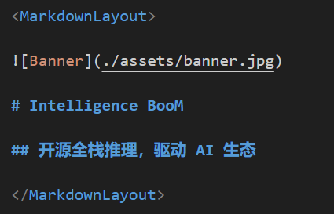

##### 渲染效果


#### 2. 通用布局

**规范**：h1 主标题 + (可选)段落副标题 + 任意内容

```markdown
<MarkdownLayout>

# 简介

这是副标题文本

## 功能特性

支持多种功能特性...


</MarkdownLayout>
```

**示例**

##### 代码块

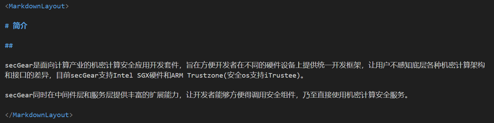

##### 渲染效果

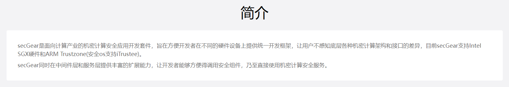

#### 3. 卡片布局

**规范**：每 3 个节点为一组卡片（h2 标题 + 段落描述 + 链接）

```markdown
<MarkdownLayout>

# 相关链接

## 白皮书

了解详细信息

[查看详情](https://example.com/whitepaper)

## 代码仓

查看代码仓库

[查看代码](https://github.com/example)

</MarkdownLayout>
```

**示例**

##### 代码块

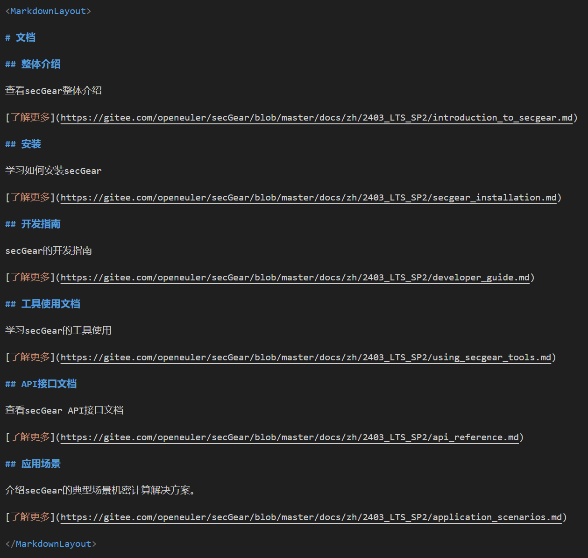

##### 渲染效果


#### 4. 扁平布局

**规范**：恰好偶数且至少4个 h2 标题，每个 h2 后跟一个段落

```markdown
<MarkdownLayout>

# 功能特色

## 低代码

允许用户以工作流的形式进行可视化编排

## 高可用

使用大模型+传统算法智能编排和调度工作流

## 轻量化

运行在较低配置的硬件条件下

## openEuler亲和

openEuler的镜像中原生包含所有能力

</MarkdownLayout>
```

**示例**

##### 代码块

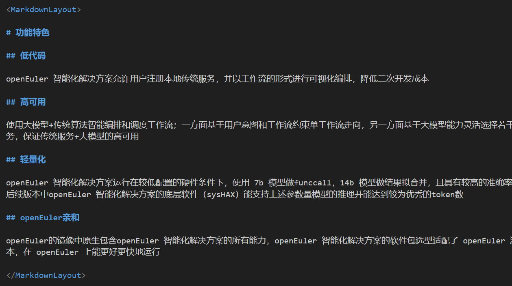

##### 渲染效果

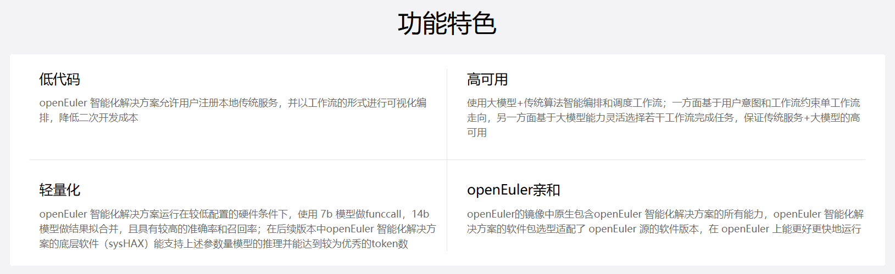

#### 5. 标签页布局

**规范**：使用 h2 作为标签页标题，h3 作为内容分组

```markdown
<MarkdownLayout>

# 功能介绍

## 构建智能应用

### UBS Engine

支持内存、DPU资源池化管理与动态调度

### UBS Virt

支持虚拟化池化，热迁移策略决策

## 调用智能应用

### 对于开发者

是一个灵活且轻量化的智能化平台

### 对于企业

是一套中心化的智能体解决方案

</MarkdownLayout>
```

**示例**

##### 代码块

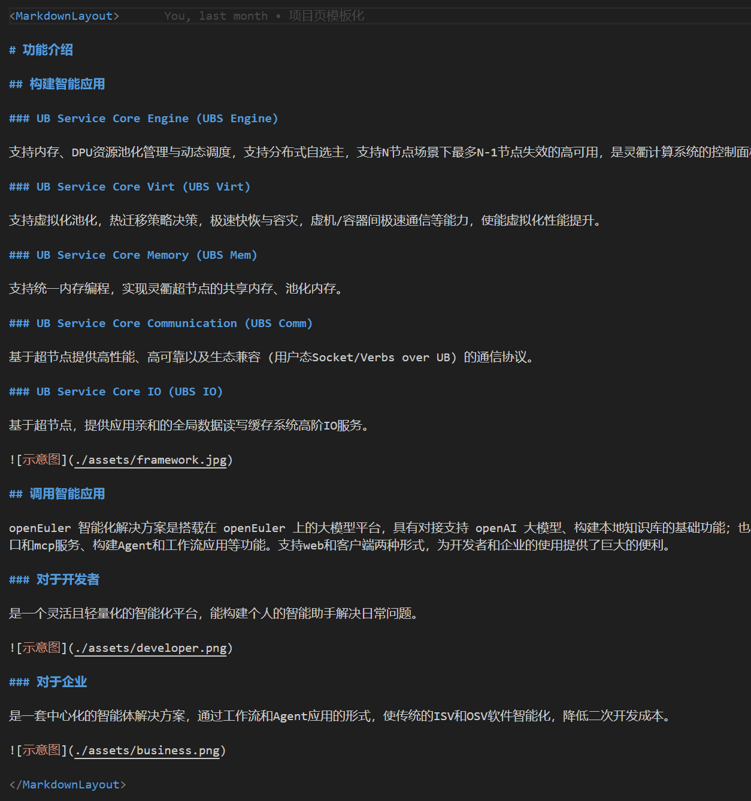

##### 渲染效果

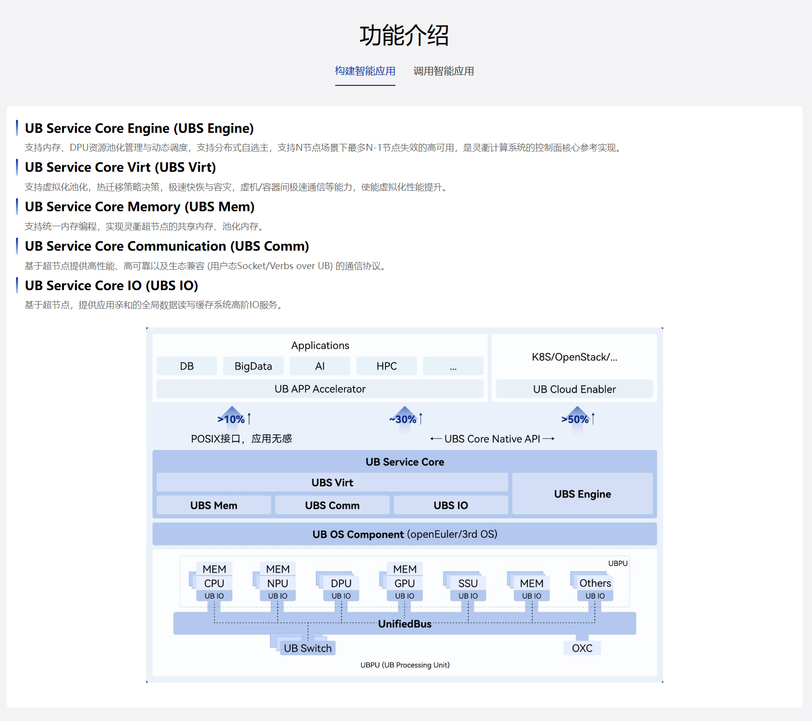

#### 6. Logo 列表

**规范**：所有内容都是图片节点

```markdown
<MarkdownLayout>

# 合作伙伴


</MarkdownLayout>
```

**示例**

##### 代码块

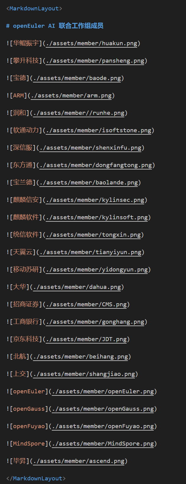

##### 渲染效果

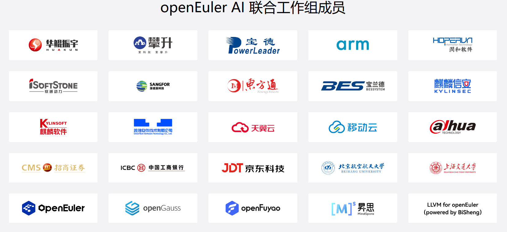

#### 7. 表格布局

**规范**：使用 Markdown 标准表格语法

```markdown
<MarkdownLayout>

# 代码仓列表

| 仓库列表 | 代码仓地址 |
|---------|----------|
| repo1 | <https://github.com/repo1> |
| repo2 | <https://github.com/repo2> |

</MarkdownLayout>
```

**示例**

##### 代码块

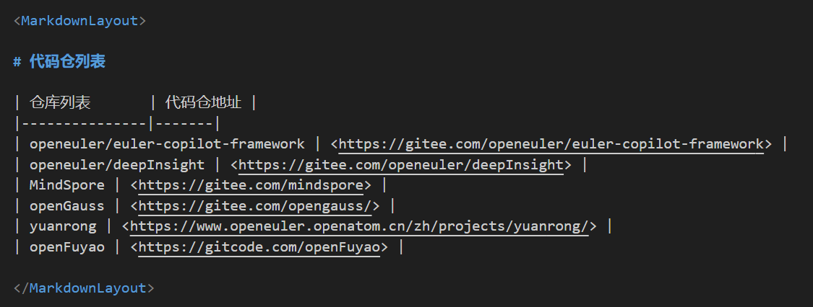

##### 渲染效果

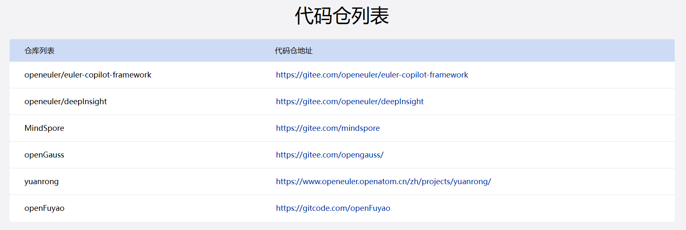

### 图片处理规范

#### 普通图片

在布局中的图片会自动使用 `MarkdownImage` 组件包装，支持：

- 悬停显示放大图标
- 点击放大查看
- 鼠标拖拽移动（放大后）
- 滚轮缩放（放大后）

```markdown

```

#### Banner 图片

Banner 布局中的第一张图片会作为背景图使用。

---

## 使用示例

### 完整页面示例

以下是一个完整的页面示例（来自 `intelligence-boom/index.md`）：

```markdown
---
title: 'openEuler Intelligence Boom'
---

<!-- Banner 区域 -->
<MarkdownLayout>


# Intelligence BooM

## 开源全栈推理，驱动 AI 生态

</MarkdownLayout>

<!-- 简介区域 -->
<MarkdownLayout>

# 简介

副标题测试文本

## 

基于 openEuler 构建开源的 AI 基础软件事实标准，推动企业智能应用生态的繁荣

</MarkdownLayout>

<!-- 功能介绍（标签页布局） -->
<MarkdownLayout>

# 功能介绍

## 构建智能应用

### UB Service Core Engine (UBS Engine)

支持内存、DPU资源池化管理与动态调度，支持分布式自选主...

### UB Service Core Virt (UBS Virt)

支持虚拟化池化，热迁移策略决策...


## 调用智能应用

### 对于开发者

是一个灵活且轻量化的智能化平台...


### 对于企业

是一套中心化的智能体解决方案...


</MarkdownLayout>

<!-- 功能特色（扁平布局） -->
<MarkdownLayout>

# 功能特色

## 低代码

openEuler 智能化解决方案允许用户注册本地传统服务...

## 高可用

使用大模型+传统算法智能编排和调度工作流...

## 轻量化

openEuler 智能化解决方案运行在较低配置的硬件条件下...

## openEuler亲和

openEuler的镜像中原生包含openEuler 智能化解决方案的所有能力...

</MarkdownLayout>

<!-- 相关链接（卡片布局） -->
<MarkdownLayout>

# 相关链接

## 白皮书

了解 UB Service Core，使用、开发、管理和维护灵衢产品

[查看详情](https://example.com/whitepaper)

## 代码仓列表

查看 UB Service Core 代码仓、联系方式等信息

[查看详情](https://example.com/repos)

</MarkdownLayout>

<!-- 合作伙伴（Logo 列表） -->
<MarkdownLayout>

# openEuler AI 联合工作组成员


<!-- ... 更多 Logo ... -->

</MarkdownLayout>

<!-- 代码仓列表（表格布局） -->
<MarkdownLayout>

# 代码仓列表

| 仓库列表 | 代码仓地址 |
|---------|----------|
| openeuler/euler-copilot-framework | <https://gitee.com/openeuler/euler-copilot-framework> |
| openeuler/deepInsight | <https://gitee.com/openeuler/deepInsight> |

</MarkdownLayout>
```

### 注意事项

1. **每个 `<MarkdownLayout>` 标签独立工作**：不同布局之间不会相互影响

2. **标题层级要清晰**：确保 h1、h2、h3 的使用符合布局类型的要求

3. **内容顺序要正确**：特别是卡片布局和扁平布局，节点顺序必须严格按照规范

4. **图片路径要正确**：使用相对路径，确保图片文件存在

5. **表格语法要标准**：表格布局需要使用标准的 Markdown 表格语法

6. **链接格式**：在卡片布局中，链接使用标准 Markdown 链接语法 `[文本](URL)`

---

## 技术栈

- **Vue 3**：使用 Composition API
- **TypeScript**：类型安全
- **SCSS**：样式预处理
- **OpenDesign**：UI 组件库（部分组件依赖）
- **AOS**：动画库（Banner 组件使用）
- **VueUse**：组合式函数工具库

---

## 扩展指南

### 添加新布局类型

1. 在 `MarkdownLayout.vue` 的 `componentType` 计算属性中添加识别逻辑
2. 创建新的布局组件（如 `MarkdownNewLayout.vue`）
3. 在 `MarkdownLayout.vue` 中导入并注册新组件
4. 在模板中添加渲染条件

### 自定义样式

所有组件都使用 SCSS 变量和 mixin，可以通过修改全局样式变量来自定义：

- 颜色变量：`var(--o-color-*)`
- 间距变量：`var(--o-gap-*)`
- 圆角变量：`var(--o-radius-*)`
- 响应式断点：使用 `@include respond-to(*)` mixin

---

## 常见问题

### Q: 为什么我的内容没有按照预期布局渲染？

A: 请检查以下几点：
1. 节点数量是否符合布局要求（如扁平布局需要恰好偶数且不少于4个h2）
2. 节点顺序是否正确（如卡片布局需要按 h2 + p + a 的顺序）
3. 是否缺少必要的节点类型（如标签页布局需要 h3）
4. 如果遇到运用指定布局但对应内容缺失的场景，可以使用空的标题或&nbsp占位符占位

### Q: 图片无法点击放大？

A: 确保图片宽度大于 216px，移动端不支持图片缩放功能。

### Q: 如何自定义布局样式？

A: 可以通过修改对应组件的 SCSS 文件，或者使用 Vue 的深度选择器覆盖样式。

### Q: 表格中的链接无法正确识别？

A: 确保链接格式为 `<URL>` 或 `[文本](URL)`，表格组件会自动识别并渲染为链接。

---

## 更新日志

### v1.0.0
- 初始版本发布
- 支持 7 种布局类型
- 图片缩放拖拽功能
- 响应式设计支持

---

## 组件说明

### MarkdownLayout

核心调度组件，负责解析和路由。

**Props**: 无（通过插槽接收内容）

**功能**:
- 解析 Markdown AST 节点
- 提取结构化数据
- 识别布局类型
- 渲染对应的子组件

### MarkdownBanner

横幅布局组件，用于页面顶部展示。

**Props**:
- `data`: Array - 解析后的节点数据数组

**数据格式**:
```javascript
[
  { type: 'img', src: './banner.jpg', alt: 'Banner' },
  { type: 'h1', content: '主标题' },
  { type: 'h2', content: '副标题' }
]
```

**特性**:
- 背景图片展示
- 文字叠加效果
- AOS 动画支持
- 响应式高度调整

### MarkdownCommonLayout

通用布局组件，用于常规内容展示。

**Props**:
- `data`: Array - 解析后的节点数据数组

**渲染规则**:
- h2/h3 标题：显示为带左侧装饰条的标题
- 段落：显示为正文
- 图片：使用 `MarkdownImage` 组件包装

### MarkdownCardLayout

卡片布局组件，用于展示带链接的内容卡片。

**Props**:
- `data`: Array - 解析后的节点数据数组

**数据格式**:
每 3 个节点为一组：
```javascript
[
  { type: 'h2', content: '卡片标题' },
  { type: 'p', content: '卡片描述' },
  { type: 'a', content: '链接文本', link: 'https://...' },
  // ... 下一组卡片
]
```

**特性**:
- 3 列网格布局（桌面端）
- 单列布局（移动端）
- 链接悬停效果
- 响应式适配

### MarkdownFlatLayout

扁平布局组件，用于 2x2 网格展示。

**Props**:
- `data`: Array - 解析后的节点数据数组

**数据格式**:
每 2 个节点为一组（h2 标题 + 段落）：
```javascript
[
  { type: 'h2', content: '标题1' },
  { type: 'p', content: '描述1' },
  { type: 'h2', content: '标题2' },
  { type: 'p', content: '描述2' },
]
```

**特性**:
- 2x2 网格布局（桌面端）
- 单列布局（移动端）
- 边框分隔线
- 响应式间距调整

### MarkdownTabsLayout

标签页布局组件，用于按 h2 分组的多标签页内容。

**Props**:
- `data`: Array - 解析后的节点数据数组

**数据格式**:
以 h2 为分隔符，每个 h2 及之后的内容组成一个标签页：
```javascript
[
  { type: 'h2', content: '标签1' },
  { type: 'h3', content: '子标题1' },
  { type: 'p', content: '内容1' },
  { type: 'h2', content: '标签2' },
  { type: 'h3', content: '子标题2' },
  { type: 'p', content: '内容2' },
]
```

**特性**:
- 动态标签页生成
- 标签页切换动画
- 内容使用 `MarkdownCommonLayout` 渲染

### MarkdownLogoList

Logo 列表组件，用于展示 Logo 网格。

**Props**:
- `data`: Array - 图片节点数组

**数据格式**:
```javascript
[
  { type: 'img', src: './logo1.png', alt: 'Logo1' },
  { type: 'img', src: './logo2.png', alt: 'Logo2' },
  // ...
]
```

**特性**:
- 5 列网格（桌面端）
- 4 列网格（平板横屏）
- 3 列网格（平板竖屏）
- 2 列网格（手机）
- 统一卡片样式

### MarkdownTable

表格布局组件，用于数据表格展示。

**Props**:
- `data`: Array - 表格数据对象数组

**数据格式**:
```javascript
[{
  type: 'table',
  columns: ['列1', '列2', '列3'],
  data: [
    { '列1': '值1', '列2': '值2', '列3': '值3' },
    // ...
  ]
}]
```

**特性**:
- 自动识别列头
- 支持链接列（自动识别并渲染为链接）
- 使用 OpenDesign 表格组件

### MarkdownImage

图片展示组件，提供交互功能。

**特性**:
- 悬停显示放大按钮
- 点击放大查看
- 响应式尺寸限制
- 移动端禁用缩放

### ImgZoomDrag

图片缩放拖拽工具组件。

**Props**:
- `src`: String - 图片地址
- `width`: Number - 原始宽度
- `height`: Number - 原始高度
- `zoom`: Number - 初始缩放比例

**功能**:
- 鼠标滚轮缩放（1x - 3x）
- 鼠标拖拽移动
- 边界限制和回弹
- 响应式缩放比例

---

## 组件架构

### 核心组件：MarkdownLayout

`MarkdownLayout.vue` 是整个组件库的核心，负责：

1. **解析 Markdown 内容**：通过 Vue 的插槽机制获取已编译的 Markdown AST 节点
2. **提取结构化数据**：将 AST 节点转换为标准化的数据对象
3. **智能识别布局类型**：根据内容特征自动选择合适的子组件
4. **渲染目标组件**：将处理后的数据传递给对应的布局组件

### 布局组件体系

```
MarkdownLayout (核心调度器)
├── MarkdownBanner (横幅布局)
├── MarkdownCommonLayout (通用布局)
├── MarkdownCardLayout (卡片布局)
├── MarkdownFlatLayout (扁平布局)
├── MarkdownTabsLayout (标签页布局)
├── MarkdownLogoList (Logo列表)
└── MarkdownTable (表格布局)
```

### 辅助组件

- **MarkdownImage**：图片展示组件，支持缩放和拖拽预览
- **ImgZoomDrag**：图片缩放拖拽工具组件
- **AppSection**：页面区块包装组件，提供统一的标题和副标题样式

---

## 渲染原理

### 1. 内容解析流程

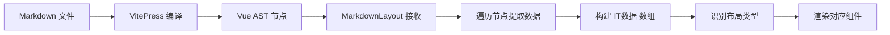

### 2. 数据提取逻辑

`MarkdownLayout` 在 `onMounted` 钩子中遍历插槽内容，将不同类型的 AST 节点转换为标准化的数据对象：

#### 标题节点 (h1, h2, h3)
```javascript
{
  type: 'h1' | 'h2' | 'h3',
  content: '标题文本'
}
```

#### 段落节点 (p)
```javascript
// 纯文本段落
{
  type: 'p',
  content: '段落内容'
}

// 包含链接的段落
{
  type: 'a',
  content: '链接文本',
  link: 'https://example.com'
}

// 包含图片的段落
{
  type: 'img',
  src: './assets/image.jpg',
  alt: '图片描述'
}
```

#### 表格节点 (table)
```javascript
{
  type: 'table',
  columns: ['列1', '列2', '列3'],
  data: [
    { '列1': '值1', '列2': '值2', '列3': '值3' },
    // ...
  ]
}
```

### 3. 布局类型识别规则

组件通过 `componentType` 计算属性，按照以下优先级顺序识别布局类型：

1. **Banner 布局** (`banner`)
   - 条件：第一个节点是图片
   - 用途：项目页Banner说明

2. **表格布局** (`table`)
   - 条件：包含 table 节点
   - 用途：数据表格展示

3. **标签页布局** (`tab`)
   - 条件：包含 h3 标题
   - 用途：按 h2 分组的多标签页内容

4. **卡片布局** (`card`)
   - 条件：包含链接 (a) 节点
   - 用途：标题+描述+链接的卡片展示

5. **扁平布局** (`flat`)
   - 条件：恰好有偶数且不少于4个h2 标题
   - 用途：2x2 网格展示特色功能

6. **Logo 列表** (`image`)
   - 条件：所有节点都是图片
   - 用途：Logo 网格展示

7. **通用布局** (`common`)
   - 条件：其他情况
   - 用途：常规的内容展示

### 4. 标题提取规则

对于非 Banner 布局，组件会自动提取：

- **主标题** (`sectionTitle`)：从第一个 h1 节点提取
- **副标题** (`sectionSubTitle`)：如果第一个节点后紧跟段落节点，则提取为副标题

这些标题会被传递给 `AppSection` 组件统一展示。

---
