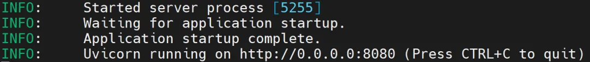
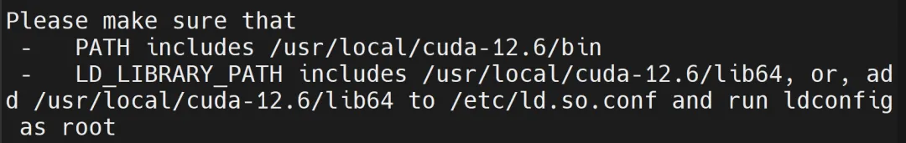

Welcome to the first blog in our **openEuler × DeepSeek** series! 

In our previous blog, we walked you through the simple steps to deploy **DeepSeek-R1 on openEuler 24.03 LTS**([download]). Today, we're leveling up the game and showing you how to take your deployment further using **vLLM**, a powerful framework that allows for high-performance LLM inference.

If you've been running DeepSeek on your local machine or small-scale server, **vLLM** is a great choice when you need to scale up for larger AI workloads. It's optimized to leverage multi-core CPUs and GPUs, making it perfect for **enterprise-level** or **team-based deployments**.

In this blog, we'll guide you through deploying **DeepSeek-R1-Distill-Llama-8B using vLLM on Kunpeng servers with openEuler 24.03 LTS**. Whether you're working with **CPU** or **GPU** (with NVIDIA hardware), we've got you covered.


## System Requirements: Get Ready to Scale Up

Before jumping into deployment, let's check the hardware specs to make sure your system is up to the task:

### CPU Requirements:

|  Model  |  CPU  |  Memory  |  Storage  |
|  --------  | --------  | --------  | --------  |
| DeepSeek-R1-Distill-Qwen-1.5B  | ≥ 8 cores | ≥ 16 GB  | ≥ 60 GB |
| DeepSeek-R1-Distill-Qwen-7B  | ≥ 128 cores | ≥ 32 GB  | ≥ 60 GB  |
| DeepSeek-R1-Distill-Llama-8B | ≥ 128 cores | ≥ 32 GB  | ≥ 60 GB  |

### GPU Requirements:

|  Model  |  CPU  |  GPU Memory  |  Memory  |  Storage  |
|  --------  | --------  | --------  | --------  |  --------  |
| DeepSeek-R1-Distill-Qwen-1.5B  | ≥ 8 cores | ≥ 6 GB | ≥ 16 GB  | ≥ 60 GB |
| DeepSeek-R1-Distill-Qwen-7B  | ≥ 32 cores | ≥ 32 cores | ≥ 32 GB  | ≥ 60 GB  |
| DeepSeek-R1-Distill-Llama-8B | ≥ 32 cores | ≥ 32 cores | ≥ 32 GB  | ≥ 60 GB  |

Now, let's walk through the deployment process using the vLLM inference framework to deploy DeepSeek-R1-Distill-Llama-8B on a Kunpeng server running openEuler 24.03 LTS.

## CPU Inference Deployment

Let's start with a CPU deployment. Follow these simple steps to get DeepSeek running with vLLM:

**Step 1: Install Required Software:**

Run the following commands to install the necessary packages.

```
yum install -y gcc g++ cmake python-pip python3-devel ninja-build.aarch64 numactl-devel.aarch64 git
pip install numpy
```

**Step 2: Set Up Environment Variables:** 

Set up the environment variables to optimize performance for your CPU-based system:

```
# OMP_NUM_THREADS specifies the number of threads for OpenMP parallelism. Adjust it based on your CPU cores.
export KUNPENG_CPU_INFERENCE=enable
export OMP_NUM_THREADS=96
```


**Step 3: Build vLLM:**

Build vLLM from source code compilation on Kunpeng:

```
git clone https://github.com/vllm-project/vllm.git
cd vllm
VLLM_TARGET_DEVICE=cpu pip install -e . -i https://mirrors.huaweicloud.com/repository/pypi/simple
```

**Step 4: Start DeepSeek Model:**

Now that vLLM is set up, deploy DeepSeek using this command:

```
python -m vllm.entrypoints.openai.api_server \
    --served-model-name deepseek-r1:8b \
    --model /home/deepseek/DeepSeek-R1-Distill-Llama-8B \
    --trust-remote-code \
    --host 0.0.0.0 \
    --port 8080 \
    --max-model-len 4096 \
    --enforce-eager \
    --dtype float16 &
```

### Explanation of Key Instructions:

- --served-model-name specifies the name of the deployed model (in this case, deepseek-r1:8b).

- --model specifies the path to the downloaded model (ensure it points to the correct model file you downloaded).

- --host sets the server IP to 0.0.0.0 to listen on all network interfaces.

- --port sets the server port to 8080 (you can change this to your preference).

- --max-model-len defines the maximum context length for the model (4096 tokens here, any input longer will be truncated).

- --dtype float16 specifies the data type for computation as float16 (half precision floating-point).

Once you see the output below, the model is successfully deployed.




## GPU Inference Deployment

Next, let's scale up with NVIDIA GPUs for GPU inference deployment! This section explains the deployment process using a Kunpeng server with CUDA 12.6. Note that the process for other CUDA versions is similar, but the specific versions of libraries like PyTorch may need to be adapted based on your environment.

**Step 1: Install Necessary Tools:**

First, install the required software:

```
yum install -y gcc g++ cmake python-pip python3-devel ninja-build.aarch64 numactl-devel.aarch64 wget git
pip install numpy
```

**Step 2: Verify NVIDIA Drivers and CUDA:**

Check if your system has the NVIDIA drivers and CUDA installed:

```
# Check NVIDIA drivers.
nvidia-smi
# Check CUDA version.
nvcc -V
```

If they are not installed, follow the instructions on the [NVIDIA website](https://www.nvidia.com/en-us/drivers/) to install the required drivers and CUDA version. 


**Note:** The NVIDIA driver version must be equal to or higher than the installed CUDA version, or compatibility issues may arise.

**Step 3: Install CUDA 12.6 (If Needed):**

Download and install CUDA 12.6:

```
wget https://developer.download.nvidia.com/compute/cuda/12.6.0/local_installers/cuda_12.6.0_560.28.03_linux_sbsa.run
sh cuda_12.6.0_560.28.03_linux_sbsa.run
```

After installation, you would see the output below:




And now configure environment variables for CUDA:

```
export PATH=$PATH:/usr/local/cuda-12.6/bin
export LD_LIBRARY_PATH=$LD_LIBRARY_PATH:/usr/local/cuda-12.6/lib64
```

**Step 4: Install PyTorch for CUDA:**

Next, install PyTorch. Be sure to match the PyTorch version to your Python and CUDA versions. For example, with Python 3.9 and CUDA 12.6, use this command:

```
wget https://download.pytorch.org/whl/nightly/cu126/torch-2.6.0.dev20250104%2Bcu126-cp39-cp39-linux_aarch64.whl
pip install torch-2.6.0.dev20250104+cu126-cp39-cp39-linux_aarch64.whl -i https://mirrors.huaweicloud.com/repository/pypi/simple
```

For more torch versions, click [here](https://download.pytorch.org/whl/torch/).

**Step 5: Clone and Install vLLM:**

Clone the vLLM repository and install it with GPU support:

```
git clone https://github.com/vllm-project/vllm.git
cd vllm

python use_existing_torch.py
pip install -r requirements-build.txt -i https://mirrors.huaweicloud.com/repository/pypi/simple
pip install -e . --no-build-isolation -i https://mirrors.huaweicloud.com/repository/pypi/simple
```

**Step 6: Start the Model with GPU:**

Once everything is set up, deploy DeepSeek with the following command:

```
python -m vllm.entrypoints.openai.api_server \
    --served-model-name deepseek-r1:8b \
    --model /home/deepseek/DeepSeek-R1-Distill-Llama-8B \
    --trust-remote-code \
    --host 0.0.0.0 \
    --port 8080 \
    --max-model-len 4096 \
    --tensor-parallel-size 8 \
    --gpu_memory_utilization 0.8 \
    --enforce-eager \
    --dtype float16
```

Here, --tensor-parallel-size 8 means using 8 GPUs in parallel for even faster performance.

## Test Your Setup

To make sure everything is running smoothly, test your model with this simple curl command:

```
curl -X POST "http://localhost:8080/v1/chat/completions" \
-H "Content-Type: application/json" \
-d '{
"model": "deepseek-r1",
"messages": [{"role": "user", "content": "Tell me about openEuler OS."}]
}'
```

After this, you will get a response from the assistant with details about openEuler. 

## What's Next?

And that's it! You've now successfully deployed DeepSeek using vLLM on Kunpeng servers. Whether you chose CPU or GPU, you're ready to power up your AI applications with high-performance inference.

Stay tuned for our next openEuler × DeepSeek blog. We'll dive deeper into things you might be interested in! 

Got questions or feedback? Feel free to reach out to us via the [openEuler Intelligent SIG](https://www.openeuler.org/en/sig/sig-intelligence). Let's continue to innovate and build the future of AI together!
