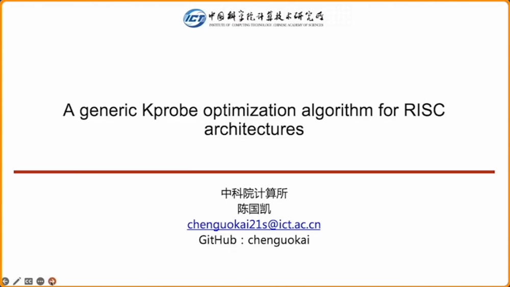
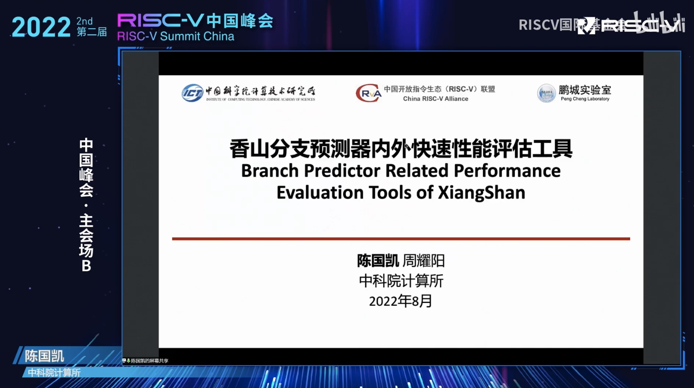

In this interview, we invite an openEuler community member who participated in the Open Source Promotion Plan (OSPP) for three consecutive years. He won the Fastest Progress Award in 2020 and became a mentor of the community in 2021. In 2022, he completed an openEuler project and shared this project at the 17th China Linux Kernel Developer Conference.

From knowledge-driven to interest-driven, and then to challenge-seeking, he continuously advances his skills with persistence in open source contributions. Now, let's listen to his open source story.

At the 17th China Linux Kernel Developer Conference [1] on October 23, 2022, Chen Guokai, a graduate student from the Institute of Computing Technology, Chinese Academy of Sciences, shared the report "A generic Kprobe optimization algorithm for RISC architectures", elaborating on his achievements in this year's Open Source Promotion Plan.

### Self-introduction

OSPP: Please briefly introduce yourself.

Chen: I'm Chen Guokai. I'm a graduate student from the Institute of Computing Technology, Chinese Academy of Sciences. My research focuses on computer architecture. Currently, I'm studying out-of-order superscalar processor frontend design, such as instruction fetching and branch prediction, and custom instruction set extensions. The knowledge in this field helped me to complete my OSPP project this year.

OSPP: When did you come into contact with open source, and how do you think of it?

Chen: If you mean 'when did I use open source software for the first time', well, I tried to install the Linux system on my computer in junior high school to experience another ecosystem different from Windows. It was my first attempt to open source. At that time, I thought, unlike Windows where we need to pay for software, Linux has a huge advantage in distributing software with similar functions free of charge. Now it seems that such understanding is very one-sided. In my undergraduate period, I joined the open source interest group in my school, read classic articles in this field, and knew more about open source. Now, I view open source as a more advanced software and hardware development method than closed source. It is an important means to promote knowledge transmission. For an open source project, there is no distinct boundary between developers and common users. Developers can feed back their improvements on the existing version to a publicly available version. Learning-oriented users can also learn and modify the working mechanism behind code.

OSPP: As I know, you have participated in many projects and competitions. Do you have any experience to share with us?

Chen: Interest is the best teacher and the biggest driving force. I tent to assess the feasibility and gains of any project that takes more than one month based on my capabilities in advance. I participated in NOIP in senior high school, and Summer 2020, Loongson Cup, and Xiangshan open-source processor project at the university. I decided to participate in them because they were challenging and I was interested in such fields.

OSPP: Can you share some learning methods and skills for improving code quality?

Chen: STFW, RTFM, and RTFSC. When I just entered my graduate research team, my peers often answered my questions with one of the three platforms, reminding me that most questions can be solved by reading relevant materials. Many people often seek help from others when encountering problems. However, they may not get valid information or get only fragmented information. So, it's better to rely on ourselves. A large number of description documents and code comments are accumulated throughout the open source software development process. Some common problems have been raised in issues or on Stack Overflow and detailed answers are available. Reading such first-hand documents can help establish a comprehensive knowledge system for these problems, improving learning and coding capabilities.

OSPP: So what's your favorite programming languages?

Chen: I prefer C and Chisel. C is a conventional language. Different from rich standard libraries of other languages, C provides only a limited number of standard functions. This may make C unsuitable for fast iterative software, but ensure good compatibility with historical code and prevent users from abuse of syntax sugar and advanced syntax that damage readability. In addition, for kernel and hardware developers, only stack pointers need to be set from assembly to C, facilitating hardware initialization. As for Chisel, this is an emerging Scala-based hardware description language. The Verilog language is commonly used to describe hardware design. This language is old and lacks syntax and type check features, which is not a good choice for agile hardware development because there are repeated and error-prone descriptions of signals. On the other hand, Chisel is a strongly typed language that provides official intermediate representations and simplifies the connection of signals of the same type, making it possible for using thousands of lines of code to describe the cache structure of superscalar processors and adjust module names in batches.

### OSPP Journey

OSPP: You have participated in OSPP for three consecutive years. In 2020, you won the Fastest Progress Award, and last year you led a project as a community mentor. Is there any difference you feel after you participate in the activities with different roles?

Chen: In 2020, I managed to complete a task that I did not have much confidence in the beginning. I was very excited after such a challenge succeeded. For the second time as a mentor, I knew more partners in the open source community and they helped me complete my open source project. This year, I participated as a student applicant again and chose a project that was more difficult than the project in the first time. I read a lot of related materials and applied a theory different from traditional hardware development.

OSPP: Can you tell us more about the achievements in this project and their application?

Chen: The project is to optimize Kprobes for RISC-V architectures. Kprobe is an instrumentation mechanism provided by the Linux kernel. It allows users to register breakpoint handlers in the kernel code. When the kernel code is executed to the position where a probe is inserted, the corresponding handler is notified to collect statistics or make modifications. The optimization on Kprobes is to replace breakpoint instructions with branch (jump) instructions to implement execution stream hijacking when the execution reaches a breakpoint. Based on my architecture knowledge, I evaluated possible implementation schemes in detail and selected the method of analyzing the instruction stream to find hidden idle registers for optimization. Up to now, this goal has been achieved. Optimized Kprobes can be used to accelerate execution on RISC-V Linux kernels that have related mechanisms.

[https://summer-ospp.ac.cn/2022/#/org/prodetail/22b970495](https://summer-ospp.ac.cn/2022/#/org/prodetail/22b970495)

OSPP: Is there any impressive experience during the project especially the interaction with the community and your mentor?

Chen: My mentor gave me timely feedback on my solution and architecture direction. I benefited a lot from his function segmentation and step-by-step project development strategies.

OSPP: Will you continue improving the documentation and code of this project? What's your plan?

Chen: Sure. Currently the project is incorporated into the openEuler community and has not been applied to the main branch of the Linux kernel mainline yet. I will follow this. Hope that this implementation and algorithm can be applied in other instruction set architectures supported by Linux in the near future.

### Growth in the Community

OSPP: What about the openEuler community? How do you like it?

Chen: The openEuler community maintains stable versions and builds distributions based on main branches of open source software. It attracts FOSS developers to actively contribute to the development of upstream functions.

OSPP: Have you changed your understanding of open source and open-source communities after participating OSPP for three times?

Chen: At the beginning, I paid more attention to technological issues. Gradually, I found that people are the most important to an open-source community, and open-source software and hardware are inevitable results of win-win cooperation among like-minded people.

OSPP: In your mind, what are the major elements for an open source community to continuously attract contributors?

Chen: Practicability of the developed software and hardware, friendly atmosphere of the community, and comprehensive document comments.

OSPP: What are your current technical fields of focus? Will you continue participating in open-source projects or open-source communities in the future?

Chen: I'm currently undertaking the frontend design of the XiangShan open-source out-of-order superscalar processor. XiangShan is an open-source hardware community. Hope that my efforts can enrich XiangShan and its software ecosystem.

### Gains and Suggestions

OSPP: How do you think students should gradually transform from open source beneficiaries to open source contributors in the learning phase?

Chen: Beneficiaries may not be contributors, but contributors definitely benefit from their participation in open source. To be a contributor, you can try some open-source counterparts of closed-source software and you may find some improvement points.

OSPP: Can you give some suggestions for students who participate in OSPP?

Chen: Keep in good contact with your project mentor. If you have questions about project design, discuss with the mentor in a timely manner and provide examples if any.

[1] [http://ckernel.org/](http://ckernel.org/)