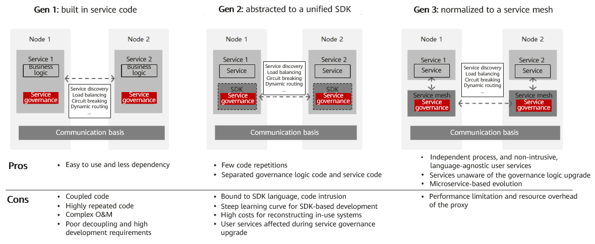

In March, the openEuler community launched an innovative project, the high-performance service governance framework Kmesh, to bring a brand-new data plane for the service mesh through architecture innovation. This blog starts with what is a service mesh and then introduces Kmesh.

The Kmesh project has been released in openEuler 23.03. You are welcome to download and use it.

**Repository address**: [https://gitee.com/openeuler/Kmesh](https://gitee.com/openeuler/Kmesh)

## What Is a Service Mesh

In 2016, the concept of a service mesh was proposed by Buoyant, the company behind the development of Linkerd software. Willian Morgan, the CEO of Linkerd, gave the initial definition of a service mesh:

"A service mesh is a dedicated infrastructure layer for handling service-to-service communication. It's responsible for the reliable delivery of requests through the complex topology of services that comprise a modern, cloud native application. In practice, the service mesh is typically implemented as an array of lightweight network proxies that are deployed alongside application code, without the application needing to be aware."

A service mesh is a product of service governance evolution. The objective is to achieve better communication between microservices. It uses governance rules such as load balancing, canary routing, and circuit breaking to properly orchestrate traffic and maximize cluster service capabilities.

We divide the evolution of service governance into three generations and compare them in the following figure. We can see that the service governance capabilities gradually decouple from business logic and move down to the infrastructure.

As the infrastructure layer for handling inter-service communication, a service mesh, which is a next-generation cloud native technology, effectively makes up for shorts of Kubernetes in microservice governance and has become a key component of cloud infrastructure.

In recent years, many service mesh software has emerged in the industry, such as Linkerd, Istio, Consul Connect, and Kuma. They have similar software architectures. The following uses Istio as an example to show the basic architecture of a service mesh.

Take a Kubernetes cluster as an example. When a pod instance is created, the service mesh software transparently creates a proxy container (also called sidecar. The default sidecar used in Istio is Envoy) in the pod. The basic pod communication flow is as follows:

-   Traffic is transparently intercepted to the proxy component in the pod based on iptables rules.

-   The proxy component completes the traffic governance logic (such as circuit breaking, routing, and load balancing) based on the request, finds the destination service instance to communicate, and forwards the message.

-   The proxy component in the destination pod intercepts the incoming traffic, performs basic traffic governance logic (such as traffic limiting), and forwards the traffic to the pod.

-   After processing, the response is returned to the requesting pod following the original path.

## Challenges of the Service Mesh Data Plane

It can be referred that a service mesh implements service governance transparent to applications by introducing a proxy layer in the data plane. However, the introduced proxy layer inevitably increases the latency of service communication and deteriorates the performance.

Use the data on the Isito official website as an example. In a cluster, the average per-hop communication latency between microservices on the data plane increases by 2.65 ms. We know that, an external access usually involves multiple invocations between microservice in the cluster, which accumulates high latency overhead. With increasingly wide application of service meshes, the additional latency overhead at the proxy layer has become the major pain point.

To address this issue, we conducted performance testing on L7 load balancing for HTTP services to analyze the communication performance of the service mesh. The breakdown of time consumption is as follows:

According to the detailed analysis of the traffic, we can see that inter-service communication transitions from one connection establishment to three, and from two protocol stack traversals to six. The time is mainly consumed in data copying, link establishment, and context scheduling and switching. The overhead of traffic governance is relatively small.

Here is the question: How to reduce the latency while maintaining transparent governance by the mesh over applications?

## Kmesh for High-Performance Service Governance

Based on the preceding performance analysis, we have conducted a two-stage optimization for the service mesh data plane.

### Kmesh 1.0: Accelerating the Service Mesh Data Plane Using Sockmap

Sockmap is an eBPF feature introduced in Linux 4.14. It can redirect data flows between sockets on a node without going through the complex kernel protocol stack, accelerating data forwarding between sockets over links.

In a service mesh, the default communication between a business container in a pod and a local proxy component goes through the complete kernel protocol stack. This overhead can be reduced by using sockmap, as shown in the following figure.

Basic steps for data foreword acceleration using sockmap:

-   An eBPF program (program type: BPF_PROG_TYPE_SOCK_OPS) is attached during link establishment to intercept all TCP link establishment actions and record socket information of the two communication sides in a sockmap table.

-   In the BPF_SOCK_OPS_ACTIVE_ESTABLISHED_CB state, a client-side sockmap record is added.

-   In the BPF_SOCK_OPS_PASSIVE_ESTABLISHED_CB state, a server-side sockmap record is added.

-   An eBPF program (program type: BPF_PROG_TYPE_SK_MSG) is attached during the sendmsg process to intercept message sending actions.
    
-   Based on the current socket information, the program looks up the sockmap table, associates it with the destination socket information, and then redirects the traffic to the receiving queue of the destination socket.

By leveraging sockmap to accelerate the service mesh data plane, we observed a 10% to 15% reduction in average latency for service access in a scenario with 60 long-lived connections.

While sockmap is a commonly used solution for optimizing the service mesh data plane, it does not fully address the performance challenges associated with service mesh latency.

### Kmesh 2.0: Offloading Traffic Governance to the OS Based on a Programmable Kernel

According to the preceding performance measurement results, it is evident that a significant portion of the additional overhead introduced by the service mesh is spent on redirecting traffic to the proxy component. The actual overhead of performing traffic governance is relatively small. This raises the question: Can we bypass the proxy component and perform traffic governance directly within the kernel, which is naturally involved in network communication?

Kmesh, a high-performance service mesh data plane solution that leverages a programmable kernel to offload traffic governance to the OS, is proposed. With Kmesh, the data plane no longer goes through the proxy component, and service-to-service communication is reduced from three hops to one hop, enabling traffic governance to be performed along the path of traffic transmission. The flow of traffic between microservices in Kmesh is illustrated below:

Kmesh software architecture:

Kmesh consists of the following components:

-   kmesh-controller: Kmesh management program responsible for Kmesh lifecycle management, xDS protocol integration, observability, and other functions.
    
-   kmesh-api: API interface layer provided by Kmesh, including the orchestrated API transformed from xDS and observability channels.
    
-   kmesh-runtime: Runtime implemented in the kernel that supports L3-L7 traffic orchestration.

-   kmesh-orchestration: L3-L7 traffic orchestration implemented based on eBPF, including routing, canary deployments, load balancing, and more.
    
-   kmesh-probe: Observability probe that provides end-to-end observability capabilities.

We deployed an Istio mesh environment and conducted comparative testing on the performance of different data plane solutions (Envoy/Kmesh) for L7 load balancing of HTTP services using the Fortio testing tool.

The results showed that Kmesh achieved a 5x performance improvement in service-to-service communication compared to the native data plane of Istio (Envoy). We also tested the performance of service-to-service communication in a non-mesh environment based on Kubernetes, and the performance was comparable to Kmesh. This further validates the latency performance of Kmesh. (The testing scenario involved L7 load balancing in a laboratory environment, and the actual performance in real governance scenarios may not be as ideal. Preliminary evaluations suggest a 2x to 3x improvement over Istio.)

## Conclusion

As a next-generation technology for cloud-native environments, a service mesh provides transparent service governance for applications. However, the proxy architecture introduces additional latency overhead, which has become a critical challenge for widespread adoption of service meshes. Kmesh proposes a new approach by offloading traffic governance to the OS using a programmable kernel.
By doing so, Kmesh significantly improves the performance of the service mesh data plane. It offers a fresh perspective for the development of the service mesh data plane.

Kmesh is a new project in the openEuler community and is still in the initial stage. We will continue to improve its L4/L7 traffic governance capabilities. For more information, visit [https://gitee.com/openeuler/Kmesh](https://gitee.com/openeuler/Kmesh). We welcome interested users to download and try it out.

## Reference

[https://linkerd.io/2017/04/25/whats-a-service-mesh-and-why-do-i-need-one](https://linkerd.io/2017/04/25/whats-a-service-mesh-and-why-do-i-need-one)

[https://istio.io/latest/docs/ops/deployment/architecture](https://istio.io/latest/docs/ops/deployment/architecture)

[https://istio.io/v1.16/docs/ops/deployment/performance-and-scalability/#performance-summary-for-istio-hahahugoshortcode-s0-hbhb](https://istio.io/v1.16/docs/ops/deployment/performance-and-scalability/#performance-summary-for-istio-hahahugoshortcode-s0-hbhb)
