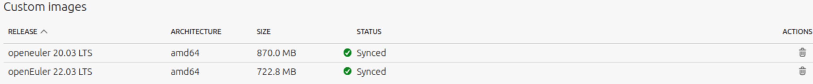
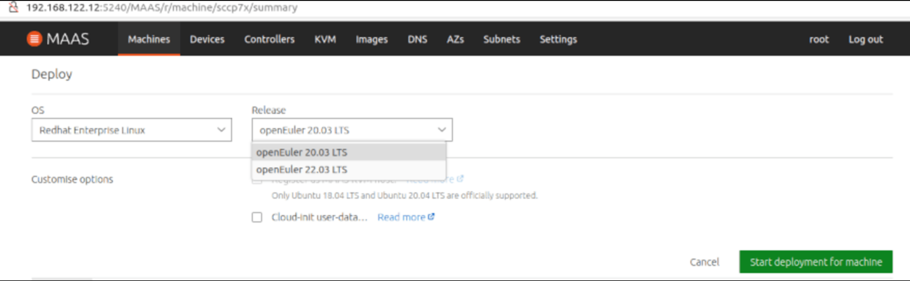
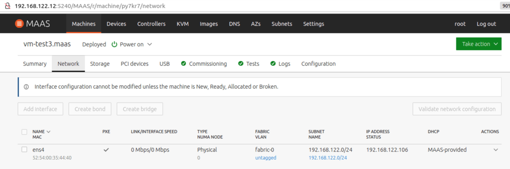
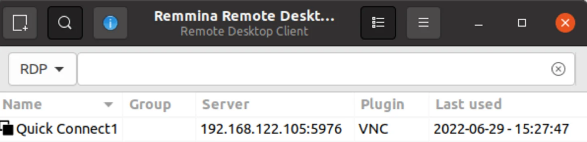
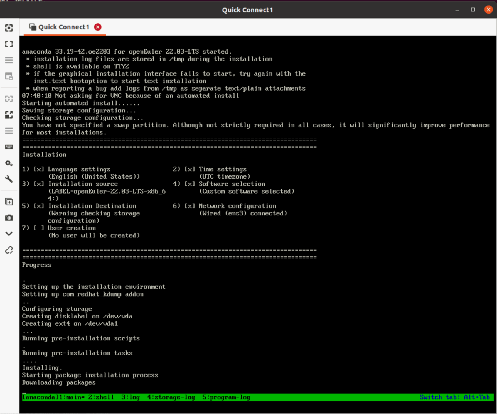

---
title: 'Using Canonical MAAS to Deploy openEuler | Linux Server Operating System'
titleTemplate: official website of the openEuler community
head:
  - - meta
    - name: description
      content: Canonical Metal as a Service (MAAS) is a remote OS installation and deployment tool used for automatic server discovery and configuration. It can convert physical servers into resources similar to virtual machines (VMs) to implement self-service and remote access of physical servers. MAAS currently supports deployment of Ubuntu, CentOS, RHEL, Windows, ESXi, and custom images. When hundreds of physical servers are managed in a data center, such as in cloud and HPC scenarios, MAAS is one of the best choices for minimizing O&M expenses. For more information, visit the openEuler official website.
  # - - meta
  #   - name: keywords
  #     content: OS migration, OS replacement, server system migration software, server system migration tool, CentOS system migration, migration procedure
category: blog
date: 2022-08-23
tags:
  - Canonical MAAS
  - openEuler
archives: 2022-08
author:
  - Mao Zhanglei
summary: The test in this blog demonstrates how to use Packer to build openEuler images for MAAS and verify MAAS-enabled deployment. Additionally, it explores temporary solutions to known issues, and potential enhancements or fixes for cloud-init and curtin when MAAS directly supports openEuler.
---

Canonical Metal as a Service ([MAAS](https://maas.io/)) is a remote OS installation and deployment tool used for automatic server discovery and configuration. It can convert physical servers into resources similar to virtual machines (VMs) to implement self-service and remote access of physical servers. MAAS currently supports deployment of Ubuntu, CentOS, RHEL, Windows, ESXi, and custom images. When hundreds of physical servers are managed in a data center, such as in cloud and HPC scenarios, MAAS is one of the best choices for minimizing O&M expenses.

The test in this blog demonstrates how to use Packer to build openEuler images for MAAS and verify MAAS-enabled deployment. Additionally, it explores temporary solutions to known issues, and potential enhancements or fixes for cloud-init and curtin when MAAS directly supports openEuler.

## Test Environment Requirements

Create an openEuler MAAS image with Packer:

- Ubuntu 18.04+, able to run kernel-based virtual machines (KVMs)

- Packer 1.8.0+

- External network access, for downloading openEuler ISO and accessing Packer-MAAS with Git

Deploy an openEuler image with MAAS and verify the deployment:

- MAAS 3.0+

- Physical server or KVM host managed by MAAS

This test can be conducted on a laptop running Ubuntu Desktop 20.04, where MAAS 3.1 can be installed on an LXD VM, with the host itself added as a KVM host. Both the host and VM can be used by Packer to create an openEuler image, but 20 GB available disk space is required. The detailed method of using MAAS in a single-server system can be found in the document links provided in the appendix.

## Building an openEuler MAAS Image with Packer

MAAS is useful only for OS images that can be used on nodes. You can select and synchronize Ubuntu and CentOS images directly from the MAAS GUI. You can also build RHEL, Windows, and ESXi MAAS images yourself and upload them to MAAS. There are two methods to build custom images to be deployed to MAAS machines: MAAS Image Builder and Packer. In this test, we use Packer and the RHEL 8 template.

Install Packer.

```shell
curl -fsSL https://apt.releases.hashicorp.com/gpg | sudo apt-key add -
sudo apt-add-repository "deb [arch=amd64] https://apt.releases.hashicorp.com $(lsb_release -cs) main"
sudo apt-get update && sudo apt-get install packer
```

Install dependencies.

```shell
sudo apt install qemu-system qemu-utils ovmf cloud-image-utils make
```

Download the Packer-MAAS template.

```shell
git clone https://github.com/canonical/packer-maas.git
```

> **Because Packer-MAAS currently does not have an openEuler template, the RHEL 8 template can be used but needs to be adapted. Download a tested template applicable to openEuler 20.03/22.03 LTS as below. If you want to view the content directly, you can access it through a browser.**

<https://git.launchpad.net/~zhanglei-mao/+git/packer-maas-openeuler/tree/>

```shell
cd packer-maas
git clone https:// git.launchpad.net/~zhanglei-mao/+git/packer-maas-openeuler openeuler
```

Use a browser to access <https://repo.openeuler.org/> to download the openEuler ISO file, and upload it to the Packer machine.

```shell
make ISO=/PATH/TO/openeuler-22.03-LTS-x86_64-dvd.iso

Example:
ubuntu@vm-k8s-w2:~/packer-maas/openeuler$ ls /home/ubuntu/*.iso -lhs
3.4G -rw-rw-r-- 1 ubuntu ubuntu 3.4G Jun 29 07:20 /home/ubuntu/openEuler-22.03-LTS-x86_64-dvd.iso
4.2G -rw-r--r-- 1 ubuntu ubuntu 4.2G Jun 29 01:24 /home/ubuntu/openEuler-20.03-LTS-SP1-x86_64-dvd.iso
ubuntu@vm-k8s-w2:~/packer-maas/ openeuler$ make ISO=/home/ubuntu/openEuler-22.03-LTS-x86_64-dvd.iso
...
==> qemu: Waiting 3s for boot...
==> qemu: Connecting to VM via VNC (0.0.0.0:5976)
...
==> qemu: Waiting for shutdown…
...
2022/06/29 07:34:54 packer-builder-qemu plugin: VM shut down.
==> qemu: Converting hard drive...
...
    qemu (shell-local): Mounting root partition...
    qemu (shell-local): Creating MAAS image openeuler.tar.gz...
...
ubuntu@ vm-k8s-w2:~/packer-maas/openeuler$ ls openeuler.tar.gz -lhs
690M -rw-r--r-- 1 root root 690M Jun 29 07:36 openeuler.tar.gz
ubuntu@vm- k8s-w2:~/packer-maas/openeuler$ mv openeuler.tar.gz openeuler2203.tar.gz
ubuntu@vm-k8s-w2:~/packer-maas/ openeuler$ make ISO=/home/ubuntu//home/ubuntu/openEuler-20.03-LTS-SP1-x86_64-dvd.iso
...
ubuntu@vm- k8s-w2:~/packer-maas/openeuler$ mv openeuler.tar.gz openeuler2003.tar.gz
```

**openeuler.tar.gz** is the created MAAS image. It needs to be uploaded to the MAAS server for subsequent import. The VNC port in the Packer output can be used for VNC access. Note that the port number is different each time.

## Uploading an openEuler Image to MAAS for Deployment and Verifying the Deployment

Upload an image to MAAS as follows:

```shell
maas $PROFILE boot-resources create \
name='rhel/rhel8' title='openEuler 22.03' architecture='amd64/generic' filetype='tgz' \ content@ =openeuler.tar.gz #

#Example:
zlmao@p14s:~/tmp$ scp ubuntu@192.168.122.105:~/packer-maas/openeuler/*.gz ./
Openeuler.tar.gz 100% 689MB 209.9MB/s 00 :03
zlmao@p14s:~/tmp$ lxc file push openeuler.tar.gz maas2/home/ubuntu/
zlmao@p14s:~/tmp$ lxc exec maas2 bash
root@maas2:~# su - ubuntu
ubuntu@maas2:~$ maas login root  http://192.168.122.12:5240/maas/ $(sudo maas apikey --username root)
ubuntu@maas2:~$ maas root boot-resources create name=rhel/8 title="openEuler 22.03 LTS" architecture=amd64/generic content@=openeuler2203.tar.gz
ubuntu@maas2:~$ maas root boot-resources create name=rhel/8.2 title="openEuler 20.03 LTS" architecture=amd64/generic content@=openeuler2003.tar.gz
```

Note that if you have multiple versions of openEuler images, use different RHEL/8.*x*.
On the MAAS GUI, you can find that the uploaded images have been synchronized.



To deploy an image, select **Redhat Enterprise Linux** for the OS, and then select the **openEuler 22.03 LTS** release.



About 4 to 10 minutes later, the system displays "Deployed", which indicates that the deployment is successful. You can find the allocated IP address for SSH remote access.



For openEuler 22.03, use the default **openeuler** username and SSH key for remote access. For openEuler 20.03, the default user is **openEuler**.

```shell
zlmao@p14s:~$ ssh openeuler@192.168.122.106
Authorized users only. All activities may be monitored and reported.
Welcome to 5.10.0-60.18.0.50.oe2203.x86_64
System information as of time: 	Wednesday, June 29, 2022 AM08:23:20 UTC
System load: 	0.05
Processes: 	97
Memory used: 	8.9%
Swap used: 	0%
Usage On: 	48%
IP address: 	192.168.122.106
Users online: 	1
To run a command as administrator(user "root"),use "sudo ".
[openeuler@vm-test3 ~]$ uname -a
Linux vm-test3.maas 5.10.0-60.18.0.50.oe2203.x86_64 #1 SMP Wed Mar 30 03:12:24 UTC 2022 x86_64 x86_64 x86_64 GNU/Linux
[openeuler@vm-test3 ~]$

zlmao@p14s:~$ ssh openEuler@192.168.122.107
```

```shell
Authorized users only. All activities may be monitored and reported.
Welcome to 4.19.90-2109.1.0.0108.oe1.x86_64
System information as of time: 	Thu Jun 30 13:40:24 UTC 2022
System load: 	0.06
Processes: 	94
Memory used: 	6.8%
Swap used: 	0.0%
Usage On: 	31%
IP address: 	192.168.122.107
Users online: 	1
[openEuler@vm-k8s-m1 ~]$ uname -a
Linux vm-k8s-m1.maas 4.19.90-2109.1.0.0108.oe1.x86_64 #1 SMP Mon Sep 6 05:27:07 UTC 2021 x86_64 x86_64 x86_64 GNU/Linux
[openEuler@vm-k8s-m1 ~]$
```

## Customizing a Packer Template

During build, Packer reads the **openeuler.js** configuration file, creates a qemu-kvm VM, and uses ISO boot and **http/openeuler.ks** as the automatic installation configuration file. Once the automatic installation is complete and the power is turned off, Packer invokes the **setup-nbd** and **tar-root** scripts to generate the final image file.

The difference between the following **openeuler.js** template and RHEL 8 lies in **console=tty0** and **vnc_ind_address**. In this template, the output of the VM can be redirected to the VNC client and the VNC can be accessed from the network instead of only the local host (127.0.0.1).

```shell
ubuntu@vm-k8s-w2:~/packer-maas/openeuler$ cat openeuler.json
{
    "variables":
        {
          "openeuler_iso_path": "{{env `OPENEULER_ISO_PATH`}}"
        },
    "builders": [
        {
            "type": "qemu",
            "communicator": "none",
            "iso_url": "{{user `openeuler_iso_path`}}",
            "iso_checksum": "none",
            "boot_command": [
                " ",
                "inst.ks=http://{{ .HTTPIP }}:{{ .HTTPPort }}/openeuler.ks ",
                "console=ttyS0 console=tty0 inst.cmdline",
                ""
            ],
            "boot_wait": "3s",
            "disk_size": "4G",
	    "headless": true,
	    "vnc_bind_address": "0.0.0.0",
            "memory": 2048,
            "http_directory": "http",
            "qemuargs": [
                [ "-serial", "stdio" ]
            ],
            "shutdown_timeout": "1h"
        }
    ],
    "post-processors": [
        {
            "type": "shell-local",
            "inline_shebang": "/bin/bash -e",
            "inline": [
                "source ../scripts/setup-nbd",
                "OUTPUT=${OUTPUT:-openeuler.tar.gz}",
                "source ../scripts/tar-root"
            ]
        }
    ]
}
ubuntu@vm-k8s-w2:~/packer-maas/openeuler$
```

**http/ openeuler.ks** is based on **rhel8.ks**, and removes configurations that would fail in openEuler. The most important modifications are as follows:

```shell
ubuntu@vm-k8s-w2:~/packer-maas/openeuler$ cat -n http/openeuler.ks
        ...
    39	yum clean all
    40	echo "%rhel 8" >> /etc/rpm/ macros.dist
    41	sed -i s/\^ID=.*\$/ID=\"rhel\"/ /etc/os-release
    42	%end
       ...
```

This is a temporary solution to the following two issues. It deceives curtin and cloud-init that the RHEL OS is being deployed and no errors occur.

## Errors Occurring During openEuler Deployment and Possible Solutions

MAAS uses curtin to decompress the openEuler image uploaded to MAAS and install the grub program during MAAS-enabled deployment. cloud-init is used to initialize the machine during the first boot after deployment by MAAS, such as setting the machine name and network address, injecting SSH public key, and so on. The user data used by cloud-int is managed and automatically provided by MAAS. If there is no temporary solution to pretend the openEuler image as RHEL, the following two errors will occur during deployment. For more information and follow-up, visit <https://bugs.launchpad.net/curtin/+bug/1975922>.

```shell
# during deploy, the curtin failed with
finish: cmd-install/stage-curthooks/builtin/cmd-curthooks: FAIL: curtin command curthooks
Traceback (most recent call last):
  File "/curtin/curtin/distro.py", line 120, in get_distroinfo
    variant = name_to_distro(variant_name)
  File "/curtin/curtin/distro.py", line 57, in name_to_distro
    return DISTROS[DISTROS.index(distname)]
ValueError: tuple.index(x): x not in tuple

# after deploy, cloud-init failed with:
2022-06-21 02:30:15,216 - stages.py[ERROR]: Unable to render networking. Network config is likely broken: No available network renderers found. Searched through list: ['eni', 'sysconfig', 'netplan']
```

The test of the following modifications to the curtin and cloud-init code is successful:

```shell
#In curtin/curtin/distro.py
DISTRO_NAMES = ['arch', 'centos', 'debian', 'fedora', 'freebsd', 'gentoo',
                'opensuse', 'redhat', 'rhel', 'sles', 'suse', 'ubuntu', 'openEuler']
...
OS_FAMILIES = {
    DISTROS.debian: [DISTROS.debian, DISTROS.ubuntu],
    DISTROS.redhat: [DISTROS.centos, DISTROS.fedora, DISTROS.redhat,
                     DISTROS.rhel, DISTROS.openEuler],

#Make openEuler be detected as rhel8 (rpm -E "%rhel")
echo "%rhel 8" >> /etc/rpm/macros.dist

# In /usr/lib/python3.7/site-packages/cloudinit/net/sysconfig.py, change openEuler to openeuler
KNOWN_DISTROS = ['centos', 'fedora', 'rhel', 'suse', 'openeuler']

# In /usr/lib/python3.7/site-packages/cloudinit/util.py, add 'openeuler'
                'arch', 'centos', 'debian', 'fedora', 'rhel', 'suse', 'openeuler'):
```

## Using VNC to Monitor the Packer Build Process

Packer build depends on the **kickstart** configuration file. It waits for the created VM to shut down automatically once the installation is complete and uses VNC to monitor errors output by logs. This is useful for debugging issues. If an Ubuntu desktop system is available, you can use VNC clients such as Remmina to access the system. The VNC port can be found in the output of Packer build.





Note that you can press **Ctrl+B 1-5** to switch the tmux window.

## Appendix - Reference Documents

- How to Test MAAS on a Computer

  - [Chapter 1 Installation](https://cn.ubuntu.com/blog/ubuntu-maas-installation-tutorial)

  - [Chapter 2 Initialization](https://cn.ubuntu.com/blog/ubuntu-maas-installation-tutorial-1)

  - [Chapter 3 KVM POD/Host](https://cn.ubuntu.com/blog/ubuntu-maas-installation-tutorial-2)

- [MAAS Installation](https://maas.io/docs/how-to-install-maas#heading--fresh-install-3-1-packages)

- [Adding a VM Host](https://maas.io/docs/how-to-manage-vm-hosts)

- [MAAS Documentation](https://maas.io/docs)

---

This blog is written by Canonical's senior field engineer Mao Zhanglei.

Link: <https://cn.ubuntu.com/blog/use-canonical-maas-deploy-openeuler-test>
