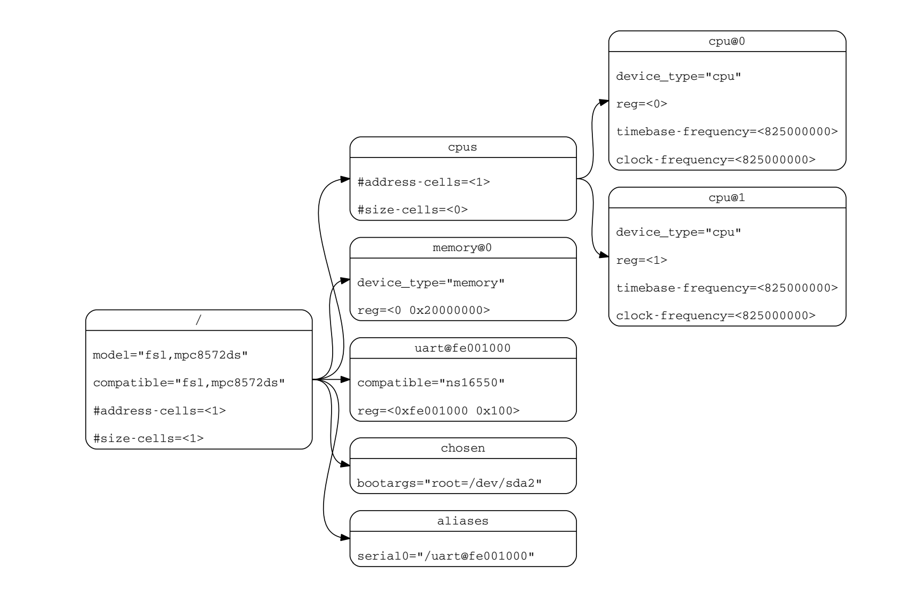

CPU topology describes how CPUs are combined physically. This blog describes the symmetric multi-processor (SMP) architecture. CPU topology also includes other information, such as cache hierarchy, which will be discussed later. In addition to describing CPU composition, CPU topology information is also used by the scheduler of the kernel to achieve better performance. StratoVirt supports CPU topology configuration, which lays a foundation for the development of CPU hot swapping.

Common CPU hierarchy in the SMP architecture:

```
Socket --> die --> cluster --> core --> thread
```

- Socket: CPU socket on the mainboard.  
- Die: a small block cut from a wafer during processor production. Internal components of a die are interconnected via an on-chip bus.  
- Cluster: a combination of big and/or small cores.  
- Core: an independent physical CPU.  
- Thread: logical CPU, a concept introduced by Intel hyper-threading technology.

## Obtaining CPU Topology

The methods of obtaining CPU topology for the x86 and Arm architectures are different. The following describes the methods separately.

### x86

In the x86 architecture, the OS reads CPUID to obtain CPU topology. In the x86 architecture, the CPUID instruction (identified by a CPUID opcode) is a processor supplementary instruction that allows software to discover details of the processor. A program can use CPUID to determine the processor type.

CPUID implicitly uses the EAX register to determine the main category of returned information, which is called a CPUID leaf. CPUID leaves related to CPU topology are 0BH and 1FH. 1FH is an extension of 0BH and can indicate more levels. Intel recommends that 1FH be checked first. If 1FH exists, it is preferentially used. When the value of EAX is initialized to 0BH, CPUID returns the core/logical processor topology information in the EAX, EBX, ECX, and EDX registers. This function (EAX=0BH) requires that ECX be initialized as an index that indicates the core level or logical processor level. The OS invokes this function in the sequence of ECX=0,1,2...n. The order in which processor topology levels are returned is fixed because each level reports some cumulative data that may depend on information retrieved from previous levels. When EAX=0BH, ECX can represent levels SMT and core. When EAX=1FH, ECX can represent levels SMT, core, module, tile, and die.

The following table provides a detailed explanation.

| Initial EAX Value | Information Provided about the Processor                                                                                                                                                                                                                                                                                                                                                                                                                                                                                                 |
| ----------------- | ---------------------------------------------------------------------------------------------------------------------------------------------------------------------------------------------------------------------------------------------------------------------------------------------------------------------------------------------------------------------------------------------------------------------------------------------------------------------------------------------------------------------------------------- |
| 0BH               | EAX Bits 04 - 00: Number of bits to shift right on x2APIC ID to get a unique topology ID of the next level type\*. All logical processors with the same next level ID share current level. Bits 31 - 05: Reserved. EBX Bits 15 - 00: Number of logical processors at this level type. The number reflects configuration as shipped by Intel. Bits 31- 16: Reserved. ECX Bits 07 - 00: Level number. Same value in ECX input. Bits 15 - 08: Level type. Bits 31 - 16: Reserved. EDX Bits 31- 00: x2APIC ID the current logical processor. |
| 1FH               | EAX Bits 04 - 00: Number of bits to shift right on x2APIC ID to get a unique topology ID of the next level type\*. All logical processors with the same next level ID share current level. Bits 31 - 05: Reserved. EBX Bits 15 - 00: Number of logical processors at this level type. The number reflects configuration as shipped by Intel. Bits 31- 16: Reserved. ECX Bits 07 - 00: Level number. Same value in ECX input. Bits 15 - 08: Level type. Bits 31 - 16: Reserved. EDX Bits 31- 00: x2APIC ID the current logical processor  |

Source: Intel 64 and IA-32 Architectures Software Developer's Manual

### Arm

In the Arm architecture, if the OS is started based on a device tree, the CPU topology is obtained through the device tree. If the OS is started in advanced configuration and power interface (ACPI) mode, the OS parses the processor properties topology table (PPTT) table to obtain the CPU topology.

### ACPI and PPTT

ACPI is an architecture-independent power management and configuration framework. This framework establishes a set of hardware registers to define the power state. ACPI is an intermediate layer between the OS and firmware, or, an interface between them. It defines two types of data structures: data tables and definition blocks. Data tables are used to store raw data used by device drivers. Definition blocks consist of bytecode that can be executed by the interpreter.

To give hardware vendors flexibility in selecting their implementations, ACPI uses tables to describe system information, functions, and methods of controlling these functions. These tables list devices on the system mainboard, devices that cannot be detected by other hardware standards, or devices that cannot be controlled by other power management methods, as well as ACPI-related functions. These tables also list system functions, such as supported sleep states, descriptions of power planes and clock sources available in the system, batteries, and system LED indicators. This enables Operating System-directed configuration and Power Management (OSPM) for system device control.

The PPTT table is one of the tables. It is used to describe the processor topology as well as additional information, for example, nodes in the processor topology that form a physical package.

The following figure shows the structure of a PPTT table, including a table header and a body. The table header is similar to that of other ACPI tables. `Signature` indicates the PPTT table, and `Length` indicates the size of the entire table. Other information is also included. The body of the table is a series of processor topologies.

The following figure shows the processor hierarchy node structure. `Type` = 0 indicates that this is a processor structure. `Length` indicates the length of the local node in bytes. `Flags` describes processor-related information. For details, see "Processor Structure Flags." `Parent` points to the upper-level node of the current node. It stores an offset address.

The following figure shows the structure of `Flags`. `Flags` occupies four bytes. `Physical package`: If this node in the processor topology represents the boundary of a physical package, this field must be set to **1**. Otherwise, set it to **0**. `Processor is a Thread`: For a leaf entry, if the processing units of this processor share the functional unit with sibling nodes, this field must be set to **1**. For a non-leaf entry, this field must be set to **0**. `Node is a Leaf`: If the node is a leaf in the processor hierarchy, this field must be set to **1**. Otherwise, this field must be set to **0**.

Reference: [https://uefi.org/specs/ACPI/6.4/05_ACPI_Software_Programming_Model/ACPI_Software_Programming_Model.html#processor-properties-topology-table-pptt](https://uefi.org/specs/ACPI/6.4/05_ACPI_Software_Programming_Model/ACPI_Software_Programming_Model.html#processor-properties-topology-table-pptt)

### Device Tree

A device tree is a data structure that describes hardware. The kernel bootloader loads a device tree to the memory and parses the device tree to obtain hardware information. A device tree consists of named nodes and properties. A node can contain child nodes, which form a tree. Properties are name–value pairs.

The following figure shows a typical device tree.


The Arm CPU topology is defined in the **cpu-map** node, which is a child node of the **cpu** node. The **cpu-map** node can contain three types of child nodes: **cluster**, **core**, and **thread**. A device tree source (DTS) file example is as follows:

```json
cpus {
	#size-cells = <0>;
	#address-cells = <2>;

	cpu-map {
		cluster0 {
			cluster0 {
				core0 {
					thread0 {
						cpu = <&CPU0>;
					};
					thread1 {
						cpu = <&CPU1>;
					};
				};

				core1 {
					thread0 {
						cpu = <&CPU2>;
					};
					thread1 {
						cpu = <&CPU3>;
					};
				};
			};

			cluster1 {
				core0 {
					thread0 {
						cpu = <&CPU4>;
					};
					thread1 {
						cpu = <&CPU5>;
					};
				};

				core1 {
					thread0 {
						cpu = <&CPU6>;
					};
					thread1 {
						cpu = <&CPU7>;
					};
				};
			};
		};
    };

    //...
};
```

Reference: [https://www.kernel.org/doc/Documentation/devicetree/bindings/arm/topology.txt](https://www.kernel.org/doc/Documentation/devicetree/bindings/arm/topology.txt)

Figure source: [https://www.devicetree.org/specifications/](https://www.devicetree.org/specifications/)

## Implementation of StratoVirt

### CPUID

First, we need to calculate the unique topology ID of each topology, and then obtain or create a CPUID entry. When the value of **function** of the entry is 0xB or 0x1F, we need to set EAX, EBX, ECX values according to the CPUID specifications. EAX indicates the topology ID, EBX indicates the number of logical processors at that level, and ECX indicates the level number. For the 0xB function, the values when **index** is **0** and **1** must be set. For the 0x1F function, the values when **index** is **0**, **1**, and **2** must be set. The code is as follows:

```rust
// cpu/src/x86_64/mod.rs
const ECX_INVALID: u32 = 0u32 << 8;
const ECX_THREAD: u32 = 1u32 << 8;
const ECX_CORE: u32 = 2u32 << 8;
const ECX_DIE: u32 = 5u32 << 8;

impl X86CPUState {
    fn setup_cpuid(&self, vcpu_fd: &Arc<VcpuFd>) -> Result<()> {
        // Calculate the topology ID.
        let core_offset = 32u32 - (self.nr_threads - 1).leading_zeros();
        let die_offset = (32u32 - (self.nr_cores - 1).leading_zeros()) + core_offset;
        let pkg_offset = (32u32 - (self.nr_dies - 1).leading_zeros()) + die_offset;

        // Obtain the KVM FD and CPUID entries supported by the KVM.

        for entry in entries.iter_mut() {
            match entry.function {
                // ...
                0xb => {
                    // Extended topology enumeration leaf
                    entry.edx = self.apic_id as u32;
                    entry.ecx = entry.index & 0xff;
                    match entry.index {
                        0 => {
                            entry.eax = core_offset;
                            entry.ebx = self.nr_threads;
                            entry.ecx |= ECX_THREAD;
                        }
                        1 => {
                            entry.eax = pkg_offset;
                            entry.ebx = self.nr_threads * self.nr_cores;
                            entry.ecx |= ECX_CORE;
                        }
                        _ => {
                            entry.eax = 0;
                            entry.ebx = 0;
                            entry.ecx |= ECX_INVALID;
                        }
                    }
                }
                // 0x1F extension, supporting the die level
                0x1f => {
                    if self.nr_dies < 2 {
                        entry.eax = 0;
                        entry.ebx = 0;
                        entry.ecx = 0;
                        entry.edx = 0;
                        continue;
                    }

                    entry.edx = self.apic_id as u32;
                    entry.ecx = entry.index & 0xff;

                    match entry.index {
                        0 => {
                            entry.eax = core_offset;
                            entry.ebx = self.nr_threads;
                            entry.ecx |= ECX_THREAD;
                        }
                        1 => {
                            entry.eax = die_offset;
                            entry.ebx = self.nr_cores * self.nr_threads;
                            entry.ecx |= ECX_CORE;
                        }
                        2 => {
                            entry.eax = pkg_offset;
                            entry.ebx = self.nr_dies * self.nr_cores * self.nr_threads;
                            entry.ecx |= ECX_DIE;
                        }
                        _ => {
                            entry.eax = 0;
                            entry.ebx = 0;
                            entry.ecx |= ECX_INVALID;
                        }
                    }
                }
                // ...
            }
        }
}
```

### PPTT

Based on the standards of the ACPI PPTT table, we need to calculate the offset value of each node for its child node to point to it. We also need to calculate the UID of each node. The initial UID is 0 and is incremented by 1 for each node. The value of **Flags** also needs to be calculated according to the PPTT table standards. At last, calculate the size of the entire table and change the value of **Length**.

```rust
// machine/src/standard_vm/aarch64/mod.rs
impl AcpiBuilder for StdMachine {
    fn build_pptt_table(
        &self,
        acpi_data: &Arc<Mutex<Vec<u8>>>,
        loader: &mut TableLoader,
    ) -> super::errors::Result<u64> {
        // ...
        // Configure the PPTT table header.

        // Add a socket node.
        for socket in 0..self.cpu_topo.sockets {
            // Calculate the offset from the start address.
            let socket_offset = pptt.table_len() - pptt_start;
            let socket_hierarchy_node = ProcessorHierarchyNode::new(0, 0x2, 0, socket as u32);
            // ...
            for cluster in 0..self.cpu_topo.clusters {
                let cluster_offset = pptt.table_len() - pptt_start;
                let cluster_hierarchy_node =
                    ProcessorHierarchyNode::new(0, 0x0, socket_offset as u32, cluster as u32);
                // ...
                for core in 0..self.cpu_topo.cores {
                    let core_offset = pptt.table_len() - pptt_start;
                    // Determine whether to add a thread node.
                    if self.cpu_topo.threads > 1 {
                        let core_hierarchy_node =
                            ProcessorHierarchyNode::new(0, 0x0, cluster_offset as u32, core as u32);
                        // ...
                        for _thread in 0..self.cpu_topo.threads {
                            let thread_hierarchy_node =
                                ProcessorHierarchyNode::new(0, 0xE, core_offset as u32, uid as u32);
                            // ...
                            uid += 1;
                        }
                    } else {
                        let thread_hierarchy_node =
                            ProcessorHierarchyNode::new(0, 0xA, cluster_offset as u32, uid as u32);
                        // ...
                        uid += 1;
                    }
                }
            }
        }
        // Add the PPTT table to the loader.
    }
}
```

### Device Tree

A StratoVirt microVM is started using a device tree. Therefore, we need to configure **cpu-map** under the **cpus** node in the device tree to enable the microVM to parse the CPU topology. In StratoVirt, two layers of clusters are supported. We use a multi-layer loop to create the tree. The first layer is a cluster, the second layer is a cluster, the third layer is a core, and the fourth layer is a thread.

```rust
impl CompileFDTHelper for LightMachine {
    fn generate_cpu_nodes(&self, fdt: &mut FdtBuilder) -> util::errors::Result<()> {
        // Create a cpus node.
        // ...

        // Generate CPU topology.
        // Create a cpu-map node.
        let cpu_map_node_dep = fdt.begin_node("cpu-map")?;
        // Create a cluster node at the first layer.
        for socket in 0..self.cpu_topo.sockets {
            let sock_name = format!("cluster{}", socket);
            let sock_node_dep = fdt.begin_node(&sock_name)?;
            // Create a cluster node at the second layer.
            for cluster in 0..self.cpu_topo.clusters {
                let clster = format!("cluster{}", cluster);
                let cluster_node_dep = fdt.begin_node(&clster)?;
                // Create a core node.
                for core in 0..self.cpu_topo.cores {
                    let core_name = format!("core{}", core);
                    let core_node_dep = fdt.begin_node(&core_name)?;
                    // Create a thread node.
                    for thread in 0..self.cpu_topo.threads {
                        let thread_name = format!("thread{}", thread);
                        let thread_node_dep = fdt.begin_node(&thread_name)?;
                        // Calculate the CPU ID.
                        // let vcpuid = ...
                        // Add it to the node.
                    }
                    fdt.end_node(core_node_dep)?;
                }
                fdt.end_node(cluster_node_dep)?;
            }
            fdt.end_node(sock_node_dep)?;
        }
        fdt.end_node(cpu_map_node_dep)?;

        Ok(())
    }
}
```

The structure of the device tree created by the above code is basically the same as that shown in the preceding example.

## Verification

We can run the following commands to start a VM. The `smp` parameter is used to configure the vCPU topology.

```bash
sudo ./target/release/stratovirt \
    -machine virt \
    -kernel /home/hwy/std-vmlinux.bin.1 \
    -append console=ttyAMA0 root=/dev/vda rw reboot=k panic=1 \
    -drive file=/usr/share/edk2/aarch64/QEMU_EFI-pflash.raw,if=pflash,unit=0,readonly=true \
    -drive file=/home/hwy/openEuler-22.03-LTS-stratovirt-aarch64.img,id=rootfs,readonly=false \
    -device virtio-blk-pci,drive=rootfs,bus=pcie.0,addr=0x1c.0x0,id=rootfs \
    -qmp unix:/var/tmp/hwy.socket,server,nowait \
    -serial stdio \
    -m 2048 \
    -smp 4,sockets=2,clusters=1,cores=2,threads=1
```

Then, we can view the configured topology in the files in `/sys/devices/system/cpu/cpu0/topology`.

```bash
[root@StratoVirt topology] ll
total 0
-r--r--r-- 1 root root 64K Jul 18 09:04 cluster_cpus
-r--r--r-- 1 root root 64K Jul 18 09:04 cluster_cpus_list
-r--r--r-- 1 root root 64K Jul 18 09:04 cluster_id
-r--r--r-- 1 root root 64K Jul 18 09:04 core_cpus
-r--r--r-- 1 root root 64K Jul 18 09:04 core_cpus_list
-r--r--r-- 1 root root 64K Jul 18 09:01 core_id
-r--r--r-- 1 root root 64K Jul 18 09:01 core_siblings
-r--r--r-- 1 root root 64K Jul 18 09:04 core_siblings_list
-r--r--r-- 1 root root 64K Jul 18 09:04 die_cpus
-r--r--r-- 1 root root 64K Jul 18 09:04 die_cpus_list
-r--r--r-- 1 root root 64K Jul 18 09:04 die_id
-r--r--r-- 1 root root 64K Jul 18 09:04 package_cpus
-r--r--r-- 1 root root 64K Jul 18 09:04 package_cpus_list
-r--r--r-- 1 root root 64K Jul 18 09:01 physical_package_id
-r--r--r-- 1 root root 64K Jul 18 09:01 thread_siblings
-r--r--r-- 1 root root 64K Jul 18 09:04 thread_siblings_list
```

Example:

```bash
cat core_cpus_list
```

Output:

```
0
```

This indicates that this core has only cpu0. Then run:

```bash
cat package_cpus_list
```

Output:

```
0-1
```

This indicates that cpu0 and cpu1 share the same socket.

The following tools can also be used for verification.

Example: `lscpu`

```bash
lscpu
```

Run the `lscpu` command. Information similar to the following is displayed:

```
Architecture:            aarch64
  CPU op-mode(s):        32-bit, 64-bit
  Byte Order:            Little Endian
CPU(s):                  64
  On-line CPU(s) list:   0-63
Vendor ID:               ARM
  Model name:            Cortex-A72
    Model:               2
    Thread(s) per core:  1
    Core(s) per cluster: 16
    Socket(s):           -
    Cluster(s):          4
    Stepping:            r0p2
    BogoMIPS:            100.00
    Flags:               fp asimd evtstrm aes pmull sha1 sha2 crc32 cpuid
NUMA:
  NUMA node(s):          4
  NUMA node0 CPU(s):     0-15
  NUMA node1 CPU(s):     16-31
  NUMA node2 CPU(s):     32-47
  NUMA node3 CPU(s):     48-63
Vulnerabilities:
  Itlb multihit:         Not affected
  L1tf:                  Not affected
  Mds:                   Not affected
  Meltdown:              Not affected
  Spec store bypass:     Vulnerable
  Spectre v1:            Mitigation; __user pointer sanitization
  Spectre v2:            Vulnerable
  Srbds:                 Not affected
  Tsx async abort:       Not affected
```

## Follow Us

StratoVirt has been open-sourced in the openEuler community. We plan to share more technical details about StratoVirt. If you are interested in virtualization and StratoVirt, feel free to join us!

Project address: [https://gitee.com/openeuler/stratovirt](https://gitee.com/openeuler/stratovirt)

Project issues: [https://gitee.com/openeuler/stratovirt/issues](https://gitee.com/openeuler/stratovirt/issues)
