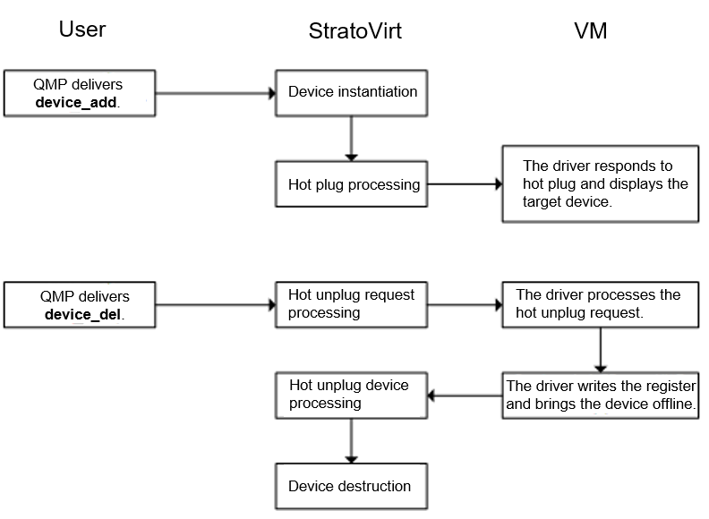

Hot swap refers to hot plug and unplug without breaking power. In virtualization scenarios, hot swap refers to the process of dynamically adjusting devices such as disks and NICs during VM running.

Common hot swap mechanisms include ACPI hot swap and PCIe-Native hot swap. The ACPI hot swap depends on the ACPI table to store required hot swap information of each device. The PCIe-Native hot swap is defined in the PCI specification, which allows devices to be hot plugged to a root port. This root port can be considered as a virtual bridge device and corresponds to a slot. The root port itself does not support hot swap, so you need to configure it before starting your VM.

Currently, the PCIe-Native hot swap has been implemented in StratoVirt standard VMs. Devices that support hot swap include disks, NICs, and PCI passthrough devices.

The overall hot swap process is as follows:



The main hot plug steps include:

A user delivers the **device_add** command through QMP. After receiving the command, StratoVirt instantiates the target device and plug it to the corresponding root port.
Then the root port updates the related register configuration and sends an interruption to notify the VM driver for processing.
The main hot unplug steps include:

A user delivers the **device_del** command through QMP. After receiving the command, StratoVirt updates the register in the root port and sends an interruption to notify the VM driver for processing.
After the processing is complete, the VM driver writes back to the register to trigger destruction of the target device on the StratoVirt side.

## Implementation Details

The hot swap feature is defined in the **pci/src/hotplug.rs** file of StratoVirt, in which the **plug** function corresponds to the hot plug operation of devices. The **unplug_request** function corresponds to the hot unplug operation and is used to initiate a device hot unplug request. Herein, the VM driver is only notified to process the request, but the device has not been removed. Therefore, this request can be regarded as an asynchronous request. After the VM driver completes the processing and writes the register to trigger the device to go offline, the **unplug** function is then called back to destroy the device.

```shell
pub trait HotplugOps: Send {
    /// Plug device, usually called when hot plug device in device_add.
    fn plug(&mut self, dev: &Arc<Mutex<dyn PciDevOps>>) -> Result<()>;

    /// Unplug device request, usually called when hot unplug device in device_del.
    /// Only send unplug request to the guest OS, without actually removing the device.
    fn unplug_request(&mut self, dev: &Arc<Mutex<dyn PciDevOps>>) -> Result<()>;

    /// Remove the device.
    fn unplug(&mut self, dev: &Arc<Mutex<dyn PciDevOps>>) -> Result<()>;
}
```

### Hot Unplug Implementation

The logic of each device hot unplug request is in the **unplug_request** function, which is responsible for updating the registers and sending interruptions to notify VM drivers to handle corresponding hot unplug requests with calls to the **hotplug_event_notify** function.

The **unplug_request** function clears the **PCI_EXP_LNKSTA_DLLLA** identifier in the Link Status register and sets the **PCI_EXP_HP_EV_ABP** identifier in the Slot Status register. It can be found here that both hot plug and unplug requests are triggered by **Attention Button Pressed** (corresponding to **PCI_EXP_HP_EV_ABP**) events. The VM driver can determine whether a request is a hot plug request or a hot unplug request based on the target device's presence status.

```shell
impl HotplugOps for RootPort {
    fn unplug_request(&mut self, dev: &Arc<Mutex<dyn PciDevOps>>) -> Result<()> {
        let devfn = dev
            .lock()
            .unwrap()
            .devfn()
            .chain_err(|| "Failed to get devfn")?;
        if devfn != 0 {
            return self.unplug(dev);
        }

        let offset = self.config.ext_cap_offset;
        le_write_clear_value_u16(
            &mut self.config.config,
            (offset + PCI_EXP_LNKSTA) as usize,
            PCI_EXP_LNKSTA_DLLLA,
        )?;

        let mut slot_status = PCI_EXP_HP_EV_ABP;
        if let Some(&true) = FAST_UNPLUG_FEATURE.get() {
            slot_status |= PCI_EXP_HP_EV_PDC;
        }
        le_write_set_value_u16(
            &mut self.config.config,
            (offset + PCI_EXP_SLTSTA) as usize,
            slot_status,
        )?;
        self.hotplug_event_notify();
        Ok(())
    }
}
```  

For device hot unplug, after StratoVirt updates the register and sends an interruption to notify the VM driver, the target device is not actually removed. Instead, it waits for the VM driver to process the request and write back to the register to notify StratoVirt to bring it offline and then destroy it.

When the VM driver writes to the root port register, the **write_config** function will be called, in which the **do_unplug** function will be called to process the logic related to device hot unplug.

```shell
fn write_config(&mut self, offset: usize, data: &[u8]) {
        ...

        self.do_unplug(offset, end, old_ctl);
    }
```

The **do_unplug** function first ensures that the written register is a Slot Control register; otherwise it returns without processing. Then it determines that the written register's identifiers are **PCI_EXP_SLTCTL_PWR_IND_OFF** and **PCI_EXP_SLTCTL_PCC** when the target device is in position, and the two identifiers have changed (that is, the two identifiers do not exist before the writing). If the preceding conditions are met, the **remove_devices** function can then be called to destroy the device.

| Symbol                      | Description                                                             |
| -------------------------- | ----------------------------------------------------------------- |
| PCI_EXP_SLTCTL_PCC         | **Power Controller Control** indicates the power management status. The value **1** indicates the power-on status.     |
| PCI_EXP_SLTCTL_PWR_IND_OFF | **Power Indicator off** indicates whether a device can be removed. The value **1** indicates that the device can be removed.|

```shell
fn do_unplug(&mut self, offset: usize, end: usize, old_ctl: u16) {
    let cap_offset = self.config.ext_cap_offset;
    // Only care the write config about slot control
    if !ranges_overlap(
        offset,
        end,
        (cap_offset + PCI_EXP_SLTCTL) as usize,
        (cap_offset + PCI_EXP_SLTCTL + 2) as usize,
    ) {
        return;
    }

    let status =
        le_read_u16(&self.config.config, (cap_offset + PCI_EXP_SLTSTA) as usize).unwrap();
    let val = le_read_u16(&self.config.config, offset).unwrap();
    // Only unplug device when the slot is on
    // Don't unplug when slot is off for guest OS overwrite the off status before slot on.
    if (status & PCI_EXP_SLTSTA_PDS != 0)
        && (val as u16 & PCI_EXP_SLTCTL_PCC == PCI_EXP_SLTCTL_PCC)
        && (val as u16 & PCI_EXP_SLTCTL_PWR_IND_OFF == PCI_EXP_SLTCTL_PWR_IND_OFF)
        && (old_ctl & PCI_EXP_SLTCTL_PCC != PCI_EXP_SLTCTL_PCC
            || old_ctl & PCI_EXP_SLTCTL_PWR_IND_OFF != PCI_EXP_SLTCTL_PWR_IND_OFF)
    {
        self.remove_devices();

        if let Err(e) = self.update_register_status() {
            error!("{}", e.display_chain());
            error!("Failed to update register status");
        }
    }

    self.hotplug_command_completed();
    self.hotplug_event_notify();
}
```

After calling the **remove_devices** function to remove the target device, call the **update_register_status** function to update the register status by clearing the link status and device presence status and sets the **Presence Detect Changed** (corresponding to **PCI_EXP_HP_EV_PDC**) identifier to indicate that the device presence status has changed.

```shell
/// Update register when the guest OS trigger the removal of the device.
fn update_register_status(&mut self) -> Result<()> {
    let cap_offset = self.config.ext_cap_offset;
    le_write_clear_value_u16(
        &mut self.config.config,
        (cap_offset + PCI_EXP_SLTSTA) as usize,
        PCI_EXP_SLTSTA_PDS,
    )?;
    le_write_clear_value_u16(
        &mut self.config.config,
        (cap_offset + PCI_EXP_LNKSTA) as usize,
        PCI_EXP_LNKSTA_DLLLA,
    )?;
    le_write_set_value_u16(
        &mut self.config.config,
        (cap_offset + PCI_EXP_SLTSTA) as usize,
        PCI_EXP_SLTSTA_PDC,
    )?;
    Ok(())
}
```

After the register is updated, **Command Completed** (corresponding to **PCI_EXP_HP_EV_CCI**) is also set by the **hotplug_command_completed** function to indicate that the command processing is complete. Then, an interruption is sent to notify the VM driver. So far, the entire hot swap process of a device is complete.

```shell
fn hotplug_command_completed(&mut self) {
    if let Err(e) = le_write_set_value_u16(
        &mut self.config.config,
        (self.config.ext_cap_offset + PCI_EXP_SLTSTA) as usize,
        PCI_EXP_HP_EV_CCI,
    ) {
        error!("{}", e.display_chain());
        error!("Failed to write command completed");
    }
}
```


| Symbol             | Description                                                  |
| ----------------- | ------------------------------------------------------ |
| PCI_EXP_HP_EV_CCI | **Command Completed** indicates that the current command processing is complete and the next command can be processed.|

## Summary

The PCIe-Native mechanism uses registers on the root port to indicate different statuses and uses interruptions to notify VMs, thereby achieving the device hot swap.

## Join Us

The hot swap feature of StratoVirt has been open-sourced in the openEuler community. If you are interested in related technologies, welcome to join us.  

Project address: [https://gitee.com/openeuler/stratovirt](https://gitee.com/openeuler/stratovirt)

If you have any questions, submit an issue at [https://gitee.com/openeuler/stratovirt/issues](https://gitee.com/openeuler/stratovirt/issues).
