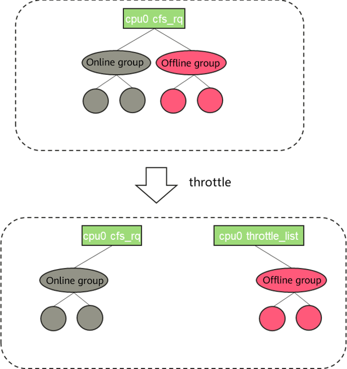
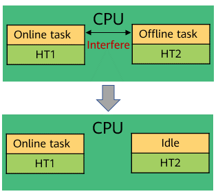

## Overview
Data center servers and production clusters are usually tasked with running various routine online  (latency-critical, LC) services. Because the loads of such services are unpredictable, the average resource usage of a cluster must be kept low, so that the servers in the cluster have sufficient resources to perform computing and respond to burst requests in the case of sudden traffic spikes, thereby avoiding service breakdown caused by stacked requests and maintaining consistent user experience. This, however, wastes a large number of idle resources and increases maintenance costs. An intuitive way to improve resource utilization under such conditions is to deploy another type of task when the online service load is low. Such tasks, as they do not require extremely quick response but consume a lot of computing resources, are called best-effort batch (BE) tasks. Cloud service vendors introduce the online and offline hybrid deployment solution to improve server resource utilization and reduce cloud operation costs. However, hybrid deployment, like all developments, has a dual nature. Improving resource utilization also introduces resource isolation challenges.

This article describes and shares details about the hybrid deployment technology for improving CPU resource isolation.

- CPU preemption: When both online and offline services exist on a server, unrestricted offline services can more easily preempt resources, leading to increased delays in online tasks. Therefore, in this solution, online (LC) services on the same core can suppress offline (BE) services to ensure the QoS of online services.

- SMT isolation control: Hyperthreads of a physical CPU share core hardware resources, such as cache and computing units. When an online task and an offline task run on a pair of hyperthreads at the same time, they interfere with each other due to hardware resource contention. In this case, the offline task needs to be throttled, so that the HT core can enter the idle state.

In the hybrid deployment scenario, when online tasks exist, throttle is performed on offline tasks to ensure CPU resource for online tasks. After HT is enabled, offline tasks that run on the same physical core but different logical cores are throttled. This solution aims to maximize resource utilization while ensuring the quality of online services. Therefore, this solution is designed to improve CPU resource utilization and ensure the response speed of online services. The design of the following two sub-features is included.


### Feature 1: CPU Preemption

#### (1) Guaranteed low preemption latency for online tasks

To ensure that online tasks can quickly preempt offline tasks, the scheduling policy of offline tasks is set to `SCHED_IDLE` by default, and the scheduling policy of online tasks is not modified (generally, the scheduling policy of online tasks is `SCHED_OTHER`). This feature is not restricted by the `sched_min_granularity_ns and sched_wakeup_granularity_ns` mechanisms.

#### (2) Absolute suppression of offline tasks

When an online task is running, the offline task needs to be stopped to prevent it from preempting CPU resources. This is achieved by the `throttle mechanism`. In the scenario where both online and offline tasks exist on the same CPU, the `cfs_rq corresponding to the offline group` is added to a `global percpu` linked list `throttle_list` to allocate all CPU resources to online tasks.



Figure 1 Offline task throttle

### Feature 2: SMT Isolation Control
Hyperthreads on a physical CPU share core hardware resources, such as the cache and computing unit. When an online task and an offline task run on a pair of hyperthreads at the same time, they interfere with each other due to hardware resource contention. However, this issue is not considered at all during CFS design. As a result, the performance of online services is affected in hybrid deployment scenarios. In practice, the CPU-intensive benchmark is used. The performance interference caused by hyper-threading can reach 40% or more. Although Core Scheduling has been incorporated into Linux 5.14, this feature is designed to defend against SMT side-channel attacks and prevent two mutually untrusted processes from working on different SMTs of the same core. There are several reasons that this feature cannot be used for SMT isolation. First, the design and implementation of this feature require high overhead (for example, core-level rq lock). Second, it does not support group scheduling. The isolation is performed based on the process granularity. However, the requirement is to isolate online tasks from offline tasks. When a core executes an online task, the corresponding MT does not run an offline task. Alternatively, when an offline task is running on a core and the online task is scheduled to the corresponding HT, the online task sends an IPI to drive the offline task away. This ensures that online tasks are not interfered with when they are running. See the following figures for details.



Figure 2 SMT isolation control solution design


## Key Issues to Be Resolved in the Solution

### (1) kill boost offline task

When the online task is 100% running, if the kill command is used to end an offline task, the offline task needs to be executed to release system resources. However, since the online task absolutely suppress the offline task, kill boost is introduced to solve this problem.

The group to which an offline task belongs is an offline group, and the root group is an online task. When an offline task is killed, the offline task is moved to the root group. In this way, the offline task becomes an online task and can be executed to release resources.

### (2) Priority inversion

If an online task and an offline task share resources (for example, public data in the kernel), after the offline task obtains a lock (not necessarily a lock) for accessing the shared resources, the offline task cannot run if it is absolutely suppressed. When the online task also needs to access the shared resource and waits for the corresponding lock, priority inversion occurs, causing a deadlock (long-time blocking may also occur). Priority inversion is a classical failure to be considered in the scheduling model.

Currently, this solution consists of two modules: priority inversion detection and processing.

- **Priority inversion detection**: The prerequisite for priority inversion is that online tasks occupy 100% of CPU resources for a long time. As a result, offline tasks are suppressed and resources cannot be released. Based on this feature, verifying whether offline tasks have been inactive for an extended period can determine whether priority inversion exists.

- **Priority inversion processing**: When priority inversion is detected, offline tasks on the corresponding CPU are not suppressed by online tasks and can run properly. Before returning to the user mode, the offline tasks enter the sleep process. The sleep time can be set using parameters. After processing all tasks in the queue, the CPU enters the idle state, indicating that the CPU recovers and priority inversion has been resolved. The normal online and offline hybrid running logic is used.

## Task Management

In the scenario where containers are deployed together, offline tasks are configured in the form of `Cgroup`. Therefore, `Cgroup` interfaces are provided for task management. The corresponding path is as follows:

```csharp
/sys/fs/cgroup/cpu/xxx/cpu.qos_level
```

The `cpu.qos_level` file indicates the online or offline attribute of a task in the current group. The default value is **0**, indicating that the task is in an online task group. If the value is **-1**, the task is in an offline task group.

To manage tasks, create an offline task group on the worker node, write the PID of the offline task to the task of the group, and set the corresponding `cpu.qos_level` file.

```
# echo <pid> > /sys/fs/cgroup/cpu/xxx/tasks
# echo -1 > /sys/fs/cgroup/cpu/xxx/cpu.qos_level
```


## Management Through the Hybrid Engine Rubik

In the scenario where containers are deployed together, the hybrid engine Rubik can automatically detect the service priority configured by users and configure the CPU priority attribute. For details about Rubik, see *openEuler Resource Utilization Optimization (3): Introduction to Rubik*.

For the CPU priority configuration, users only need to add the annotation of `volcano.sh/preemptable` to the YAML file to identify the service attribute when deploying the service pod. Then, Rubik automatically sets the **cpu.qos_level** value of **Cgroup** corresponding to the pod. For example, the following is a YAML file of an Nginx online service pod:

```
# cat nginx-online.yaml
apiVersion: v1
kind: Pod
metadata:
  name: nginx-online
  annotations:
    volcano.sh/preemptable: "false"   # If volcano.sh/preemptable is set to true, the service is an offline service. If it is set to false, the service is an online service. The default value is false.
spec:
  containers:
  - name: nginx
    image: nginx
    resources:
      limits:
        memory: "200Mi"
        cpu: "1"
      requests:
        memory: "200Mi"
        cpu: "1"
```

After running the `kubectl apply -f nginx-online.yaml` command to deploy the Nginx service, go to the Cgroup directory of the nginx-online pod and check whether `cpu.qos_level` is set to **0** for online services and **-1** for offline services.

```
# cat /sys/fs/cgroup/cpu/kubepods/pod59f1cdfa-a0ad-4208-9e95-efbef3519c00/cpu.qos_level
0
```

## **Summary**

The CPU preemption and SMT isolation control have achieved good results in CPU resource management and control in online and offline hybrid deployment scenarios. However, there are still some defects. For example, the LLC/MBA dynamic adjustment software policy is not refined and a better effect depends on the hardware priority algorithm. We can expect a new Kunpeng server. It is also important to mitigate neighbor interference in public cloud scenarios. openEuler has made some explorations in this method. The tidal affinity technology has achieved excellent results and will be introduced in future articles. The next issue will talk about technologies related to resource utilization and memory.

## Join Us


The resource utilization optimization technologies described in this article are jointly developed by the Cloud Native SIG and Kernel SIG. The source code will be gradually open-sourced in the openEuler community. If you are interested in related technologies, you are welcome to join us. You can add the assistant WeChat (account: wildLittleHelper) to join the corresponding SIG WeChat group.
