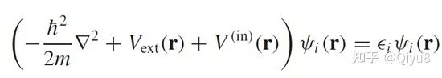
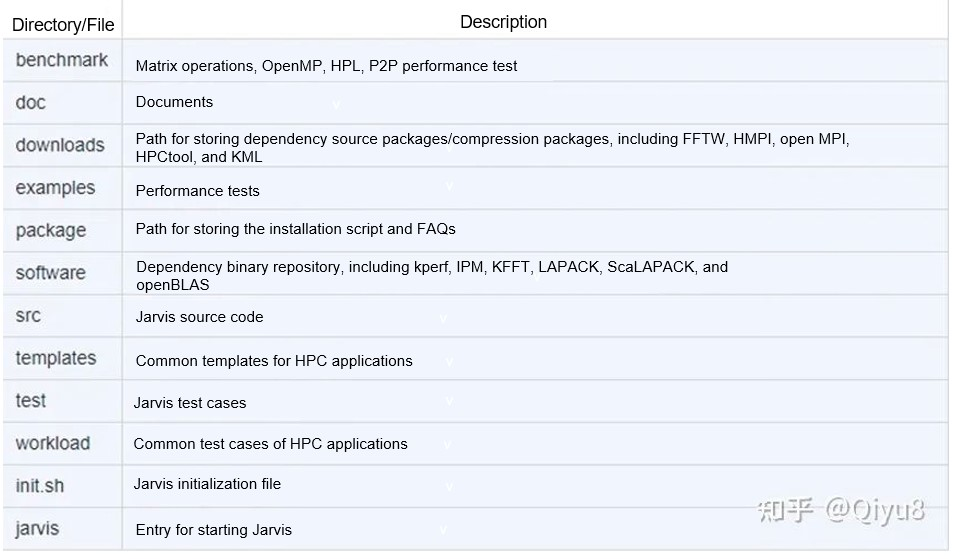
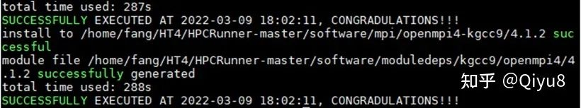
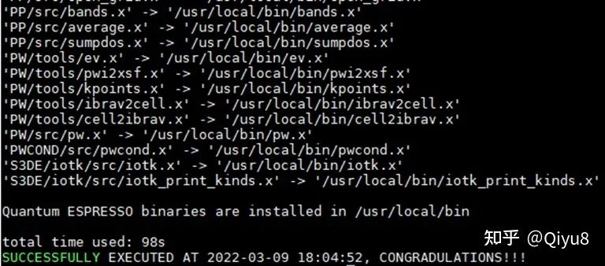
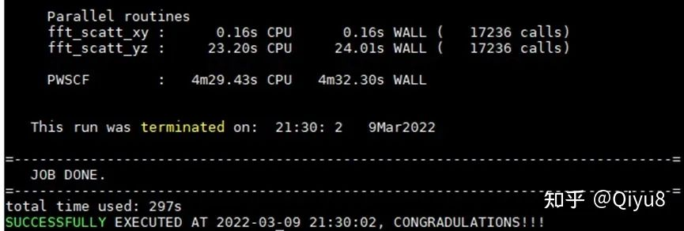
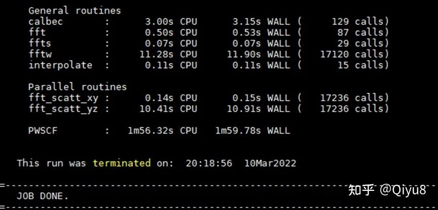
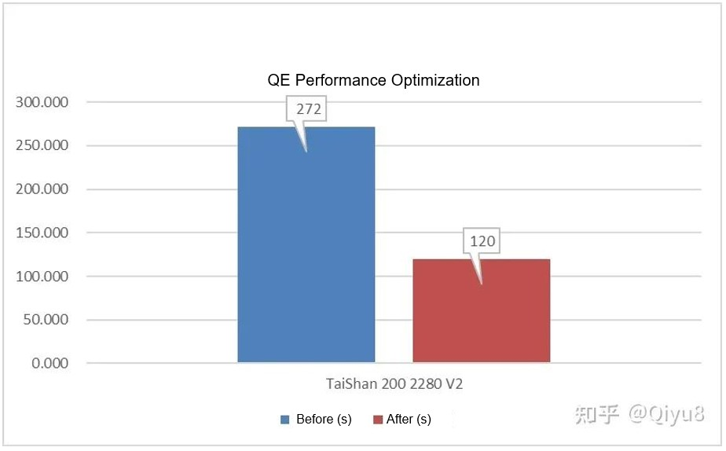

---
title:'Exploring the Secrets of HPC Applications'
category: blog
date: 2022-10-13
tags:
  - openEuler
  - HPC
archives: 2022-10
author:
  - Fang Chunlin (Qiyu8)
summary: The openEuler HPC SIG is committed to bringing high-performance computing (HPC) applications into everyday use. This is achieved by establishing communication networks across various fields, including meteorology, molecular dynamics, biology, and manufacturing, designing a unified HPC platform for the deployment and optimization of diverse computing power, developing automated containerization for streamlined deployment, and providing one-stop optimization for HPC applications.
---

> Author: Fang Chunlin (Qiyu8)
> Source: [https://zhuanlan.zhihu.com/p/489828346](https://zhuanlan.zhihu.com/p/489828346)
---
> **About the Author**
Fang Chunlin, maintainer of NumPy/Taro and leader of USIMD and HPCRunner open source projects, now focuses on operations of the openEuler HPC SIG, which is committed to bringing high-performance computing (HPC) applications into everyday use. The SIG aims to establish communication networks across various fields, including meteorology, molecular dynamics, biology, and manufacturing, design a unified HPC platform for the deployment and optimization of diverse computing power, develop automated containerization for streamlined deployment, and provide one-stop optimization for HPC applications.
---

## 1. Background
When HPC is mentioned, it is often associated with supercomputers capable of performing hundreds of millions of floating-point operations or more. HPC is integral to numerous fields that have a direct impact on our daily lives, including weather forecasting, aircraft production, vaccine research and development, Down syndrome screening, and film rendering. HPC is also a distant technology. The projects that have been awarded the Gordon Bell Prize, considered the Nobel Prize of the supercomputing application field, may be enigmatic to many.

| Year| Project                            | Supercomputing System   |
| -------- | ------------------------------------ | ----------- |
| 2021     | Closing the "quantum supremacy" gap: achieving real-time simulation of a random quantum circuit using a new Sunway supercomputer        | China. Sunway  |
| 2020     | Pushing the limit of molecular dynamics with ab initio accuracy to 100 million atoms with machine learning  | USA. Summit|
| 2016     | 10M-Core Scalable Fully-Implicit Solver for Nonhydrostatic Atmospheric Dynamics| China. Sunway  |

While hardware is crucial to supercomputing, software has become increasingly significant. When likened to the automobile market, HPC applications can be considered luxury vehicles within the realm of open source software. To attain peak performance, HPC applications necessitate sophisticated engines (compilers), intricate tires (parallel technologies), and demanding mechanical frameworks (installation and optimization processes). However, the optimization of HPC applications is a complex undertaking. This blog aims to demystify the process by demonstrating how to deploy and optimize an HPC application for quantum chemistry.


## 2. Solution to the Schrödinger Equation

It has been demonstrated that solutions to wave functions are instrumental in determining the macroscopic characteristics of materials, including their optical, mechanical, thermodynamic, and magnetic properties. Substances typically comprise numerous electrons. So, what is the method for solving their wave functions? A single iron atom contains 26 electrons, while two iron atoms contain a total of 52 electrons. When computing the interaction between two iron atoms, it is necessary to calculate the interaction between one electron and the remaining 51 electrons. As the number of atoms to be calculated increases, the computational workload grows exponentially. Calculating 100 iron atoms is a formidable task, let alone hundreds of thousands of atoms (nanoscale materials). However, the renowned Kohn-Sham theory provides an exact solution to this problem by representing a multi-electron system using one or more functions to solve the multi-body Schrödinger equation. This significantly reduces the computational workload, and Walter Kohn was awarded the 1998 Nobel Prize in Chemistry for his contributions. Quantum ESPRESSO (QE), an HPC application featured in this blog, is an open source implementation of the aforementioned formula and is widely used in quantum chemistry. According to its official introduction, "It is a suite for first-principles electronic-structure calculations and materials modeling, distributed for free and as free software under the GNU General Public License. It is based on density-functional theory, plane wave basis sets, and pseudopotentials (both norm-conserving and ultrasoft)."  The following is the famous Kohn-Sham equation:



▲ Kohn-Sham equation

## 3. QE Installation

*Environment: CentOS7/openEuler + Arm server*


You can install QE by using Jarvis (HPCRunner) [https://gitee.com/openeuler/hpcrunner](https://gitee.com/openeuler/hpcrunner), a platform for one-click dependency installation, environment configuration, compilation, running, and optimization. Decompress or clone Jarvis to a location on the server, and its directory structure and description are as follows:


▲ Jarvis source code directory

Step 1: Go to the Jarvis directory and initialize the environment.

```csharp
cd hpcunner

source ./init.sh
```

Step 2: Copy the QE's HPC configuration and switch to the configuration that is set based on Kunpeng GCC and OpenMPI.

```csharp
cp ./templates/qe/6.4/data.qe.test.config ./

./jarvis -use data.qe.test.config
```


Step 3: Obtain QE and dependencies.

```csharp
Download QE 6.4 (https://github.com/QEF/q-e/archive/refs/tags/qe-6.4.1.tar.gz) and decompress it to the /tmp directory.

tar -xzvf ./downloads/q-e-qe-6.4.1.tar.gz -C /tmp


2. Copy the QE test case to /tmp.

\cp -rf ./workloads/QE/qe-test /tmp
```


Step 4: Download and install dependencies in one-click mode.

Run the following command to install Kunpeng GCC and OpenMPI, which may take about five minutes.

```csharp
./jarvis -d -dp
```

▲ Downloading and installing dependencies

Step 5: Compile QE in one-click mode.

```csharp
./jarvis -b
```

▲ Compiling QE


Step 6: Execute QE in one-click mode.

```csharp
./jarvis -r
```

▲ Executing QE

After a few minutes, "JOB DONE" is displayed. After 14 self-consistent field (SCF) computations, we can obtain the energy value between atoms. This is how we install and execute the HPC application.


## 4. QE Optimization

During the running of HPC applications, perf (a performance tool) can be used to collect hotspot function data in non-intrusive mode and display the data in a directory tree.

```csharp

Step 1: Execute QE.

./jarvis -r


Step 2: Create a window, go to the hpcrunner directory, and run the performance data collection command.

./jarvis -p

```

According to the real-time distribution chart of hotspot functions, GEMM matrix calculation operations, in addition to MPI communication, account for a significant proportion. To optimize these operations, OpenBLAS can be used to replace GEMM matrix calculations, the BiSheng compiler can be used instead of the current compiler, and the HyperMPI library can be used to replace the MPI communication library.

```csharp

Step 3: Copy the optimized configuration.

cp ./templates/qe/6.4/data.qe.test.opt.config ./


Step 4: Switch to the optimized configuration.

./jarvis -use data.qe.test.opt.config


Step 5: Download and install dependencies in one-click mode (about 6 minutes).

./jarvis -d -dp


Step 6: Compile QE in one-click mode.

./jarvis -b


Step 7: Execute QE in one-click mode.

./jarvis -r

```


▲ Optimized QE

It can be seen that the running time is shortened. But how about the performance?


▲ QE performance comparison before and after optimization

If the result shown in the figure is obtained, the optimization is successful.


## 5. Summary

"However difficult it might seem, the challenge will be overcome". The optimization of HPC applications remains a formidable task that calls for the amalgamation of knowledge and teamwork. With unwavering determination and concerted effort, we will ultimately realize our objectives.

If you have an interest in HPC, you are welcome to join the openEuler HPC SIG and the open source project Jarvis to contribute to the openEuler ecosystem for diversified computing power. In addition to migration and optimization technologies, you can also find open source internships here and even earn bonuses. For details, visit [https://gitee.com/openeuler/hpcrunner/issues](https://gitee.com/openeuler/hpcrunner/issues).


For the openEuler HPC SIG:

[https://gitee.com/openeuler/hpcrunner](https://gitee.com/openeuler/hpcrunner)

For the Jarvis project:

[https://gitee.com/openeuler/hpc](https://gitee.com/openeuler/hpc)
