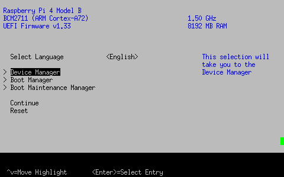
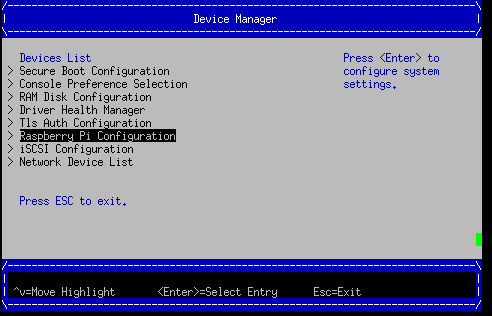
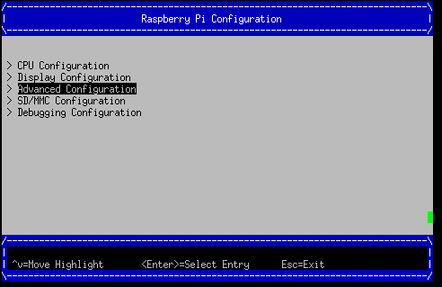
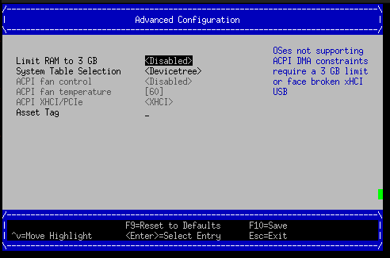
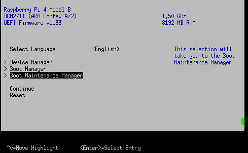
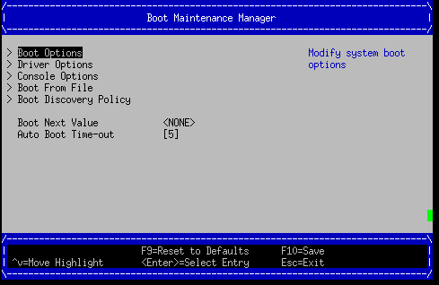
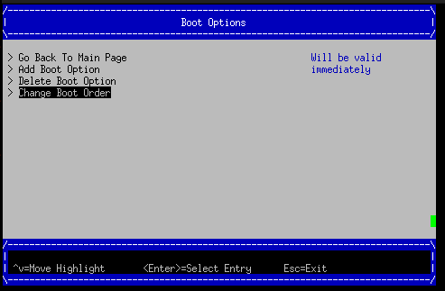
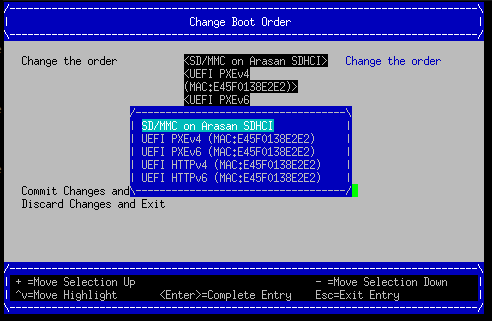
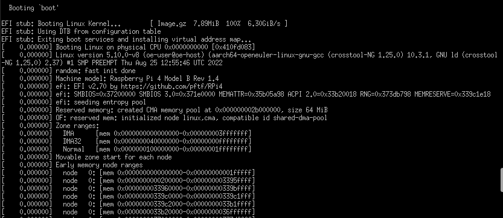
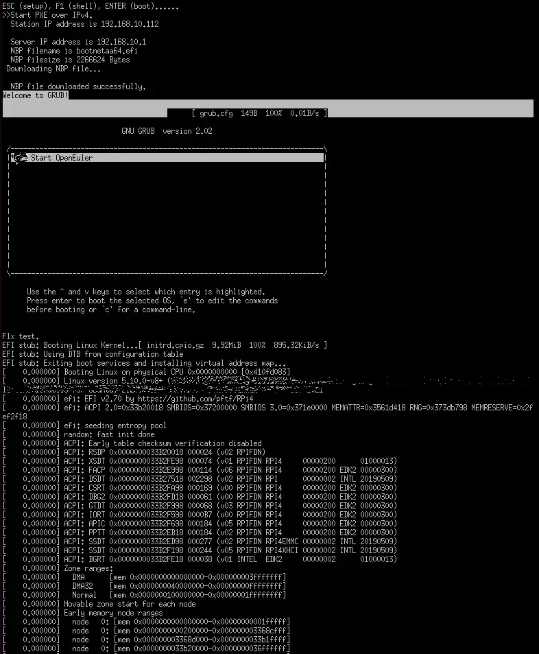

The startup and shutdown of the secondary core in mixed deployment scenarios depend on the third-party UEFI firmware that supports the PSCI standard. This blog describes how to enable Raspberry Pi 4B to support UEFI and start openEuler Embedded through the SD card or network.

### Instructions of Raspberry Pi Image of openEuler Embedded UEFI + GRUB

The Raspberry Pi image of openEuler Embedded integrates the dependencies of the mixed deployment environment based on Raspberry Pi 4B. Therefore, you are advised to use the Raspberry Pi image that integrates openEuler Embedded UEFI and GRUB. This image contains the software packages of the Tiny image and integrates OpenSSH for network login and the MCS dependency library and MCS reserved memory (mcsmem dtoverlay) for mixed deployment.


### Building and Burning openeuler-image-uefi

Branch requirements: master branches of openEuler 22.09 and later

Environment requirements: see the build guidelines in the *openEuler Embedded Support for Raspberry Pi 4B*.

 - Example of the build commands:

```
su openeuler
source /usr1/openeuler/src/yocto-meta-openeuler/scripts/compile.sh raspberrypi4-64 /usr1/openeuler/src/build/build-raspberrypi4-64/
bitbake openeuler-image-uefi
```

- Example of the image generation command:

```
openeuler-image-uefi-raspberrypi4-64-*.rootfs.rpi-sdimg
```

- Write **openeuler-image-uefi-raspberrypi4-64-*.rpi-sdimg** to the SD card.

- For details, see the image usage in the *openEuler Embedded Support for Raspberry Pi 4B*.

### openeuler-image-uefi Startup Guidelines

Step 1: Modify the UEFI configuration upon the first startup after writing. Press **ESC** to enter the UEFI mode, remove the 3 GB memory limit, disable ACPI, and select **DEVICETREE**. Save the settings, and restart the system.









Step 2: Change the boot order or manually boot from the SD card, as shown in the following figures. Then select **Commit Changes and Exit**.






Step 3: Start the system.


**Note:**

 - By default, the UEFI firmware enables the 3 GB memory limit, which can be disabled in the UEFI menu. Otherwise, only 3 GB memory is displayed after the system is started.
   For details, see the official configuration description: [https://github.com/pftf/RPi4/](https://github.com/pftf/RPi4/).
   
-  The UEFI + ACPI deployment method of this version is defective, for example, the HDMI driver is abnormal. When using this version for the first time, you must enter the UEFI menu and use the DEVICETREE mode.

### Manually Updating the Firmware to Enable Raspberry Pi 4B to Support UEFI Boot
#### Environment and Tool Preparations

- Compilation toolchain: The cross compilation toolchain of openEuler Embedded can be used. For details, see [Application Development Using openEuler Embedded SDK](https://docs.openeuler.org/en/docs/22.03_LTS/docs/Embedded/application-development-using-sdk.html).

- Device: It is recommended that factory settings of the Raspberry Pi 4B be used, including Raspberry Pi 4B basic suite and SD card.

### Downloading and Updating the openEuler Embedded Standard Image and UEFI Firmware

#### 1. Write the openEuler Embedded Raspberry Pi image to the SD card.

For details about how to obtain the openEuler Embedded Raspberry Pi image, see the *openEuler Embedded Support for Raspberry Pi 4B*.

```
# Assume that the image name is openeuler-image-raspberrypi4-64.rootfs.rpi-sdimg and the SD card is identified as /dev/sda (Linux).
sudo dd bs=4M if=openeuler-image-raspberrypi4-64.rootfs.rpi-sdimg of=/dev/sda
```

Compress the **kernel8.img** file in the root directory of the SD card (boot drive) into **Image.gz**.

```
# If the boot partition is full, move **kernel8.img** to another location and try again.
mv SDbootVolumes/kernel8.img /tmp/Image
gzip -c /tmp/Image > SDbootVolumes/Image.gz
```

#### 2. Download the Raspberry Pi UEFI firmware.

Take v1.33 as an example. Download the Raspberry Pi UEFI firmware from [https://github.com/pftf/RPi4/releases/download/v1.33/RPi4_UEFI_Firmware_v1.33.zip](https://github.com/pftf/RPi4/releases/download/v1.33/RPi4_UEFI_Firmware_v1.33.zip), decompress the downloaded package, and copy all files except **bcm2711-rpi-4-b.dtb** to the root directory of the SD card (boot drive) to overwrite the previous files.

```
# Back up bcm2711-rpi-4-b.dtb.
cp SDbootVolumes/bcm2711-rpi-4-b.dtb /bakdir/bcm2711-rpi-4-b.dtb
cp -rf /xxx/RPi4_UEFI_Firmware_v1.33/* SDbootVolumes/
# Restore the .dtb file of openEuler Embedded that is backed up.
cp /bakdir/bcm2711-rpi-4-b.dtb SDbootVolumes/
```

**Note:**

 - For details about how to remove the 3 GB memory limit, disable ACPI, and enable DEVICETREE, see section "openeuler-image-uefi Startup Guidelines".
   
- Delete **kernel8.img**; otherwise, the startup will be affected.

#### 3. Create GRUB and select a boot mode.

- SD card boot: see section "Raspberry Pi UEFI - Manually Creating GRUB and Starting openEuler Embedded Using an SD Card".

- Network boot: see section "Raspberry Pi UEFI - Manually Creating GRUB and Starting openEuler Embedded Using the network".

### Raspberry Pi UEFI - Manually Creating GRUB and Starting openEuler Embedded Using an SD Card

#### Compiling and Creating the GRUB Startup Component

1. Obtain the GRUB source code.

Code URL: [https://github.com/coreos/grub/releases/tag/grub-2.02](https://github.com/coreos/grub/releases/tag/grub-2.02)

2. Compile the GRUB component.

Decompress the source package, go to the root directory, and build the GRUB library of arm64-efi (cross compilation). Note that the cross compilation tool has been configured. Run the following commands:

```
./autogen.sh
./configure --prefix=/xxx/grub-2.02/build --with-platform=efi --disable-werror --target=aarch64-openeuler-linux-gnu
make
```

After the build is successful, the corresponding binary files and GRUB component dependency libraries are generated in the current directory. **grub-core** is the tool library required for making **grub-efi**, and **grub-mkimage** is the host-tool for making **grub.efi**.

3. Create a boot program.

Create a GRUB boot program. In the following example, the output program name is **bootaa64.efi**. After the program is generated, place it in the corresponding directory (**/EFI/BOOT/bootaa64.efi**) in the boot partition of the SD card.

```
./grub-mkimage -d ./grub-core -O arm64-efi -o bootaa64.efi -p '' ls grub-core/*.mod | cut -d "." -f 1
mkdir -p SDbootVolumes/EFI/BOOT
cp ./bootaa64.efi SDbootVolumes/EFI/BOOT/
```

**Note****:** If the path contains periods (.), modify the command accordingly.

4. Create a boot configuration file.

Edit the **grub.cfg** file. The **grub.cfg** file is placed together with **bootaa64.efi** in the **/EFI/BOOT** directory. After the configuration file is edited, select the SD card for boot from the UEFI menu. The following is an example of the **grub.cfg** file content. (The cmdline content at the end indicates that the kernel is compressed using gzip, the partitions of the SD card are used, and initrd is not used.)

```
insmod gzio
set timeout=0

menuentry 'Start OpenEuler' {
echo "openEuler test."
linux /Image.gz coherent_pool=1M 8250.nr_uarts=1 snd_bcm2835.enable_compat_alsa=0 snd_bcm2835.enable_hdmi=1 bcm2708_fb.fbwidth=1824 bcm2708_fb.fbheight=984 bcm2708_fb.fbswap=1 smsc95xx.macaddr=E4:5F:01:38:E2:E2 vc_mem.mem_base=0x3ec00000 vc_mem.mem_size=0x40000000  dwc_otg.lpm_enable=0 console=tty1 console=ttyS0,115200 console=ttyAMA0,115200 root=/dev/mmcblk0p2 rootfstype=ext4 rootwait
}
```

**Note:**

The preceding content must be used together with the Raspberry Pi image built by openEuler Embedded and used in UEFI non-ACPI (DEVICETREE) mode. The .dtb file uses the content in the openEuler Embedded image. **Image.gz** is generated after the **gzip** command (**gzip -c kernel8.img > Image.gz**) is used to compress the kernel image (if the openEuler Embedded used). **kernel8.img** is no longer required and must be deleted; otherwise, the startup will be affected.

## Raspberry Pi UEFI - Manually Creating GRUB and Starting openEuler Embedded Using the network

#### 1. Prepare a PXE boot server.

Take Ubuntu 14.04 as an example. The file name specified for DHCP is the name of the GRUB EFI boot file.

Assume that the server subnetwork is 192.168.10.*x*, the server IP address is 192.168.10.1, and NIC eth0 is used for the DHCP service. The following is an example of initializing the server IP address:

```
sudo ifconfig eth0 192.168.10.1 up
```

#### 2. Enable the DHCP service.

Install the DHCP software:

```
sudo apt-get install isc-dhcp-server
```

Edit the `/etc/dhcp/dhcpd.conf` file. The following is an example:

```
allow booting;
allow bootp;
option domain-name "example.org";
default-lease-time 600;
max-lease-time 7200;
ddns-update-style none;

subnet 192.168.10.0 netmask 255.255.255.0 {
range 192.168.10.100 192.168.10.200;
filename "mygrub.efi"; # Name of the downloaded GRUB file, which must match the name of the created EFI boot program.
option routers 192.168.10.1;
next-server 192.168.10.1; # TFTP server IP address. This parameter is mandatory for PXE and optional for HTTPBOOT.
option broadcast-address 192.168.10.255;
}
```

Configure the network port of the DHCP service. Add or modify the following fields in the `/etc/default/isc-dhcp-server` file:


INTERFACES="eth0" # NIC used by DHCP
Enable the DHCP service:

```
sudo /etc/init.d/isc-dhcp-server restart
```

#### 3. Enable the TFTP service.
Install the TFTP server software:

```
sudo apt-get install tftpd-hpa
```

Configure the TFTP service and edit the `/etc/default/tftpd-hpa` file. The following is an example:

```
TFTP_USERNAME="tftp"
TFTP_ADDRESS=":69"
TFTP_DIRECTORY="/var/lib/tftpboot/"
TFTP_OPTIONS="--secure -l -c -s"
```

Start the TFTP service:

```
sudo /etc/init.d/tftpd-hpa restart
```

#### 4. Compile and create the GRUB startup component.

 - Obtain the GRUB source code.

Code URL: [https://github.com/coreos/grub/releases/tag/grub-2.02](https://github.com/coreos/grub/releases/tag/grub-2.02)

 - Compile the GRUB component.

Decompress the source package, go to the root directory, and build the GRUB library of arm64-efi (cross compilation). Note that the cross compilation tool has been configured. Run the following commands:

```
./autogen.sh
./configure --prefix=/xxx/grub-2.02/build --with-platform=efi --disable-werror --target=aarch64-openeuler-linux-gnu
make
```

After the build is successful, the corresponding binary files and GRUB component dependency libraries are generated in the current directory. grub-core is the tool library required for making grub-efi, and grub-mkimage is the host-tool for making grub.efi.

 - Create a boot program.

Create a GRUB boot program. In the following example, the output name is **mygrub.efi**.

```
./grub-mkimage -d ./grub-core -O arm64-efi -o mygrub.efi -p '' ls grub-core/*.mod | cut -d "." -f 1
```

**Note:**

If the path contains periods (.), modify the command accordingly.

- Create a boot configuration file.

Edit the **grub.cfg** file, which is stored in the TFTP root directory (**/var/lib/tftpboot/grub.cfg**). After the configuration file is edited, select IPv4 network startup from the UEFI menu. The following is an example of the **grub.cfg** file content (The cmdline content at the end indicates that the kernel is compressed using gzip, and initrd is used.):

```
insmod gzio
set timeout=0

menuentry 'Start OpenEuler' {
echo "openEuler test."
linux /Image.gz coherent_pool=1M 8250.nr_uarts=1 snd_bcm2835.enable_compat_alsa=0 snd_bcm2835.enable_hdmi=1 bcm2708_fb.fbwidth=1824 bcm2708_fb.fbheight=984 bcm2708_fb.fbswap=1 smsc95xx.macaddr=E4:5F:01:38:E2:E2 vc_mem.mem_base=0x3ec00000 vc_mem.mem_size=0x40000000  dwc_otg.lpm_enable=0 console=tty1 console=ttyS0,115200 console=ttyAMA0,115200
initrd /initrd.cpio.gz
}
```

### Appendix: Introduction to Kernel Image.gz and File System initrd During Network Boot

#### File System Example

If the network boot mode is used, you can use the rootfs of the standard Raspberry Pi image built by openEuler Embedded and manually package the rootfs, or use the [qemu-aarch64 reference file system released by openEuler Embedded](https://repo.openeuler.org/openEuler-22.03-LTS/embedded_img/arm64/aarch64-std/openeuler-image-qemu-aarch64-20220331025547.rootfs.cpio.gz).

Example of manually packaging the rootfs (prepare the Raspberry Pi built environment of openEuler Embedded in advance):

```
# Assume that the build directory is available.
cd tmp/work/raspberrypi4_64-openeuler-linux/openeuler-image/1.0-r0/rootfs/
find . | cpio -H newc -o | gzip -n9c > ../initrd.cpio.gz
# **initrd.cpio.gz** generated in the upper-layer directory is the required file system.
```

Note:

When configuring the **/etc/inittab** file system, ensure that serial port redirection is correctly configured during getty login. Otherwise, no information is displayed. PL011 (Raspberry Pi 4B hardware serial port) corresponds to pins GPIO14 (TXD) and GPIO15 (RXD).

#### Kernel Example

If the network boot mode is used, you can use **kernel8.img** of the standard Raspberry Pi image built by openEuler Embedded. Its format is Image, but needs to be compressed into Image.gz using gzip.

For details about how to compile the kernel (openEuler),
see *Cross-Compiling the Kernel on Raspberry Pi openEuler* in Gitee.

Note:

 - If the preceding UEFI+ACPI deployment method is used, the ACPI functions must be enabled in the configuration file. In the menu displayed after running **make menuconfig ARCH=arm64**, enable the ACPI functions. However, you are advised to disable ACPI in UEFI and select DEVICETREE. For details, see section "openeuler-image-uefi Startup Guidelines".
   
- To adapt to preceding EFI configurations, the Linux kernel file in the **grub.cfg** file must be an Image.gz file compressed by running the **gz** command.

#### Operation Instructions

Place the preceding kernel and file system files in the TFTP service directory (**/var/lib/tftpboot**) for network boot.

The basic process of booting from the network is as follows:

1. The DHCP server assigns an IP address to Raspberry Pi 4B.

2. Raspberry Pi 4B boots UEFI from the PXE.

3. The PXE downloads **mygrub.efi** from the TFTP server based on the file name and TFTP server address specified for DHCP.

4. The GRUB boot program starts and downloads the file system and kernel from the corresponding TFTP directory based on **grub.cfg**, and loads and starts the file system and kernel.

The used ACPI resource table/DTB is initialized by the UEFI firmware (stored in memory before the kernel is booted). However, **cmdline/bootargs** can be configured using **grub.cfg**. When the kernel is loaded, GRUB transfers the configurations to UEFI and reports them to the system.



### Follow Us

openEuler Embedded has been open-source in the openEuler community, where a series of related topics will be shared. If you are interested in the construction and application of openEuler Embedded, you are welcome to participate the sharing and join the SIG.


Embedded SIG:
[https://www.openeuler.org/zh/sig/sig-detail/?name=sig-embedded](https://www.openeuler.org/zh/sig/sig-detail/?name=sig-embedded)

Project URL:
[https://gitee.com/openeuler/yocto-meta-openeuler](https://gitee.com/openeuler/yocto-meta-openeuler)

You can also participate in community development and contribute to the project by starring and forking our repository.
