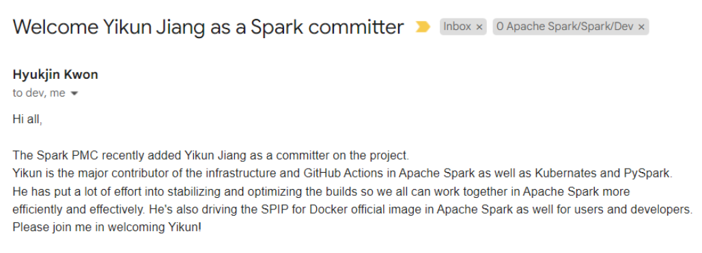
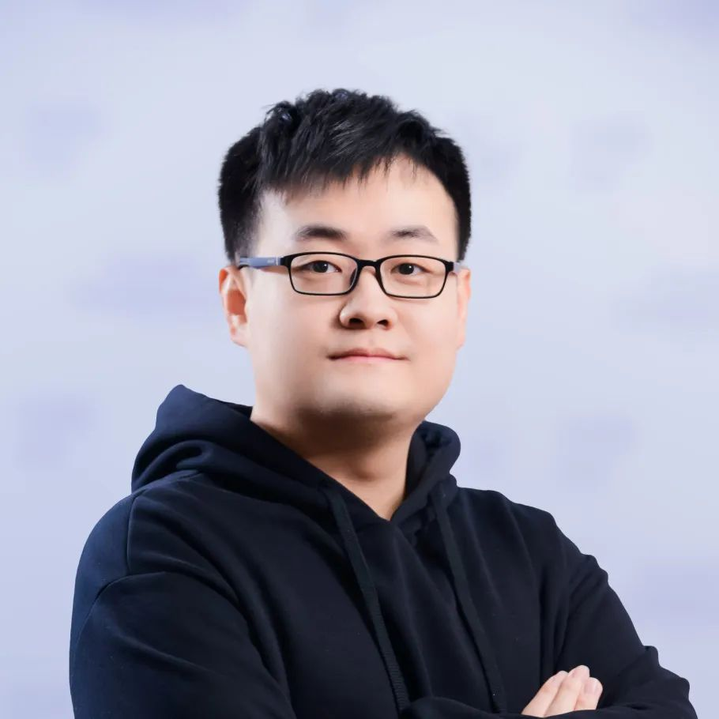

At the beginning of October 2022, Jiang Yikun, an openEuler maintainer, accepted the invitation of Apache Spark PMC and officially became an Apache Spark committer (core contributor)[1].

He has made many contributions to the improvement of infrastructure, cloud native, and PySpark of Apache Spark.

## Road to Open Source: From Amateur to Adept

Jiang Yikun joined Huawei's computing open source team in 2016 and has become a core member of the OpenStack community (OpenInfra Foundation), maintainer of the openEuler community (OpenAtom Foundation), reviewer of the Volcano community (CNCF Foundation), and committer of the Spark community (Apache Foundation). He has accumulated much experience by contributing to multiple top open source communities, and this enhances his interests in technology development and open source.

## From Diversified Computing Power Enthusiast to Apache Spark Core Contributor

As the optimal native operating system that supports diversified computing power, openEuler is compatible with multiple processor architectures, such as x86, Arm, RISC-V, LoongArch, and SW64. However, the open-source community does not fully support multi-architecture application software. As a result, openEuler cannot maximize its diversified computing power.

Yikun's team has contributed to multi-architecture support for the open source community since 2019. Within the Apache Spark community, Yikun collaborated with fellow team members and the broader Spark community to successfully adapt the Arm64 architecture and integrate Arm CI into the community processes. As a result, Apache Spark 3.0.0 now officially supports the Arm64 architecture (SPARK-30057), and Spark becomes sustainable on the Arm platform (SPARK-29106).

As Yikun's contributions to the Spark community have grown, his focus has transitioned from merely adapting diversified computing power to enhancing it at the architecture level. In November 2021, Yi Kun, as the first author, worked with developers from Huawei, Apple, Netflix, and Cloudera to launch an issue related to feature design and code development in the Spark community — *Spark-36057: Customized Scheduling of Spark on Kubernetes*. In addition, he succeeded in integrating the Apache Spark + Volcano scheduling system into the community, making it a highlight feature of Apache Spark 3.3.0 and enhancing the diversified computing scheduling capability of Spark. Many big data users (such as Huawei, AsiaInfo, and CESTC) in the openEuler community have started to integrate this solution into their downstream products and services to enhance queue scheduling, resource reservation, and diversified computing power scheduling. Consistently adhering to the concept of "Upstream first", he has actively championed the utilization of open-source technologies by downstream users.

Recently, he spearheaded a groundbreaking proposal within the Apache Spark community: SPARK-40513, which aims to provide official Docker image support for Spark. This proposal includes defining container image specifications, standards, and reference implementations specifically tailored for the Spark community, as well as releasing images. The proposal received unanimous approval from the Spark community. By establishing this foundation, operating systems like openEuler can now efficiently customize Spark big data images with higher quality.

In addition, he has diligently worked to stabilize and optimize the infrastructure of the Apache Spark community, due to his wealth of experience in cloud computing, cloud-native, infrastructure, and Arm CI. Therefore, the Apache Spark values his contribution and recognizes him as one of its esteemed committers.

## Making openEuler Better Integrated with Other Open-Source Communities

Yikun and his team have not only made significant contributions to the Apache Spark community but have also remained actively engaged in various other SIGs within the openEuler community, for example, big data, OpenStack, cloud native, HPC, and infrastructure. Their collective aspiration is to extend the impact of openEuler to a broader open-source ecosystem. Furthermore, the openEuler community warmly welcomes more developers to join its ranks. By fostering collaboration and innovation, openEuler hopes to enhance its communication with other communities and collectively advance the world of open source.

[1] Welcome Yikun Jiang as a Spark committer [https://lists.apache.org/thread/xftwh05x64sbwp3k0qbp24mwp2bqdch9](https://lists.apache.org/thread/xftwh05x64sbwp3k0qbp24mwp2bqdch9)

[2] SPIP: Support Customized Kubernetes Schedulers [https://issues.apache.org/jira/browse/SPARK-36057](https://issues.apache.org/jira/browse/SPARK-36057)

[3] SPIP: Support Docker Official Image for Spark [https://issues.apache.org/jira/browse/SPARK-40513](https://issues.apache.org/jira/browse/SPARK-40513)
