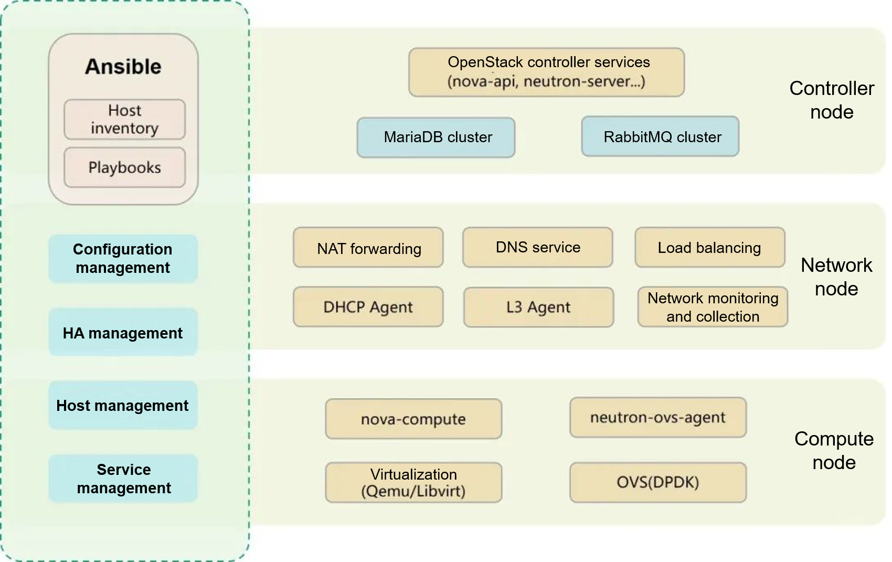

In August 2022, Unicom Digital Tech officially open-sourced opensd to the openEuler community after review and approval by the technical committee of the community. As a contributor to the openEuler community, Unicom Digital Tech initiated the OpenStack SIG and has continuously participated in the adaptation of OpenStack to the openEuler OS. It helps build the openEuler cloud platform and works with the openEuler community to develop OSs that are more suitable for cloud computing.

opensd is an automatic deployment tool developed by Unicom Digital Tech to simplify enterprise-class OpenStack deployment. It enables delivery personnel to manage host configurations and install and configure OpenStack and its basic dependency components through texts.

The initial open-source version of opensd can be used to deploy OpenStack Rocky high availability (HA) services. On openEuler 22.09, opensd supports OpenStack Yoga and Python 3. It can be used to deploy services such as Keystone, Glance, Cinder, Placement, Nova, and Neutron and has passed the installation and deployment verification tests in Arm64 and x86 environments.

### Technical Architecture

opensd is developed in Ansible. It organizes OpenStack component check, database configuration, installation preparation, authentication, installation, and configuration procedures into playbooks and assigns roles to each component. The structure is clear, and the configuration is practical. Users can customize cluster deployment by modifying playbooks during installation and configuration.

### Features

Supports the deployment of OpenStack Rocky and Yoga;

Supports the separate deployment of Nova Cells V2 in large-scale scenarios;

Supports OpenStack deployment in complex scenarios, such as Cinder and Glance deployment with multiple Ceph backends.

### Future Plan

opensd is maintained by the OpenStack SIG and is planned to support OpenStack Train on openEuler-22.03-LTS-SP1.

Welcome to participate in the opensd project. Project address: [https://gitee.com/openeuler/opensd](https://gitee.com/openeuler/opensd)
