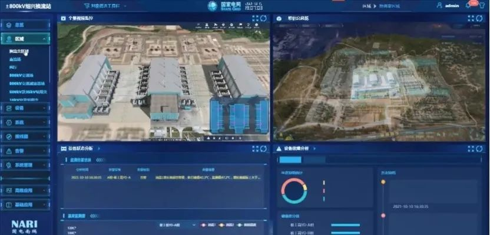

Recently, the Lingzhou digital converter station of State Grid Ningxia Electric Power Company, which adopts the KylinSec OS and Huawei Taishan servers, has been put into trial operation. It is the independently innovated core system of the first batch of digital converter stations in China.

A digital converter station integrates virtual reality and digital twin technologies to implement interconnection between underlying functions, interconnection between humans and machines, service integration and data sharing, and agile iteration, comprehensively improve device management capabilities, including comprehensive awareness of device status, timely defect identification, proactive warning of exceptions, in-depth health control, and efficient emergency handling. In addition to the Lingzhou digital converter station, KylinSec also participated in the entire construction process of the other three digital converter stations located in Shandong Yinan, Jiangsu Taizhou, and Zhejiang Shaoxing, covering the state's 40 ultra-high-voltage OSs. KylinSec provides a joint solution for the digital converter pilot project, which meets the strict requirements of the power industry for highly secure, highly reliable, and strong real-time UHV, and ensures the safe and stable operation of the HVDC transmission system.

-- Source: official WeChat account of State Grid Zhejiang Electric Power Co. Ltd. --

KylinSec is the first commercial vendor of openEuler. KylinSec has made innovative development in OS security, reliability, real-time performance, and explored industry scenarios such as electric power. This digital converter station pilot project is the first in-depth cooperation between KylinSec and Huawei for state grid ultra-high voltage scenario, realizing highly secure and reliable, independent system innovation. Relying on technical advantages and innovative practices, KylinSec is capable of simultaneously releasing commercial versions with openEuler LTS and continuously iterating products. In addition, KylinSec discovers industry requirements to develop more new application scenarios and deeply couple the OSs and industries. KylinSec works with openEuler to provide stable and reliable digital infrastructure OSs for key fields such as electric power and enable many key industry applications.

Based on openEuler's open source innovation and application practices, KylinSec is accelerating all-round cooperation with power and energy enterprises in power generation, distribution, transmission, and transformation to build a multi-level and diversified product system covering secure OSs, cloud desktops, and storage encryption systems. Currently, the joint value-added solution based on KylinSec OS has been fully implemented. KylinSec helps build a digital system in the electric power industry with its technical strength of products, scenarios, and applications.

In the future, KylinSec will work with upstream and downstream partners in the industry chain, such as Huawei, to build independent and innovative basic software and hardware platforms, and continually promote the implementation of joint security solutions based on chips and OSs in more electric power industry scenarios, such as digital converter stations, and promote innovation breakthroughs in key technologies of new power systems. The digital system based on openEuler is developing towards integration and innovation of important industries and application scenarios, which has become a huge driving force for the development of the digital economy. The Euler ecosystem will also continue to prosper.
