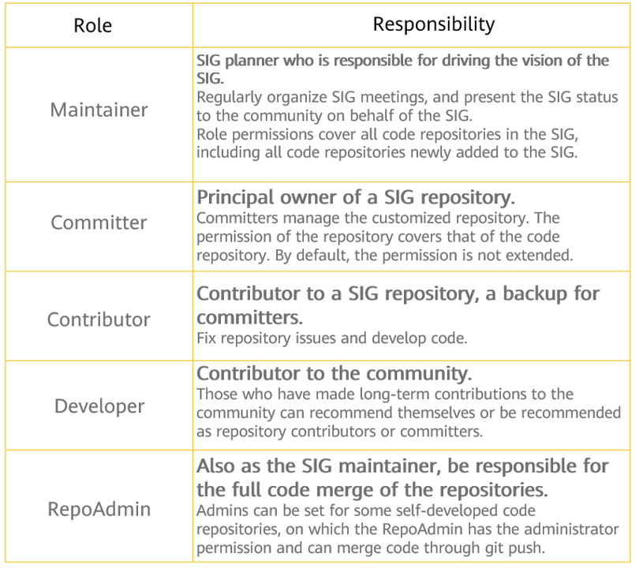

SIGs, or Special Interest Groups, are established by the openEuler community developers to cultivate the technology ecosystem. These SIGs cover diverse areas like computing, cloud-native full-stack development, versatile-scenario collaboration, big data and AI, and compatibility and migration.

Developers of all levels, from rookies to seniors, can join various SIGs, allowing like-minded individuals to work together on user requirements. 

Currently, the openEuler community hosts nearly 100 SIGs, each with specific roles and management responsibilities. 

The following figure shows the openEuler SIG Landspace (shows only some SIGs).

### Roles of SIG Members

In the openEuler community, core members of a SIG lead the governance of the SIG, work with team members to promote the input of deliverables, and try to make the deliverables a part of the community version release.

After discussion with multiple SIGs and confirmation by the community TC committee, the openEuler community divides SIG members into the following roles with responsibilities:

### Role Permission of SIG Members

In a SIG, different roles assume different responsibilities, especially on the Gitee code hosting platform of the community. Clarifying the permission division of each role helps better manage the code repository, enable community partners to better communicate with each other, and participate in community contributions.

The permissions of SIG member roles are as follows:

### SIG Member Management

The **sig_info.yaml** file mentioned above is the core for community member management. Therefore, a **sig_info.yaml** file must be added for each SIG to facilitate SIG management.

The **sig_info.yaml** file is compiled by maintainers and committers. For details about how to compile the file, see https://www.openeuler.org/en/blog/georgecao/openEuler-sig-member-management.html.

When configuring the **sig_info.yaml** file, ensure that the following information is included:

1.  The global maintainer needs to be configured, and the maintainer has the merge permission on all repositories in the SIG (inheriting the original maintainer logic).

2. Specific committers can be added to some repositories. These committers only have merge permission on these repositories.

3. Contributors can be added to some repositories and the Gitee ID of associated members can be listed. As the main contributor of the repositories, the contributor does not have the permission to merge code.

4. Admins can be added to some repositories and the Gitee IDs of associated members can be listed. These users can use the git push function to merge code.

Note: The **sig_info.yaml** file is compatible with the **OWNER** file. The **sig_info.yaml** information takes effect only after the **OWNER** file in the current SIG directory is deleted. If the **OWNER** file exists, the original membership and permission control are retained.

If you have any questions about this solution, send an email to:

george@openeuler.sh

If you are interested in the OS, welcome to join openEuler!

1. Visit the following link to view the openEuler SIG Landspace, learn about the SIGs, and join the technical fields that you are interested in.

https://www.openeuler.org/en/sig/sig-list/

2. Visit the following link to set up an openEuler SIG:

https://www.openeuler.org/en/sig/sig-guidance/
