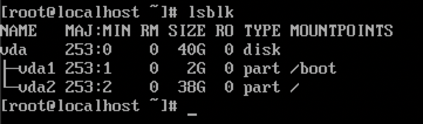
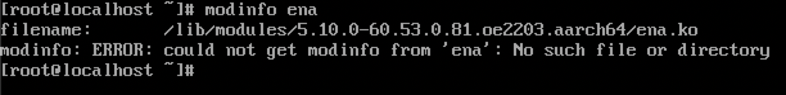
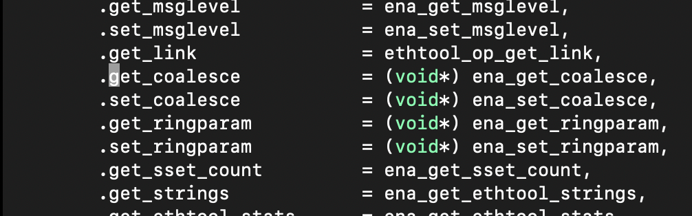
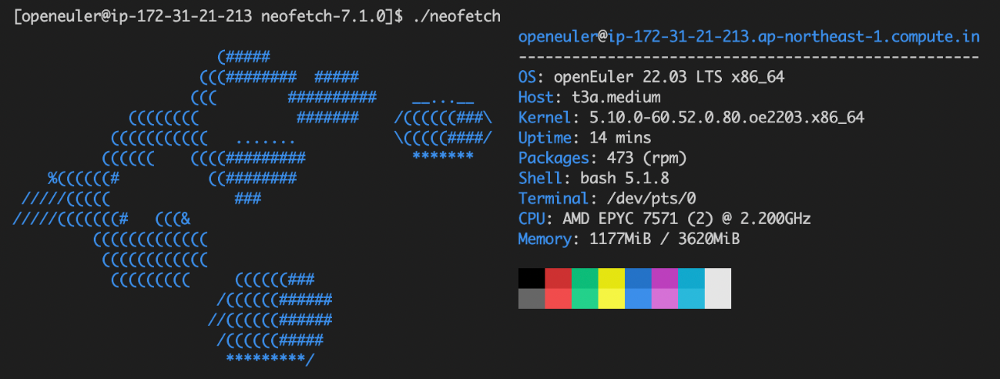

### About the Author

Wang Hanxing, a SUSE software engineer, is responsible for the R&D of the Rancher product line.


The RFO SIG of the openEuler community is trying to integrate openEuler with Rancher to promote the cloud native capabilities of the community. Out-of-the-box use of openEuler in a cloud environment is an important basis. This blog describes how to create an openEuler AWS AMI (an Amazon Machine Image that provides the information required to launch an Amazon Web Services instance).

By creating an AWS AMI, openEuler can be used with AWS to support standard SSH key injection, partition capacity expansion, and user data execution in a cloud environment. In addition, the cloud-init mechanism is available to automatically start a Rancher RKE2 cluster. The RFO SIG will be responsible for creating openEuler cloud images and adapt openEuler for more cloud platforms.

### Adjusting the Disk Partition Size

The official openEuler QCOW2 image has a total disk size of 40 GB. Start the VM in QEMU and check the partitions.



The command output shows that there are two partitions. The 2 GB one is the boot partition, and the 38 GB one is the root partition.


Use the QEMU Disk Network Block Device (NBD) Server to load the partitions of the QCOW2 image to the Linux system, use **resize2fs** to compress the ext4 file system, and use **fdisk** to adjust the partition size.

```shell
# Load the NBD kernel module.
$ sudo modprobe nbd max_part=3
# Attach the partitions in the QCOW2 image to the system.
sudo qemu-nbd -c "/dev/nbd0" "openEuler-22.03-LTS-x86_64.qcow2"
$ lsblk
NAME         MAJ:MIN RM  SIZE RO TYPE MOUNTPOINT
nbd0          43:0    0   40G  0 disk
|-nbd0p1      43:1    0    2G  0 part
|-nbd0p2      43:2    0   38G  0 part

# Adjust the size of the ext4 file system to 6 GB.
$ sudo resize2fs /dev/nbd0p2 6G
# Use fdisk to adjust the partition size to 6 GB.
$ sudo fdisk /dev/nbd0

Welcome to fdisk (util-linux 2.34).
Changes will remain in memory only, until you decide to write them.
Be careful before using the write command.


Command (m for help): d
Partition number (1,2, default 2): 2

Partition 2 has been deleted.

Command (m for help): n
Partition type
   p   primary (1 primary, 0 extended, 3 free)
   e   extended (container for logical partitions)
Select (default p):

Using default response p.
Partition number (2-4, default 2): 2
First sector (4194304-83886079, default 4194304):
Last sector, +/-sectors or +/-size{K,M,G,T,P} (4194304-83886079, default 83886079): +6G

Created a new partition 2 of type 'Linux' and of size 6 GiB.
Partition 2 contains a ext4 signature.

Do you want to remove the signature? [Y]es/[N]o: N

Command (m for help): w

The partition table has been altered.
Calling ioctl() to re-read partition table.
Syncing disks.

# Detach the partitions of the QCOW2 image from the system.
$ sudo qemu-nbd -d /dev/nbd0
```

Use **qemu-img** to reduce the size of the QCOW2 image to 8 GB and convert the image to the RAW format.

```shell
$ qemu-img resize openEuler-22.03-LTS-x86_64.qcow2 --shrink 8G
$ qemu-img convert openEuler-22.03-LTS-x86_64.qcow2 openEuler-22.03-LTS-x86_64.raw
```

### Creating a Snapshot and Base AMI

Use the tool provided by AWS CLI to upload the RAW image to an AWS S3 bucket.

```shell
$ aws s3 cp openEuler-22.03-LTS-x86_64.raw s3://${BUCKET_NAME}/
```

Create VM import and role policies.

```shell
$ cat << EOF > trust-policy.json
{
   "Version": "2012-10-17",
   "Statement": [
      {
         "Effect": "Allow",
         "Principal": { "Service": "vmie.amazonaws.com" },
         "Action": "sts:AssumeRole",
         "Condition": {
            "StringEquals":{
               "sts:Externalid": "vmimport"
            }
         }
      }
   ]
}
EOF

$ aws iam create-role --role-name vmimport --assume-role-policy-document file://trust-policy.json

$ cat << EOF > role-policy.json
{
   "Version":"2012-10-17",
   "Statement":[
      {
         "Effect": "Allow",
         "Action": [
            "s3:GetBucketLocation",
            "s3:GetObject",
            "s3:ListBucket"
         ],
         "Resource": [
            "arn:aws:s3:::${BUCKET_NAME}",
            "arn:aws:s3:::${BUCKET_NAME}/*"
         ]
      },
      {
         "Effect": "Allow",
         "Action": [
            "s3:GetBucketLocation",
            "s3:GetObject",
            "s3:ListBucket",
            "s3:PutObject",
            "s3:GetBucketAcl"
         ],
         "Resource": [
            "arn:aws:s3:::${BUCKET_NAME}",
            "arn:aws:s3:::${BUCKET_NAME}/*"
         ]
      },
      {
         "Effect": "Allow",
         "Action": [
            "ec2:ModifySnapshotAttribute",
            "ec2:CopySnapshot",
            "ec2:RegisterImage",
            "ec2:Describe*"
         ],
         "Resource": "*"
      }
   ]
}
EOF

$ aws iam put-role-policy --role-name vmimport --policy-name vmimport --policy-document file://role-policy.json

```

Create a snapshot import task to create a snapshot for the RAW image stored in the S3 bucket.

```shell
$ aws ec2 import-snapshot \
   --description "openEuler RAW image import task" \
   --disk-container \
   "Format=RAW,UserBucket={S3Bucket=${BUCKET_NAME},S3Key=openEuler-22.03-LTS-x86_64.raw}"
```

Wait for several minutes and obtain the snapshot ID based on the import task ID.

```shell
$ aws ec2 describe-import-snapshot-tasks \
      --import-task-ids ${IMPORT_TAST_ID}
```

Use the snapshot to create a base AMI that does not contain the cloud-init mechanism.

```shell
$ aws ec2 register-image \
    --name "DEV-openEuler-22.03-LTS-x86_64-BASE" \
    --description "DEV openEuler image, do not use for production!" \
    --root-device-name /dev/xvda \
    --architecture x86_64 \
    --ena-support \
    --virtualization-type hvm \
    --block-device-mappings \
      DeviceName=/dev/xvda,Ebs={SnapshotId=${SNAPSHOT_ID}}
```

Now the base AMI ID is obtained.

### Using Packer to Create an AMI Containing the Cloud-init Mechanism

Create a Packer configuration file and change **<BASE_AMI_ID>** in the configuration file to the obtained base AMI ID.

```shell
{
    "variables": {
        "version": "{{env `OPENEULER_VERSION`}}",
        "build": "{{env `AWS_IMAGE_BUILD_NUMBER`}}",
        "arch": "{{env `OPENEULER_ARCH`}}"
    },
    "builders": [
        {
            "type": "amazon-ebs",
            "name": "amazon-ebs-hvm-x86_64",
            "region": "ap-northeast-1",
            "ami_regions": [
                "ap-northeast-1"
            ],
            "source_ami": "<BASE_AMI_ID>",
            "instance_type": "t3a.micro",
            "ssh_username": "root",
            "ssh_password": "openEuler12#$",
            "ami_name": "openEuler-{{user `version`}}-x86_64-hvm-{{user `build`}}",
            "ena_support": "true"
        }
    ],
    "provisioners": [
        {
            "type": "shell",
            "environment_vars": [
                "VERSION={{user `version`}}",
                "ARCH={{user `arch`}}"
            ],
            "script": "./install-cloudinit.sh"
        }
    ]
}
```

Create script file **install-cloudinit.sh** to execute commands for installing cloud-init and other components.

```shell
#!/bin/bash
set -e

yum -y update
yum -y install cloud-init cloud-utils-growpart gdisk
yum -y install vim tar make zip gzip wget git tmux \
    conntrack-tools socat iptables-services htop

# disable Apparmor
echo "GRUB_CMDLINE_LINUX_DEFAULT=\"apparmor=0\"" >> /etc/default/grub
# Update grub config
if [[ "$(uname -m)" == "x86_64" ]]; then
    grub2-mkconfig -o /boot/grub2/grub.cfg
elif [[ "$(uname -m)" == "arm64" ]]; then
    grub2-mkconfig -o /boot/efi/EFI/openEuler/grub.cfg
fi
```

Run the following command to use Packer to build an AMI:

```shell
$ packer build <PACKER_CONFIG.json>
```

### Building an Arm-based AMI

Theoretically, the overall process of building an AMI in the Arm architecture is almost the same as that in the x86_64 architecture. However, after a server is started with a base AMI in the Arm architecture, you may encounter a situation where the NIC cannot be found and the server cannot be connected using an SSH tool.

After connecting to the server through the serial port for debugging, it is found that the AWS Elastic Network Adapter (ENA) driver is not pre-installed in the kernel of the Arm-based openEuler system. As a result, the network connection is abnormal.




openEuler will add ENA driver support to the kernel in the Arm architecture. Before that, you can refer to the following procedure to compile and import the ENA driver kernel module.

Note that this method is only a temporary workaround and is not recommended in the production environment.

Run an openEuler AArch64 VM on the local host to compile the kernel module, install compilation tools such as GCC, Make, Git, Vim, and kernel header files, clone the source code of the ENA driver to the local host, and compile the driver.

```shell
$ yum -y install make git gcc vim kernel-devel-$(uname -r)
$ git clone git clone https://github.com/amzn/amzn-drivers.git
$ cd amzn-drivers/kernel/linux/ena/
$ make -j2
```

You may find the following error message during compilation:

```shell
/root/amzn-drivers/kernel/linux/ena/ena_ethtool.c:1218:19: error: initialization of 'int (*)(struct net_device *, struct ethtool_coalesce *, struct kernel_ethtool_coalesce *, struct netlink_ext_ack *)' from incompatible pointer type 'int (*)(struct net_device *, struct ethtool_coalesce *)' [-Werror=incompatible-pointer-types]
 1218 |  .get_coalesce  = ena_get_coalesce,
      |                   ^~~~~~~~~~~~~~~~
compilation terminated due to -Wfatal-errors.
```

A direct solution is to edit **ena_ethtool.c** and add **(void*)** for the four function pointers in lines 1218 to 1221 to perform type casting.




After compilation, the **ena.ko** kernel module file is generated. You can run the **modinfo ena.ko** command to view the module information.

```shell
$ modinfo ena.ko
filename:       /root/amzn-drivers/kernel/linux/ena/ena.ko
version:        2.8.0g
license:        GPL
description:    Elastic Network Adapter (ENA)
author:         Amazon.com, Inc. or its affiliates
......
```

When adjusting the disk partition, mount the partition, copy the kernel module file to a directory in the mounted partition, and edit the **modprobe** configuration file to load the kernel module upon system startup.

```shell
# Mount the partition to the /mnt directory.
$ sudo mount /dev/nbd0p2 /mnt
# Copy the ENA kernel module to the /root directory.
$ sudo cp ./ena.ko /mnt/root/
$ sudo bash -c ' echo "install ena insmod /root/ena.ko" >> /mnt/etc/modprobe.d/ena.conf '
$ sudo bash -c ' echo "ena" >> mnt/etc/modules-load.d/ena.conf '
$ sudo sync && sudo umount /mnt
```

Restart the system and then run the **lsmod** command to view the loaded kernel modules or run the **dmesg** command to view kernel logs. It shows that the ENA driver is loaded.

```shell
$ sudo lsmod
Module                  Size  Used by
ena                   147456  0
......

$ dmesg | grep ena:
[   94.814488] ena: loading out-of-tree module taints kernel.
[   94.814896] ena: module verification failed: signature and/or required key missing - tainting kernel
```

Currently, the openEuler community has fixed the issue that the kernel in the Arm architecture does not contain the ENA driver. You can obtain the kernel containing the ENA driver in subsequent kernel updates. For more information, view the PR at [https://gitee.com/openeuler/kernel/pulls/104](https://gitee.com/openeuler/kernel/pulls/104).

### Using an AMI

On the AWS EC2 instance console, use the created AMI to start an EC2 VM, and set configurations about the network security group, SSH key, disk size, and user data.

In this blog, the Elastic Block Store (EBS) disk size is set to 30 GB, and the RKE2 installation script is filled in the user data.

```shell
#!/bin/bash

echo "-------- Start custom user data ----------"

yum update
curl -sfL https://get.rke2.io > install.sh
chmod +x ./install.sh
sudo INSTALL_RKE2_METHOD=tar ./install.sh
sudo systemctl enable rke2-server
sudo systemctl start rke2-server

echo "-------- User data finished successfully -----------"
```

After the instance is started, the cloud-init mechanism automatically creates an account named **openeuler** and allows only logins using an SSH key. In addition, SSH login using the **root** account is disabled. The root partition of the disk is automatically expanded to the specified EBS disk size, and the script filled in the user data is automatically executed.



View the logs generated by cloud-init, containing the execution result of user data.

```shell
$ tail -f /var/log/cloud-init-output.log
Is this ok [y/N]: Operation aborted.
[INFO]  finding release for channel stable
[INFO]  using v1.24.4+rke2r1 as release
[INFO]  downloading checksums at https://github.com/rancher/rke2/releases/download/v1.24.4+rke2r1/sha256sum-amd64.txt
[INFO]  downloading tarball at https://github.com/rancher/rke2/releases/download/v1.24.4+rke2r1/rke2.linux-amd64.tar.gz
[INFO]  verifying tarball
[INFO]  unpacking tarball file to /usr/local
Created symlink /etc/systemd/system/multi-user.target.wants/rke2-server.service → /usr/local/lib/systemd/system/rke2-server.service.
-------- User data finished successfully -----------
Cloud-init v. 21.4 finished at Wed, 21 Sep 2022 06:56:30 +0000. Datasource DataSourceEc2Local.  Up 130.47 seconds
```
Verify that the total capacity of the partition is automatically expanded to the specified EBS disk size.

```shell
$ lsblk
NAME        MAJ:MIN RM SIZE RO TYPE MOUNTPOINTS
nvme0n1     259:0    0  30G  0 disk
├─nvme0n1p1 259:1    0   2G  0 part /boot
└─nvme0n1p2 259:2    0  28G  0 part /
```

Verify that RKE2 is successfully installed and all pods can be started properly.

```shell
$ sudo /var/lib/rancher/rke2/bin/kubectl --kubeconfig /etc/rancher/rke2/rke2.yaml get nodes
NAME                                               STATUS   ROLES                       AGE     VERSION
ip-172-31-21-213.ap-northeast-1.compute.internal   Ready    control-plane,etcd,master   7m58s   v1.24.4+rke2r1

$ sudo /var/lib/rancher/rke2/bin/kubectl --kubeconfig /etc/rancher/rke2/rke2.yaml get pods -A
NAMESPACE     NAME                                                                        READY   STATUS      RESTARTS   AGE
kube-system   cloud-controller-manager-ip-172-31-21-213.ap-northeast-1.compute.internal   1/1     Running     0          14m
kube-system   etcd-ip-172-31-21-213.ap-northeast-1.compute.internal                       1/1     Running     0          14m
kube-system   helm-install-rke2-canal-l5rnl                                               0/1     Completed   0          14m
kube-system   helm-install-rke2-coredns-jckq7                                             0/1     Completed   0          14m
kube-system   helm-install-rke2-ingress-nginx-dxcsc                                       0/1     Completed   0          14m
kube-system   helm-install-rke2-metrics-server-kgjdf                                      0/1     Completed   0          14m
kube-system   kube-apiserver-ip-172-31-21-213.ap-northeast-1.compute.internal             1/1     Running     0          14m
kube-system   kube-controller-manager-ip-172-31-21-213.ap-northeast-1.compute.internal    1/1     Running     0          14m
kube-system   kube-proxy-ip-172-31-21-213.ap-northeast-1.compute.internal                 1/1     Running     0          14m
kube-system   kube-scheduler-ip-172-31-21-213.ap-northeast-1.compute.internal             1/1     Running     0          14m
kube-system   rke2-canal-ng2sw                                                            2/2     Running     0          13m
kube-system   rke2-coredns-rke2-coredns-76cb76d66-nklrw                                   1/1     Running     0          13m
kube-system   rke2-coredns-rke2-coredns-autoscaler-58867f8fc5-mpgd7                       1/1     Running     0          13m
kube-system   rke2-ingress-nginx-controller-fhpbd                                         1/1     Running     0          12m
kube-system   rke2-metrics-server-6979d95f95-2lrp8                                        1/1     Running     0          13m
```

#### About SUSE Rancher

Rancher is an open-source enterprise-level Kubernetes management platform that implements centralized deployment and management of Kubernetes clusters in hybrid clouds and on-premises data centers. Rancher is favored due to its intuitive and simplified operation experience. It is named a leader in multi-cloud container development and in enterprise container management by Forrester in 2020 and 2018 respectively, and a cool vendor in cloud infrastructure by Gartner in 2017.

Currently, the number of image downloads of Rancher exceeds 300 million worldwide, with 40,000+ enterprise customers, such as Samsung, Schneider Electric, Siemens, WWK, China Unicom, and Xiamen Airlines.

In December 2020, SUSE acquired Rancher Labs, and after this, Rancher became a key part of SUSE's enterprise vision—Innovate Everywhere. SUSE and Rancher jointly provide customers with strong innovation capabilities. By providing hybrid cloud IT infrastructure, cloud native transformation, and IT O&M solutions, SUSE and Rancher simplify, modernize, and accelerate enterprises' digital transformation, driving innovation everywhere.

Currently, SUSE and Rancher's services in China are carried by SUSE Software (Beijing) Co., Ltd. SUSE has excellent R&D, technical support, and sales teams in China. Based on Rancher's leading cloud native technologies, SUSE will provide timely and reliable technical support and service assurance for enterprise customers in China.
