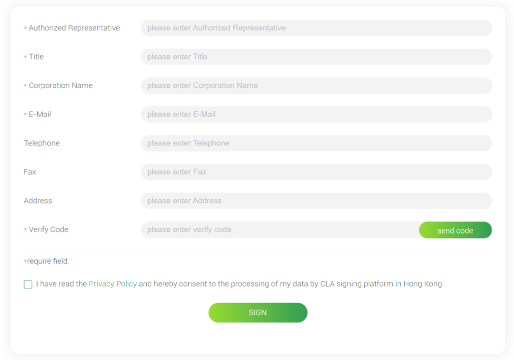
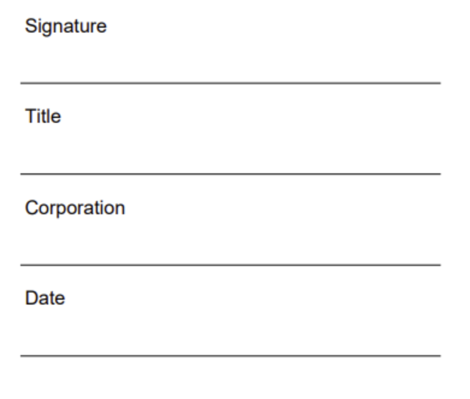
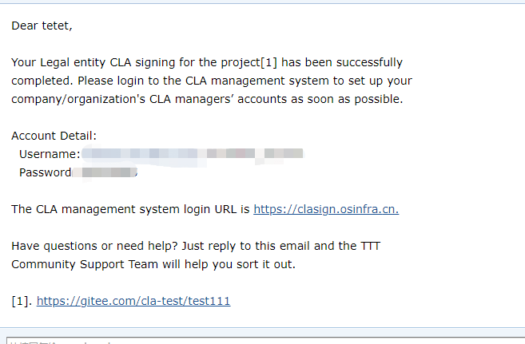
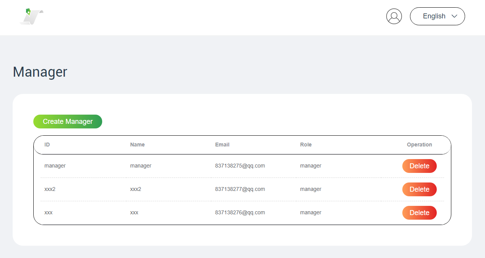
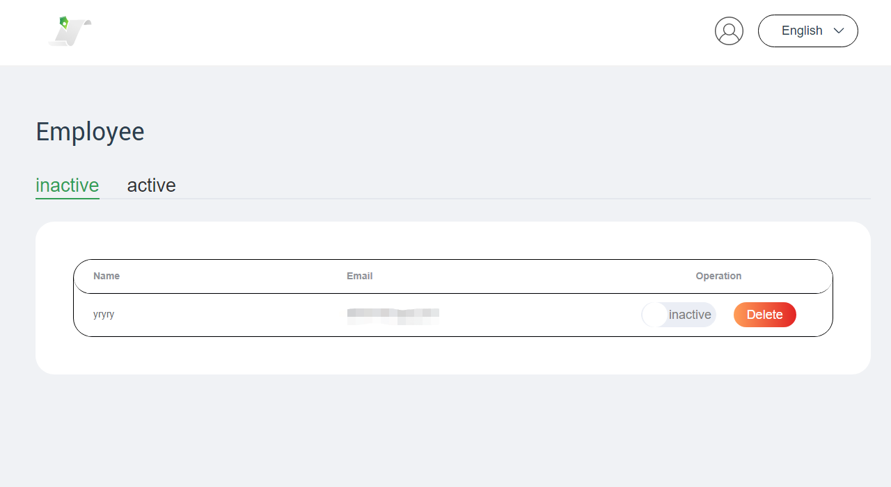
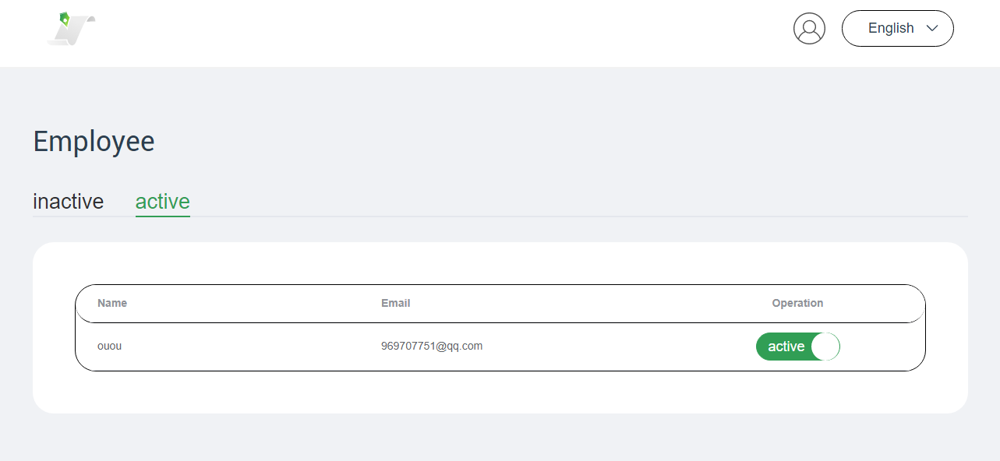
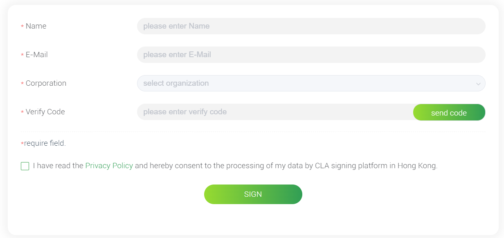
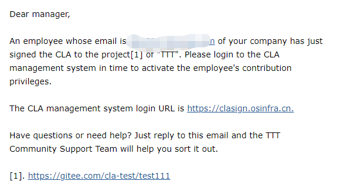

### A Guide to Signing the openEuler Corporation CLA

#### 1. Why Is a Corporation CLA Necessary for Joining the openEuler Community

A Contributor License Agreement (CLA) is usually required for a developer to contribute to an open source project. The CLA is the declaration of individual or corporation contributors as owning the copyright to the content that they contribute. By signing the CLA, the contributors allow their contributions to be redistributed under an open source license while reserving their copyright, and if the contributions include patents, grant a patent license within the scope of the project.

#### 2. Signing a Corporation CLA

2.1 Visit the openEuler CLA signing address: [https://clasign.osinfra.cn/sign/gitee_openeuler-1611298811283968340 ](https://clasign.osinfra.cn/sign/gitee_openeuler-1611298811283968340)

 
Sign Corporation CLA

2.2 Choose **Sign Corporation CLA** and fill the necessary information in the CLA signing form. After you click **send code**, an email containing the verification code will be sent to the email address of the corporation you represent. Verify the code to proceed to the next step.

After the Corporation CLA is signed, the email address cannot be changed. Use a proper email address to sign the Corporation CLA.

 
Form for signing the Corporation CLA

2.3 A PDF version of the CLA signed in the previous step will be sent to your corporation's email address. Please print the PDF file and stamp it with the corporation seal.

 
Sample of the CLA file received by a corporation

2.4 Scan the CLA with the official seal, signature, and date as a PDF file, and reply to the email received in step 2.2 with the PDF file attached to complete CLA signing.

2.4 There are two types of administrators in the CLA management system of corporation employees in the openEuler community: **super administrator** and **system administrator**. After receiving the email, the administrator of the openEuler system checks the PDF file. If the file pass the check, the email box used to sign the corporation CLA will receive an email, indicating that the signing is successful. The email contains the user name and initial password of **super administrato**r account.

A super administrator can add and delete system administrators. Multiple system administrators can be created in the system. All system administrators have the same rights to manage the contributions of corporation employees. The super administrator account cannot be the same as the system administrator account.

 
 Signing success notification email

If you have any problem to sign the CLA, add WeChat "openeuler123" or send an email to "cla@public.openeuler.org".

#### 3. Introducing to Corporation Manager

3.1 Visit [https://clasign.osinfra.cn/sign/gitee_openeuler-1611298811283968340](https://clasign.osinfra.cn/sign/gitee_openeuler-1611298811283968340) and click **Corporation Manager**.

 
Corporation Manager

The login page containing the user name and password is displayed. After entering the user name and password, click **Login in** to go to the administrator page.

Login in

3.2 After logging in to the system, the super administrator needs to create a system administrator for management. The main task of the super administrator in the CLA system is to create and delete system administrators. After a system administrator is created, the system administrator receives a notification email. For the differences between the super administrator and the system administrator, see ***5.1 What Is the difference between the super administrator and system administrator in the Corporation Manager system?***

Creating or deleting a system administrator

3.3 After logging in to the system, the system administrator can view the list of employees who have signed the CLA but not active. The system administrator can activate the employees' permission to contribute to the openEuler community or delete the employees' contribution requests as needed.

 Inactive corporation employee list

In the active employee list, the system administrator can set an employee to the inactive state.

 Active corporation employee list

#### 4. Signing an Employee CLA 

4.1 After the Corporation CLA is signed, employees of your corporation can sign an Employee CLA by visiting the following URL: [https://clasign.osinfra.cn/sign/gitee_openeuler-1611298811283968340 ](https://clasign.osinfra.cn/sign/gitee_openeuler-1611298811283968340)

Click **Sign Employee CLA**.

 
 Sign Employee CLA

4.2 Employees must use the corporation email address to sign the CLA. After entering the corporation  email address and clicking **send code**, the corporation email address receives an email containing the verification code. After filling in the form and submitting the form, the Employee CLA is signed.

 
  Form for signing the Employee CLA

4.3 When an employee signs the CLA, system administrators of the Corporation Manager system will be notified to decide whether to allow the employee to contribute. For details about the system administrators, see section 4.3.

 
 Sample of notification email received by corporation CLA administrator

#### 5. F&Qs

5.1 What Is the difference between the super administrator and system administrator in the Corporation Manager system?

There are two types of administrators in the Corporation Manager system of the openEuler community: super administrator and system administrator. After a Corporation CLA is created, the corporation email address used to sign the CLA will receive the account and initial password of the super system administrator. The administrator should log in to the system to change the initial password as soon as possible.

In corporate practice, managers or legal representatives typically execute the CLA. However, the oversight of developer contributions is not within their purview. Instead, system administrators assume this responsibility. Multiple system administrators can be appointed, each possessing equal authority to manage employee contributions.            

5.2 Does the openEuler community provide SLA commits for issue and CVE resolution?

In the openEuler open source community, all issues and CVE resolution are completed by contributors. Therefore, no business behavior is involved, and no SLA commits exist.

5.3 What are the email addresses that can be used to sign the Corporation CLA of openEuler?

Personal mailboxes such as 126.com, qq.com, and gmail.com cannot be used to sign the Corporation CLA. However, they can be used to sign the Individual CLA.

5.4 Does the legal representative have to sign the Corporation CLA?

The person who signs the Corporation CLA is the authorized representative of the corporation, not necessarily the legal representative.

5.5 More information about the CLA

[https://openeuler.feishu.cn/docs/doccnB3yBLtkrCmN5N6WRLFttWg](https://openeuler.feishu.cn/docs/doccnB3yBLtkrCmN5N6WRLFttWg)