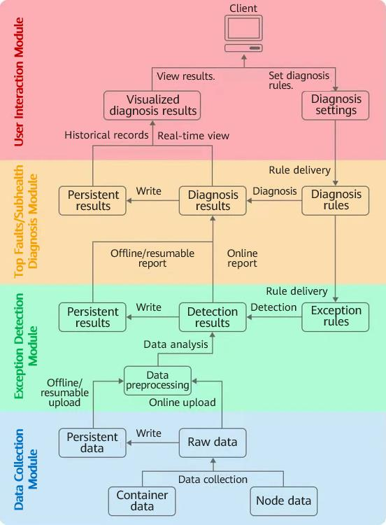

The Container Problem Detect System (CPDS) is designed and developed by Beijing Linx Software Corp. (Linx Software for short) to detect and identify top faults and subhealth status of containers.

In November 2022, Linx Software officially open sourced this project in the openEuler community.

#### Background

With the development of enterprise digitalization and the popularization of cloud native technologies, enterprises' daily operations involve a growing number of latency-sensitive and high-concurrency online scenarios. Business innovation requirements prompt enterprises to use innovative technologies. Containers, as a lightweight computing carrier, are widely used in scenarios such as artificial intelligence, big data, and edge computing, delivering high elasticity and agility for various scenarios.

As businesses grow larger and larger and container clusters continue to expand, IT O&M finds itself under more pressure. Service interruptions caused by software and hardware faults have become one of the major factors that affect stability. Most existing fault detection solutions for container clusters in the industry are based on cluster component status detection, service entry monitoring, and user-defined interface liveness probing. These technologies struggle to detect or identify the subhealth status of services and cannot deliver fault diagnosis or execution policies. As a result, key faults cannot be handled.

To solve these problems in the cloud native field, Linx Software launched and open sourced the CPDS project. The system implements fault detection, diagnosis, and policy execution for container clusters, solving a core pain point in the industry.

#### Technical Implementation

Container cluster exceptions are classified into three categories: basic cluster service exceptions, cluster OS exceptions, and business service exceptions.

For basic cluster service exceptions, the CPDS uses technologies such as **systemd** and **initv** to start and monitor related key service and execute policies.

For cluster OS exceptions, the CPDS implements node agents on hosts to collect and report information about the node network, system calls, and drive Logical Volume Manager (LVM), and execute policies.

For business service exceptions, the CPDS sets cross-namespace agents in nodes and containers without intrusion into services to comprehensively monitor and analyze application status, resource consumption, execution of key system functions, and I/O status in containers, and detect exceptions. For example, if the CPU usage is high, the CPDS analyzes multiple metrics (such as **irq** and **iowait**) to identify the fault domain. Then, it analyzes the collected data about system calls, network, and drives to locate the fault cause and take corresponding measures. In addition, the CPDS analyzes the execution results, time consumption, and other metrics about system calls of applications in service containers, locates potential problems such as container subhealth, and takes measures to ensure stable running of service containers.

#### System Architecture

The following figure shows the technical architecture of the CPDS. The information collection module collects key data about the basic cluster services, cluster system, and service containers using the node and container data collection program, and reports the data to the exception detection module. After preprocessing data, the exception detection module detects exceptions in the collected data based on rules and uploads the detection results to the diagnosis module, which diagnoses faults or subhealth of nodes and service containers based on diagnosis rules and displays the results in a visualized manner through the user interaction module.

#### Future Plan

The CPDS project is maintained by the Cloud Native SIG of the openEuler community. The first release package is planned to be released in the second half of 2023 to support openEuler-22.03-LTS.

Project address: [https://gitee.com/openeuler/Cpds](https://gitee.com/openeuler/Cpds)

#### About Linx Software

Linx Software was founded in 2016 by Dr. Gong Min, a Linux pioneer in China. As an advanced secure OS vendor, Linx Software is committed to developing and producing basic OS software with high security, performance, and stability as well as related products and services, ensuring production and secure, stable running of key service systems at the OS level.

Linx Software provides a series of products and solutions, including the secure OS, container system, distributed storage, virtualization management platform, secure cloud desktop, big data platform, trustworthiness verification system, intranet host security monitoring software, network HA software, Windows application running platform, etc.
