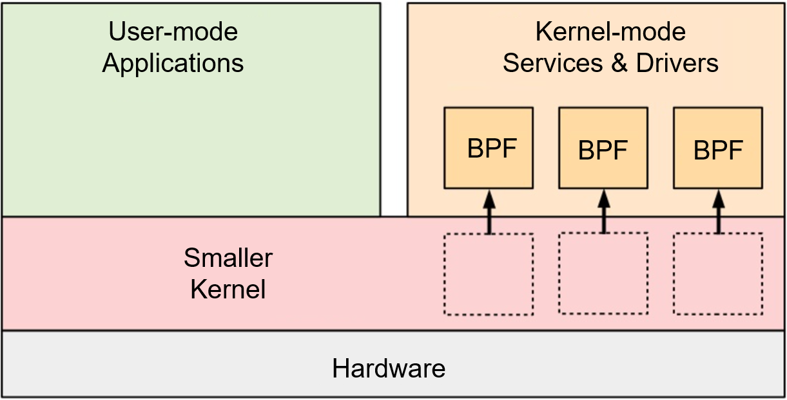

eBPF is a technology that allows sandboxed programs to run in the kernel. It provides a mechanism for safely injecting code during occurrence of kernel and user program events, enabling non-kernel developers to control the kernel. As the kernel develops, eBPF has gradually expanded from its initial use in packet filtering to network, kernel, security, tracing, and more. Its functions and features are also rapidly evolving. The early version of BPF was called classic BPF, or cBPF. It is precisely this functional expansion that makes the current BPF known as extended BPF, or eBPF.

Nowadays, eBPF is widely used in cloud native, observation, performance tuning, security, hardware acceleration, and many other fields. Its application scenarios are rapidly expanding, and various innovative ideas based on the eBPF technology are emerging. The era of eBPF has arrived.

#### Status Quo of the eBPF Technology

Although eBPF technology applications are experiencing a surge, basic technologies related to development, release, and installation are fragmented. As a result, technical achievements cannot be quickly ported to the production environments of industry customers. Similar eBPF applications are repeatedly used in practices. These problems hinder the popularization and promotion of the eBPF technology.

As shown in the figure below, there are two technical paths for the development and release of eBPF.

Separation between the development state and the runtime state (typical example: libbpf)

Advantages: release in ELF files (or links to applications), lightweight runtime, applicable to large-scale applications in production environments.

Disadvantages: high technology application barriers and no portability. For example, eBPF programs of a later kernel version cannot be ported to an earlier kernel version.

Convergence of the development state and the runtime state (typical example: BCC)

Advantages: release in source code with good portability; high-level language APIs provided in runtime encapsulation and abstraction, reducing the development difficulty.

Disadvantages: heavy-loaded runtime that has high requirements on production environments (a series of tools in the development state need to be installed); highly abstracted, flexibility reduced, not suitable for large-scale application development.

Both technical paths have their drawbacks. With the eBPF development, projects such as BumbleBee and eunomia-bpf have emerged to integrate the advantages of the two paths, but there is still a lack of overall planning for the basic eBPF technologies.

#### eBPF Development Prospect

*The future of eBPF in the Linux Kernel*, released at the eBPF summit 2022, outlines several directions for the evolution of eBPF, including:

More comprehensive programming capabilities: Currently, eBPF's programming capabilities have some limitations (such as not supporting loops of variable boundaries, limited number of instructions, etc.). The evolution target is to provide Turing-complete programming capabilities.

Higher security: Supports type-specific security and enhances runtime verifier. The evolution target is to provide secure programming capabilities comparable to Rust.

Wider portability: Enhances CO-RE and the portability of Helper interfaces to implement cross-system and cross-platform portability.

More powerful programmability: Allows access and modification to any kernel parameter and return value to implement more powerful programmability.

In general, the overall evolution target is to build eBPF into a secure programming language for the kernel (including hardware) runtime. This language is then used to build eBPF software to carry kernel (or hardware) capabilities. The evolution has resulted in an interesting phenomenon: according to the traditional software classification, it is difficult to categorize eBPF software as either application software or system software. Therefore, it is defined as an independent software form: eBPF as Service.

#### Ideas for Establishing eBPF Industry Standards

eBPF software is different from system and application software. From the perspective of its own characteristics, it should have a series of matching tools for development, compilation, packaging, release, installation, and upgrade.

The eBPF development framework and release mode are developing rapidly. However, problems such as cross-version portability, multi-scenario support, development usability, and service availability still exist. The openEuler eBPF SIG hopes to standardize basic technologies (including packaging, release, installation, and upgrade) of the eBPF software to facilitate the promotion of eBPF in various industries and scenarios. We work with multiple enterprises and universities to advocate the establishment of industry standards in the openEuler community, so as to provide performance acceleration, security hardening, and intelligent observation services to community users through standardized releases of kernel customization and hardware offloading capabilities.

We are planning to host an online meetup in December, with participation from various enterprises and organizations such as eSurfing Cloud, Sangfor, Huawei, Xi'An University of Posts and Telecommunications, Sun Yat-sen University, YUSUR, CAICT, and Ruijie. Our goal is to establish eBPF technology standards and provide a solid foundation for its application and scientific research. We welcome Chinese vendors who have requirements and plans for eBPF technology to join us in this effort.

The discussion will be divided into three directions:

eBPF Runtime: provides portable software installation, software warm upgrade, and package management capabilities.

eBPF Development Kit: provides one-stop development, debugging, and compilation tools, as well as software package release capabilities with cross-system and cross-platform portability.

eBPF Service HUB: enables mart management on eBPF Service and provides eBPF Service push and distribution capabilities.

####  Objectives of the openEuler eBPF SIG

One of the objectives of the openEuler eBPF SIG is to promote the standardization of eBPF as Service, and provide kernel and hardware acceleration capabilities as services in marts to benefit more community users.

The openEuler community will simultaneously push some base software and technical standards within the industry standards to the upstream Linux community to strengthen the construction of the eBPF technology ecosystem and enhance the influence of Chinese eBPF technologies.

If you want to join the discussion, submit a topic at: [https://etherpad.openeuler.org/p/sig-ebpf-meetings](https://etherpad.openeuler.org/p/sig-ebpf-meetings)

References:

[1] [https://www.brendangregg.com/blog/2019-12-02/bpf-a-new-type-of-software.html](https://www.brendangregg.com/blog/2019-12-02/bpf-a-new-type-of-software.html)
