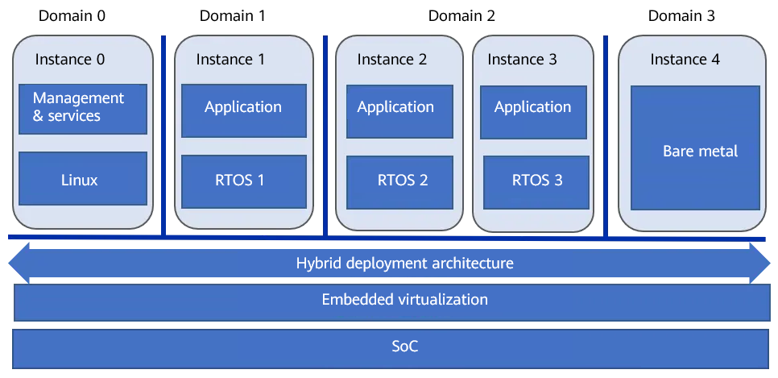
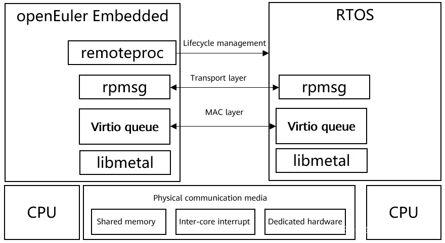
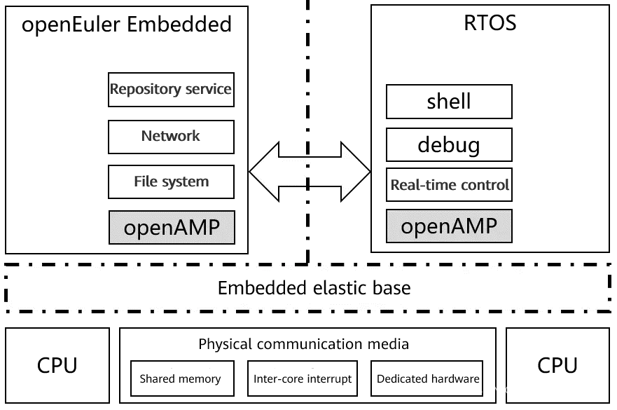

## Background

Linux has been widely used in the embedded scenario, while a real-time operating system (RTOS) will be more suitable in the scenario requiring high real-time performance, reliability, and security. However, in some scenarios, combining both is the solution. In such designs, a powerful processor runs Linux for feature-rich tasks, while a microcontroller, DSP, or real-time processor handles real-time control or signal processing. Communication occurs via I/Os, networks, or off-chip buses. However, this design can lead to low integration since it requires two sets of hardware systems, limited communication by the off-chip physical mechanism (such as the speed and delay), and reduced flexibility and maintainability since the software of Linux and RTOS is separated from each other.

Embedded systems benefit from rapid hardware advancements, including improved single-core performance, evolution from single-core to multi-core, heterogeneous multi-core, and even many-core, and virtualization and trusted execution environment (TEE) technologies. Future encapsulation techniques will enhance integration, enabling multiple OSs on a single system-on-a-chip (SoC).

Driven by various application requirements, including the Internet of Things (IoT), intelligentization, function security, and information security, embedded software systems have become increasingly complex, and a single OS is required to handle all functions. To address this, different systems can implement specific tasks: Windows for user interfaces (UI), Linux for network communication and management, and an RTOS for high timeliness and reliability. Additionally, these systems should be easy to develop, deploy, and expand, which can be achieved through containerization or virtualization.

Figure 1 General architecture of a hybrid critical system in openEuler Embedded

From the perspective of openEuler Embedded, the hybrid critical system architecture is depicted in the figure above. The hardware consists of a homogeneous or heterogeneous multi-core SoC system. In terms of applications, multiple OSs or runtimes run concurrently to fulfill various system functions. For instance:

Linux handles system management and services.

An RTOS ensures real-time control.

Another RTOS focuses on system reliability.

A bare-metal runtime executes dedicated algorithms. 

The terms "hybrid deployment architecture" and "embedded virtualization" refer to specific support technologies. In a narrow sense, criticality primarily relates to the functional safety level. According to the functional safety standard IEC-61508, Linux can achieve SIL 1 or SIL 2 levels, while an RTOS can reach the highest level, SIL 3. In a broader context, criticality can encompass objectives such as timeliness, power consumption, and information security.

In a system like this, several challenges must be addressed:

- Efficient hybrid deployment: This involves implementing multi-OS collaborative development, integrated builds, independent deployment, and upgrades effectively.
- Efficient communication and collaboration: The system’s overall functions span various domains. The challenge lies in achieving efficient, scalable, timely, and secure communication between these different domains.
- Efficient isolation and protection: Ensuring strong isolation and protection between multiple domains is crucial. Failures in one domain should not impact others. Additionally, minimizing the Trust Compute Base is essential.
- Efficient resource sharing and scheduling: Managing and scheduling resources efficiently under different constraints (such as timeliness, functional safety, performance, and power consumption) is key to optimizing hardware resource utilization.

For the challenges mentioned above, the current approach of openEuler Embedded is to view implement a hybrid critical system with three steps: deployment, isolation, scheduling. First, implement the hybrid deployment of multiple OSs. Next, implement the isolation and protection between multiple Oss. Finally, enhance resource utilization through mixed criticality scheduling. The hybrid deployment architecture tackles "efficient hybrid deployment" and "efficient communication and collaboration", while embedded virtualization addresses "efficient isolation and protection" and "efficient resource sharing and scheduling".

## Multi-OS Hybrid Deployment Architecture 

The following figure shows the architecture of the multi-OS hybrid deployment architecture in openEuler Embedded. The open source framework OpenAMP [1] is introduced as the infrastructure.

Figure 2 Infrastructure for a multi-OS hybrid deployment architecture

In the architecture described earlier, libmetal shields the implementation details of various systems and offers a unified abstraction. Virtio queue acts as the MAC layer in the network protocol, providing an efficient bottom-layer communication mechanism. Meanwhile, rpmsg serves as the transport layer, offering an abstract communication mechanism based on endpoints and channels. Lastly, remoteproc handles lifecycle management functions, including initialization, startup, suspension, and termination.

openEuler Embedded 22.03 integrates OpenAMP support and works with openEuler SIG Zephyr[2] to implement hybrid deployment of openEuler Embedded and RTOS Zephyr[3] on the QEMU platform. For details, see multi-OS hybrid deployment demo[4].

Building upon this foundation, the hybrid deployment architecture of openEuler Embedded is poised to evolve further. It will seamlessly integrate with other RTOSs, including RT-Thread[5]—an open-source OS developed in China. This approach enables the deployment of multiple OSs as services, as depicted in Figure 3. Additionally, an embedded elastic base, leveraging virtualization technology, can be introduced as needed.

Figure 3 Multi-OS service-oriented deployment architecture 

In the architecture, the openEuler Embedded serves as the central hub, offering common services like management, networking, and file systems to other OSs. These other OSs can then specialize in their respective fields. Additionally, the openEuler Embedded connects to Linux OS via channels such as shell, log, and debug, providing robust maintenance and testing capabilities, which streamline development.

## Follow us

Embedded is already open sourced in the openEuler community. There will be a series of topic sharings, and if you're interested in building and applying Embedded, please stay tuned for openEuler Embedded&Yocto SIG and discuss technologies related to Embedded and Yocto. Scan the QR code below to join the group chat.

Project URL: https://gitee.com/openeuler/yocto-meta-openeuler

## References

[1]https://www.openampproject.org/

[2]https://gitee.com/openeuler/community/tree/master/sig/sig-Zephyr

[3]https://www.zephyrproject.org/

[4]https://gitee.com/openeuler/yocto-embedded-tools/tree/openEuler-22.03-LTS/mcs

[5]https://www.rt-thread.org/ 

