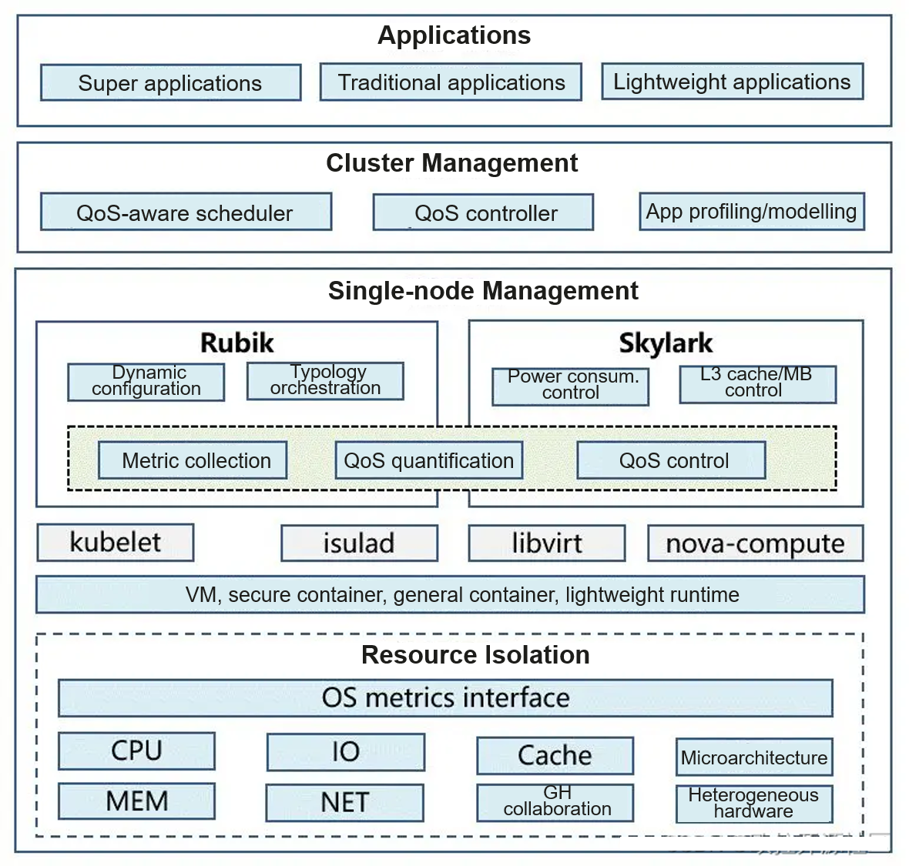

## Background

According to a report released by Canalys[1], spending on worldwide cloud infrastructure services increased 34% year on year to US$55.9 billion in Q1 2022. However, researches show that the average CPU utilization rate of user clusters across global data centers is lower than 20%. It is a huge challenge to improve data center resource utilization[2].

## Causes

Imbalanced resource allocation is the major cause for low resource utilization. Such imbalance can be reflected in multiple aspects, including:

1.  Independent scheduling systems from clusters: Various scheduling systems are used for different jobs, and jobs cannot use idle resources of other clusters.
2.  Lack of diversity of task types: Jobs in a cluster are severely homogeneous and require the same part of resources. As a result, the utilization rate of these resources is high, but other resources are left idle.
3.  Lack of priority management: Resources are over-allocated because there is no low-priority jobs in the cluster to use idle resources or there are low-priority jobs but the cluster does not support priority management.
4.  Fixed resource types in the cluster: Resource types in the cluster are fixed and cannot be elastically scaled based on dynamic service requirements. As a result, some resources are wasted.

In general, tasks and resources in clusters lack diversity, or the clusters cannot efficiently schedule and manage diverse tasks and resources.

## Workarounds

Deploy different types of jobs and improve resource utilization in terms of time and space.

- Resource oversubscription (space division): Oversubscribe idle resources of online services to offline jobs to improve the overall resource utilization.
- Off-peak use (time division): Run offline jobs in off-peak hours of online services to reduce resource waste.

## Technical Challenges

Both space-divided oversubscription and time-divided oversubscription are weakened by insufficient resources during peak hours. This problem deteriorates the quality of service (QoS) of some services. It is a challenging issue to maintain QoS while improving resource utilization.

In addition, the diversity and complexity of cloud services increase the difficulty in ensuring QoS.

In terms of the awareness of load characteristics, applications can be classified into three types: white-box, black-box, and gray-box. The system can sense the internal structure of white-box applications and obtain their QoS metrics in real time. This will not happen for black-box applications. Applications whose awareness degree is between the two are called gray-box applications. How to accurately quantify the QoS of black-box services and locate interference sources is a technical challenge for capability generalization and a research hotspot in the industry.

In terms of load complexity, applications can be classified into lightweight applications (such as microservices and Function Compute services), traditional applications (such as monolithic applications), and super applications (such as HPC and AI applications). Technical challenges such as full-stack collaborative awareness need to be resolved to build a unified system.

## Solution Brief

Based on the preceding cause analysis, converged deployment and scheduling of diverse services/loads and resources can significantly improve resource allocation flexibility, thereby optimizing resource utilization. However, this brings greater technical challenges. When more services/loads and resource types are managed, the dependency relationship between them may be more complicated and the multi-objective optimization requirements may become more demanding. We divide cluster deployment into the following levels:

**L0: independent deployment.** The cluster has an independent technology stack and resource pool, resulting in low cluster resource utilization (less than 20%).

**L1: shared deployment.** The unified technology stack expands the cluster scale. Resources are shared by services of a single type. Resource utilization is improved based on dynamic elasticity. The cluster resource utilization is low (less than 30%).

- Related technologies: unified technology stack, containerization, and elastic scaling

**L2: hybrid deployment.** The unified technology stack expands the cluster scale. Resources are shared by services of multiple types. Resource utilization is improved based on oversubscription and isolation technologies. The cluster resource utilization is high (greater than 40%).

- Related technologies: resource oversubscription, hierarchical resource isolation, and feedback control

**L3: generic hybrid deployment.** Thousands of black-box services on the public cloud share resources, ensuring the quality of key services based on QoS quantification and awareness.

- Related technologies: QoS quantification/location, precise control, and QoS-aware scheduling

**L4: converged deployment**. Variable workloads like containers, VMs, and lightweight runtimes are converged based on the generalization of workload types, and complicated scenarios like HPC/AI+heterogeneous resource awareness are leveraged to optimize the overall utilization of various resources.

- Related technologies: heterogeneous resource-aware scheduling and unified scheduling

L1 and L2 mainly improve the cluster CPU utilization, and L3 and L4 generalize resource utilization optimization technologies.

Currently, the industry has explored L2 for internal services and significantly improved the overall resource utilization of clusters and even data centers. This attempt in public cloud is still in the early stage and has not been put into large-scale commercial use.

Based on the trends of generic and converged deployment, we have developed a sustainably evolving resource utilization optimization solution, as shown in the following figure.

To achieve the optimal deployment, multiple layers of task execution need to be optimized.

**Cluster management layer:** Services with strong performance interference are deployed separately for scheduling considerations, and unnecessary interference is reduced through task combination optimization.

**Single-node management layer:** The single-node management layer detects resource contention in real time and eliminates the impact on key jobs.

**Resource isolation layer:** Tasks are managed by priority to provision sufficient resources for high-priority tasks.

Currently, Huawei has implemented the L2 solution based on the preceding framework. Related features have been verified and released, with the following technical breakthroughs made at the three layers:

**Cluster management layer:**

Predictive scheduling: Features such as predictive scheduling based on the physical resource usage of nodes, scheduling for load balancing, and scheduling for resource preemption are supported.
Feature modeling: A common application profile modeling component is designed and implemented to automatically inject interference, collect metrics, and output models.

**Single-node management layer:**

QoS quantification: Service QoS can be detected and interference sources can be controlled in real time based on a quantification model.
Topology orchestration: Services are dynamically orchestrated based on the hardware topology to improve the overall performance without changing the resource quota.
Power consumption control: After the resource utilization is improved, the device power consumption increases. Therefore, power consumption changes need to be monitored in real time to cap the power consumption as required.
L3 cache/memory bandwidth control: Currently, the underlying hardware provides the L3 cache and memory bandwidth isolation. However, dynamic control by software is still required to achieve a balance between interference control and resource utilization.

**Resource isolation layer:**

Priority-based preemption: This feature is provided for resources that can be queued by priority, such as CPU, MEM, and IO/NET resources. Among them, the CPU absolute suppression capability (to avoid priority inversion) and NET preemption performance (less than 100 ms) are improved.

Elastic scheduling: Elastic scheduling based on tidal affinity and CPU burst is provided.

The preceding fine-grained features will be open-sourced to the openEuler community. Welcome to try these features in the community.

## Future Plan

Currently, we have verified and implemented the hybrid deployment (L2) solution in some scenarios. In the short term, we need to make breakthroughs in ensuring the QoS of black-box services and achieving L3 to benefit more users. In the long run, in addition to container scenarios, the resource utilization of more load and resource types needs to be improved. This requires more technical breakthroughs in cluster scheduling and OSs.

This article briefly introduces the technologies for improving cloud resource utilization. The isolation, feedback control, and resource-aware scheduling technologies will be described in subsequent articles of this series.

## References

1.  [Global cloud services spend hits US$55.9 billion in Q1 2022](https://www.canalys.com/newsroom/global-cloud-services-Q1-2022)
2.  Wang KJ, Jia T, Li Y. State-of-the-art Survey of Scheduling and Resource Management Technology for Colocation Jobs. Journal of Software, 2020, 31(10): 3100-3119

The resource utilization optimization technologies described in this article are jointly developed by the Cloud Native SIG, High Performance Network SIG, Kernel SIG, OpenStack SIG, and Virt SIG. The source code will be gradually open-sourced in the [openEuler community](https://gitee.com/openeuler).
