0. Introduction
1. Concepts
2. Live Variable Analysis and Graph Coloring Algorithms
3. Linear Scan
4. Allocation in LLVM
5. References

## Introduction

This article briefly introduces the basic concepts involved, live variable analysis and graph coloring with an example, and the linear scan algorithm and its implementation in LLVM 12.

## Concepts

Basic concepts:
- |X|: the degree of X, that is, the number of neighbors of a node in an undirected graph.

- CFG: control flow graph.  

- Successor: the successor of the basic block in CFG.

- Quaternion: (op,result,arg1,arg2). For example, `a=b+c` can be rewritten as a quaternion (+,a,b,c).

- SSA: static single assignment.

- use/def: For example, for instruction `n: c <- c+b`, use[n]={c,b} and def[n]={c}.

- live-in: When any of the following conditions is met, variable a is live-in at node n (a∈in[n]). Node n represents an instruction.

    1. a∈use[n];  
    2. There is a path from n to a node that uses a that does not contain a definition of a.

- live-out: Variable a is live-out at node n if it is live-in at one of the successors of n. We write a∈out[n]
  $$
  in[n] = use[n]\cup(out[n]-def[n])\\
  out[n] = in[s_1]\cup in[s_2]\cup ...\cup in[s_n], where\ s_1,...,s_n are\ all\ successors\ of\ n
  $$

- Interference: Two variables interfere if they are in the same `live-in` set at the same time.

- Register Interfere Graph (RIG): an undirected graph. The vertex and edge sets are as follows:

   - Node: variable  
   - Edge: If two nodes interfere with each other, there is an interference edge between the two nodes.

- K-coloring: Given an undirected graph G = (V, E), where V is a vertex set and E is an edge set. V is divided into k groups, and there is no adjacent vertex in each group. In this case, graph G is k-colorable. Of course, the smaller the k, the better.  
  Note that our subsequent algorithms will work on the most common quaternion, not SSA. Before introducing the register allocation algorithm, we need live variable analysis to construct the interference figure.

## Live Variable Analysis and Graph Coloring Algorithms

### Live Variable Analysis

Simply put, it is to compute the used variables at each point.

The algorithm is described as follows [1]:

```
input: CFG = (N, E, Entry, Exit)
begin
// init
for each basic block B in CFG
	in[B] = ∅
// iterate
do{
	for each basic block B other than Exit{
		out[B] = ∪(in[s]),for all successors s of B
		in[B] = use[B]∪(out[B]-def[B])
	}
}until all in[] do't change
```
> There is a similar tool called Reaching Definitions for live variable analysis.


For example, perform live variable analysis on the code in Figure 1.

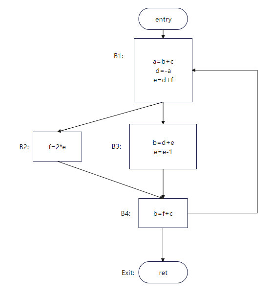

> Figure 1 [2]

Live variables for each point:
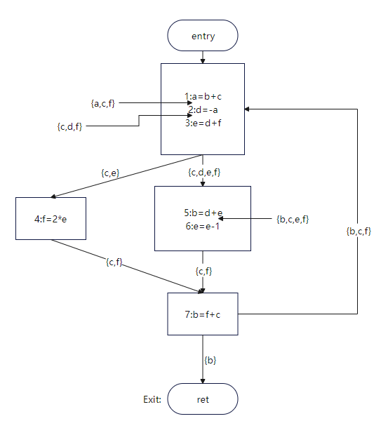

> Figure 2

Due to space limitations, only the result of the first round of instruction 1 is computed. If you're interested, you can try the remaining computations.

| Step      | Subscript| out | in    |
| ---------- | ---- | --- | ----- |
| First iteration| 1    | {}  | {b,c} |
| ...        | ...  | ... | ...   |

Figure 3 shows the RIG.

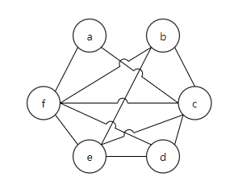

> Figure 3

### Graph Coloring

After the above live variable analysis, we get the interference graph, and the next step is to color it.

Graph coloring is an NP problem. We will use **heuristic** algorithm to color the interference graph.
The procedure is as follow:

1. Pick a node whose degree is less than k.  
2. Delete the node from the graph.  
3. Determine whether the graph can be colored.  
4. Repeat the first three steps until the coloring is complete.  

Algorithm description [3]:

```
input: RIG, k
// init
stack = {}
// iterate
while RIG != {} {
	t := pick a node with fewer than k neighbors from RIG // Nodes can be sorted by degree before being returned.
	stack.push(t)
	RIG.remove(t)
}
// coloring
while stack != {} {
	t := stack.pop()
	t.color = a color different from t's assigned colored neighbors
}
```

For example 1, it is assumed that four registers r1, r2, r3, and r4 are available for allocation.

| Step| Stack        | RIG                                                            |
| ---- | ------------- | -------------------------------------------------------------- |
| 0    | {}            | 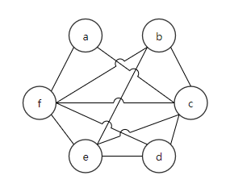 |
| 1    | {a}           | 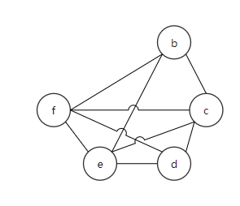 |
| 2    | {d,a}         | 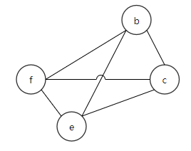 |
| 3    | {c,d,a}       | 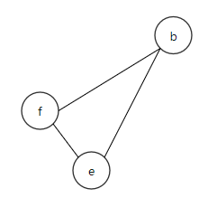 |
| 4    | {b,c,d,a}     | 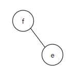 |
| 5    | {e,b,c,d,a}   | 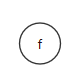 |
| 6    | {f,e,b,c,d,a} |                                                                |


| Register Allocation                                          | Stack       |
| ------------------------------------------------------------ | ----------- |
| 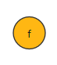 | {e,b,c,d,a} |
| 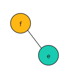 | {b,c,d,a}   |
| 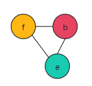 | {c,d,a}     |
| 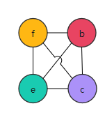 | {d,a}       |
| 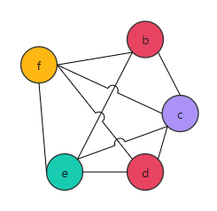 | {a}         |
| 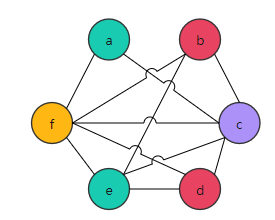 | {}          |

The RIG in FIG. 3 is **4-colorable**. But what if only three colors are available?

It's okay. We have large memory, though the speed is reduced. If the coloring fails, the variable is stored in the memory and obtained when it is used.

The preceding example is still used, but k is 3, and there are only three colors.

| Step| Stack                                | RIG                                                            |
| ---- | ------------------------------------- | -------------------------------------------------------------- |
| 0    | {}                                    |  |
| 1    | {a}                                   |  |
| 2    | Since there is no node whose degree is less than 3, spilling variables are required.| /                                                              |

It's ideal if the neighbor of f is 2-colorable. But, here only one variable can be selected and stored in the memory.  
We choose to spill variable `f` to the memory. The following figure shows the IR and RIG after spilling.

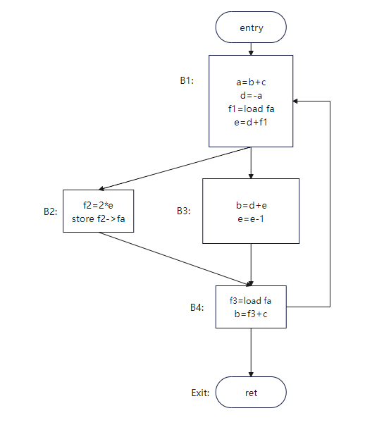

> Figure 4: IR after spilling

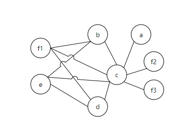

> Figure 5: RIG after spilling

Therefore, spilling divides the live range of a variable to reduce the number of neighbors of the spilled node.
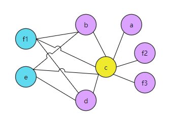

> Figure 6: Figure 5 after coloring

This is a brief overview of the graph coloring algorithm. However, what are the implications of the copy instructions in the code?

Before register allocation, Copy Propagation and Dead Code Elimination optimize some copy instructions.

For example, in code segment 1, Y and X can be coalesced. However, Copy Propagation in code segment 2 cannot be used because branches cause different Y values.

```txt
//Code segment 1
X = ...
A = 10
Y = X
Z = Y + A
return Z

//Code segment 2
X= A + B
Y = C
if (...) {Y = X}
Z = Y + 4
```


Therefore, the register allocation algorithm also needs to process the copy instructions. It assigns the same register to the source and target of the copy instruction.

In RIG, if the source and target of the copy instruction are considered as the **same nodes in the RIG**, the same register is allocated.

- Same node means that RIG can be extended: A dotted line edge coalesces candidates.

- Coalescing condition: If the live ranges of X and Y do not overlap, X and Y in the `Y=X` instruction can be coalesced.

- To ensure that the coalescing is valid and does not cause spilling, the local degree after the coalescing is < k.

To calculate the local degree, there are three algorithms:

- Simple algorithm
- Brigg's algorithm
- George's algorithm

1. Simple algorithm: `(|X|+|Y|)<k`. It is a conservative algorithm with limited applications.

   For example, when k=2, the simple algorithm cannot be used for coalescing. 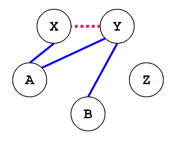

   > Figure 7 [3]

   However, it is obvious that FIG. 7 may be coalesced into FIG. 8: 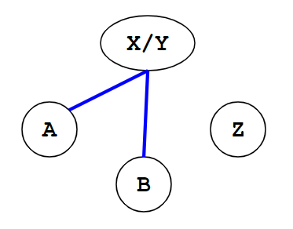

   > Figure 8 [3]

2. Brigg's algorithm: X and Y can be coalesced if (number of neighbors of X and Y with degree ≥ N) < N. However, if the degree of X is large, the algorithm efficiency is low.

3. George's algorithm: X and Y can be coalesced if for each neighbor T of Y, |T| < k or T interferes with X.

   For example, when k=2, X and Y may be coalesced in FIG. 9.

   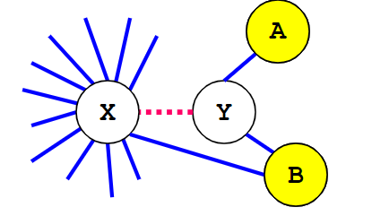

   > Figure 9 [3]

   Compared with Brigg's algorithm, George's algorithm does not inspect all neighbors of a node. Note that graphs can be colored in ascending order of node degrees.

## Linear Scan

The algorithm is described as follows [4]:

```txt
LinearScanRegisterAllocation:
	active := {}
	for i in live interval in order of increasing start point
		ExpireOldIntervals(i)
		if length(avtive) == R
			SpillAtInterval(i)
		else
			register[i] := a regsiter removed from pool of free registers
			add i to active, sorted by increasing end point
ExpireOldInterval(i)
	for interval j in active, in order of increaing end point
		if endpoint[j] >= startpoint[i]
			return
		remove j from active
		add register[j] to pool of free registers
SpillAtInterval(i)
	spill := last interval in active
	if endpoint[spill] > endpoint[i]
		register[i] := register[spill]
		location[spill] := new stack location
		remove spill from active
		add i to active, sorted by increasing end point
	else
		location[i] := new stack location
```

The live interval is the live range of a variable, which can be computed by analyzing live variables. However, you need to identify the time points when the variable appears for the first time and last time.

Example:

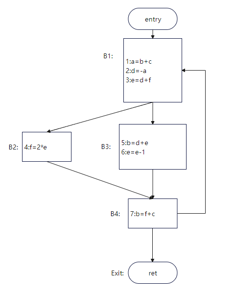

| Variable| Live Interval |
| ------ | ------------- |
| a      | 1,2           |
| d      | 2,3,4,5       |
| e      | 3,4,5,6       |

## Allocation in LLVM

The algorithms described above are used in the most common quaternion. However, LLVM-IR is in the SSA form and has PHI nodes, which are not represented by machine instructions. Therefore, PHI nodes need to be eliminated before register allocation.

As an industrial strength compiler, LLVM has multiple allocation algorithms. You can manually control the allocation algorithms by using the command line option `-regalloc=pbqp|greedy|basic|fast`.

The default algorithm varies according to the optimization level. By default, greedy is used for O2 and O3 optimization level, and fast is used for other optimization levels.

The strategy of the fast algorithm is simple. The code is scanned and registers are allocated to the variables that appear. If the registers are insufficient, the variables are spilled to the memory. It is mainly used for **debugging**.

The basic algorithm is based on a linear scan, sets the spill weight for the live interval, and uses the priority queue to store the live interval.

The greedy algorithm also uses priority queues. Registers are allocated to variables with a long live range, and variables with a short live range can be placed in gaps. For details, see [5].

The full name of the PBQP algorithm is Partitioned Boolean Quadratic Programming. For details, see [6].

For specific implementation, the top-to-bottom sequence is as follows:

- `TargetPassConfig::addMachinePasses` includes register allocation and other optimizations.
- `addOptimizedRegAlloc` is a pass closely related to register allocation, for example, eliminating the PHI node mentioned above.
- `addRegAssignAndRewriteOptimized` is the actual register allocation algorithm.
- The files related to register allocation are **RegAllocBase.cpp**, **RegAllocGreedy.cpp**, **RegAllocFast.cpp**, **RegAllocBasic.cpp**, and **RegAllocPBQP.cpp** in **lib/CodeGen**.
- The RegAllocBase class defines a series of APIs for the selectOrSplit and enqueue/dequeue methods. The focus of the data structure is the priority queue.
	The selectOrSplit method is similar to SpillAtInterval mentioned above.
	The priority queue is similar to the active list.
The brief code is as follows:
```
void RegAllocBase::allocatePhysRegs() {
  // 1. virtual reg is a variable.
  while (LiveInterval *VirtReg = dequeue()) {

    // 2. selectOrSplit returns an available physical register and a new live intervals list.
    using VirtRegVec = SmallVector<Register, 4>;
    VirtRegVec SplitVRegs;
    MCRegister AvailablePhysReg = selectOrSplit(*VirtReg, SplitVRegs);
	// 3. Allocation failure check
    if (AvailablePhysReg == ~0u) {
    	...
    }
	// 4. Formal allocation
    if (AvailablePhysReg)
      Matrix->assign(*VirtReg, AvailablePhysReg);
	
    for (Register Reg : SplitVRegs) {
      // 5. Live interval after enqueuing and segmentation
      LiveInterval *SplitVirtReg = &LIS->getInterval(Reg);
      enqueue(SplitVirtReg);
    }
  }
}
```

As for the performance comparison of the four algorithms, we mainly consider three indicators: runtime, compile time, and amount of spills.

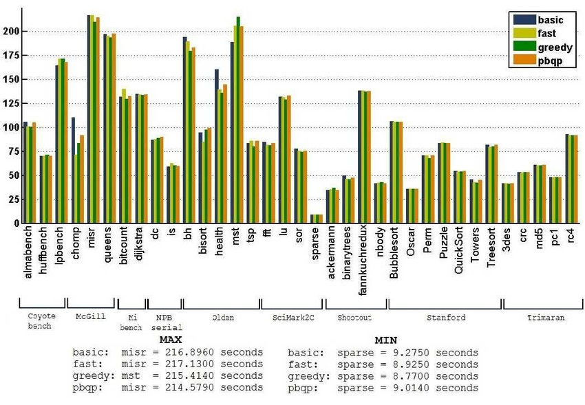

> Runtime in seconds for each program using different algorithms [6]

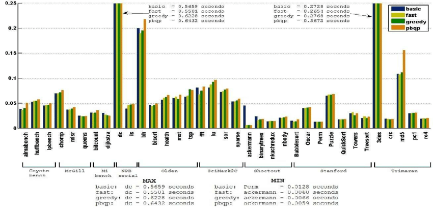

> Compile time in seconds of different algorithms [6]

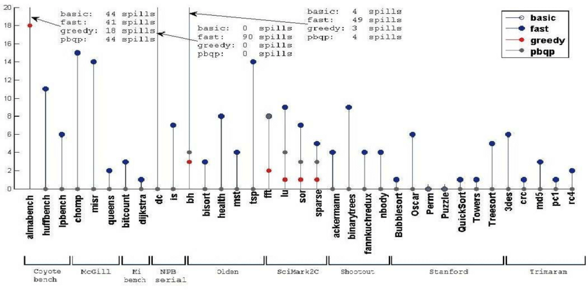

> Amount of spills of different algorithms [6]

From the three figures, we can see that the greedy algorithm is better than other algorithms in most test sets. Therefore, it is feasible to use greedy as the default allocator.

## Summary

We demonstrate the live variable analysis and graph coloring algorithms through an illustrative example. The live variable analysis enables us to determine the live range of a variable, the interference graph, and the coloring. If coloring fails, we can spill a variable to memory. Subsequently, we introduce the register coalescing transformation in RIG.
We provide a brief overview of the register allocation algorithm: linear scan. Then, we present the implementation of the algorithm in LLVM 12 and compare the performance differences of the four algorithms in LLVM.

## References

1. [Introduction to Data Flow Analysis (cmu.edu)](http://www.cs.cmu.edu/afs/cs.cmu.edu/academic/class/15745-s18/www/lectures/L5-Intro-to-Dataflow-pre-class.pdf) 
2. [register-allocation](http://web.cecs.pdx.edu/~mperkows/temp/register-allocation.pdf)
3. [Register Allocation (cmu.edu)](http://www.cs.cmu.edu/afs/cs.cmu.edu/academic/class/15745-s18/www/lectures/L12-Register-Allocation.pdf) and [Register Allocation: Coalescing (cmu.edu)](http://www.cs.cmu.edu/afs/cs.cmu.edu/academic/class/15745-s18/www/lectures/L13-Register-Coalescing.pdf) 
4. [linearscan.pdf (ucla.edu)](http://web.cs.ucla.edu/~palsberg/course/cs132/linearscan.pdf) 
5. [greedy-register-allocation-in-llvm-30](http://blog.llvm.org/2011/09/greedy-register-allocation-in-llvm-30.html)
6. T. C. d. S. Xavier, G. S. Oliveira, E. D. d. Lima and A. F. d. Silva, "A Detailed Analysis of the LLVM's Register Allocators," 2012 31st International Conference of the Chilean Computer Science Society, 2012, pp. 190-198, doi: 10.1109/SCCC.2012.29.
