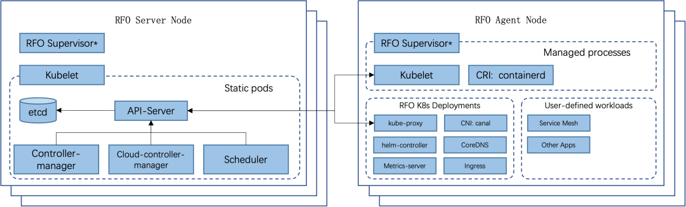
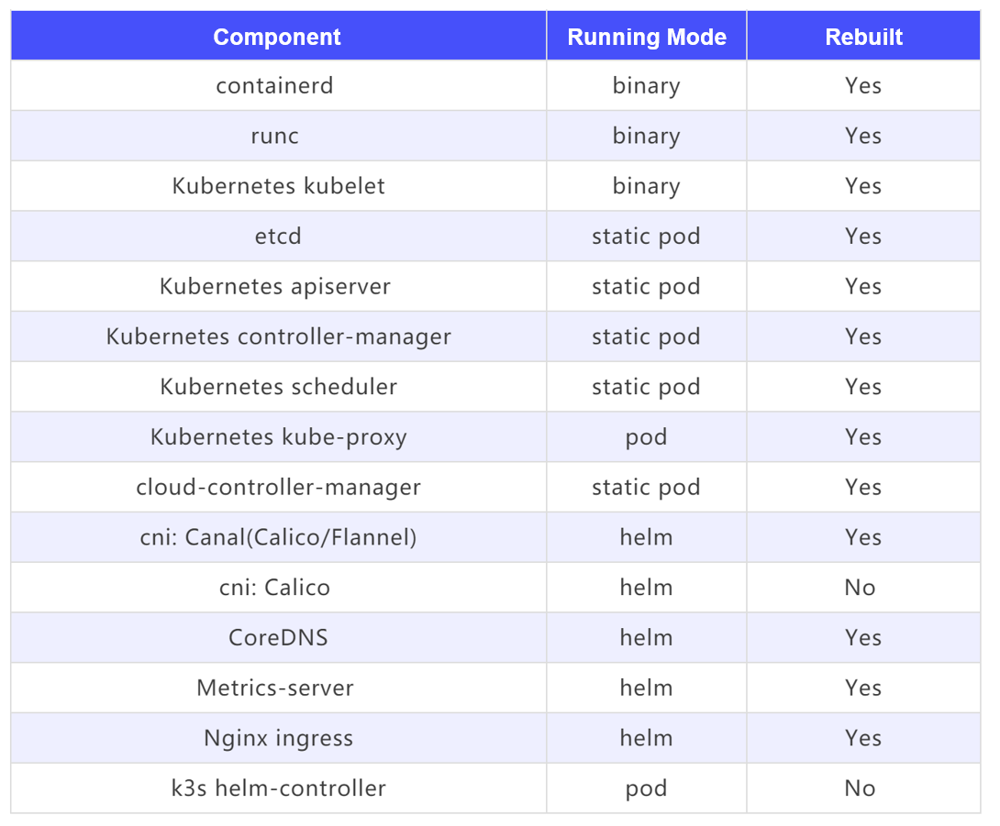

### General Availability of Rancher RFO

Rancher for openEuler (RFO) aims to build a Rancher basic platform for openEuler. It major task is to build a Kubernetes distribution for the openEuler ecosystem. Based on the upstream RKE2 technology stack, the artifact uses openEuler base images and has excellent compatibility with openEuler LTS editions.

SUSE has established the [RFO SIG](https://www.openeuler.org/en/sig/sig-detail/?name=sig-rfo) in the openEuler community to operate product iteration and open sourced the achievements of the RFO distribution ([https://gitee.com/rfolabs/rfo](https://gitee.com/rfolabs/rfo)).

Goals of the RFO distribution are as follows:

* Complete and traceable engineering. Ensure that build records and end-to-end test results of core components can be traced.

* Out-of-the-box product. Streamline RFO installation and deployment and enable RFO to be deployed from Rancher Prime.

* Leveraging the openEuler ecosystem. Use the openEuler ecosystem to build core components and the openEuler container image for final packaging.

* Secure and compliant software supply chain. Ensure that the distributions of core components cannot be tampered with and commit to providing a hardened Kubernetes cluster environment.

* Compatibility with diverse computing architectures. Kubernetes infrastructure for diverse computing architectures such as AMD64, ARM64, and RISC-V is available.

RFO SIG was established in the openEuler community in September 2022. After three months of engineering iteration, we officially launched the general availability version of the RFO distribution. Welcome to try it and provide feedback in the Rancher community and openEuler community. Currently, the following tested versions are available: v1.23.14+rfor1, v1.24.8+rfor1, and v1.25.4+rfor1. We will continue following the iteration of upstream Kubernetes versions.

### Quick Start

The following demonstrates the quick start of RFO (v1.24.8+rfor1 for example) based on openEuler 22.03-LTS.

#### Preparing for the Installation

The following preparation procedure must be performed on all hosts.


1. Check the OS version.

````
cat /etc/os-release
````
Output:
````
NAME="openEuler"
VERSION="22.03 LTS"
ID="openEuler"
VERSION_ID="22.03"
PRETTY_NAME="openEuler 22.03 LTS"
ANSI_COLOR="0;31"
````

2. Configure NetworkManager to ignore the veth interface of Canal CNI.

````

touch /etc/NetworkManager/conf.d/rfo-canal.conf
cat >> /etc/NetworkManager/conf.d/rfo-canal.conf << EOF
[keyfile]
unmanaged-devices=interface-name:cali*;interface-name:flannel*
EOF
systemctl disable nm-cloud-setup.service nm-cloud-setup.timer
systemctl reload NetworkManager
````

3. Stop the openEuler firewall service. The default Canal CNI in RFO conflicts with the firewalld network stack. Therefore, firewalld needs to be disabled.

````
systemctl stop firewalld
systemctl disable firewalld
````

#### Installing the Server

1. Use the **install** script to install RFO.

````
curl -sfL https://gitee.com/rfolabs/rfo/raw/rfo-master/install-rfo.sh | INSTALL_RFO_VERSION="v1.24.8+rfor1" sh -
````

This script can be executed only by the **root** user or through the **sudo** command.

The installation result is as follows:

````
[INFO]  using v1.24.8+rfor1 as release
[INFO]  downloading checksums at https://rfolabs.oss-cn-shenzhen.aliyuncs.com/rfo/releases/v1.24.8%2Brfor1/sha256sum-amd64.txt
[INFO]  downloading tarball at https://rfolabs.oss-cn-shenzhen.aliyuncs.com/rfo/releases/v1.24.8%2Brfor1/rfo.linux-amd64.tar.gz
[INFO]  verifying tarball
[INFO]  unpacking tarball file to /usr/local
````

2. Enable the rfo-server service.

````
systemctl enable rfo-server
````

3. Start the rfo-server service.

````
systemctl start rfo-server.service
````

4. (Optional) View rfo-server service logs.

````
journalctl -u rfo-server -f
````

After running this installer:

* The rfo-server service is installed. This service is configured to automatically restart after the node is restarted or the process crashes or is killed.

* Other utilities are installed in **/var/lib/rancher/rfo/bin/**, including kubectl, crictl, and ctr. Note that these are not installed on your local path by default.

* Two cleanup scripts are installed in **/usr/local/bin/rfo**, including **rfo-killall.sh** and **rfo-uninstall.sh**.

* A kubeconfig file is written to **/etc/rancher/rfo/rfo.yaml**.

* A token that can be used to register other server or agent nodes is created in the **/var/lib/rancher/rfo/server/node-token** file.

Note: If you want to add server nodes, the total number must be an odd number for election purposes.

#### Installing the Agent

1. Run the installer.

````
curl -sfL https://gitee.com/rfolabs/rfo/raw/rfo-master/install-rfo.sh | INSTALL_RFO_VERSION="v1.24.8+rfor1" INSTALL_RFO_TYPE="agent" sh -
````

2. Enable the rfo-agent service.

````
systemctl enable rfo-agent.service
````

3. Configure the rfo-agent service.

````
mkdir -p /etc/rancher/rfo/
vim /etc/rancher/rfo/config.yaml
````
Content of the **config.yaml** file:

````
server: https://<server>:9345
token: <token from server node>
````

You can run the **cat /var/lib/rancher/rfo/server/node-token** command on the server node to obtain the token.

The RFO server process listens to the registration of new nodes through port 9345. In most cases, Kubernetes APIs can be used on port 6443.

4. Start the service.

````
systemctl start rfo-agent.service
````

5. (Optional) View rfo-agent service logs.

````
journalctl -u rfo-agent -f
````

#### Accessing the Cluster

After the rfo-server node is installed, you can use the embedded kubectl and kubeconfig configurations on the server node to access the cluster.

````
export KUBECONFIG=/etc/rancher/rfo/rfo.yml
export PATH=/var/lib/rancher/rfo/bin:$PATH
kubectl get pods --all-namespaces
helm ls --all-namespaces
````

Or, specify the path to the kubeconfig file in the command.

````
kubectl --kubeconfig /etc/rancher/rfo/rfo.yml get pods --all-namespaces
helm --kubeconfig /etc/rancher/rfo/rfo.yml ls --all-namespaces
````

If you want to access the cluster outside the cluster, you can copy the **/etc/rancher/rfo/rfo.yml** configuration file to a machine outside the cluster as **~/.kube/config**, and replace **127.0.0.1** in the file with the IP address or host name of your RFO server. Then kubectl is ready to manage your RFO cluster.

### Features

#### Small-Scale Configuration

RFO is repackaged based on RKE2 and has all features of RKE2. It learns from the experience of developing and maintaining lightweight Kubernetes distribution K3s and builds an enterprise-class distribution with ease of use. This means that RFO is, in the simplest case, a single binary file that needs to be installed and configured on all nodes in a Kubernetes cluster. After being started, RFO is able to direct and supervise the agent with an appropriate role on each node, and obtain required content from the network. The following figure shows the RFO architecture.



RFO System Architecture

The following are Kubernetes components used by RFO in the project. Most of them are repackaged and distributed using openEuler base images.



When the **install.sh** script is used for installation, RFO is installed in the system as a Linux system service, and systemd is the RFO supervisor. Other installation methods (such as directly starting the RFO binary file) are not recommended. In some scenarios, there is no RFO supervisor for monitoring the RFO running status; as a result, programs such as kubelet run in the background.

Generally, RFO is distributed as an installation package that contains only the RFO binary, systemd service configuration file, and uninstallation script. Other components are pulled, installed, and started according to the node role after RFO is started.

#### Backup and Recovery

When RFO is running, you can run the **etcd-snapshot** subcommand to manage etcd snapshots, including:

* Use a local directory or S3 as the snapshot storage backend.

* Create a snapshot for current etcd data.

* Reset a cluster and restore data from a snapshot to the current or another node.

* Configure scheduled backup.

#### Helm Integration

RFO has an embedded Helm Controller (https://github.com/k3s-io/helm-controller) that uses a HelmChart custom resource definition (CRD) to manage Helm charts.

The HelmChart resource definition captures most of the options you frequently pass to the **helm** command line tool. The following is an example of deploying Grafana from the default chart repository to overwrite some default chart values. Note that the HelmChart resource is in the **kube-system** namespace, but the chart resource will be deployed to the **monitoring** namespace.


````

apiVersion: helm.cattle.io/v1
kind: HelmChart
metadata:
  name: grafana
  namespace: kube-system
spec:
  chart: stable/grafana
  targetNamespace: monitoring
  set:
    adminPassword: "NotVerySafePassword"
  valuesContent: |-
    image:
      tag: master
    env:
      GF_EXPLORE_ENABLED: true
    adminUser: admin
    sidecar:
      datasources:
        enabled: true
````
In addition, RFO supports custom deployment through **HelmChartConfig** resources and allows overwriting the values of packaged components (such as Canal, CoreDNS, and Nginx-Ingress) deployed as HelmCharts. The **HelmChartConfig** resource must match the name and namespace of its corresponding HelmChart. In addition, **valuesContent** can be provided and passed to the **helm** command as an additional value file.

Note: The **HelmChart spec.set** value overwrites the **HelmChart** and **HelmChartConfig spec.valuesContent** settings.


For example, to customize the Grafana image tag for the Grafana helm chart in the preceding example, you can create a Kubernetes resource file with the following content, and use `kubectl apply -f <manifest filename>` to apply it:

````
apiVersion: helm.cattle.io/v1
kind: HelmChartConfig
metadata:
  name: grafana
  namespace: kube-system
spec:
  valuesContent: |-
    image:
      tag: 9.3.2
````

#### Certificate Rotation

By default, the validity of the RFO certificate is 12 months. If the certificate has expired or remains valid for less than 90 days, you can use the **certificate** subcommand to rotate the certificate, which will restart RFO.

````
systemctl stop rfo-server
rfo certificate rotate
systemctl start rfo-server
````

You can also rotate a single service by passing the **--service** flag, for example, **rfo certificate rotate --service api-server**.

#### Secret Encryption

RFO supports the **secrets-encrypt** subcommand for static encryption of secrets. After static encryption is enabled, the following operations are automatically performed:

* Generate an AES-CBC private key.

* Use the generated key to generate an encryption configuration file.

````
{
  "kind": "EncryptionConfiguration",
  "apiVersion": "apiserver.config.Kubernetes.io/v1",
  "resources":
    [
      {
        "resources": ["secrets"],
        "providers":
          [
            {
              "aescbc":
                {
                  "keys":
                    [{ "name": "aescbckey", "secret": "xxxxxxxxxxxxxxxxxxx" }],
                },
            },
            { "identity": {} },
          ],
      },
    ],
}
````

* Pass the configuration as encryption-provider-config to the Kubernetes API Server.

After this function is enabled, all created secrets will be encrypted with this key. Note that if you disable encryption, encrypted secrets cannot be read until you enable encryption again with the same key.


#### High Security and Reliability

RFO is closely related to openEuler in design and has the same security compliance requirements as openEuler. In the continuous integration pipeline, sonobuoy tests are performed based on openEuler container images to ensure that RFO distributions meet the requirements of CNCF-certified Kubernetes distributions.

### Maintenance Principles and Release Cycle


The maintenance and release cycle of RFO is the same as that of RKE2 and Kubernetes, and complies with the following principles:

* For an RKE2 minor version, track the changes within one week after the RKE2 release. If the changes are irrelevant to RFO, skip this release.

* For an RKE2 major version (maintained based on a Kubernetes major version), track the changes within two weeks after the RKE2 release.

For openEuler OS updates, comply with the following principles:

* Release corresponding RFO versions for openEuler LTS versions. Currently, a new openEuler LTS version is released every two years. After a new LTS version is released, track the changes in the latest RFO release.

* Release an RFO minor version when critical or high-level system vulnerabilities occur in openEuler.

In addition to the native functions of RKE2, RFO tries to integrate the openEuler OS. RFO plans to add the following support in the future:

* ARM64 platform

* Built-in iSula runtime

#### Future Plan


The follow-up plan focuses on artifact security and trustworthiness certification and artifact distribution expansion.

Artifact security and trustworthiness certification mainly includes the following aspects to ensure that the distributions of core components cannot be tampered with and provide a hardened Kubernetes cluster environment:

* Sign distributed container images.

* Perform helm chart signature on distributed RFO charts.

Artifact distribution expansion includes the following aspects:

* Support offline image build and offline deployment.

* Build RFO and kube-explorer (https://github.com/cnrancher/kube-explorer) RPM packages and distribute them through the openEuler software repository.

#### About Rancher

Rancher is an open-source enterprise-level Kubernetes management platform that implements centralized deployment and management of Kubernetes clusters in hybrid clouds and on-premises data centers. Rancher is favored due to its intuitive and simplified operation experience. It is named a leader in multi-cloud container development and in enterprise container management by Forrester in 2020 and 2018 respectively, and a cool vendor in cloud infrastructure by Gartner in 2017.

Currently, the number of image downloads of Rancher exceeds 300 million worldwide, with 40,000+ enterprise customers, such as Samsung, Schneider Electric, Siemens, WWK, China Unicom, and Xiamen Airlines.

In December 2020, SUSE acquired Rancher Labs, and after this, Rancher became a key part of SUSE's enterprise vision—Innovate Everywhere. SUSE and Rancher jointly provide customers with strong innovation capabilities. By providing hybrid cloud IT infrastructure, cloud native transformation, and IT O&M solutions, SUSE and Rancher simplify, modernize, and accelerate enterprises' digital transformation, driving innovation everywhere.

Currently, SUSE and Rancher's services in China are carried by SUSE Software (Beijing) Co., Ltd. SUSE has excellent R&D, technical support, and sales teams in China. Based on Rancher's leading cloud native technologies, SUSE will provide timely and reliable technical support and service assurance for enterprise customers in China.
