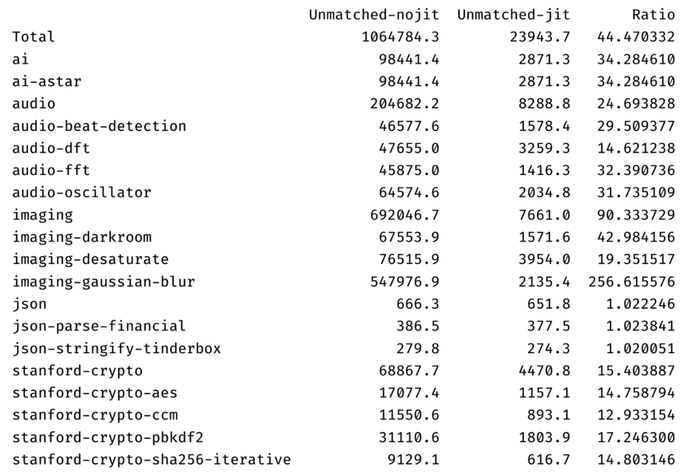
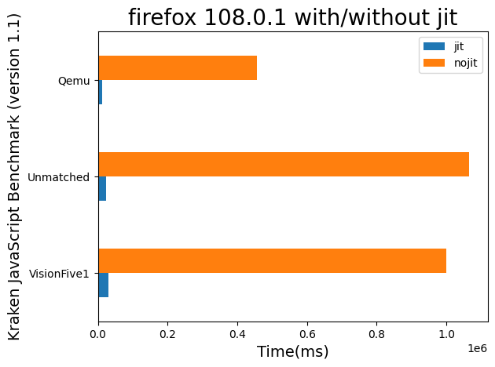
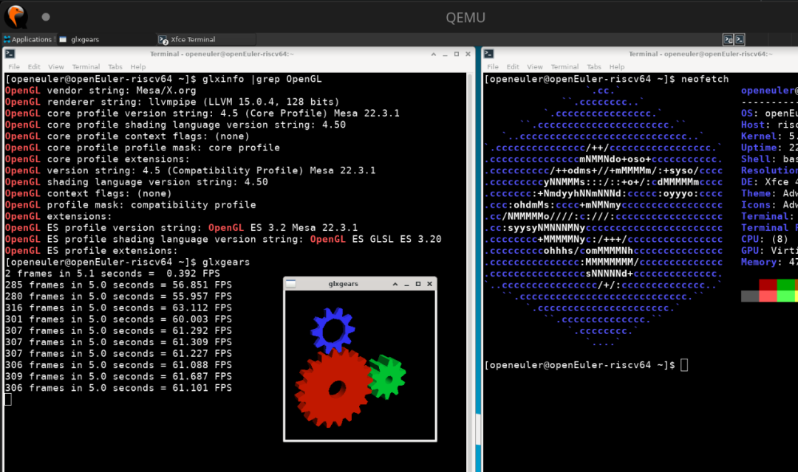

The RISC-V SIG will soon release the openEuler RISC-V 22.03 V2 image. This release provides installation sources of the latest Firefox version with SpiderMonkey JIT compilation support and the latest Mesa version with LLVMpipe optimization for users to install and test. It is expected that the GUI performance will be significantly optimized.  

After enabling JIT in the new version of Firefox, the Kraken benchmark test shows that the running speed of JavaScript programs is increased by up to 40 times, making it the fastest Firefox in the RISC-V field.  

Enabling SpiderMonkey JIT Optimization on Firefox RISC-V
-----------------------------------------

Mozilla Firefox holds a significant position in the field of free software. In the past year, the RISC-V SIG has successfully adapted Firefox to openEuler RISC-V. In the current RISC-V development and test environments, the Firefox GUI can be successfully opened for users to browse web pages, verify logins, send and receive emails, and play videos, meeting basic user requirements.

However, Firefox of an earlier version runs slowly when a website with JavaScript scripts is opened. This is because the JavaScript engine SpiderMonkey is executed by the interpreter. In Firefox, SpiderMonkey mainly relies on the JIT compiler to accelerate the execution of JavaScript code. Firefox without JIT greatly lags behind Google Chrome in JavaScript execution performance.

To promote the development of Firefox RISC-V, the PLCT lab of the software institute started the JIT porting of SipderMonkey in the RISC-V architecture in the second half of 2022. Currently, this patch has been submitted to the Mozilla community.

The SpiderMonkey JIT porting work is described as follows:

-   Step 1: Set up the basic RISC-V 64 framework.

    -   Initialize the porting work and directly copy the files in the **none** folder.

    -   Define the required **macro-assembler** functions in the **macro-assembelr-riscv64.h/cc** file.

-   Step 2: Port the assembler.

    -   Finish the assembler porting. The runtime function (JavaScript runtime function) is successfully compiled in JavaScript. The SpiderMonkey can execute the **Hello world** program.

    -   Port the disassembler and simulator to facilitate debugging on x86 machines.

    -   Implement the functions defined in **macro-assembler** one by one and make them pass all jittests tests (\[17425| 0| 0| 0\] 100% ===&gt;| 240.6s).

-   Step 3: Submit to the upstream system.

    -   Submit to the upstream at [https://bugzilla.mozilla.org/show\_bug.cgi?id=1800431](https://bugzilla.mozilla.org/show\_bug.cgi?id=1800431).

The RISC-V SIG has fixed the JIT patch of SpiderMonkey developed by the PLCT lab and incorporated it into Firefox 108.0.1, and has performed Kraken benchmark tests on QEMU, Visionfive1, and Unmatched devices.

According to the test result, enabling JIT can improve the running speed of JavaScript programs up to 40 times, with the image rendering module showing the most significant improvement. The execution speed of the Gaussian blur algorithm is improved between 170% to 270%. Compared with other distributions, openEuler RISC-V is the first to have the fastest Firefox in the RISC-V field.

Currently, the implemented JIT patch contains all related functions, and the JIT-enabled Firefox runs smoothly on openEuler RISC-V.

At the same time, the RISC-V SIG will continue to follow up the PLCT lab's work on implementing the memory64 feature of WASM and assessing the need for SpiderMonkey to support RISC-V 32, and observe the performance.

Introduction of LLVMpipe JIT to Mesa
---------------------------

The commonly used RISC-V development environment QEMU and various development boards on the market seldom have graphics devices or capabilities and often rely on LLVMpipe for software rendering. The performance of LLVMpipe without JIT support is poor, with the glxgears test on QEMU often only achieving 5 frames per second. The overall desktop smoothness is also limited by the graphics performance, which remains at a relatively low level.

To address this long-standing performance bottleneck, the RISC-V SIG has introduced a new JIT engine based on LLVM Orcjit for LLVMpipe in the upgraded 22.3.2 version of Mesa, with support for RISC-V optimization patches.

Compared with the glxgears test with 5 frames per second, patch-enabled LLVMpipe can output about 60 frames, synchronized with the test machine monitor. For QEMU and development board hardware without GPUs, Firefox-based web browsing and video playback are smoother, with significant performance improvement.

Currently, Firefox and Mesa with JIT have entered the test phase. Interested partners can use and test them using the latest images. We welcome everyone to provide test feedback and work together to improve the RISC-V desktop ecosystem experience.

-   openEuler RISC-V 22.03 V2
    Version image: [https://mirror.iscas.ac.cn/openeuler-sig-riscv/openEuler-RISC-V/preview/openEuler-22.03-V2-riscv64/](https://mirror.iscas.ac.cn/openeuler-sig-riscv/openEuler-RISC-V/preview/openEuler-22.03-V2-riscv64/)

The RISC-V SIG is dedicated to enhancing and optimizing the RISC-V desktop software environment. If you share our vision for the future of RISC-V and want to contribute your efforts, we welcome you to join us!
