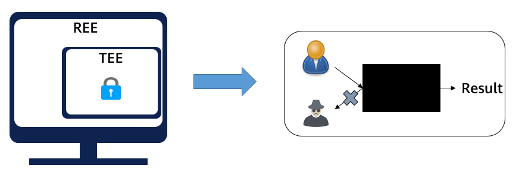
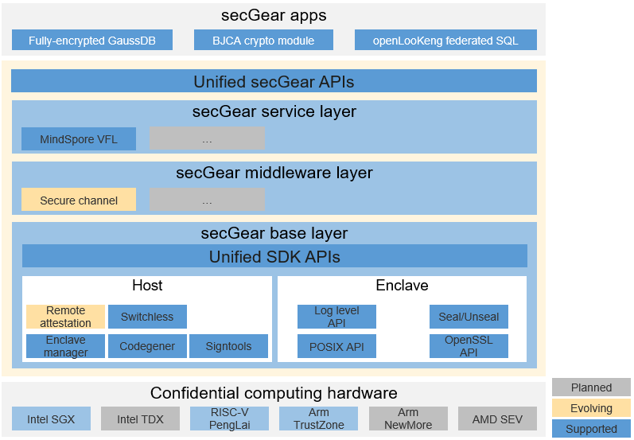
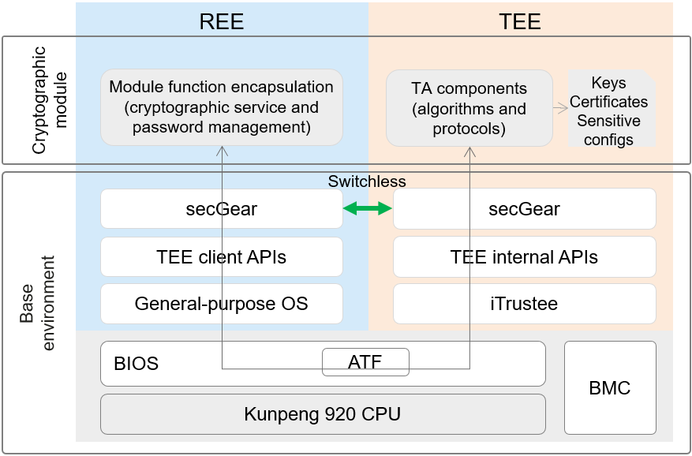
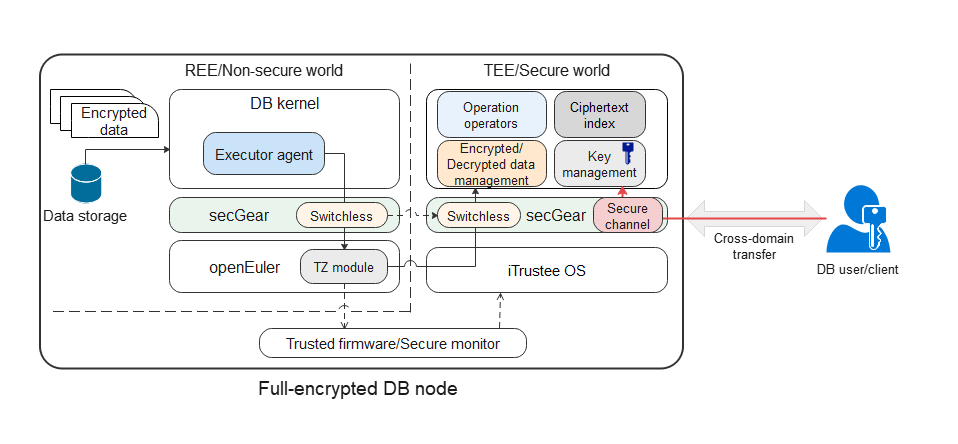
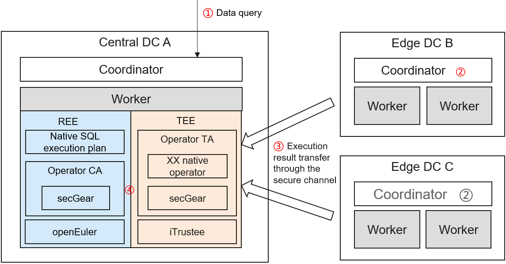
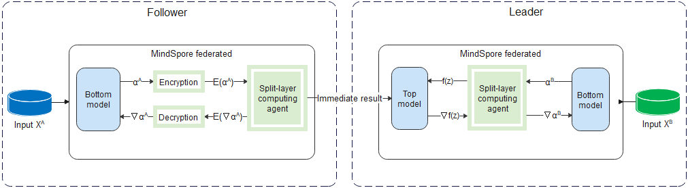
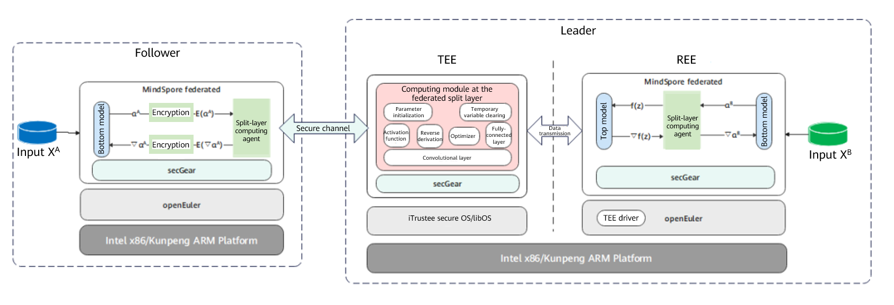

With the rapid development of network and computing services, data has become a fundamental factor of production in the digital economy. The key to the healthy development of the digital economy is to efficiently mine the value of data and form a secure, compliant, and trusted environment for data circulation. In addition, according to requirements of China's *Personal Information Protection Law* and EU's *General Data Protection Regulation (GDPR)*, the scope of data privacy protection is expanding with protection strength increasing. Therefore, security protection for critical data and services is not only a technical challenge, but also a necessary requirement for security compliance.

Currently, most data protection solutions apply to data in static storage or under network transmission. To effectively protect data in use, privacy computing technology emerges.

As an important branch of privacy computing, confidential computing protects data in use with the hardware trusted execution environment (TEE) \[1\]. As shown in the following figure, in the rich execution environment (REE), the TEE isolated based on hardware is like a black box that prevents external systems (including OSs, privileged users, and malicious programs) from obtaining unauthorized access to or tampering with applications and data in use in the TEE. In this way, data on a third-party platform is "available but invisible", eliminating security concerns about data migration to the cloud and promoting secure data flow.

Pain Points in Confidential Computing
------------

Mainstream processors have implemented their confidential computing technologies, such as Arm TrustZone, CCA, Intel SGX, TDX, and AMD SEV. In addition, based on the PCIe TDISP features, confidential computing environments for GPUs and DPUs are under construction, such as NVIDIA H100
GPU, NVIDIA BlueField, and AMD smartNIC DPUs. In general, the core element of the TEE technologies is to provide a hardware isolated operating environment and security capabilities such as measurement and memory encryption based on the trust root.

As the TEE design ideas and implementation modes vary with processor architectures, the SDK APIs of vendors are also different and complex in development processes, which increases the development difficulty of confidential computing applications, reduces portability, and isolates their ecosystems. For application developers, their trusted applications are strongly bound to the architecture. For example, applications developed based on
SGX SDK can hardly be ported to Arm TrustZone, because the APIs provided by the secure OS SDK are greatly different from those provided by SGX SDK.

secGear Confidential Computing Framework
----------------------------

There are various confidential computing technologies with different complex SDK APIs, causing difficulty in development. Application ecosystems in different TEEs are isolated from each other, which increases development and maintenance costs.openEuler secGear unifies the development framework for confidential computing, dedicating to compatibility with mainstream TEEs in the industry to ignore TEE differences and provide simple and unified development APIs. The source code is shared for different architectures, enabling developers to focus on services and reducing development and maintenance costs. Streamlined TEE application ecosystems will facilitate the construction of the confidential computing ecosystem as a whole.

The secGear is logically divided into three layers, as shown in the following figure.

-   Base layer: unified layer of the confidential computing SDK, ignoring the TEE and SDK differences to share source code for different architectures.
    
-   Middleware layer: The general component layer provides confidential computing software for users to quickly build confidential computing solutions.
    
-   Service layer: The confidential computing service layer runs dedicated solutions for typical scenarios.

secGear complies with the Mulan PSL 2.0 license \[2\]. Developers can use secGear to contribute open-source middleware and solutions, including
commercial solutions. Beside the open-source MindSpore solutions for vertical federated confidential computing, there are secGear-based customer solutions, such as GaussDB fully encrypted database, BJCA cryptographic module, and openLooKeng federated SQL.

Typical Application Scenarios
------------

This section describes several secGear-based service scenario solutions for you to understand and learn from the solutions and build your confidential computing solutions for your services.

### TEE-based BJCA Cryptographic Module

Driven by policies and services, the cryptographic application assurance infrastructure has been evolving towards virtualization. As services are migrated to the cloud, a brand-new cryptographic delivery mode needs to be built to integrate cryptographic services, cloud services, and service applications. Under such circumstance, Beijing Certificate Authority (BJCA) launches a TEE-based cryptographic module. With BJCA, compliant cryptographic computing modules built in the Kunpeng TEE can be used for digital authentication to support the cryptographic cloud service platform. Kunpeng hosts can be used to construct a confidential computing platform to provide high-speed, ubiquitous, elastically deployed, and flexibly scheduled cryptographic services for cloud computing, privacy computing, and edge computing. The endogenous cryptographic module based on Kunpeng processors has become a revolutionary innovative solution in the cryptographic industry, which is a new starting point for endogenous trusted cryptographic computing \[3\].

In conventional cryptographic modules, algorithm protocols and processed data are privacy data and can be protected in the TEE. As shown in the figure,
secGear can divide the cryptographic module into two parts: management service and algorithm protocol.

-   Management service: runs in the REE to provide cryptographic services for the external world and forward requests to the TEE for processing.
    
-   Algorithm protocol: runs in the TEE to encrypt and decrypt user data.

Cryptographic services may have highly concurrent requests with large data volumes. The switchless feature of secGear reduces the context switches and data copies typically required for processing a large number of requests between the REE and TEE.

 

### TEE-based Fully-Encrypted GaussDB

Cloud databases have become an important growth point for database services in the future. Most traditional database service vendors are accelerating the provision of better cloud database services. However, cloud databases face more complex and diversified risks than traditional databases. Application vulnerabilities, system configuration errors, and malicious administrators may pose great risks to data security and privacy.

The deployment network of cloud databases changes from a private environment to an open environment. The system O&M role is divided into service administrators and O&M administrators. Service administrators have service management permissions and belong to the enterprise service provider. O&M administrators belong to the cloud service provider. Although being defined to be responsible only for system O&M management, the database O&M administrator still has full permissions to use data. The database O&M administrator can access or even tamper with data with O&M management permissions or through privilege escalation. In addition, due to the open environment and blurring of network boundaries, user data is increasingly exposed to attackers in the entire service process, no matter in transfer, storage, O&M, or running. Therefore, in cloud database scenarios, third-party trust and reliable data security protection are facing greater challenges than traditional databases. Data security and privacy leakage are top concerns of cloud databases.

To address the preceding challenges, the TEE-based fully-encrypted GaussDB is designed as follows: Users hold data encryption and decryption keys, data is stored in ciphertext in the entire life cycle of the database service, and query operations are completed in the TEE of the database service.

As shown in the figure, the fully-encrypted database has the following features:

1.  Data files are stored in ciphertext and plaintext key information is not stored.

2.  The database data key is stored on the client.

3.  When the client initiates a query request, the REE executes the encrypted SQL syntax on the server to obtain related ciphertext records and sends them to the TEE.
    
4.  The client encrypts and transfers the database data key to the server TEE through the secure channel of secGear. The database data key is decrypted in the TEE and used to decrypt the ciphertext records into plaintext records. The SQL statement is executed to obtain the query result. Then the query result is encrypted using the database data key and sent back to the client.
    
     
    

In step 3, when a large number of concurrent database requests are sent, frequent calls between the REE and TEE will be triggered and a large amount of data needs to be transferred. As a result, the performance deteriorates sharply. The switchless feature of secGear helps reduce context switches in calls and data copies, improving the performance.

 

### TEE-based openLooKeng Federated SQL

openLooKeng federated SQL is a type of cross-DC query. The typical scenario is as follows. There are three DCs: central DC A, edge DC B, and edge DC C. The openLooKeng cluster is deployed in the three DCs. When receiving a cross-domain query request, DC A delivers an execution plan to each DC. After the openLookeng clusters in edge DCs B and C complete computing, the result is transferred to the openLookeng cluster in DC A over the network to complete aggregation computing. In the preceding solution, the computing result is transferred between openLookeng clusters in different DCs, avoiding insufficient network bandwidth and helping to solve the cross-domain query problem. However, the computing result is obtained from the original data and may contain sensitive information. As a result, security and compliance risks exist when data is transferred out of the domain. How do we protect the computing results of the edge DCs during aggregation computing and ensure that the computing results are available but invisible in the central DC. Here is the solution empowered by confidential computing. In DC A, the openLookeng cluster splits the aggregation computing logic and operators into independent modules and deploys them in the Kunpeng-based TEE. The computing results of the edge DCs are transferred to the TEE of DC A through the secure channel. All data is finally aggregated and computed in the TEE. In this way, the computing results of the edge DCs are protected from being obtained or tampered with by privileged or malicious programs in the REE of DC A during aggregation computing.

 

 

The query process is as follows:

1.  A user delivers a cross-domain query request in DC A. The coordinator of openLooKeng splits and delivers the execution plan to its worker nodes and the coordinators of edge DCs based on the query SQL statement and data distribution. Then the coordinators of edge DCs deliver the execution plan to their worker nodes.
    
2.  Each worker node executes the plan to obtain the local computing result.

3.   
    Edge DCs encrypt their computing results through the secure channel of secGear, transfer the results to the REE of DC A over the network, forward the results to the TEE, and decrypt the results in the TEE.
    
4.  DC A performs aggregation computing on the computing results of DCs A, B, and C in the TEE, obtains a final execution result, and returns the result to the user.
    

In step 4, when there are a large number of query requests, data transmission between the REE and TEE will be frequent and a large number of data copy operations wll be performs. As a result, the performance deteriorates. The switchless feature of secGear can be used to reduce context switches and data copies to improve the performance.

### TEE-based MindSpore Feature Protection

Vertical federated learning (VFL) is an important branch of federated learning. When multiple parties have features about the same set of users, VFL can be used for collaborative training. The following figure shows the solution process.

1.   
    A party that has features is called a follower, while a party that has labels is called a leader. Each follower inputs its features to its bottom model to obtain the intermediate result, and then sends the intermediate result to the leader.
    
2.   
    The leader uses its labels and the intermediate results of followers to train the top model, and then sends the computed gradient back to the followers to train their bottom models.

This solution prevents followers from directly uploading their raw data out of the domain, thereby protecting data privacy. However, attackers may derive user information from the uploaded intermediate results, causing privacy leakage risks. Therefore, a stronger privacy protection solution is required for intermediate results and gradients to meet security compliance requirements.

Based on the security risks and solutions in the previous three scenarios, confidential computing is a good choice to make intermediate results "available but invisible" out of the domain. The figure shows the TEE-based VFL feature protection solution \[4\].

1.  Followers encrypt their intermediate results through the secure channel of secGear and transfer the results to the leader. After receiving the results, the leader transfers them to the TEE and decrypts them through the secure channel in the TEE.
    
2.  In the TEE, the intermediate results are input to the computing module at the federated split layer to compute the result.

In this process, the plaintext intermediate results of followers exist only in the TEE memory, which is inaccessible to the leader, like a black box.

Outlook
----

In 2023, openEuler secGear will continue to evolve and release stable versions that support the switchless feature, secure channel, and remote attestation, which can be used to build commercial end-to-end confidential computing solutions. Meanwhile, openEuler keeps building common middleware or services and looks forward to your contributions. Together, we can promote the development of the confidential computing application ecosystem. secGear will continue to focus on AMD SEV, Intel TDX, and Arm CCA technologies, building a secure, unified, and easy-to-use development framework for confidential computing.

References
----

---------- -------------------------------------------------------------------------------------------------------------------------------------------------------------------------------------------------------------------------
  \[1\]      Confidential Computing Consortium, "A Technical Analysis of Confidential Computing": [https://confidentialcomputing.io/wp-content/uploads/sites/85/2022/01/CCC-A-Technical-Analysis-of-Confidential-Computing-v1.2.pdf](https://confidentialcomputing.io/wp-content/uploads/sites/85/2022/01/CCC-A-Technical-Analysis-of-Confidential-Computing-v1.2.pdf)

  \[2\]      Mulan PSL 2.0 license: [http://license.coscl.org.cn/MulanPSL2](http://license.coscl.org.cn/MulanPSL2)

  \[3\]      Digital authentication: [https://mp.weixin.qq.com/s?__biz=MzA4NDUzMzY2Mw==&chksm=87ed5619b09adf0fe8a509dcee9d7413f3dbd1ec6f39d0d247272c1caf6d754d943be18133af&idx=1&mid=2650554089&sn=5725062bb6a1712c224a2f31d4558d32](https://mp.weixin.qq.com/s?__biz=MzA4NDUzMzY2Mw==&chksm=87ed5619b09adf0fe8a509dcee9d7413f3dbd1ec6f39d0d247272c1caf6d754d943be18133af&idx=1&mid=2650554089&sn=5725062bb6a1712c224a2f31d4558d32)

  \[4\]      MindSpore: [https://www.mindspore.cn/federated/docs/zh-CN/master/secure\_vertical\_federated\_learning\_with\_TEE.html](https://www.mindspore.cn/federated/docs/zh-CN/master/secure\_vertical\_federated\_learning\_with\_TEE.html)
