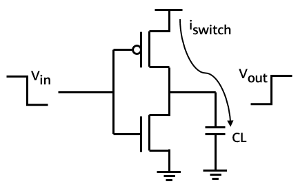
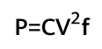

With the rapid growth of the cloud computing market, cloud vendors are increasing their investment in cloud infrastructure. However, the industry still faces the problem of low resource utilization. Improving resource utilization has become an important technical subject.

Hybrid deployment of services of different priorities is a typical and effective method to improve resource utilization. Services can be classified into high-priority and low-priority services based on latency sensitivity. When high-priority services compete with low-priority services for resources, resources are preferentially allocated to high-priority services.

The core technology of service hybrid deployment is resource isolation control, which involves kernel-mode basic resource isolation and user-mode QoS control. Skylark is a QoS-aware resource scheduler provided by Skylark of openEuler for VM hybrid deployment scenarios. In Skylark, the priority granularity is VMs. That is, a priority attribute is added to each VM. Resources are isolated and controlled based on VMs. Skylark improves physical machine resource utilization while ensuring the QoS of high-priority VMs. The kernel layer provides some basic resource interference isolation mechanisms, such as the CPU priority scheduling mechanism and the simultaneous multithreading (SMT) interference isolation mechanism. In addition, the cluster management software OpenStack detects VM priorities to implement a hybrid resource model.

VM hybrid deployment is jointly developed by OpenStack SIG, Virt SIG, and Kernel SIG of the openEuler community. This article describes the power consumption management technology of the Skylark.

Why Do We Need To Manage Power Consumption
------------------

Various hybrid solutions have already improved the server utilization rate, which is, however, accompanied by a higher likelihood of the instantaneous utilization rate reaching 100%. Generally, a CPU runs at the turbo frequency. After the CPU runs with full load for a period of time, the continuous power consumption increase will greatly exceed the thermal design power (TDP), which triggers CPU frequency reduction. Since a server CPU is powered as a whole, the frequency of all cores on the same CPU is reduced concurrently, which affects the QoS of customer services corresponding to all VMs running on the CPU. When the utilization is reduced and the power consumption is reduced to a certain value, the CPU runs at the turbo frequency again. Therefore, high resource usage will indirectly cause CPU QoS degradation. After VMs are deployed in hybrid mode, the CPU QoS or customer services must be ensured while resource utilization is improved.

This article shares in detail the basic concepts related to power consumption and the technical details of power consumption management in the VM hybrid deployment technology.

Source of CPU Power Consumption
------------

The main power consumption in a CPU comes from the transistor switch, short circuit, and leakage current. The following figure shows the CMOS schematic diagram.

The switching power consumption is mainly the charging and discharging of the capacitor. For example, a low-level input will cause the load capacitor at the output end to be charged once. A high-level input will cause the electric energy stored in the capacitor to be released in the form of heat. Therefore, a large amount of thermal energy is generated by the billions of transistors in a CPU. The short-circuit power consumption is generated when the P and N tubes are short-circuited. Leakage power consumption is caused by leakage current when the CMOS tube cannot be closed properly. It is related to the manufacturing process and temperature.

CPU power consumption formula:

In the formula, C indicates the capacitance, which is a constant related to the CPU process and is determined before the CPU is delivered. P indicates the power consumption, F indicates the CPU operating frequency, and V indicates the voltage. The CPU power consumption is directly proportional to the CPU operating voltage and frequency. Besides, there is a relationship between the voltage and the frequency. This is because a field-effect transistor in the CPU requires a certain amount of time to charge and discharge, and signal integrity can be maintained only after charging and discharging are completed. As the voltage increases, the charging time decreases, allowing for a higher frequency of overturning.

What Is TDP
----------

Thermal design power (TDP) describes the heat dissipation capacity of a heat sink when a CPU or GPU is running with a full load. According to the principle of energy conservation, the CPU requires input energy, that is, the power of the PSU, to run. The input current generates heat after passing through the capacitor. If the heat is not dissipated, the CPU temperature will become higher and higher, affecting the CPU running. TDP indicates the heat dissipation capability of a CPU within the designed operating temperature range and is an important reference indicator of the heat dissipation system. The larger the TDP is, the more heat the CPU generates when working with a full load.

After the turbo 2.0 technology introduces the Power Limits (PL1, PL2, PL3, and PL4) and Turbo Time Parameter (Tau), TDP is no longer the maximum heat that can be generated by a CPU.

PL1 is the power consumption when a CPU runs at the default dominant frequency, excluding the turbo frequency and AVX. In most cases, PL1 is equal to TDP. PL2 is the maximum power of a CPU after it exceeds TDP. The CPU can run above the TDP threshold within the Tau period. Generally, manufacturers do not set the PL3/PL4. Tau is the maximum time that the CPU can run in PL2.

In practical use, it is important to consider redundancy and production security. For that reason, it is not feasible for a server to operate at maximum power continuously. To protect a CPU, a power wall is set. When the power consumption is greater than a certain threshold, the CPU automatically invokes the frequency adjustment interface to reduce the CPU frequency to reduce the power consumption. When the power consumption decreases and the CPU temperature becomes normal, the CPU frequency gradually restores to the original value. 

Power Consumption Management in Hybrid Deployment Solution
----------------

In the Skylark VM hybrid deployment solution, there are three core modules for data collection, real-time QoS analysis, and real-time QoS control. The power consumption management of the three modules is implemented by using the following algorithms:

-   **Power consumption data collection**: Based on the topology relationship on the host, the frequency of each CPU core and the power consumption of each package are accurately collected and calculated by using the MSR register.
    
-   **Real-time analysis of power consumption and utilization**: ·In each period, the system marks the power consumption hotspot package and frequency-reduced CPU cores based on the specified TDP threshold, and sorts the CPU utilization of VMs running on the frequency-reduced CPU cores. To ensure the QoS of high-priority VMs, the low-priority VMs with the highest utilization are placed in the QoS adjustment queue.
    
-   **Real-time QoS control**: In each QoS adjustment period, the system restricts or restores the vCPU bandwidth of the VM in the QoS adjustment queue based on the CPU core status and power consumption hotspot package. By reducing the CPU bandwidth, the system reduces the CPU utilization of the frequency-reduced core to reduce power consumption.

Summary
----

While the hybrid deployment of high-priority and low-priority VMs increases the average resource utilization, it also carries the risk of degrading QoS. If the CPU is suddenly fully loaded, frequency reduction may be triggered due to the power consumption increase. As a result, the CPU QoS may degrade. Skylark proposes the power consumption management technology to indirectly adjust the power consumption and ensure the CPU QoS by adjusting the vCPU bandwidth of low-priority VMs in hotspots. 

Related Articles
------------

\[1\] openEuler Resource Utilization Optimization (1): Overview: [https://mp.weixin.qq.com/s/x9sdogEslRJJ5mDbs5bxgQ](https://mp.weixin.qq.com/s/x9sdogEslRJJ5mDbs5bxgQ)

\[2\] openEuler Resource Utilization Optimization (2): Effect in Typical Applications: [https://mp.weixin.qq.com/s/anOTdRIufYaj5pl4hy1e_A](https://mp.weixin.qq.com/s/anOTdRIufYaj5pl4hy1e_A)

\[3\] openEuler Resource Utilization Optimization (3): Introduction to Rubik: [https://mp.weixin.qq.com/s/jJXeBCRM2k92rPqyA6SL-Q](https://mp.weixin.qq.com/s/jJXeBCRM2k92rPqyA6SL-Q)

\[4\] openEuler Resource Utilization Optimization (4): CPU Preemption and SMT Isolation Control: [https://mp.weixin.qq.com/s/8Odi24WjKAho8SYsYd7a1A](https://mp.weixin.qq.com/s/8Odi24WjKAho8SYsYd7a1A)
