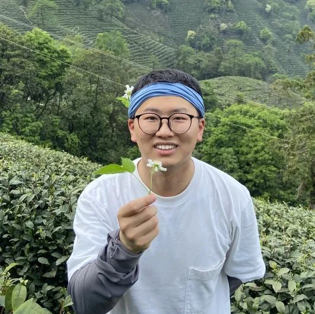

The openEuler community has been established for three years. With the support of many users and developers, the community grows rapidly.

At openEuler Summit 2022, the community presented the openEuler Star award for outstanding individual contributors and groups.  

We are honored to invite Xia Senlin, an openEuler Star, to share his learning and work in the community and introduce how to contribute to the community.

About the Interviewee
====================

Xia Senlin, developer of the openEuler community

Hello, guys. I'm a maintainer of the small_leek, Application, ruby, epol, and Desktop SIGs. My current research focuses on software engineering capability building. I often take part in activities of SIGs such as cicd, release, Application, and Desktop.

Interview Details
-----------------

What are the strengths of openEuler that attract you most?

For me, openEuler is one of the genuine open source communities in China. For developers, **openEuler has a low technical threshold and rich interest groups. From the beginning, the openEuler technical committee has gathered many technical experts in the OS field, and continues attracting experts from various segments.** Developers can not only obtain software packages from the openEuler community, but also communicate with technical experts. So I sincerely invite you guys to join the openEuler community.

You were selected as one of the openEuler stars in 2022, which means that you have made outstanding contributions to openEuler. Can you tell us your contributions in detail?

In 2022, I have done three major things in the community.

(1) Performed service cluster expansion and hierarchical building based on the existing OBS, which greatly improved the efficiency of concurrent building of multi-version projects.

(2) Optimized the baseline version control process of the release SIG, and combined commits for adding, deleting, and moving a software package into one PR.

(3) Participated in the R&D of the self-developed OS build system in the community, and promoted the continuous application of the system in the build, test, and release of openEuler 22.03 LTS SP1.

In the openEuler community, I am mainly engaged in building community software engineering capabilities. If you have any suggestions, feel free to communicate with me.

How do you participate in the community work? Do you have any experience to share with us?

At the beginning, I didn't know much about how an open source community operates. After comparing RPM building, bug fixing, CVE fixing, and community infrastructure, which is RPM build system + gate, I gradually found the field that I was really interested in. Now, I mainly engage in software engineering capability building and optimization.

In the past year, I have communicated with OS vendors and SUSE experts to understand the architectures and technical features of mainstream OS build systems. In addition, I have learned from teams that use OBS to improve single-package building efficiency and design an optimization solution that applies to building requirements of the openEuler community. Also, my sincere thanks go to developers in the cicd SIG of the openEuler community for their assistance with test devices for iterative testing.

**Interest matters a lot to me. Only if I am really interested in this field can I be willing to invest more time in it.**

What are your concerns in community affairs? And what's your following plan?

In terms of community affairs, I value developers' suggestions or complaints on the community's engineering capabilities, because they are end users who give actual pain points.

In a short term, I will continue to invest in optimizing the self-developed build system of the community and perform long-term stability tests. I will try to release this optimized system by June 30, and the related gate will provide stronger test support as well.

Expectations
====================

Thanks for the recognition of my contributions to the openEuler community in 2022 and the openEuler Star award. I wish the openEuler community a steady growth and prosperous future!
