# RocksDB 6.10.2 Porting Guide (openEuler 22.03 LTS)

## RocksDB Overview

RocksDB is an embedded persistent key-value storage system developed and maintained by Facebook Database Engineering Team and is based on LevelDB. It can also be used as a storage database in C/S mode.

For more information about RocksDB, visit the [official RocksDB website](http://rocksdb.org/).

**Programming language**: C++

**Brief description**: an embedded persistent key-value store for fast storage

**Open source license**: Apache + GPLv2

Recommended version: RocksDB 6.10.2

OS: openEuler 22.03 LTS


## Configuring the Installation Environment

### Installing Dependencies Using Yum

```
yum install -y vim gcc-c++ snappy snappy-devel zlib zlib-devel bzip2 bzip2-devel lz4 lz4-devel
```


### Installing zstd from Source Code

**Procedure**

- Go to the **/home** directory.

```
cd /home
```

- Obtain the zstd source package and rename the package.

```
wget https://codeload.github.com/facebook/zstd/tar.gz/refs/tags/v1.1.3

mv v1.1.3 zstd-1.1.3.tar.gz
```

- Decompress the source package.

```
tar -zxvf zstd-1.1.3.tar.gz
```

- Go to the directory generated after decompression.

```
cd zstd-1.1.3/
```

- Build zstd.

```
make -j8
```

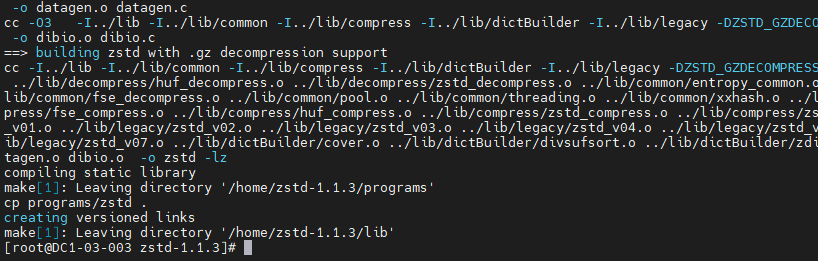

- Install zstd.

```
make install
```

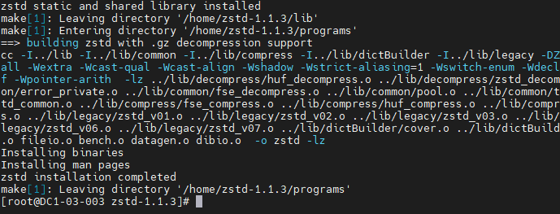

- Configure environment variables.

```
export LD_LIBRARY_PATH=$LD_LIBRARY_PATH:/usr/local/lib

export CPLUS_INCLUDE_PATH=$CPLUS_INCLUDE_PATH:/usr/local/include
```


### Installing CMake from Source Code

Note: The CMake version must be 3.5.1 or later. CMake 3.10.0 is recommended.

**Procedure**

- Go to the **/home** directory.

```
cd /home
```

- Obtain the source package.

```
wget https://github.com/Kitware/CMake/releases/download/v3.10.0/cmake-3.10.0.tar.gz
```

- Decompress the source package.

```
tar -zxvf cmake-3.10.0.tar.gz
```

- Go to the source package directory.

```
cd cmake-3.10.0
```

- Configure the build environment.

```
./bootstrap --prefix=/usr/local/cmake
```

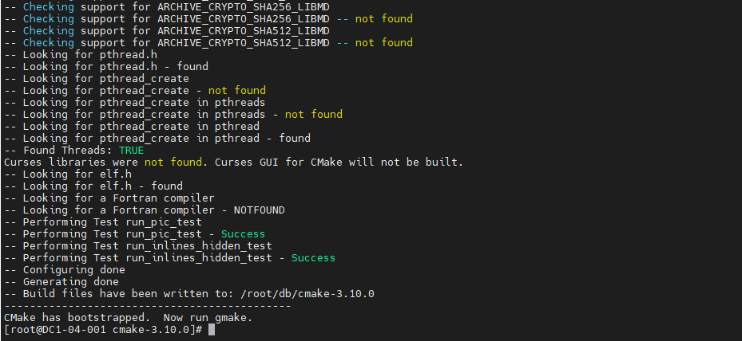

- Build CMake.

```
make -j8
```

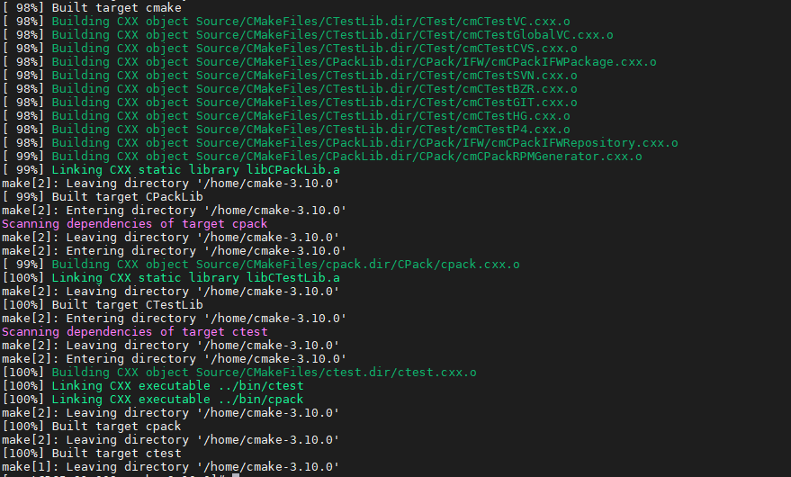

- Install CMake.

```
make install
```

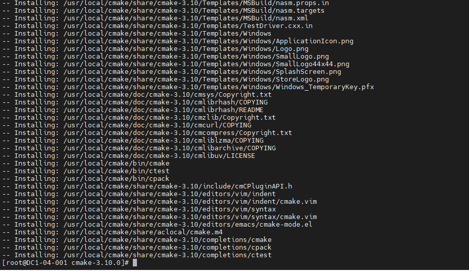

- Run the following command to set the CMake environment variable:

```
export PATH=$PATH:/usr/local/cmake/bin
```

- View the CMake version to check whether the installation is successful.

```
cmake --version
```

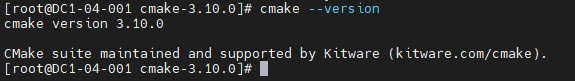

If the version is not 3.10.0, refer to "Troubleshooting" > "CMake Version Not Take Effect" in this blog.


### Installing gflags from Source Code

**Procedure**

- Go to the **/home** directory.

```
cd /home
```

- Obtain the source package and rename the package.

```
wget https://github.com/gflags/gflags/archive/v2.2.2.tar.gz
mv v2.2.2.tar.gz gflags-2.2.2.tar.gz
```

- Decompress the source package.

```
tar -zxvf gflags-2.2.2.tar.gz
```

- Go to the source package directory.

```
cd gflags-2.2.2
```

- Create a directory.

```
mkdir build/
```

- Go to the new directory.

```
cd build/
```

- Configure the build environment.

```
cmake -DBUILD_SHARED_LIBS=ON -DBUILD_STATIC_LIBS=ON -DINSTALL_HEADERS=ON -DINSTALL_SHARED_LIBS=ON -DINSTALL_STATIC_LIBS=ON ..
```

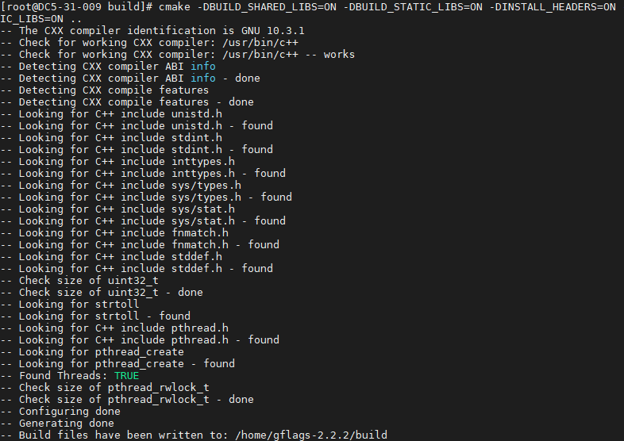

- Build gflags.

```
make -j8
```

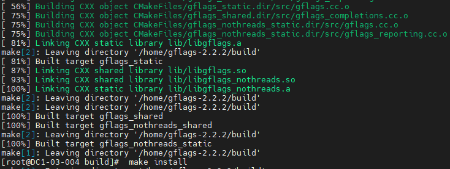

- Install gflags.

```
make install
```

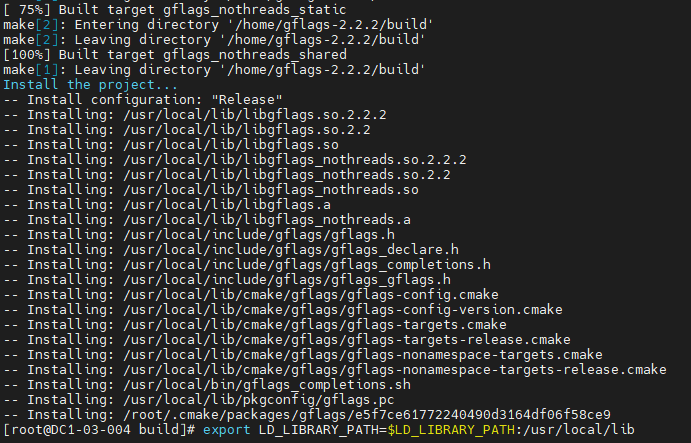

- Run the following commands to set the gflags environment variables:

```
export LD_LIBRARY_PATH=$LD_LIBRARY_PATH:/usr/local/lib
export CPLUS_INCLUDE_PATH=$CPLUS_INCLUDE_PATH:/usr/local/include/gflags
```


## Installing RocksDB from Source Code

**Procedure**

- Go to the **/home** directory.

```
cd /home/
```

- Obtain the source package and rename the package.

```
wget https://github.com/facebook/rocksdb/archive/refs/tags/v6.10.2.tar.gz
mv v6.10.2.tar.gz rocksdb-6.10.2.tar.gz
```

- Decompress the RocksDB installation package.

```
tar -zxvf rocksdb-6.10.2.tar.gz
```

- Go to the directory generated after decompression.

```
cd rocksdb-6.10.2/
```

- Modify the CMake build configuration file.

```
vim CMakeLists.txt
```

Note: If you perform the build based on the configuration file in the source package, during the generation of the benchmark tool, an error message is displayed indicating that the required static library is not found. To solve this problem, modify the **CMakeList.txt** configuration file. The procedure is as follows:

Add the following content to line 1186:

```
add_subdirectory(third-party/gtest-1.8.1/fused-src/gtest)
add_library(testharness STATIC
test_util/testharness.cc)
target_link_libraries(testharness gtest)
```

Before modification:

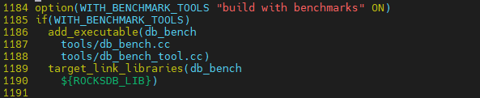

After modification:

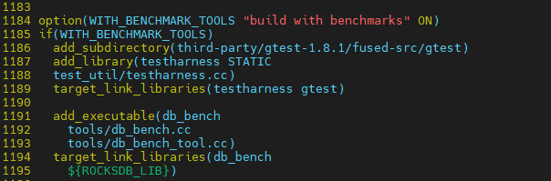

- Create a directory.

```
mkdir build
```

- Go to the new directory.

```
cd build
```

- Configure the build environment.

```
cmake -DCMAKE_INSTALL_PREFIX=/usr/local/rocksdb -DWITH_SNAPPY=1 -DWITH_ZLIB=1 -DWITH_LZ4=1 -DWITH_ZSTD=1 -DWITH_BZ2=1 ..
```

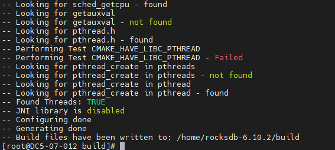

- Run the build command.

```
make -j8
```

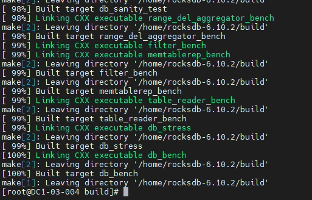


If the error message "Cannot allocate memory" is displayed, refer to "Troubleshooting" > "'Cannot allocate memory' Reported During RocksDB Building" in this blog.

- Run the installation command.

```
make install
```

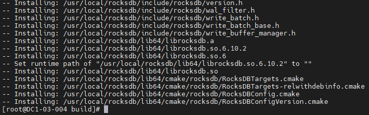

- Move the tool to the installation directory.

```
cp ../utilities/merge_operators.h
/usr/local/rocksdb/include/rocksdb/utilities/
mkdir -p /usr/local/rocksdb/tools
cp -p ./tools/ldb /usr/local/rocksdb/tools
cp -p ./tools/sst_dump /usr/local/rocksdb/tools
```

- View the installation directory.

```
ls /usr/local/rocksdb
```

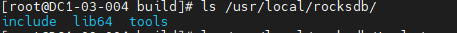

- Set environment variables.

```
export CPLUS_INCLUDE_PATH=$CPLUS_INCLUDE_PATH:/usr/local/rocksdb/include
export LD_LIBRARY_PATH=$LD_LIBRARY_PATH:/usr/local/rocksdb/lib64
export LIBRARY_PATH=$LIBRARY_PATH:/usr/local/rocksdb/lib64
export PATH=$PATH:/usr/local/rocksdb/tools
```


## Verifying the Get, Put, Delete, and Merge APIs

Notes:

- Use the ldb tool to verify the normal operations of the put, get, and delete APIs.

- Use code to verify the normal operations of the merge API.

### Put

- Create a database storage directory.

```
mkdir -p /home/rocksdb/rkdb1
```

- Add data.

```
ldb --db=/home/rocksdb/rkdb1 --create_if_missing put k1 v1
ldb --db=/home/rocksdb/rkdb1 put k2 v2
```

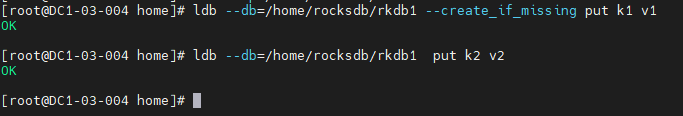

- View the execution result.

```
ldb --db=/home/rocksdb/rkdb1 scan
```

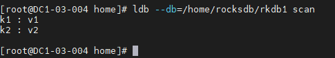


### Get

- Read data.

```
ldb --db=/home/rocksdb/rkdb1 get k1
ldb --db=/home/rocksdb/rkdb1 get k2
```

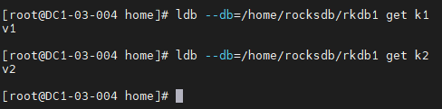

- View the execution result.

```
ldb --db=/home/rocksdb/rkdb1 scan
```

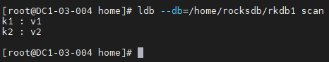


### Delete

- Delete data.

```
ldb --db=/home/rocksdb/rkdb1 scan
ldb --db=/home/rocksdb/rkdb1 delete k2
```

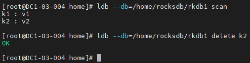

- View the execution result.

```
ldb --db=/home/rocksdb/rkdb1 scan
```

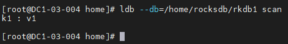


### Merge

- Go to the **/home** directory.

```
cd /home/
```

- Create a source code file.

```
vim rocksdb_test_merge.cpp
```

- Add code content.

```cpp
#include <iostream>

#include <vector>

#include <rocksdb/db.h>

#include <rocksdb/options.h>

#include <rocksdb/table.h>

#include <rocksdb/merge_operator.h>

#include <rocksdb/filter_policy.h>

#include <rocksdb/perf_context.h>

#include <rocksdb/iostats_context.h>

#include <rocksdb/trace_reader_writer.h>

#include "rocksdb/utilities/merge_operators.h"

using namespace rocksdb;

using namespace std;

int main()

{

DB* db;

Options options;

options.create_if_missing = true;

//no compression

options.compression = kNoCompression;

BlockBasedTableOptions table_options;

table_options.no_block_cache = true;

table_options.cache_index_and_filter_blocks = false;

options.table_factory.reset(NewBlockBasedTableFactory(table_options));

options.merge_operator =
MergeOperators::CreateStringAppendOperator();

Status s=rocksdb::DB:: Open(options,"/home/rocksdb/rkdb2",&db);

if(!s.ok()){

cout<<"open rocksdb failed:"<<s.ToString()<<endl;

delete db;

exit(-1);

}

cout<<"open rocksdb success!"<<endl;

//Merge operator

int j = 0;

string key = to_string(j);

string value;

char buf[8];

//EncodeFixed64(buf,2);

s = db->Merge(WriteOptions(),key,"1");

//need change

if(!s.ok()){

cout << "Merge value failed:" << s.ToString()<<endl;

delete db;

exit(-1);

}

s = db->Merge(WriteOptions(),key,"2");

db->Flush(FlushOptions());

if(!s.ok()){

cout << "Merge value failed:" << s.ToString()<<endl;

delete db;

exit(-1);

}

s = db->Get(ReadOptions(),key,&value);

if(!s.ok()){

cout << "Merge value failed:" << s.ToString()<<endl;

delete db;

exit(-1);

}

cout << "Get merge value: " << value << "\n value of size:" << value.size() << endl;
}
```


- Create a database directory.

```
mkdir -p /home/rocksdb/rkdb2
```

- Run the following command to build the code.

```
g++ -o rocksdb_test_merge --std=c++11 rocksdb_test_merge.cpp -lrocksdb -ldl
```

- Run the executable file.

```
./rocksdb_test_merge
```

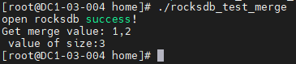

- Query data in the database.

```
ldb --db=/home/rocksdb/rkdb2 scan
```

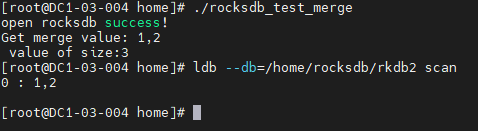


## Troubleshooting


### CMake Version Not Take Effect

- **Symptom**

 After CMake 3.10.0 is built and installed successfully, this version does not take effect. Another version number is displayed.

- **Key Process and Cause Analysis**

Another CMake version already exists in the environment and has a higher priority than CMake 3.10.0.

- **Conclusion and Solution**

  Check for CMake in the environment.

```
find / -name cmake | grep bin
```

  Check the CMake version.

```
/usr/bin/cmake --version
/usr/local/cmake/bin/cmake --version
```

  Make CMake 3.10.0 take effect.

```
cd /usr/bin/
mv cmake cmake-3.12.1
hash -r
cmake --version
```


### "Cannot allocate memory" Reported During RocksDB Building

- **Symptom**

The error message "Cannot allocate memory" is displayed during RocksDB building.

- **Key Process and Cause Analysis**

When **make -j** is executed, all CPU cores are used. As a result, the memory becomes insufficient.

- **Conclusion and Solution**

  Reconfigure the build environment.

```
rm -rf *
cmake -DCMAKE_INSTALL_PREFIX=/usr/local/rocksdb -DWITH_SNAPPY=1 -DWITH_ZLIB=1 -DWITH_LZ4=1 -DWITH_ZSTD=1 -DWITH_BZ2=1 ..
```

  Check the number of CPU cores.

```
lscpu
```

  Run the build command again (to reduce the number of CPU cores to be used).

```
make -j8
```
