# etcd-3.76 Porting Guide (openEuler 22.03 LTS)

## Overview

etcd is a strongly consistent, distributed key-value storage service that provides a reliable way to store data that needs to be accessed by a distributed system or cluster of machines. It can gracefully handle leader elections during network partitioning and can tolerate machine failures even on the leader node.

Programming language: C++

Brief description: Distributed storage for shared configuration and service discovery.

Recommended version: etcd-3.76

## Environment Requirements

### Hardware Requirements

| Item        | Description                                    |
| ----------- | ---------------------------------------------- |
| Server      | TaiShan 200 server (model 2280)                |
| Processor   | Kunpeng 920 5250                               |
| Memory size | 16 x 32 GB 2666 MHz                            |
| NIC         | 1 x 10GE                                       |
| Disk        | OS: 2 x 900 GB SAS; DATA: 3.2 TB 1 x ES3000 V3 |

 

### OS and Software Requirements

| Item      | Version             |
| --------- | ------------------- |
| openEuler | openEuler 22.03 LTS |


## Installation and Uninstallation Based on Source Code Compilation


### Disabling the Firewall

Note: In the test environment, the firewall is disabled to avoid the network impact. Configure the firewall based on actual requirements.

- Stop the firewall.

```
systemctl stop firewalld.service
```

- Disable the firewall.

```
systemctl disable firewalld.service
```

- Check the firewall.

```
systemctl status firewalld.service
```

### Installing Dependencies

- Configure the Yum source and install the basic dependencies.

```
yum -y install git gcc gcc-c++ vim*
```

### Installing Go

- Download the Go source package. In this example, the source package is saved in the **/home** directory.

```
wget https://dl.google.com/go/go1.17.7.linux-arm64.tar.gz
```

- Decompress the package.

```
tar -zxvf go1.17.7.linux-arm64.tar.gz -C /usr/local
```

- Configure environment variables.

```
vim /etc/profile
```

- Add the following configurations to the end of the **/etc/profile** file and type **:wq** to save the file.

```
export GOROOT=/usr/local/go
export PATH=$PATH:$GOROOT/bin
```

- Make the environment variables take effect.

```
source /etc/profile
```

- View the installation path.

```
ls /usr/local/go
```

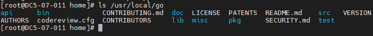

- View the version.

```
go version
```

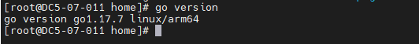

### Installing etcd by Compiling Source Code

- Download the etcd source package. In this example, the source package is saved in the **/home/** directory.

```
wget https://codeload.github.com/etcd-io/etcd/tar.gz/refs/tags/v3.1.20
mv v3.1.20 etcd-3.1.20.tar.gz
```

- Decompress the file.

```
tar -zxvf etcd-3.1.20.tar.gz
```

- Configure environment variables.

```
vim /etc/profile
```

Add the following configurations to the end of the **/etc/profile** file and type **:wq** to save the file. etcd uses V2 by default but V3 APIs are required here.

```
export ETCDCTL_API=3
export ETCD_UNSUPPORTED_ARCH=arm64
```

- Make the environment variables take effect.

```
source /etc/profile
```

- Perform compilation.

```
cd etcd-3.1.20
./build
```

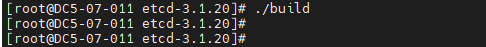

- Search for the installation path. After the compilation is successful, two executable files **etcd** and **etcdctl** are generated in the <div class="+ topic/ph sw-d/filepath " id="filepath770511318198">etcd-3.1.20/bin</div> directory.


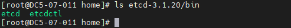


- Modify the installation path. Copy the **bin** directory and **etcd.conf.yml.sample** file in the **etcd-3.1.20** folder to the **/usr/loca/etcd** directory and check the path.

```
mkdir -p /usr/local/etcd/conf
cp -r /home/etcd-3.1.20/bin /usr/local/etcd
cp -r /home/etcd-3.1.20/etcd.conf.yml.sample /usr/local/etcd/conf/etcd.conf
ls /usr/local/etcd
```

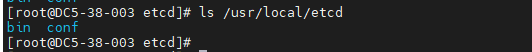

### Verifying etcd

- Start etcd.

  Foreground running:

```
cd /usr/local/etcd/bin
./etcd
```

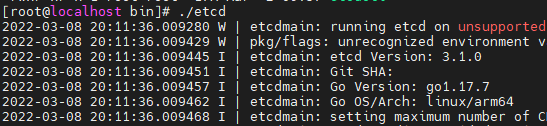

- Background running:


```
cd /usr/local/etcd/bin
nohup ./etcd >./nohup.out 2>&1 &
```

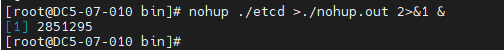

- Verify the inserted data.

```
./etcdctl put key "etcd"
```

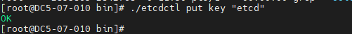

- Delete the data.

```
./etcdctl del key
```

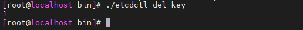

- Check for the data.

```
./etcdctl get key
```

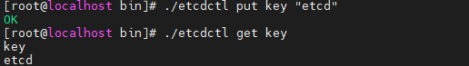

- Change the data. Run the **put** command to change the data.

```
./etcdctl put key "world"
```

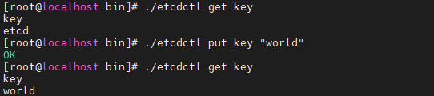

- Exit the data.

  Exit from the foreground.

```
Ctrl+c
```

Exit from the background: Search for the etcd process ID and stop the process, or directly stop the etcd process.

```
ps -ef | grep etcd
kill -9 197152
```

Alternatively:

```
pkill -9 etcd
```

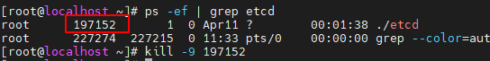

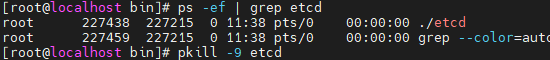

### Uninstalling etcd

- Uninstall etcd. If etcd is running, directly stop it.

```
pkill -9 etcd
```

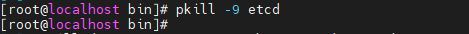

- Delete the directories. During source code compilation and installation, only related files are generated. Therefore, you can directly delete the corresponding directories.

```
cd /usr/local
rm -rf etcd/
ls /usr/local/etcd
```

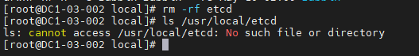


## Troubleshooting

### Error of "Not a git repository"

- Symptom


​	The error message "Not a git repository" is displayed during the compilation.

- Key Process and Cause Analysis


​	Git is not initialized.

- Conclusion and Solution


Initialize git and then perform the compilation again.

```
git init
./build
```

### Error of "no required module provides package"

- Symptom


The error message "no required module provides package github.com/coreos/etcd/cmd/etcd: go.mod file not found" is displayed during the compilation.

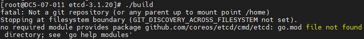

- Key Process and Cause Analysis


The **GO111MODULE** module is not enabled.

- Conclusion and Solution


Run the following command:

```
go env -w GO111MODULE=auto
```

### Error of "Needed a single revision"

- Symptom


The error message "fatal: Needed a single revision" is displayed during the compilation.

- Key Process and Cause Analysis


During the etcd compilation, the local code is compared with the remote code. When the **build** script is executed, it stops.

- Conclusion and Solution


Modify the **build** script, comment out lines 9 to 12, and type **:wq** to save the modification and exit.

```
cd etcd-3.1.20
vim build
```

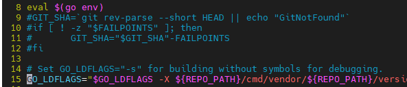

3.  Perform the compilation again.

```
./build
```

## Change History

| Date     | Description                               |
| -------- | ----------------------------------------- |
| 2023-2-9 | This issue is the first official release. |

-----------------------------------------------------------------------
