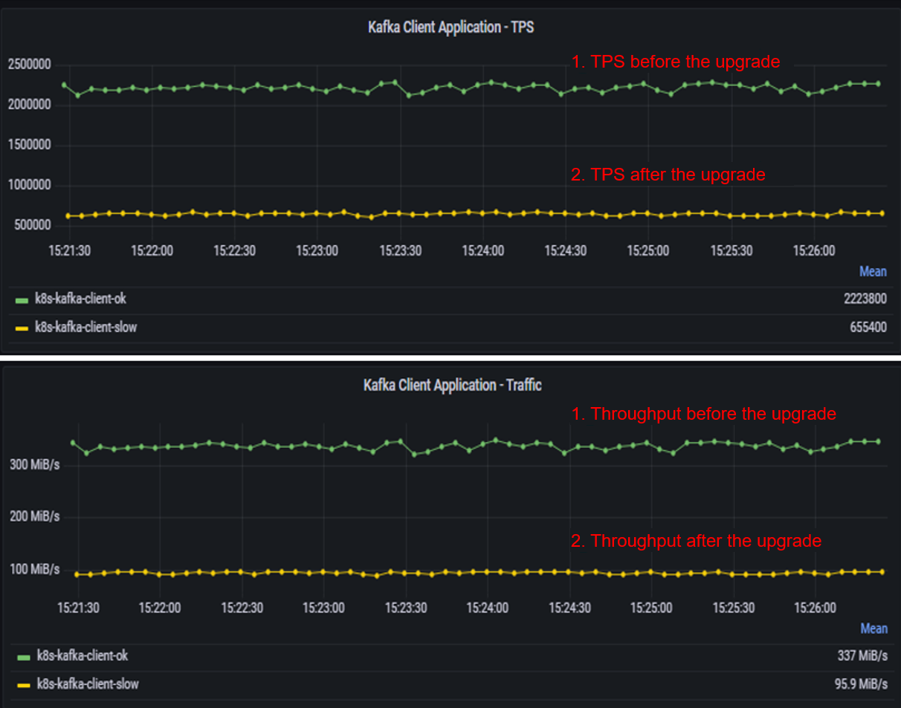
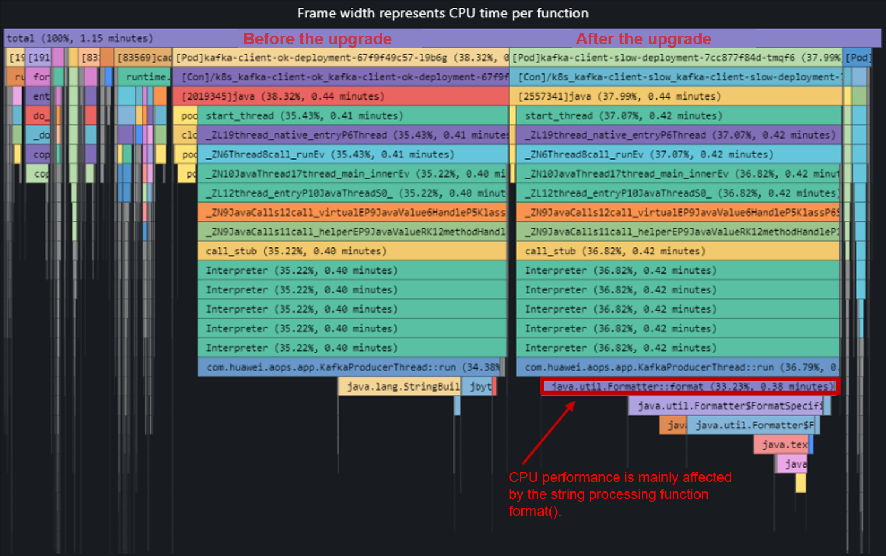
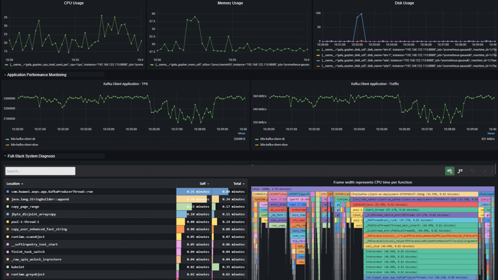
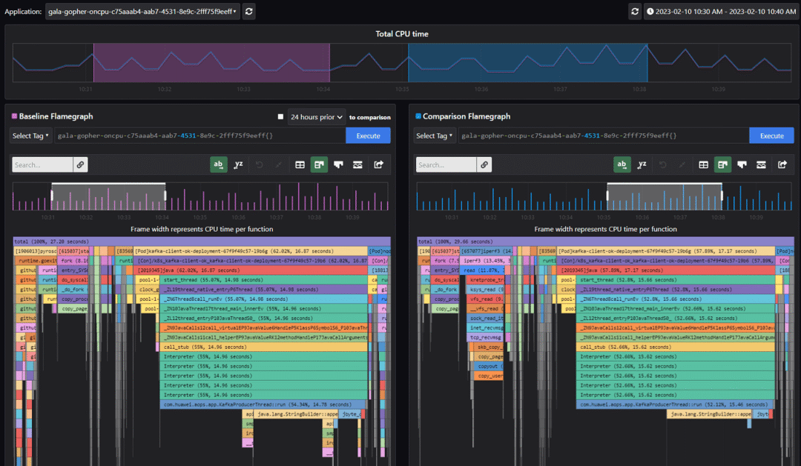
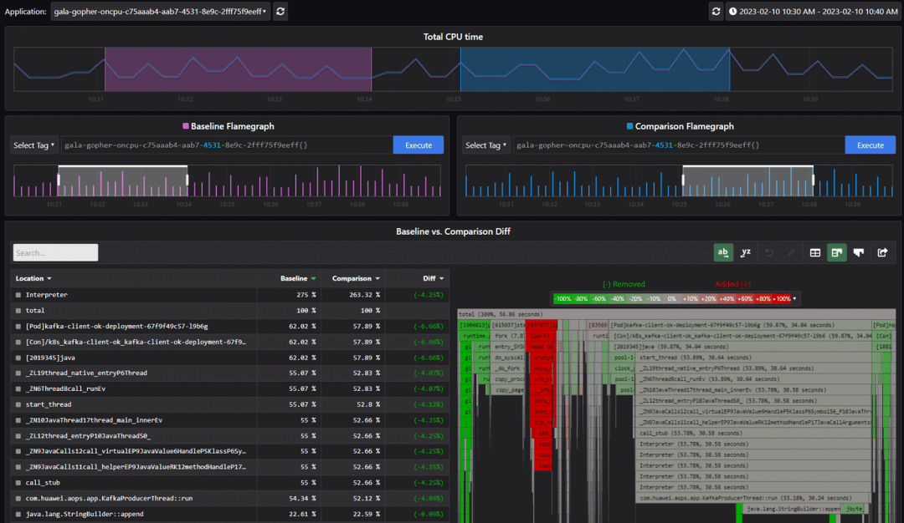

This article describes two performance diagnosis cases based on A-Ops flame graphs to show how to use flame graphs to quickly locate system or application performance issues.

**Case 1** **Diagnosis of Java Application Performance Issues in Cloud Native Scenarios**

**1. Scenario and Case Overview**

After a Java Kafka producer is upgraded, its performance decreases from 2.22 million TPS to 655 thousand TPS, and the throughput decreases from 337 MiB/s to 95.9 MiB/s, as shown in the following figure. (To facilitate comparison, applications before and after the upgrade are started in different pods.)

The performance of the Kafka client application deteriorates significantly. However, the Kafka server is lightly loaded, with 0.7% CPU usage and 16.8% memory usage. This indicates that the performance deterioration is caused by client application problems.  

**2. Performance Issue Diagnosis**

According to the comparison between the flame graphs before and after the upgrade, the CPU performance after the upgrade is mainly affected by the string processing function format(). A large number of string operations are performed on a Kafka producer. However, the performance of format() is low, which is several times or even dozens of times lower than that of the StringBuilder method. Therefore, the format function is the main cause of performance deterioration.

**Case 2** **Diagnosis of CPU Jitter Issues**

**1. Scenario and Case Overview**

CPU jitter issues occasionally occur in the production environment, which affects application performance. However, it is difficult to detect and locate such faults because there is no necessary rule of occurrence.

**2. Performance Issue Diagnosis**

To simulate the preceding occasional faults, we use iPerf to inject fault traffic for two minutes, analyze the flame graphs before and after the fault injection from multiple perspectives, and then diagnose CPU jitter faults.

Use iPerf3 to inject traffic. The command is as follows:

`iperf3 -c 192.168.122.115 -p 5201 -i 10 -t 120 -P 100 -N -M 100 -b 10000M`

The following figure shows the system application indicators and flame graphs before and after traffic injection.

During traffic injection, the CPU usage increases from 22% to 33%, and the application performance decreases from 2.32 million TPS to 2.15 million TPS. In the flame graph, the CPU usage of the iperf3 process is 8.96%.

We can further analyze this fault through the flame graph comparison view. The flame graph on the left is the flame graph before the fault is injected, and the flame graph on the right is the flame graph during the fault injection. We can see that the iperf3 process is added during the fault injection.

In addition, the flame graph diff view can be used. As shown in the following figure, the red part in the flame graph indicates the processes added during fault injection. It shows that iPerf3 is the root cause of CPU jitter and application performance deterioration.

With A-Ops hotspot flame graphs, developers and maintainers can easily predict potential problems and locate problems that have occurred.

**Installing the A-Ops Tool**

gala-ops is an application-level or system-level online diagnosis tool for gray faults in cloud infrastructure. A flame graph probe **stackprobe** is integrated into the gala-gopher component of the tool. You only need to install gala-gopher with several clicks, and then enable the flame graph probe in the configuration file.

A-Ops installation and deployment guide:

[https://gitee.com/Vchanger/a-ops-tools#a-ops-tools](https://gitee.com/Vchanger/a-ops-tools#a-ops-tools)

gala-gopher installation and deployment guide:

[https://gitee.com/openeuler/gala-gopher](https://gitee.com/openeuler/gala-gopher)

We welcome you to use the A-Ops tool and provide comments and suggestions to help optimize it.
