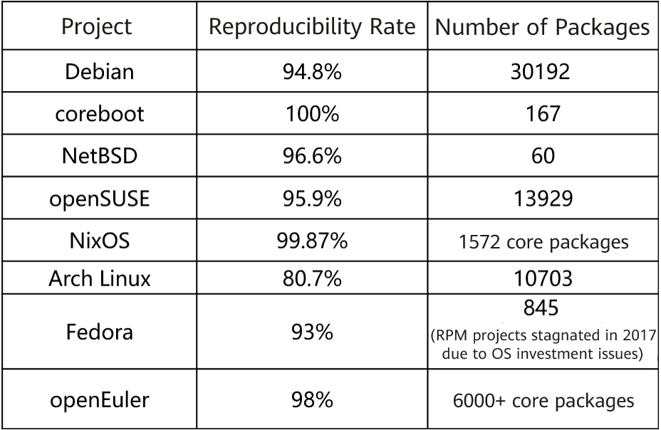

Reproducible builds are a set of software development practices that safeguard the software supply chain. It has been included in SupplyChainSecurityCon's topics and Microsoft's Secure Supply Chain Consumption Framework (S2C2F) in 2022, and has been sponsored by Google open source security team. OpenSSF and SLSA also have requirements for reproducible builds in software supply chain integrity and package management best practices.  

In 2022, preliminary reproducible build capabilities are available on openEuler.  

# What Are Reproducible Builds

A build is reproducible if given the same source code, build environment, and build instructions. Any party can re-create bit-by-bit identical copies of all specified artifacts.

# Purpose and Significance of Reproducible Builds

Reproducible builds allow verification that no backdoors have been introduced in binary files, so as to avoid potential security risks and ensure quality of the binary files. The build environment and build project can be restored to minimize dependency changes and streamline tests, facilitating fault locating and improving development efficiency.  

Reproducible builds enable an independently verifiable path from source to binary code. With existing technologies such as code signing, repository signing, and secure boot, the entire process from production to use of open-source code can be traced.  

**Causes of Build Differences**

During code build from the source code to a binary package, differences may be introduced and gradually amplified in each step and through each build tool. As a result, the final binary package of each build from the same source code differs.  

>

Amplified binary differences

There are many factors that cause build differences, including the build environment, timestamp, random number, and file disorder. Although a digital signature can prove the uniqueness of source code and a binary file, it cannot prove the consistency of the mapping between source code and the binary file, which involves enormous workloads and complex technologies. The following figure shows the factors that may cause differences during each build phase.  

>

# Communities Related to Reproducible Builds

Reproducible builds are not new. Since 1992, tools have been available in the GNU Toolchain to provide initial support for reproducible builds. In 2000, Debian developers proposed a technical topic on the impact of embedded timestamps on reproducible builds, and began conceive of full support for reproducible builds in the Debian project in 2007. In Debian 11 released in 2022, 94.8% packages are reproducible (AMD64, 31500 packages).

Up to now, a considerable number of communities have joined to implement reproducible builds. Major communities include Debian, Arch Linux, coreboot, FreeBSD, NetBSD, and OpenWrt.

The openEuler community has been committed to reproducible builds since 2022, in cooperation with communities such as openSUSE and Yocto Project.

>

The following table lists the package reproducibility rate of each community.

>

There are tools in these communities for developers to achieve the goal of reproducible builds.

>

In addition to the preceding tools, the Reproducible Builds community promotes other open source communities to support reproducible builds. For example, the Reproducible Builds community encourages GNU to add compilation options to eliminate file path differences, and promotes a series of packaging software to eliminate file sequence differences. Reproducible build capabilities are also preconfigured in some package managers in various build frameworks, such as npm/yarn, pipenv/poetry, Go module, Cargo, and Bazel, and in Microsoft's .NET framework as well.

# openEuler's Solution to Reproducible Builds

In the current solution of openEuler, two RPM packages are generated after two builds and then compared. During the build process, the open-source tool **libfaketime** is used to eliminate differences. After the two builds are complete, the two generated RPM packages are compared. If inconsistent, the RPM packages are decompressed for further comparison at the file level, and a difference report is output.

>

To achieve reproducible builds, two conditions must be met.

1. Build system consistency. The dates and time of the two builds must be the same (or time information removed) and the file sequences are the same.
2. The instruction set and build tools used in each build must be consistent or recorded.

The openEuler's solution involves three major methods.
1. Uses libfaketime to eliminate differences. This tool leverages a Linux environment variable, **LD_PRELOAD**, that can affect the runtime linker of a program. This variable replaces the .so file provided by the Linux system with user-defined functions (such as time(), gethostname(), random(), and rand()) in a user dynamic library to ensure that the time, host name, and random numbers obtained during each build are consistent.

>

Principles of the difference elimination tool

By using this tool, product source code does not need to be modified, thereby reducing the investment in code correction. The differences generated by commercial and open source tools are eliminated without modifying any code. In addition, the semantics of timestamps are saved to the maximum extent. This tool can be disabled using commands in the "unset LD_PRELOAD" format.  

In addition to the native functions of libfaketime, we added a precise blocklist and allowlist mechanism to solve build failure problems caused by libfaketime. Besides, we optimized the function of eliminating differences among random number generation methods, and added replacements for the random(), rand(), /dev/random, and /dev/urandom methods.  

2. Uses an automatic unpacking and comparison tool, **unpacker**, to accurately analyze file-level differences and output visualized difference reports. This tool compares the MD5 values of the two RPM packages. If the values are the same, the build is reproducible. If the values are inconsistent, this tool decompresses the two RPM packages. If the MD5 values of all files decompressed from the two RPM packages are consistent, the build is reproducible. Otherwise, the **diffoscope** tool is used to generate a difference report. The unpacker extracts the RSA and PGP signature files from the RPM packages and does not regard the signature file differences as RPM differences.  

>

Principles of the unpacking and comparison tool

>

Difference report sample

3. After the RPM package comparison is complete, the comparison result and difference report are archived, which can be viewed and managed on the reproducible build website of openEuler.

>

In 2022, we had compared the reproducible build results of 1800+ core openEuler code repositories in ARM and x86 environments, involving 6000+ software packages. The reproducibility rate reaches 98%. This year, we expand the reproducible build scope to the Everything edition of openEuler 22.09. We have successfully implemented reproducible builds in 4130 code repositories, involving 14,000+ software packages. The reproducibility rate reaches about 94%. According to preliminary analysis, many code repositories are non-reproducible due to HTML file differences in the RPM packages.

# openEuler's Plan for Reproducible Builds

1. Analyze the causes of non-reproducible code repositories, provide solutions, and incorporate the solutions to the upstream communities.

2. Replace OBS with EulerMaker to avoid build failures caused by libfaketime and implement reproduction of the build process using metadata at any time.

3. Gradually improve the reproducibility rate of openEuler code repositories, and achieve a repeatability rate of over 98% in code repositories of the Everything edition.

4. Replicate reproducible build capabilities for partners.
