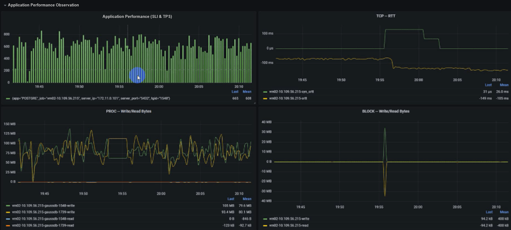
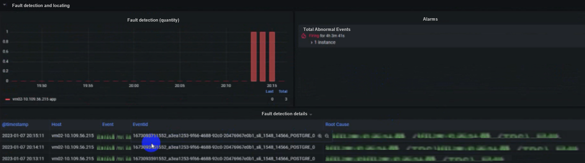
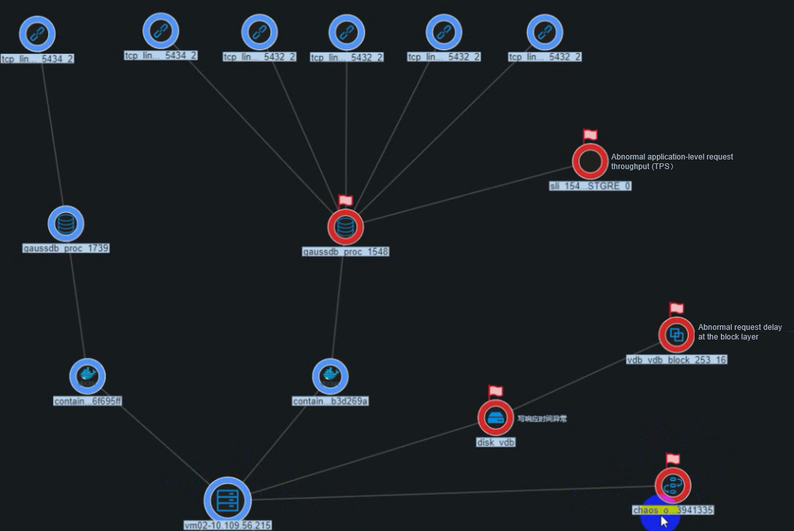
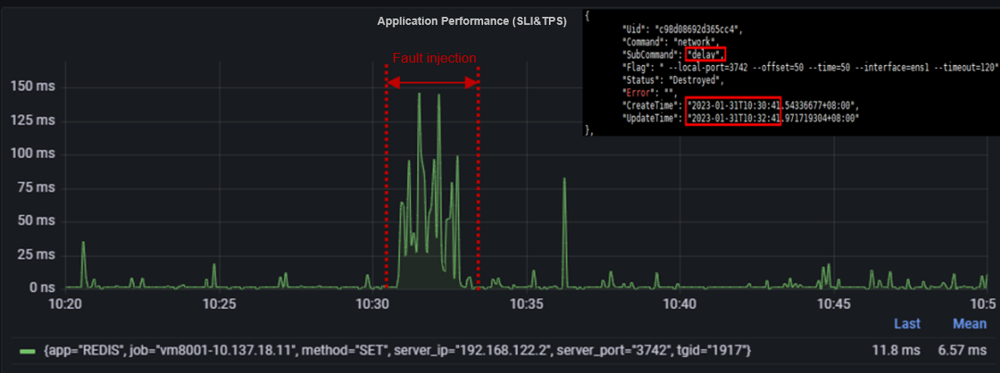
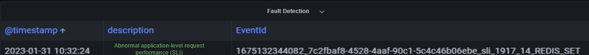
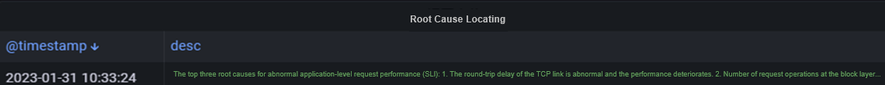
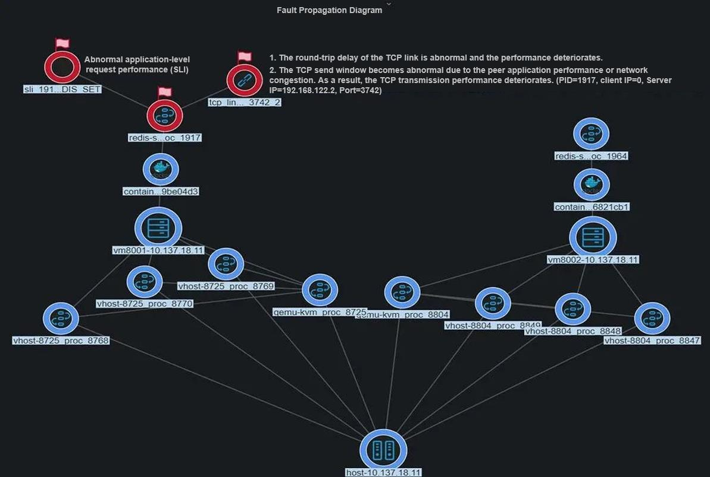

In database scenarios, excessive I/O bandwidth consumption by certain OS process operations, such as disk and network operations, can lead to a decline in application performance. This presents a significant challenge for O&M personnel who need to quickly and accurately diagnose, demarcate, and locate performance issues.  

# Case 1: Online Diagnosis of a Disk I/O Fault on a GaussDB Application

This case is simulated by injecting a disk I/O fault into a GaussDB application.

## Before Fault Injection

The following figure shows the real-time application topology. The GaussDB application contains one master (process ID: 1548) and one slaver (process ID: 1739), which are running on VM02.
The master has five client TCP connections.  

Now, the GaussDB application performance is shown in the following figure, on which you can see that the average TPS is 600.  

## Fault Injection

Run the **blade create disk burn --read --write --path /data --timeout 120** command to inject a disk read/write fault to the GaussDB data directory.
 

## Application Performance Diagnosis

After fault injection, the application performance deteriorates from about 600 TPS to 60 TPS (nearly 10 times), as shown in the following figure.  

The fault detection and locating result is as follows. On the figure, you can see that an application performance deterioration event has been generated and it is caused by abnormal read/write response.  

The figure below illustrates the propagation of faults. The application performance deteriorates due to abnormal disk write response and abnormal request delay at the block layer. These issues are further compounded by the chaos caused by the fault injection tool (process ID: 3941335), leading to disk exceptions.

# Case 2: Online Diagnosis of a Network Delay Fault on a Redis Application

## Fault Injection

Use the fault injection tool ChaosBlade to inject a 2-minute network delay fault by running the **blade create network delay --time 50 --offset 50 --interface ens1 --local-port 3742 --timeout 120** command.
 
3742 \--timeout 120

During fault injection, the Redis SRI metric shows an obvious deterioration (from 10 ms to 80 ms).

## Application Performance Diagnosis

The fault detection and locating result is as follows. On the figure, you can see that an application performance deterioration event has been generated and it is caused by abnormal network delay.

The figure below illustrates the propagation of faults. It also shows that the application performance deterioration is caused by abnormal network delay.

