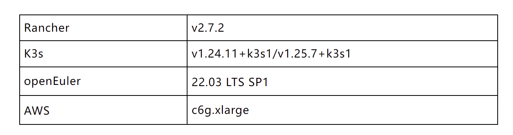
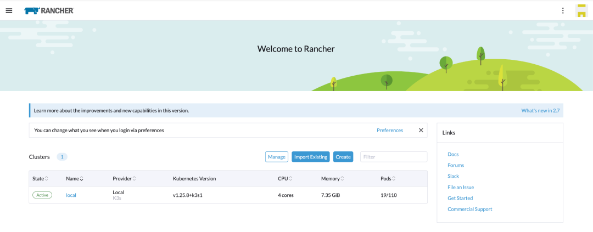
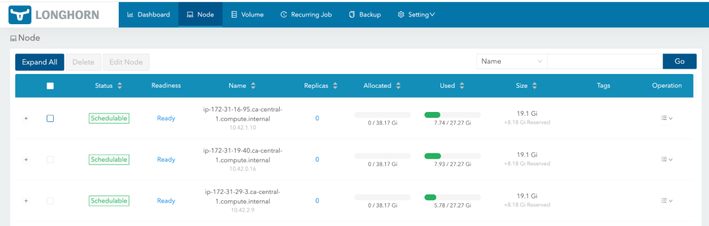

K3s is a lightweight Kubernetes distribution certified by Cloud Native Computing Foundation (CNCF). It has a wide range of installations around the world and is mainly maintained by SUSE engineers in the open source community. K3s can be deployed independently. It can be managed by the Kubernetes management software Rancher. The SUSE Chinese team cooperates with the openEuler community to promote compatibility between related products, such as Rancher and K3s, and openEuler OS through RFO SIG.  

Rancher v2.7.2 has many major updates, for example, enhanced management of the K3s ARM64 cluster. Users can create a K3s ARM64 cluster through the Rancher configuration and use Rancher to manage the life cycle of the cluster. In addition, the RFO SIG ensures the compatibility with openEuler.  

**Preparing the ARM64 Environment**

The software environment used in this document is as follows. The AWS cloud environment is used to demonstrate related product capabilities.  

Note: AWS openEuler AMI is built on the openEuler KVM image and has built-in AWS drivers. The AMI is maintained by the RFO SIG. The software in the table supports the ARM64 architecture.

# Deploying the Rancher Management Plane

Using AWS to create an ARM64 environment is easy. openEuler AMI can be used to create EC2 instances. The c6g.xlarge flavor can meet the deployment requirements of Rancher. The Rancher management plane needs to be deployed in Kubernetes. To quickly start the deployment, you are advised to use the local cluster with K3s as the management plane and install Rancher through Helm.  

The Rancher management plane can work properly in the openEuler ARM64 environment. After the startup is complete, enter the RancherForFun password to enter the UI management mode.  

# Creating an Elastic K3s Cluster

Rancher is embedded with the AWS EC2 driver and can quickly create EC2 instances based on the expected AMI, allowing Rancher to create elastic K3s clusters that are compatible with the openEuler ARM64 environment. As shown in the following figure, a K3s cluster consists of one ALL Roles node and one worker node. openEuler 22.03 AMI is used to configure bidding instances to minimize the cost. The K3s cluster version can be v1.24.11+k3s1.  

If cluster resources are insufficient, you can add worker nodes on the UI. Based on your settings, Rancher uses the built-in EC2 driver to create a new ARM64 instance and automatically deploys the K3s program. In addition, Rancher can access the SSH shell of a node through the UI.  

# Enhancing the Service Capability of the K3s Cluster

During routine maintenance and management, you need to periodically back up the K3s cluster. The backup can be executed automatically and manually. Rancher saves data at backup points. You can restore data based on a backup.  

The upgrade for K3s is also very simple. You only need to edit the cluster on the UI and select the version to be updated. For example, you can upgrade K3s from v1.24.11+k3s1 to 1.25.7+k3s1.  

Rancher has built-in cluster tools to extend the service capabilities of downstream clusters. Some tools, such as distributed storage components Longhorn, monitoring, and logs, are already compatible with ARM64 and verified on openEuler OS.  

If a K3s cluster is no longer needed, you can delete it from Rancher. The associated EC2 instances will also be deleted.  

# Continuous Product-based Connection

RFO SIG continuously ensures compatibility between Rancher and openEuler through engineering methods. K3s ARM64 scenario management is also a popular function in the community. In addition, Rancher has an optimal plug-in mechanism, which facilitates the expansion of various cloud drivers and access to openEuler in various cloud environments. In a non-cloud environment, you can also flexibly configure it on an existing openEuler host. The combination of openEuler as the infrastructure OS and Rancher can quickly establish a product-based container management platform and support AMD64 and ARM64 environments.  
