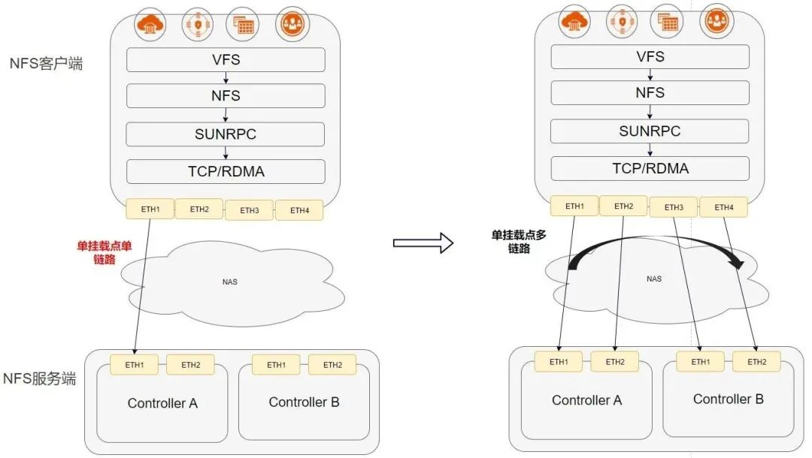
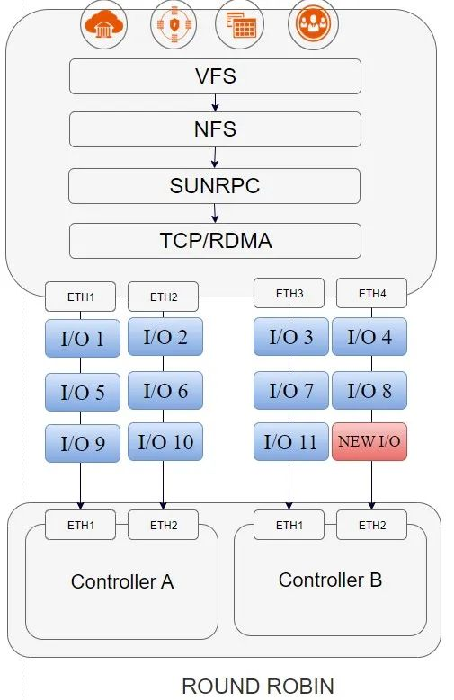

On April 21, the NFS+ protocol was released at openEuler Developer Day 2023, improving the reliability of single-client access to NAS storage by three times, and performance by six times. This move aims to help NAS storage fully meet the strict requirements of new core production scenarios.

# Challenges Faced by Traditional NFS

The network file system (NFS) is a distributed file system protocol developed by Sun Microsystems (Sun) in 1984. It allows users on clients to access data in file systems on servers over the network. Because of its simple configuration and user-friendly nature, NFS has gained widespread use in various applications such as financial data exchange platforms, electronic design automation (EDA) simulation, CDRs, and check images. With the emergence of diverse application scenarios, the importance of data is increasing, various industries put forward higher requirements for the reliability and performance of NAS storage. Traditional NFS specifies only one server IP address for a single mount point, which faces the following challenges:

First, when a network port or link is faulty, the mount point cannot be accessed suspending service I/Os and compromising reliability.  

Second, NAS storage is deployed in the public zone, and accessing it from the host requires crossing three layers of networking. If one end is faulty, the IP address cannot detect the fault. Currently, file systems are manually mounted depending on the application layer, and active-active links cannot be automatically switched over.  

Third, the performance of a mount point is limited by the performance of a physical link, posing challenges on the performance of important services.

# Working Principle of the openEuler-based NFS Multipathing

The NAS storage for production adopts the NFS protocol, requiring end-to-end fault solutions from clients to servers and high-performance data sharing capabilities beyond the local file system. For example, the client side requires strong link reliability and high concurrency performance. Conversely, the server side requires permission and resource control, disaster recovery, security, and other capabilities. To clarify, on the client side, it's crucial to prioritize strong link reliability and high concurrency performance. Conversely, on the server side, key priorities include permission and resource control, disaster recovery, as well as security measures and other necessary capabilities.  

To address these challenges, openEuler launches the new NFS+ protocol. The NFS+ protocol is a driver module running in the openEuler OS kernel. It consists of the parameter management module mounted at the NFS protocol layer and the multipathing management module at the transport layer. NFS+ specifies multiple local and server IP addresses to establish multiple TCP/RDMA links for different IP addresses, achieving functions such as multi-path link setup, fault recovery and failover, and load balancing.

**The NFS+ Protocol Improving NAS Performance and Reliability**

The NFS+ protocol does not change the data plane of the OS and occupies no host CPU resource. It only adds the multipathing function to the control plane to implement second-level automatic failover upon controller, device, and site faults. In this way, the NAS storage access performance is improved by six times, and the reliability is improved by three times.  

## Fault Failover and Recovery

The NFS+ protocol automatically detects link faults, degrades and isolates faulty links, and uses the industry's first automatic failover of active-active path on the three-layer network. When the lower-layer storage fails or host I/O times out, the cross-site active-active service is switched over automatically, addressing cross-engine failures and host awareness issues.  

-   Failover: When the NFS+ protocol detects a link fault, it automatically switches I/Os to other available links, making I/Os unaware of link faults.  

-   Recovery: The NFS+ protocol can automatically detect the link status. After faults of one link are rectified, I/Os are automatically delivered to the link again.  

## Link Load Balancing

NFS+ improves the concurrent access capability of hosts through the NIC port/multi-NIC/multi-node aggregation. The NFS+ protocol provides the basic Round Robin path selection algorithm for the NFSv3 protocol. This algorithm enables a single mount point to evenly deliver I/Os on multiple links, fully utilizing the capabilities of multiple physical links and improving the NFS performance of a mount point.  

## Customization for Optimal Path Algorithms

The NFS+ protocol provides vendor-defined APIs of path selection algorithms. Storage server vendors can customize their path selection algorithms as required to achieve optimal performance.

Facing new scenarios, services, and requirements, enterprises must promptly respond to changes in user requirements amidst intense market competition. openEuler will work with community partners and developers to continuously build a robust NAS ecosystem, enhance the NFS+ protocol's and NAS storage's performance and reliability, deliver high-performance NAS storage solutions that are easy to operate and maintain, and accelerate digital transformation.
