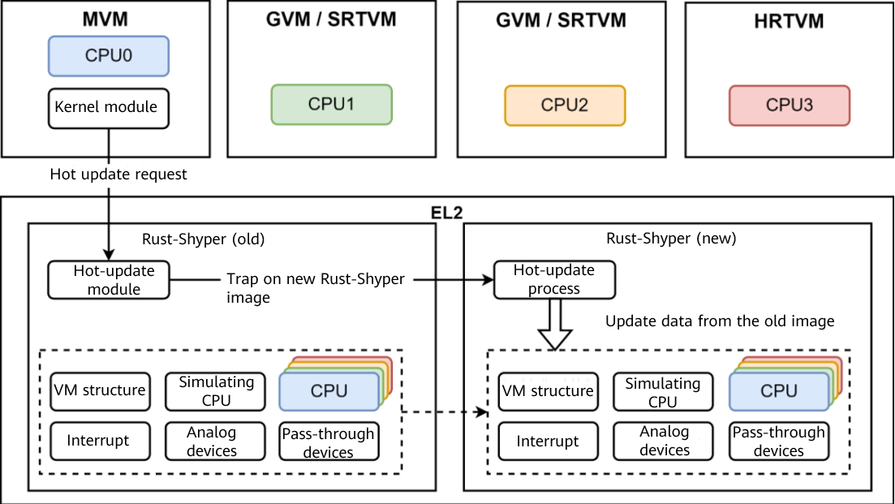

**「Rust-Shyper is a hypervisor designed and developed by Professor Wang Lei of the School of Computer Science and Engineering, Beihang University (BUAA). Rust-Shyper is a reliable embedded hypervisor built with Rust. On February 15, 2023, Rust-Shyper was officially open-sourced in the openEuler community.」**

You can find the project at [https://gitee.com/openeuler/rust_shyper](https://gitee.com/openeuler/rust_shyper)

Rust-Shyper is a **「Type-1」** hypervisor designed for embedded scenarios such as unmanned vehicles and robots. It is based on the AArch64 architecture and is compiled by **「Rust」**.  The design aims to improve resource utilization and ensure real-time performance, isolation, and memory security of VMs.  In addition, Rust-Shyper supports two hot update mechanisms: **「VM migration」** and **「hypervisor live-update」**. They can dynamically fix hypervisor software vulnerabilities without affecting the running of VMs. Currently, the system can run on the NVIDIA Jetson TX2, Raspberry Pi 4, and QEMU platforms, supporting real-time and non-real-time virtual machines, Linux, and RTOS.  

A keynote speech on the Rust-Shyper project was given on a the sub-forum related to embedded technologies at **「openEuler Developer Day 2023」** , with the theme of "Rust-based embedded hypervisor and hot update technologies". You can watch the video playback from the following link:  

[https://www.openeuler.org/zh/interaction/summit-list/devday2023/](https://www.openeuler.org/zh/interaction/summit-list/devday2023/)  (The topic starts from 00:49:38 on the embedded forum on the 21st.)  

## Embedded Virtualization Challenges

With the continuous development of the Internet of Things, modern embedded systems are evolving towards universal systems and hybrid critical systems. Tasks carried by the embedded systems usually require different reliability, real-time performance, and verification levels. How to ensure isolation and real-time performance between different critical tasks becomes a challenge. Virtualization offers a resource isolation method that is crucial in addressing this issue. However, embedded virtualization also faces the following challenges:  

-   How to ensure **「isolation and security」** between VMs to prevent malicious attacks.

-   How to ensure communication efficiency and **「real-time performance」** between VMs to avoid delay or jitter.

-   How to ensure the **「stability and reliability of the Hypervisor」** to prevent faults.

## Design Concepts and Features of Rust-Shyper

1.  **「Memory security」**: The Rust language system and memory security model are used to ensure the memory security of the Hypervisor.  
    
2.  **「Strong isolation」**: Hardware-assisted virtualization is used to implement security isolation and fault isolation between VMs.

3.  **「Abundant device models」**: To improve resource utilization, multiple device models such as pass-through devices, mediation transfer, and full simulation are implemented.

4.  **「Real-time virtualization」**: Resource passthrough and real-time virtualization are implemented based on performance requirements.

5.  **「Hypervisor hot update」**: VM migration and hypervisor live update are implemented.

## Rust-Shyper Architecture and Functions

Rust-Shyper is a Type-1 hypervisor built on the AArch64 architecture. The entire structure consists of three layers:  

-   The bottom layer is the hardware layer, corresponding to the ARMv8 EL3 firmware layer.

-   The middle layer is the hypervisor layer, corresponding to the ARMv8 EL2 virtualization layer. This layer is also the privileged layer where the Rust-Shyper code is located.
    
-   The top layer is the VM layer, corresponding to ARMv8 EL1 and EL0.

To meet the requirements of embedded applications, Rust-Shyper provides differentiated virtualization services by providing different VM types, including management VM (MVM), guest VM (GVM), and real-time virtual machine (RTVM).  

## Rust-Shyper **「Hypervisor Hot Update」**

To improve the reliability of hypervisor in embedded scenarios, Rust-Shyper introduces the cross-hardware VM migration technology and local hot update technology.  

### VM Migration

The figure shows the VM migration process. Rust-Shyper implements VM migration between hardware platforms based on the pre-copy policy, which can be used for load balancing and error prevention.  

### Hypervisor Live-update

Rust-Shyper implements **「hypervisor live-update」**. The maximum delay and jitter of Rust-Shyper are lower than those of Jailhouse, greatly reducing hot update costs and meeting the real-time requirements of VMs. Rust-Shyper can be used for software version upgrade and error rectification.  

## Application Scenarios and Future Planning

-   Use Rust-Shyper to port the unmanned vehicle application of the NVIDIA Jetson TX2 hardware platform  (to be completed in May 2023).  
    
-   Apply Rust-Shyper to ROS and port robot applications.  
 
-   Research on the optimization of virtualization device models such as Virtio.  

-   Port Rust-Shyper on the RISC-V platform.  

## About Us

Wang Lei's team undertakes a number of scientific research projects, including the National Natural Science Foundation project, the 863 Program, and the Core Electronic Components, High-End Universal Chips, and Basic Software project. His team developed the C-language Shyper hypervisor based on the space-time partition isolation mechanism to meet the requirements of high reliability and strong real-time performance in hybrid key fields. The hypervisor has passed the EAL5+ certification. In addition, his team proposed an age-based evolutionary model for the Linux kernel based on the complex network theory to explain the formation mechanism of the OS network characteristics.