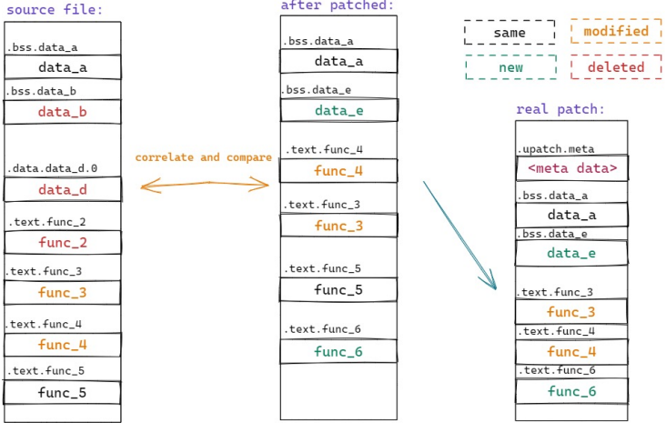
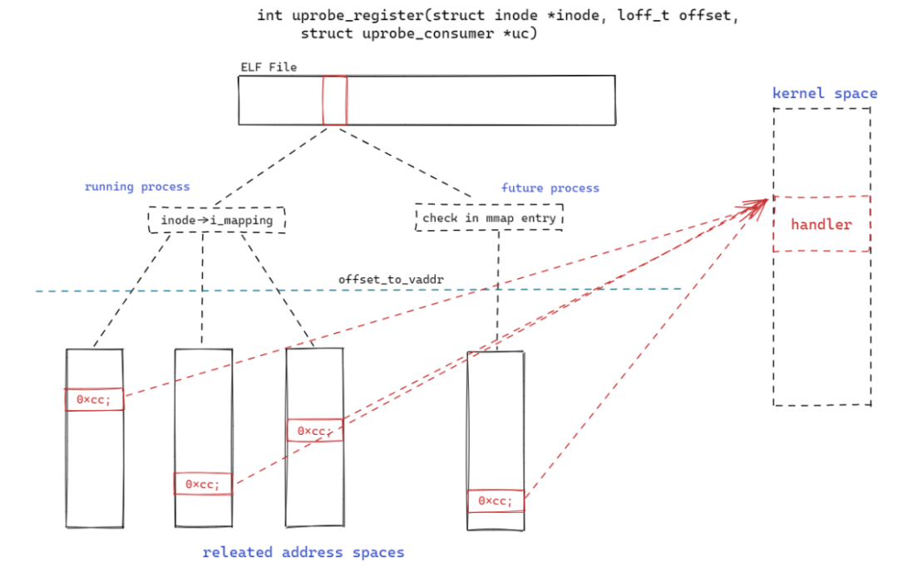
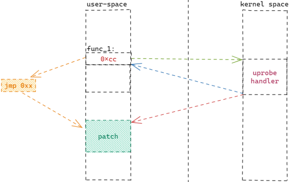

The openEuler community launched an innovative project: SysCare, a unified hot patch service for Linux distributions. This blog will briefly introduce SysCare to you.

## Introduction to SysCare

**[SysCare: I take care of your systems.]**

SysCare is an OS O&M tool that resolves various faults and risks during system running and provides comprehensive protection for Linux distributions.

SysCare provides a set of commands to create and manage kernel hot patches (kpatch) and userspace hot patches (upatch). You can fix system vulnerabilities online by running simple commands without focusing on technical details or system component differences, or migrating services.

As shown in the following figure, SysCare supports three-layer hot patches:

-   Underlying-layer kernel hot patches (kernel): including hot patches for all components and drivers.

-   Middle-layer system library hot patches (libs): including glibc, OpenSSL, Protobuf, etc.

-   Upper-layer application hot patches (apps): support for applications such as QEMU, Redis, and MySQL.

>

## Why SysCare

There is a long-standing problem in Linux, that is, how to quickly and reliably fix vulnerabilities and rectify faults without affecting services.

Currently, **hot patches** are commonly used. During service running, code-level repair is directly performed on faulty components without affecting services. However, it is quite complex to create a hot patch, which needs to be matched at code level and is difficult to manage. Besides, no simple and unified patch mechanism is available for diverse userspace components.

To solve this problem, SysCare is developed.

## Patch Creation Using SysCare

For kernel hot patches, relatively mature solutions such as kpatch and livepatch have been widely used. The following focuses on the implementation of SysCare for userspace hot patches.

### Difficulties Faced by Userspace Hot Patches

It is known that userspace hot patches face many difficulties:

-   **[Various programming languages]** The existing method of generating patches from assembly code cannot support multiple languages. The impact scope of code changes varies according to languages.

-   **[A single program file with multiple running instances]** To install a hot patch, you need to locate a specific process. However, the program may be not running. It is difficult to install a hot patch by monitoring whether a program file is being executed.

-   **[Dynamic libraries]** Dynamic libraries are loaded during process running, and the process, location, and time for loading cannot be determined in advance. Existing technologies do not support hot patch creation for a dynamic library.

-   **[Various compilation modes and program forms]** The compilation and linking procedures vary with programs. You need to trace the compilation procedure of each process to make the corresponding hot patch.

## SysCare Solution

SysCare provides new solutions for userspace hot patches.

**[Comparing Binary Compilation Target Files and Generating Hot Patches]**

By comparing the .o target files generated before and after code modification, SysCare extracts the changes to generate a hot patch. As shown in the following figure, SysCare compiles code before and after modification, compares the generated .o files (source file and file after being patched), and locates the changes: added data_e and func_6, modified func_4 and func_3, and deleted data_b, data_d, and func_2. These changes are extracted into an .o file (real patch).

>

**[Hijacking the Compiler and Tracing the Compilation Process]**

Through the uprobe technology, SysCare injects code into the compiler such as GCC, traces the entire program compilation process, and obtains the information required for making a hot patch and the .o target file during the compilation.

>

**[Hot Patches for ELF Files]**

The uprobe technology is used to bind hot patches to ELF files. When an ELF file is running, uprobe can trigger the patch to take effect. In this way, you do not need to monitor the process. No matter whether the process is running or not, you can make the patch take effect after the patch is installed or when a new process is running. In addition, this technology can be used to install hot patches for dynamic libraries. Such a patch takes effect as follows:

1.  Execute the uprobe system call and add an uprobe breakpoint at the function to be modified.

2.  Register the uprobe handler.

3.  Call the uprobe handler when the function is running.

4.  Map the patch to the address space of the current process.

5.  Perform security check. If the patch can be installed, change the first instruction of the function to the **jump** instruction, pointing to the patch address.
    
6.  Jump to the patch address for execution.

>

>

## Patch Management Using SysCare

SysCare simplifies patch management by shielding the differences between kernel hot patches and userspace hot patches. You can run the **build** command of SysCare to build a hot patch for a specified component.

In addition, SysCare provides patch management commands such as **apply**, **active**, **deactive**, **remove**, **status**, **info**, and **list** for applying, activating, deactivating, and removing patches, and querying the patch status, patch information, and patch list.

For details about how to use SysCare, visit [https://docs.openeuler.org/en/docs/22.03_LTS_SP1/docs/SysCare/using_SysCare.html](https://docs.openeuler.org/en/docs/22.03_LTS_SP1/docs/SysCare/using_SysCare.html).

## Project Planning

SysCare is first released on openEuler 22.03 LTS SP1 and will provide complete unified hot patch functions on openEuler 22.03 LTS SP2. SysCare can be used on x86 and ARM architectures and supports userspace and kernel hot patches.

The future planning of SysCare is as follows:

-   openEuler 22.03 LTS SP2: SysCare will be integrated into the Apollo service platform. Hot patches can be directly generated and released in the openEuler code repository based on PRs. You can obtain hot patches from the openEuler official source.
    
-   openEuler 23.09: SysCare will support Linux 6.x kernel and C++. Application support for complex compilation procedures will be improved, and reliability and performance will be enhanced.
    
-   openEuler 24.03 LTS: SysCare will provide cluster patch management capabilities and system hot repair capabilities such as quick restart.

## Join Us

For more information, please visit [https://gitee.com/openeuler/syscare](https://gitee.com/openeuler/syscare).
