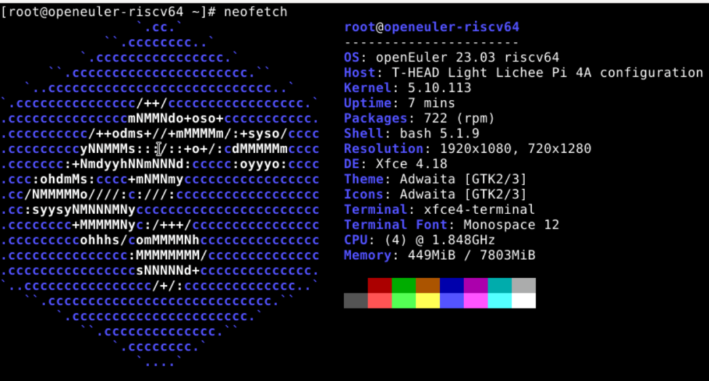
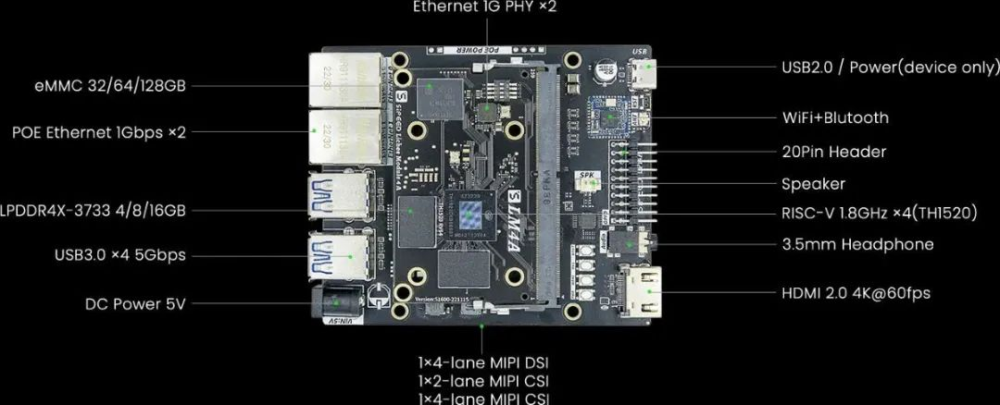

The RISC-V SIG has successfully made openEuler compatible with the LicheePi 4A development board. And the latest image of openEuler RISC-V 23.0.3 V1 has been available on LicheePi 4A, which demonstrates again that openEuler has made new breakthroughs in promoting the development of the RISC-V ecosystem.  

Image download: [https://mirror.iscas.ac.cn/openeuler-sig-riscv/openEuler-RISC-V/preview/openEuler-23.03-V1-riscv64/lpi4a/](https://mirror.iscas.ac.cn/openeuler-sig-riscv/openEuler-RISC-V/preview/openEuler-23.03-V1-riscv64/lpi4a/)

## openEuler Compatible with LicheePi 4A Open Sourced in the Community

The latest test image of openEuler RISC-V 23.03 is designed based on the firmware and kernel branch that have been open sourced by the vendor.  

According to the test of the RISC-V SIG, the basic system, wired networks, WiFi, and other peripherals of openEuler RISC-V 23.03 support basic functions and Xfce desktop, delivering a smooth experience.  

However, the image also has some problems. First, the GPU currently supports only  the LLVMpipe mode. The TH1520 processor delivers a high performance of 200+ FPS in the glxgears test, and HDMI output and system GUI are smooth. Besides, the image can only be booted from eMMC, and requires fastboot for burning. Furthermore, the "8+8" design is capable of meeting the majority of requirements. However, it falls short in terms of storage needs. These problems will be addressed in the later versions of openEuler RISC-V with support for microSD boot and other peripheral devices. Additionally, official images of openEuler 22.0.3 LTS and 23.03 supporting more functions will be launched and updated.  

## LicheePi 4A: Multi-Core Heterogeneous RISC-V SoC with High Performance

LicheePi 4A is the industry's first RISC-V development board with a similar performance to Raspberry Pi 4. Built on top of T-Head's TH1520 processor, LicheePi 4A is equipped with four 2.0 GHz C910 cores, 4 TOPS NPU, and 50 GFLOPS GPU, delivering superior performance to meet the requirements of various scenarios.  

LicheePi 4A also supports a range of peripherals, including GbE ports (supporting PoE), USB 3.0 type-A ports, HDMI 2.0, 3.5 mm audio ports, microSD reader, and 5 V DC power supply.  
Furthermore, LicheePi 4A is integrated with WiFi and bluetooth adapters, and MIPI-DSI and MIPI-CSI connectors for displays and cameras. All these rich hardware features make LicheePi 4A a powerful and flexible development platform to meet developers' requirements in various fields.

Figure source: Sipeed

## Promoting the Implementation of High-Performance RISC-V Applications

The RISC-V SIG plans to leverage the computing power of RISC-V vector extension instructions (RVV 0.7) to build the entire operating system using a toolchain that supports RVV 0.7, thus unleashing performance potentials. To achieve this goal, the SIG will work with the RuyiSDK team from the Institute of Software, Chinese Academy of Sciences (CAS), to explore the RISC-V field and provide RuyiSDK-based support for developers.  

For now, functions of LicheePi 4A have been improved, yet there are so many features to be explored and to be ported to openEuler RISC-V images. However, LicheePi 4A-based openEuler RISC-V OS still faces challenge in GPU compatibility and user experience. We sincerely invite developers who are interested in this field and test volunteers to join us and experience the image version to solve potential problems and further flourish RISC-V development ecosystem.

## Contacting Us

If you are interested in RISC-V, you're welcomed to join the RISC-V SIG for further discussion.

WeChat QR code of Mr. Wu Wei from the Institute of Software, CAS

**Add "oerv" for friending on WeChat**

## About the Author

Yang Yanling, a postgraduate at Wenzhou University, PLCT Lab Intern of the Institute of Software, CAS, and member of the RISC-V SIG in the openEuler community, who is responsible for daily operations of the RISC-V SIG and ROS SIG.
