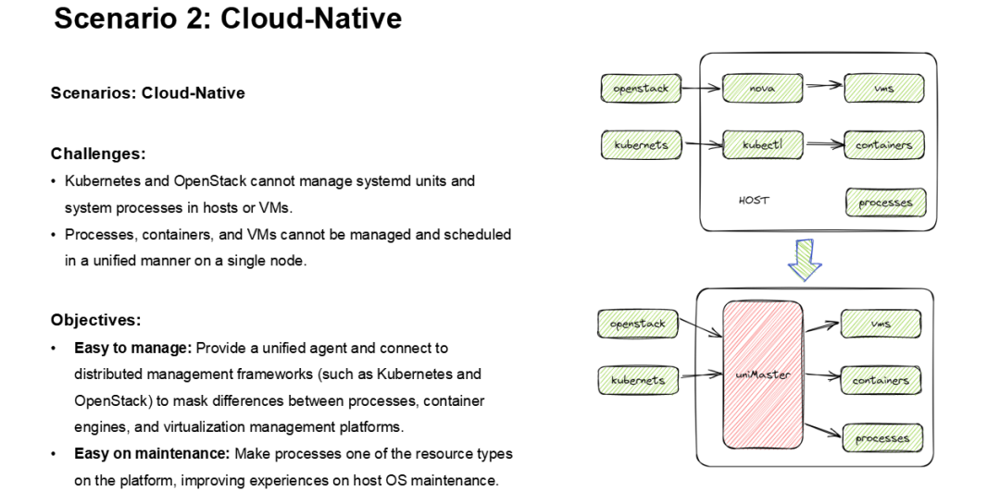

## Process1 and sysMaster

The Linux operating system designates process1 as the init process, which serves as the ancestor of all subsequent processes. As the first process initiated upon system startup, the init process assumes responsibility for launching and overseeing all other processes, as well as terminating them when the system is shut down. However recently, the init process has been replaced by the systemd process, but the concept of a process with ID 1 still exists, with system startup and recycling processes as its minimal functionalities.

To further improve the initialization and service management of the Linux system, openEuler develops Rust-based **sysMaster**, which refines the traditional init daemon process and provides a unified system initialization and service management solution to manage processes, containers, and VMs in embedded, server, and cloud-based scenarios. In addition, **sysMaster**  incorporates multiple technical means, such as fault monitoring and self-healing in seconds, to improve OS stability and service availability. 

The following figure shows the **sysMaster** architecture, which includes three primary components:

-   **sysmaster-init** provides functions such as system initialization, zombie process recycling, and keep-alive monitoring. It is easy to use and can be independently used in embedded scenarios. 

-   **sysmaster-core** provides core functions such as lifecycle management for service units, and supports capabilities such as hot restart, hot upgrade, and self-healing in seconds, ensuring 24/7 service continuity.
    
-   **sysmaster-extends** provides components for key system functions, such as devMaster for device management, busMaster for bus communication, and uniMaster for unified proxy. Each component can be used independently in different scenarios.

>

## Shortcomings of Common Initializer Programs

Common initializer programs include SysVinit, Upstart, and systemd. The following table lists their features.

>

While systemd has greatly improved startup speed and functionality, its system architecture and implementation have become increasingly complex over time, which does not go with the Keep It Simple principle. Additionally, it lacks support for flexible usage, and may not be suitable for certain scenarios such as embedded systems and some IoT devices. Moreover, each new version of systemd introduces its own set of issues, without necessarily addressing existing problems. The accumulation of these problems can result in a system breakdown. Therefore, it is not ideal for openEuler in edge, embedded, server, and cloud-based scenarios.

>

In cloud-based scenarios, service management objects are changed from processes to VMs and containers, which are managed by using agents (such as kubelet and nova) on nodes and platforms such as OpenStack and Kubernetes. Systemd is responsible for managing these agents on nodes and providing them with essential capabilities like log output. Additionally, systemd manages the lifecycle of some key services such as Ngnix. These services are designed with a distributed architecture, meaning that if a problem arises, the service is able to autonomously handle it without relying on external resources. In other words, unlike container and VM instances, these services cannot be orchestrated in a unified manner through the Kubernetes and OpenStack platforms.

>

The existing, mature initializer programs, such as systemd and Upstart, do not support embedded scenarios. Systemd in particular, which is widely used, has a significant number of components with independent functionalities, intricate dependency relationships, and high resource usage, making it unsuitable for many embedded applications.

## sysMaster **Features**

OS initialization and service management are crucial to any system. Our goal is to offer a comprehensive framework for both, which can address existing issues and cater to the needs of both traditional and cloud-based scenarios.

Our objectives are:

1.  To address memory security issues related to system initialization, thereby minimizing the likelihood of faults.

2.  To facilitate rapid deployment, upgrades, and recovery, while implementing fault recovery in seconds without disrupting services.

3.  To be lightweight and adaptable, meeting diverse resource overhead requirements in embedded, server, and cloud-based scenarios. 

Our objectives for running instances (such as containers, VMs, and processes) on nodes in cloud-based scenarios are:

1.  To provide a unified interface for managing the lifecycle of instances to interconnect with distributed management frameworks (such as Kubernetes and OpenStack) and shield the differences between the container engines and virtualization management platforms.
    
2.  To enable key cloud-based services in VMs to reuse the capabilities of the existing cloud instance scheduling platform, thereby facilitating distributed management.

**sysMaster** is designed with a multi-level split 1+1+N architecture, which assigns specific tasks to each individual component. This approach streamlines the complexity of each component and results in a simple yet effective overall component architecture, enhancing system scalability and adaptability, while reducing development and maintenance costs.  **sysMaster** has the following features:

1.  Lightweight scheduling and fast speed. The job scheduler and event driver in **sysMaster-core** are responsible for processing startup tasks. The job scheduler provides lightweight and parallel scheduling capabilities and supports transaction capabilities to ensure the atomicity of service startup.  The event driver receives external events and drives the job scheduler to complete event-related tasks, such as management of control commands and device discovery.
    
2.  Plugin architecture for flexible service expansion. The Unit manager provides the plugin mechanism, supports dynamic loading of various service types, implements on-demand loading, and supports flexible service expansion.
    
3.  External status, multi-level restoration points, language-level native security, and ultimate reliability.  The reliability framework supports external status and multi-level checkpoint customization, resource reconciliation, data self-recovery, and fast self-recovery from faults. In addition, the framework supports hot upgrade to implement fast version upgrade without interrupting services. **sysMaster** is developed using the Rust language to eliminate memory security issues, improving the robustness of process1 and the overall system reliability.
    
4.  Seamless migration from systemd to **sysMaster**. An ecosystem migration tool is provided to allow customers and developers to quickly switch from systemd to **sysMaster**, achieving seamless switchover and migration.
    
5.  Unified interface for managing the lifecycle of objects running on a single node. **sysMaster** integrates features of existing cloud-based scenarios and utilizes iSulad (container engine) and QEMU to offer a consolidated interface for managing both container and virtualized instances. The key application instances managed by **sysMaster** are connected to distributed scheduling frameworks such as Kubernetes and OpenStack. 
    
6.  Native support for Harmony and Linux kernels. **sysMaster** is designed to support all scenarios such as embedded, server, and cloud. Currently, it supports the Harmony microkernel and Linux kernel and provides a unified service management framework for the microkernel and macrokernel.

## sysMaster Progress and Plan

Since the first technically-validated version was released in September 2022, the latest version of **sysMaster** introduces the fault recovery mechanism. When a process breaks down due to the abnormal service management function of **sysMaster**, the process can be recovered in seconds instead of restarting the entire system. In addition, **sysMaster** has all init functions and core main functions, and streamlines system container/VM scenarios.

>

This year, **sysMaster** will focus on the quick startup feature to improve its advantages in startup speed and running memory. This will include optimizing the job scheduler and event driver in **sysMaster-core**. In addition, **sysMaster** will focus on developing device management and other necessary components to meet the requirements of VM scenarios. For example, DevMaster, as an important component of **sysMaster**, helps users manage and monitor hardware devices, such as network interfaces, drives, and CPUs, improving the reliability and stability of the system. In the future, **sysMaster** will deliver more cloud-based applications that can cater to ever-changing requirements, while optimizing its architecture and performance to enhance the scalability and adaptability of the system. It will also endeavors to provide novel functionalities and components that can support diverse scenarios, including containerization, virtualization, and edge computing. Ultimately, it will strive to evolve into a robust system administration framework that elevates user experience and amplifies efficiency.  

>

## Join Us

See more details about **sysMaster** at https://gitee.com/openeuler/sysmaster

If you are interested in process1 and system administration, welcome to join us. You can add the following WeChat and reply "sysMaster" to join the chat group. 

