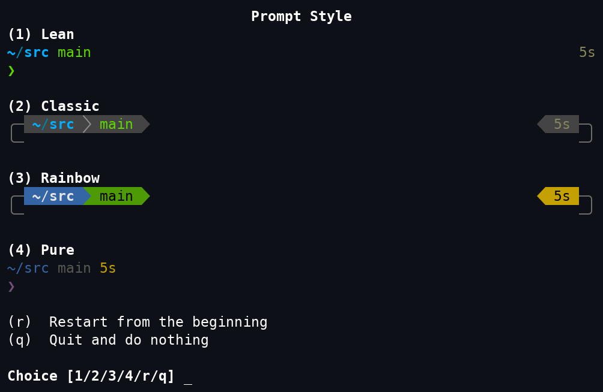

In the world of operating systems, the software package is privileged because its richness in content and handiness in distribution determine the user and developer experience to a great extent.

**openEuler User Repo** (EUR) is an individual software package hosting platform released by the openEuler community. It aims to provide an easy-to-use **software package distribution platform** for developers. The platform supports automatic software packaging from PyPI and RubyGems, supports continuous build to be automatically triggered through webhooks and will support one-click software packages import to the community from your personal repository in near future.

Link: [https://eur.openeuler.openatom.cn/](https://eur.openeuler.openatom.cn)

As the users of EUR are increasing, so are the projects. EUR has 68 projects so far. In this article we will share 2 new projects published in April. You are very welcome to try them!

# Project 1: i3

## Introduction


i3 is a powerful X11-based tiling window manager.


In the i3 environment, you can manage, move, and switch windows without using the mouse. And it also supports multiple monitors. Therefore, it is highly recommended.

## How to Install


Currently, version 22.03 is supported. If you are interested in other versions, please contact us.

```python
cd /etc/yum.repos.dcurl -OL
https://eur.openeuler.openatom.cn/coprs/mywaaagh_admin/i3wm/repo/openeuler-22.03_LTS_SP1/mywaaagh_admin-i3wm-openeuler-22.03_LTS_SP1.repodnf
makecachednf in i3

```

# Project 2: tide

## Introduction


tide is a command prompt beautification tool under Fish. You need to install Fisher and Fish of a later version before you use the tide.



Link: [https://github.com/IlanCosman/tide](https://github.com/IlanCosman/tide)

## How to Install

Install the Fish and Fisher of the latest version through EUR.

Currently, versions 22.03 and 20.03 are supported. If you are interested in other versions, please contact us.

```python

cd /etc/yum.repos.dcurl -OL
https://eur.openeuler.openatom.cn/coprs/mywaaagh_admin/fish/repo/openeuler-20.03_LTS_SP3/mywaaagh_admin-fish-openeuler-20.03_LTS_SP3.repo
*\# Version 20.03 *curl -OL
https://eur.openeuler.openatom.cn/coprs/mywaaagh_admin/fish/repo/openeuler-22.03_LTS_SP1/mywaaagh_admin-fish-openeuler-22.03_LTS_SP1.repo
*\# Version 22.03 *dnf makecachednf in fish fisherchsh -s /bin/fish *\#

```

Switch the default shell to **fish***.

Use Fisher to install the tide.

Log in to the shell again, and ensure that you have entered Fish and the Fisher function is working properly.

  ```python
\$ fish -vfish, version 3.6.0\$ fisher -vfisher, version 4.4.3
  ```

Install tide (Internet connection required).

  ```python

fisher install IlanCosman/tide@v5

  ```

Welcome to try them out! We would really appreciate if you leave any suggestions or comments in the community forum.

**E-mail**: infra@openeuler.org

**Community forum**: [https://forum.openeuler.org/](https://forum.openeuler.org/)

**openEuler User Repo (EUR)**:

[https://our.openeuler.openatom.cn/](https://our.openeuler.openatom.cn/)

**How to use openEuler User Repo (clip)**:

[https://b23.tv/sKHjKUU](https://b23.tv/sKHjKUU)
