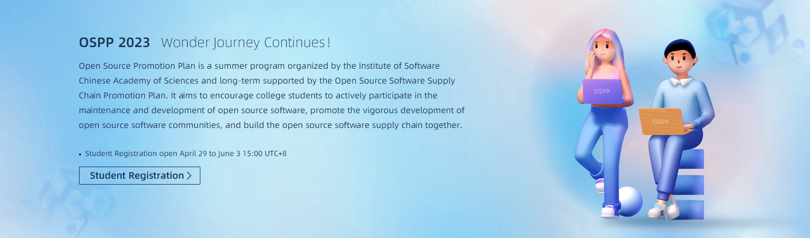

Open Source Promotion Plan (OSPP) is a summer program hosted by the Institute of Software Chinese Academy of Sciences and openEuler. It aims to encourage college students to actively participate in the maintenance and development of open source software, promote the vigorous development of open source software communities, and build the open source software supply chain together. OSPP has united with multiple open source communities to propose project tasks for the development and maintenance of important open source software, and we are open to students from universities worldwide.

94 projects have been released in the openEuler community. You can visit [OSPP project list](https://summer-ospp.ac.cn/org/orgdetail/b9770f4d-f586-4373-bdac-ce6389065946?lang=en) to view all projects. Welcome to apply for projects you are interested in.

The following introduces nine projects released by sig-infrastructure, involving **operating systems, development tools, and AI**. You are welcome to participate in the projects. We will provide you with rich learning resources and technical guidance.

# Project 1: Adding pyproject Support for pyporter

**Project description:**

Currently, pyporter cannot pack Python projects in pyproject.toml format.

**Output criteria:**

pyporter supports packing projects in pyproject.toml format and can automatically pack 500 software packages in the openEuler User Repo (EUR).

**Skill requirements:**

Python programming and RPM packaging capabilities

**Project mentor:**

pkwarcraft@hotmail.com

**Project homepage:**

https://gitee.com/openeuler/open-source-summer/issues/I6Z2YK?from=project-issue

# Project 2: Collecting and Sorting Corpus for Q&A Bot NLP Training

**Project description:**

Objective: Use crawlers and AI to collect and sort openEuler-related materials to expand the corpus of the openEuler Q&A bot.
1. Crawl issues of valid Q&As from the official Gitee repository of openEuler and store them in tables.
2. Crawl the MD documents in the official Gitee repository of openEuler and generate an overview for each document.
3. Use AI to slice the documents obtained in step 2, generate Q&A pairs based on the document content, and store the Q&A pairs in tables.
4. Tag the Q&A pairs, such as "OS" or "migration tool", and use AI models to classify them.

**Output criteria:**

Submit code in the code repository. The code should implement the preceding functions. Contact the mentor for details after you claim the task.

**Skill requirements:**

1. Familiar with one of the development languages, such as Python, Go, and Java

2. NLP basics

**Project mentor:**

muyuying1@huawei.com

**Project homepage:**

https://gitee.com/openeuler/open-source-summer/issues/I6YZS9?from=project-issue

# Project 3: Optimizing the Image Management Function of EulerLauncher

**Project description:**

About EulerLauncher:

EulerLauncher is a developer tool set incubated by the technical operation team and infrastructure team of the openEuler community. It integrates virtualization technologies (such as LXD, Hyper-V, and Virtualization Framework) in mainstream desktop OSs. It utilizes VMs and container images released by the openEuler community to provide developers with unified development resource (such as VMs and containers) provisioning and management experience on Windows, macOS, and Linux, improving the convenience and stability of the openEuler development environment on mainstream desktop OSs, as well as developer experience.

EulerLauncher supports image download and import.

1. Currently, only images in **\*.qcow2.xz** format can be imported. You need to adapt the image import function for other mainstream image formats, such as QCOW2.

2. Optimize the EulerLauncher image download and import processes and responsiveness to improve user experience.

3. Add the VM snapshot function (that is, create a snapshot for the current VM to generate an image in the current state) and export development images of mainstream programming frameworks such as Python, Go, and Java.

**Output criteria:**

1. Implement the preceding functions for EulerLauncher.
2. Provide comprehensive compilation, installation, and usage guides.

**Skill requirements:**

Python programming capabilities

**Project mentor:**

834864567@qq.com

**Project homepage:**

https://gitee.com/openeuler/open-source-summer/issues/I6YUCL?from=project-issue

# Project 4: Adding QEMU Backend Support for EulerLauncher on Windows

**Project description:**

Add QEMU backend support for EulerLauncher on Windows.

On Windows, EulerLauncher supports only the Hyper-V backend, which is available only to Windows Pro users. QEMU is a set of emulation software, written by Fabrice Bellard, that is open sourced under the General Public License (GPL). It provides cross-platform full virtualization support (https://www.qemu.org/download/#windows). Adding QEMU backend support for EulerLauncher on Windows can provide openEuler VM provisioning capabilities for users of various Windows editions.

**Output criteria:**

1. Implement QEMU backend support for EulerLauncher on Windows.
2. Provide comprehensive compilation, installation, and usage guides.

**Skill requirements:**

1. Python programming capabilities
2. QEMU basics

**Project mentor:**

wengqz@qq.com

**Project homepage:**

https://gitee.com/openeuler/open-source-summer/issues/I6YUAA?from=project-issue

# Project 5: Introducing the ONNX Runtime+ Ascend Backend Software Package to openEuler

**Project description:**

ONNX Runtime is Microsoft's open-source ONNX model inference platform. It is a mainstream universal AI inference platform in the industry and officially supports Ascend hardware. This project requires you to complete building and function tests of ONNX Runtime+Ascend on openEuler. Ensure that ONNX Runtime is natively available on openEuler, build the RPM package, and introduce it into openEuler 23.09.

**Output criteria:**

1. Complete ONNX Runtime+Ascend backend building and function tests on openEuler, submit encountered problems in issues to the ONNX Runtime community, and submit PRs to fix the issues.

2. Create an ONNX Runtime repository in the official Gitee repository of openEuler and introduce the latest ONNX Runtime RPM SPEC file. Ensure that the software package is successfully built. If any software dependency problem is found, rectify the problem.

**Skill requirements:**

1. Proficient in C and C++

2. Familiar with technologies related to AI training and inference

3. Preferred qualifications: familiar with Python, RPM package making, and ONNX Runtime

**Project mentor:**

wangxiyuan1007@gmail.com

**Project homepage:**

https://gitee.com/openeuler/open-source-summer/issues/I6YTQZ?from=project-issue

# Project 6: Adding a UI for EulerLauncher

**Project description:**

Add a UI for EulerLauncher, a unified cross-platform development environment management tool of openEuler.

Currently, EulerLauncher uses a CLI as the client. You need to develop an EulerLauncher UI that can be used across platforms (such as Windows, macOS, and Linux).

**Output criteria:**

1. Provide an attractive and easy-to-use EulerLauncher UI.
2. Provide comprehensive compilation, installation, and usage guides.

**Skill requirements:**

1. Python programming capabilities
2. UI design and development capabilities

**Project mentor:**

409601498@qq.com

**Project homepage:**

https://gitee.com/openeuler/open-source-summer/issues/I6YGL3?from=project-issue

# Project 7: Supporting Complex VM Operations for EulerLauncher on Hyper-V

**Project description:**

Adapt EulerLauncher to support complex VM operations on the Hyper-V backend.

Currently, EulerLauncher supports only the basic functions of adding, deleting, modifying, and querying VMs. This project requires you to develop functions of starting and stopping VMs and attaching new disks on Windows+Hyper-V. In addition, the function of setting VM specifications (such as CPU, RAM, and disk) needs to be added.

**Output criteria:**

1. Implement the preceding functions of EulerLauncher on the Windows+Hyper-V backend.
2. Provide comprehensive compilation, installation, and usage guides.

**Skill requirements:**

Python basics

**Project mentor:**

746364661@qq.com

**Project homepage:**

https://gitee.com/openeuler/open-source-summer/issues/I6YUEK?from=project-issue

# Project 8: Developing a VS Code Plugin for EulerLauncher to Implement Automatic Development

**Project description:**

Developing a VS Code plugin for EulerLauncher to implement automatic development.

Visual Studio Code (VS Code) is a cross-platform editor developed by Microsoft. It can run on Windows, Linux, and iOS platforms. You can install some plugins to turn the editor into a compiler. VS Code supports multiple languages, such as C++, Python, Java, C#, and Go. It provides powerful functions, rich plugins, and fast startup. Therefore, adding a VS Code plugin to EulerLauncher can utilize VS Code's code development capability for openEuler native development and code testing on EulerLauncher, greatly facilitating openEuler developers.

**Output criteria:**

1. Develop a VS Code plugin for EulerLauncher to implement automatic code synchronization, automatic VM startup, and automatic tests based on configuration scripts.
2. Provide comprehensive compilation, installation, and usage guides.

**Skill requirements:**

Python basics

**Project mentor:**

826144794@qq.com

**Project homepage:**

https://gitee.com/openeuler/open-source-summer/issues/I6YUGK?from=project-issue

# Project 9: Realizing Bidirectional Synchronization Between GitHub and Other Git Services

**Project description:**

Currently, open source communities mainly use GitHub for open source collaboration using fork and PR models. A large number of excellent developers and free resources generate the siphon effect for GitHub,
making it the hub of open source communities. Still, many enterprises use other open source platforms (such as GitLab, Gitee, and Gitea) to build their internal, independent code repositories. After the internal code goes open source, the code exists both in the internal code repository and GitHub. As a result, two main branches are generated over time, making the code hard to maintain.

To solve this problem, this project aims to implement bidirectional synchronization between GitHub and internal code repositories. PRs of external contributors or submissions in the internal code repository can be synchronized to the peer side in a timely manner to ensure code consistency. Internal code repository deployment solutions are uncertain, whereas the external GitHub service is relatively determined. Therefore, during project design, ensure the project compatibility to implement bidirectional synchronization between GitHub and other Git services.

Note that only code, PRs, and issues need to be synchronized bidirectionally. Develop the system in Rust and use the local database cache.

**Output criteria:**

1. Analyze the GitHub authorization mechanism and API implementation mechanism for code repositories, PRs, and issues.

2. Design compatible APIs to implement bidirectional synchronization for various target systems.

3. Implement container-based deployment on Vercel.

4. Output design documents in English.

**Skill requirements:**

1. Rust programming capabilities

2. Proficient in English

**Project mentor:**

chenzeng2@huawei.com

**Project homepage:**

https://gitee.com/openeuler/open-source-summer/issues/I6YJ2N?from=project-issue

# Timeline and Participation Method

 The following is the timeline of OSPP 2023. If you are interested in the preceding projects, welcome to join us! 

