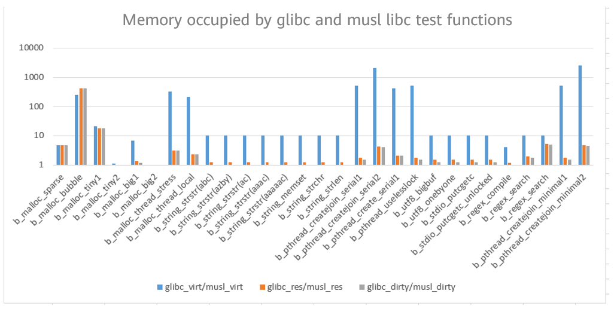
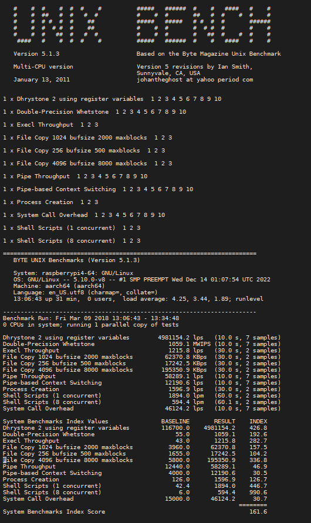
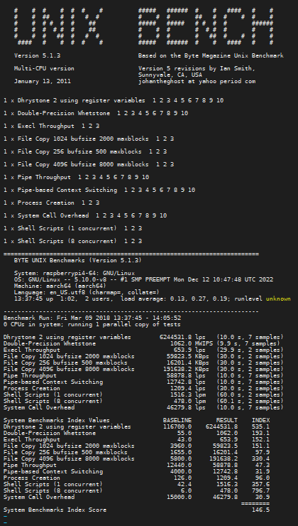

The RISC-V SIG has made significant progress by successfully adapting musl libc on openEuler Embedded, which has replaced the glibc library for image building. Currently, images compiled using musl libc as the standard library are available on the Raspberry Pi 4 development board, promoting the polymorphism development of openEuler Embedded.  

You can find the procedure for compiling an image at the following link:  

[https://openeuler.gitee.io/yocto-meta-openeuler/master/features/muslc.html](https://openeuler.gitee.io/yocto-meta-openeuler/master/features/muslc.html)

## Advantages of musl libc Compared with glibc

1.  musl libc is a dedicated library developed for openEuler Embedded, featuring simplicity, lightweight, and high efficiency.  

2.  musl libc is much smaller because it focuses on minimizing the code size and function call overhead so as to improve performance.  

3.  Unlike the cumbersome and complex glibc code, the source code of musl libc is relatively simple and not highly encapsulated.  

4.  musl libc is a standard function library of the C language, whose code is clean and efficient. It is designed for static linking and is well-suited for making portable programs. It can also be easily used for cross compilation to compile programs running in different system environments.  

## Disadvantages of musl libc Compared with glibc

1.  POSIX standard: musl libc complies with the POSIX standard more strictly, while glibc adds some extensions to provide more functions and better compatibility.  

2.  Error handling: musl libc implements stricter and more standard error handling, while glibc has more error handling options and supports different language environments.  

To sum up, if you need a small and fast C standard library to use in a Linux system, choose musl libc. If the executable program of a function you want to develop needs to run in different system environments, glibc can meet your requirements. If you want to compile a program that can run on multiple Linux distributions with the same CPU architecture, musl libc is the optimal choice because function libraries and execution files compiled using glibc may not be shared on different Linux distributions.  

## Raspberry Pi 4: Performance Comparison Between musl libc and glibc

libc-bench is an official set of time- and memory-efficiency tests provided by musl to compare implementations of various C/POSIX standard library functions.  

UnixBench is an open-source tool for testing basic performance of UNIX systems. It tests the performance of each aspect of a system, compares each test result with a reference value to obtain an index value, and then combines the index values of all test items to form a test score. A higher test score indicates better system performance.  

We compared the performance of Raspberry Pi images compiled with musl libc and glibc using the libc-bench and UnixBench tools in our performance tests. The results of the tests are presented below:  

Result of the memory usage test conducted by using libc-bench:

According to the preceding test result, the image compiled using musl libc as the standard library is much better than glibc in terms of virtual memory usage, physical memory usage, and recyclable system memory.  

Performance test data of the Raspberry Pi system using musl libc:  

Performance test data of the Raspberry Pi system using glibc:  

In conclusion, the Raspberry Pi system using glibc scored 146.5, while the system using musl libc scored 161.6, resulting in a 10% performance gain with musl libc.  

## Further Exploration of Performance and Functionality Potentials of Adapting musl libc to openEuler Embedded

The performance and functionality of images compiled using musl libc can still be greatly improved. In terms of performance, implementation of the malloc and memcpy series functions in musl libc is slow. The performance of malloc can often become a bottleneck in multi-threaded environments. This is because implementation of malloc in musl libc requires the locking and unlocking of global variables during each execution, leading to intense competition. In the future, optimizations will be necessary to improve performance in this regard.  

In terms of functionality, musl libc's support for character sets/codes is not as comprehensive as glibc. In terms of error handling, glibc has more error handling options and supports different language environments. In terms of the POSIX standard, glibc adds some extensions to provide more functions and better compatibility. Hence, there is significant scope for musl libc to enhance and refine its capabilities.  
