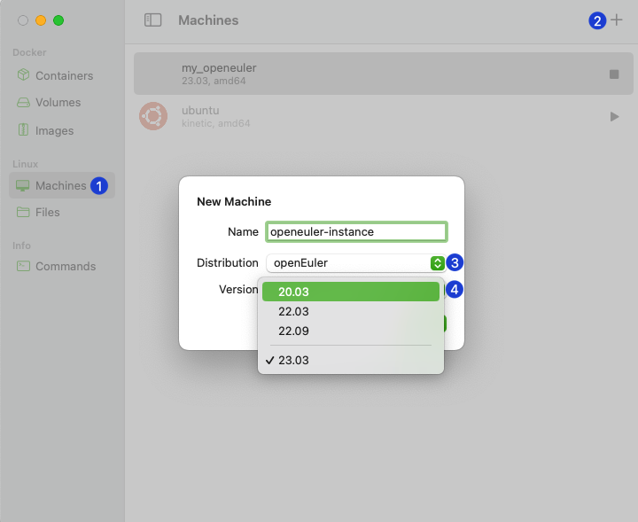

[OrbStack](https://orbstack.dev/), a lightweight virtual machine platform for Mac, supports the openEuler distributions.
Download here: <https://orbstack.dev/download>, create a VM, and select the openEuler, to take your coding to a whole new level.

