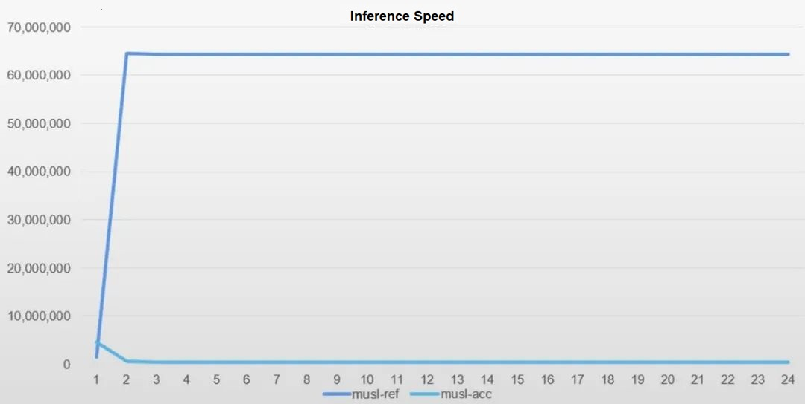
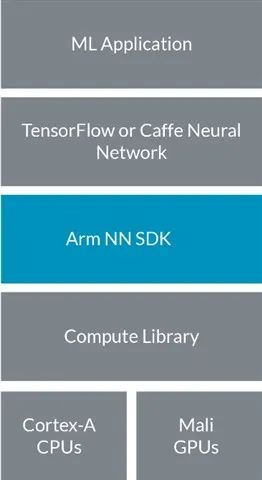

Earlier this year, the RISC-V special interest group completed the adaptation of Arm Neural Network (Arm NN) to the openEuler Embedded. In January 2023, Arm NN was integrated into the system build project's code library. The library has undergone several tests, confirming its availability and capability to accelerate and optimize the neural network library on the openEuler Embedded.  

To download the system build project, please visit [https://gitee.com/openeuler/yocto-meta-openeuler](https://gitee.com/openeuler/yocto-meta-openeuler).

## openEuler Embedded That Supports Arm NN Has Been Available in the openEuler Community

openEuler Embedded is a Linux distribution for embedded scenarios, built on the openEuler community platform. Embedded systems face limitations in terms of resources, power consumption, and diversity, which makes machine learning using embedded processor cores crucial for technological development. To address this, the Arm NN acceleration library developed by Arm offers a solution, applying machine learning to embedded systems. Arm NN provides high-performance neural network inference capabilities, supports edge-device collaboration, and improves resource utilization.  

**Object detection is a typical machine learning workload for embedded systems.**  

In this case, we will use object detection as an example to test the inference acceleration capabilities of Arm NN:  

1. Model: yolov3 tiny (FLOAT32 quantization)  

2. Training data: COCO  

3. Test data: 640 x 480 H.264 video  

Experimental results show that Arm NN can enhance inference performance by up to 100 times, while maintaining an acceptable level of precision loss. As shown in the following figure, the horizontal axis indicates the sequence numbers of the detected images, and the vertical axis indicates the inference duration (in μs).  

Note: **musl-ref** refers to the openEuler Embedded based on MuslC without any acceleration, and **musl-acc** refers to the openEuler Embedded with ArmNN acceleration and optimization enabled.  

In order to be compatible with the openEuler Embedded, the Arm NN software must be adapted to yocto-meta-openeuler. This involves several preparations, including adapting TensorFlow and Compute Library, as well as utilizing flatbuffers. The build code for openEuler Embedded Arm NN can be found in the meta-openeuler/recipes-arm level. Community developers can build the Arm NN software as needed.  

## Arm NN: Integrates Mainstream Neural Network Frameworks to Provide Efficient AI Platforms

The Arm NN SDK is a set of open-source Linux software tools that enables machine learning workloads on power-efficient devices. This inference engine provides a bridge between existing neural network frameworks and power-efficient Arm Cortex CPUs, Arm Mali GPUs and Arm machine learning processors.  

Arm NN bridges the gap between the existing neural network frameworks and the power-efficient Arm IP. It enables efficient conversion between existing neural network frameworks such as TensorFlow and Caffe, and run efficiently on the Arm Cortex CPU and Arm Mali GPU without making changes.  

### Advantages

-   Easily run TensorFlow and Caffe on embedded systems.  

-   The advanced and optimization functions in the Compute Library enable developers to give full play to the powerful performance of the underlying platform.  

-   The programming mode remains the same regardless of the kernel type.  

-   Existing software can automatically detect and use new hardware features.  

-   Being open source, it can be easily extended to adapt to other kernel types of Arm partners.

## Arm NN Brings New AI Functionality to the openEuler Embedded

Arm NN provides a neural network optimization solution for openEuler Embedded to run machine learning workloads on power-efficient devices. To make full use of the software and hardware features across different platforms, the neural network acceleration for Arm CPUs is available on Linux systems. The instruction acceleration library interface is used to make it serve for the target hardware. Currently, the adaptation of the Arm NN software library to the openEuler Embedded is basically completed. The RISC-V SIG will continue to develop more new functions and port the latest image of openEuler Embedded. To accelerate the implementation of AI applications on the openEuler Embedded, we invite you to download images and collaborate in exploring and resolving potential issues, driving the growth of the openEuler AI ecosystem.
