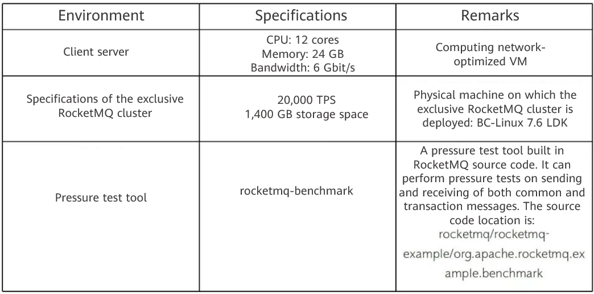
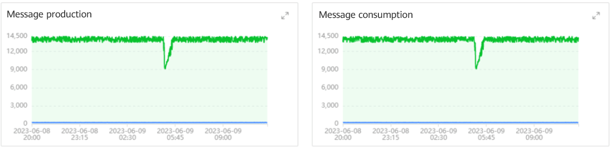
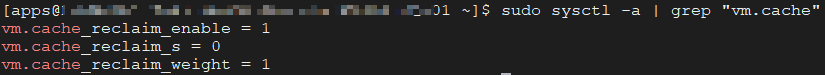
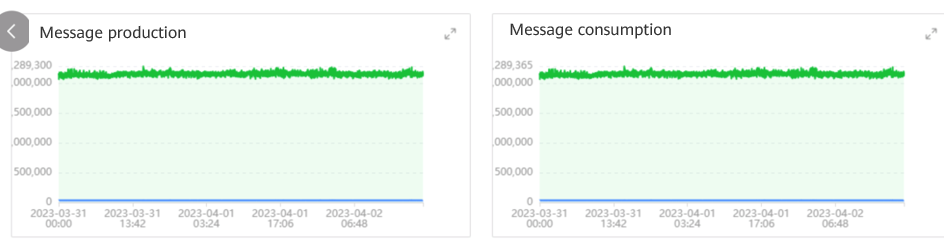
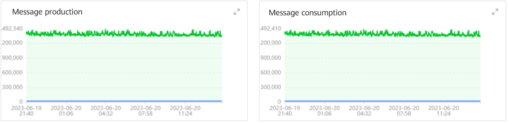

RocketMQ on openEuler is a stability solution that deploys message queue middleware RocketMQ on the openEuler system in container mode. It leverages the openEuler kernel feature which enhances the OS cache recycling efficiency to improve the stability and reliability of message queue middleware in ultra-large-scale, high-concurrency, high-throughput, and low-latency scenarios.

## OOM Issues Encountered by RocketMQ in Stability Pressure Tests

Before the RocketMQ product is officially launched, multiple rounds of performance and stability pressure tests have been conducted on the exclusive RocketMQ cluster by creating multiple groups of producer/consumer processes using a pressure test tool.  

### Test Environment

### Pressure Test Results

During a long-lasting pressure test, it was found that the throughput of message sending and receiving would experience a significant TPS (production/consumption) drop at a certain moment within a period of time, and this phenomenon was periodic.  

RocketMQ is known for its stable performance, but why did we observe TPS fluctuations during high-concurrency pressure tests? We first suspected that the issue might be caused by high CPU loads or frequent GCs of the RocketMQ Broker component, but upon checking the CPU loads and JVM GC frequency, we did not find any abnormalities. Finally, after careful check, it was found that the buffer/cache in the Broker Pod process kept increasing during the long-lasting pressure test. As a result, the system failed to reclaim the buffer/cache in a timely manner, resulting in the running process in the Pod occupying memory space beyond the preset limit, and triggering the OOM Killer mechanism to restart the Broker Pod.

## RocketMQ on openEuler: A New Choice for Improving Stability in Large-Scale and High-Concurrency Scenarios

Why does the system buffer/cache continuously increase during message sending and receiving at high concurrency? According to the OS manual, the buffer/cache mainly manifests on the system's page cache.

### Important Role of Page Cache in RocketMQ Message Storage

A page cache is also called a file cache. When Linux reads or writes files, it is used to cache the logical content of the files to accelerate the access to images and data on disks.  

In the preceding figure, the red part is the page cache. It is actually a memory area managed by the Linux kernel. The various programs we write usually read files into the memory space (actually page cache) through mmap and buffered I/Os.  

To achieve low latency and high throughput in large-scale and high-concurrency scenarios, the storage module of RocketMQ mainly uses the following two solutions:

1. **mmap + concurrent read and write of page cache messages**: In this solution, all message read and write processes pass through the page cache. In multi-thread concurrent read/write scenarios, the page cache inevitably encounters locking issues, especially when maintaining the page cache consistency. When the system flushes dirty pages back to disks, the high disk pressure may cause burrs.

2. **Off-heap memory pooling + split read and write of page cache messages**: In this solution, messages are written to the off-heap memory block (DirectByteBuffer) created when RocketMQ is started, and are read from the page cache. Implementing message read/write splitting in this manner enhances overall process concurrency and effectively minimizes latency. Additionally, utilizing an off-heap memory pool can further reduce the overhead associated with transition between the user mode and kernel mode.

The page cache plays a crucial role in the storage layer of RocketMQ. Any issues with page caches, such as cache reclamation, consistency, and page fault interrupt, can have serious impacts on the main processes of message sending and receiving.

### openEuler Optimization for Improved Cache Recycling Efficiency

To prevent the reliable memory from being exhausted due to excessive page cache allocations (unlimited by default), the total number of page caches and the total amount of reliable memory need to be limited. The CentOS system kernel cannot reclaim page caches that do not exceed the node memory resources in a timely manner. openEuler adds related system kernel parameters for page cache reclamation and provides several proc interfaces for limiting the page cache usage. The interfaces are defined in **/proc/sys/vm/**. The details are as follows:   

1. [**cache_reclaim_enable**]: indicates whether to enable the page cache restriction function.  

2. [**cache_reclaim_s**]: indicates the interval for triggering cache reclamation, in seconds. The system creates work queues based on the number of online CPUs. If there are *n* CPUs, the system creates *n* work queues. Each work queue performs reclamation every `cache_reclaim_s` seconds. This parameter is compatible with the CPU online and offline functions. If the CPU is offline, the number of work queues decreases. If the CPU is online, the number of work queues increases.  

3. [**cache_reclaim_weight**]: indicates the weight of each reclamation. Each CPU of the kernel expects to reclaim `32 x cache_reclaim_weight` pages each time. This weight applies to both reclamation triggered by the page upper limit and periodic page cache reclamation.  

### Verification of RocketMQ on openEuler in the Production Environment  

To address the OOM issues, we upgraded the OS kernel of the host where the exclusive cluster is located to the latest BC-Linux for Euler 21.10 version. (BC-Linux for Euler is an enterprise-level Linux OS customized based on the openEuler system.) After the system update, we used two types of message bodies (1 KB and 4 KB) to perform long-lasting pressure tests in the same test environment.  

#### Test Scenario 1

During the long-lasting pressure test in which 1 KB messages are sent and received, the exclusive cluster is able to achieve a total message sending and receiving TPS of over 20,000 (with message sending TPS of over 10,000 and message receiving TPS of over 10,000). The following figure shows the rates of message production and consumption.  

According to the preceding figure, when the message body size is 1 KB, the message production and consumption rates do not fluctuate in the long-lasting pressure test, the TPS remains stable, and the service is normal during the test.  

#### Test Scenario 2

During the long-term pressure test in which 4 KB messages are sent and received, the cluster is able to achieve a total message sending and receiving TPS of over 14,000 (with message sending TPS of over 7,000 and message receiving TPS of over 7,000). The following figure shows the rates of message production and consumption.  

According to the preceding figure, when the message body size is 4 KB, the message production and consumption rates do not fluctuate in the long-term pressure test, the TPS remains stable, and the service is normal during the test.  

## Conclusion

The exclusive instance of RocketMQ has been completely upgraded to cloud native in 2022. It is particularly suitable for the technical evolution and related application scenarios of cloud native, serverless architecture, and big data stream computing. Currently, the RocketMQ on openEuler solution has been launched in multiple resource pools at Guangzhou, Hohhot, Beijing, and Hangzhou, and has been migrated, reconstructed, and upgraded on some existing servers. In the future, RocketMQ will continuously improve the service quality and create more value for customers.    
