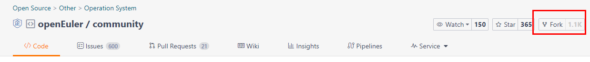
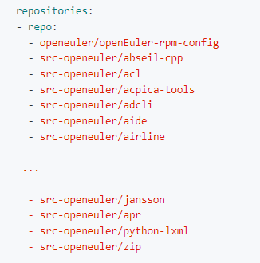
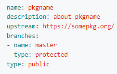

Welcome to openEuler!

# Signing the CLA {#Signcla .unnumbered}

As a newcomer, you must sign the **Contributor License Agreement (CLA)** before you can contribute to the community.

You can sign the individual CLA, employee CLA, or corporation CLA accordingly.

The address for signing the agreement is:

[https://clasign.osinfra.cn/sign/gitee_openeuler-1611298811283968340 ](https://clasign.osinfra.cn/sign/gitee_openeuler-1611298811283968340 )

# Installing openEuler

For details, see [[downing and installing openEuler]](https://www.openeuler.org/en/download/?version=openEuler%2022.03%20LTS%20SP3).

# Starting Your Contribution

After the agreement is signed, you can contribute to the community by doing the following things:

1. **Submit requirements or bugs**. Simply speaking, if you encounter problems when using openEuler, you can submit them to the community.

2. **Fix bugs in the community.** This level of participation involves becoming a developer in the community. We encourage everyone to not only ask questions but also find solutions.

3. **Provide software packages** that openEuler lacks. This will enrich openEuler's capabilities. We hope that with your participation, openEuler will evolve into a software ecosystem that has "everything".
 
Before making your contribution, you can bookmark the following three websites:

1.  Official openEuler website: <https://openeuler.org/>

2.  openEuler code repository: <https://gitee.com/openeuler/>

3.  openEuler package repository: <https://gitee.com/src-openeuler>

The official website of openEuler gives you some general information. The actual "community" we're talking about is reflected in 2 and 3.

### Submitting an Issue

-   You can report a problem or defect to the community by creating an issue. Submit the issue to the issue list of the project repository and view the [Issue Submission and Handling Guide](https://gitee.com/openeuler/community/blob/master/en/contributors/issue-submit.md) to obtain more information. When submitting the issue, comply with the issue submission rules.

-   You can submit issues on Gitee or [QuickIssue](https://quickissue.openeuler.org/en/issues/).

 All issues in the openEuler community can be submitted through QuickIssue. In addition, you can search the repository to which an issue belongs by entering relevant information.

-   If you do not receive any response for a long time, contact [community@openeuler.org].

### Submitting a PR

To contribute code, you also need to know how to download code from Gitee and merge the code through a pull request (PR). openEuler uses the Gitee code hosting platform. For details, see [[Gitee Workflow Guide]](https://gitee.com/openeuler/community/blob/master/en/contributors/Gitee-workflow.md)。

### Adding a Software Package

Procedure

To add a software package in the **openeuler/community** repository of Gitee, perform the following steps:

1. Fork the **community** repository as your own.

2. Clone the forked community repository to the local host.

3. Modify the **community** repository.

-   Determine the SIG to which the software package belongs. For example, the .zip package belongs to Base-service. (See [SIG List](https://www.openeuler.org/en/sig/sig-list/) to find the SIG or project that you are interested in.)

-   Modify the contents in the corresponding subfolder of the **sig** folder, such as the project list.

-   Modify the **sig-info.yaml** file in the **sig** folder. Add the software package in the format of \"-src-openeuler/zip\" to the corresponding SIG list. The following uses the ZIP package as an example to describe how to modify the **sig/Base-service/sig-info.yaml** file:

-   Create a repository and add the corresponding YAML file to **sig/{sig directory}/src-openeuler/First letter of the software name**. (Add projects maintained by the openEuler community to the **openeuler** directory, and add projects introduced from other communities to the **src-openeuler** directory. Example: **sig/Base-service/src-openeuler/z/zip.yaml**)

-   Make changes to the file and create a PR. In the commit message, justify the addition of the package or the creation of the repository. The more clear and informative the commit message is, the more likely it is to get approved.

4. After the PR is merged, a repository with the same name will be created in Gitee. You can see the repository in [src-openeuler](https://gitee.com/organizations/src-openeuler/projects).

For details, see [[Adding a New Software Package]](https://gitee.com/openeuler/community/blob/master/en/contributors/create-package.md).

#### EUR 

openEuler User Repo (EUR) is an individual software package hosting platform developed by the openEuler community. It aims to provide an easy-to-use software package distribution platform for developers.

Link: https://eur.openeuler.openatom.cn/

How to use openEuler User Repo (clip):

<https://b23.tv/sKHjKUU>

**Testing**

Testing is the responsibility of all contributors. The [QA SIG](https://gitee.com/openeuler/QA) is the official organization responsible for testing activities related to the community versions. If you want to perform tests on your own infrastructure, see [Introduction to the Community Testing System](https://gitee.com/openeuler/QA/blob/master/社区测试体系介绍.md).

The successful release of a community version requires multiple types of testing activities. The location of the code and the details of the environment required for successful testing vary according to the testing. For details, see [[Testing Guide]](https://gitee.com/openeuler/QA/blob/master/%E7%A4%BE%E5%8C%BA%E5%BC%80%E5%8F%91%E8%80%85%E6%B5%8B%E8%AF%95%E8%B4%A1%E7%8C%AE%E6%8C%87%E5%8D%97.md).

**Community Component Packaging**

You can also participate in community component packaging. For details, see [[Packaging Guide]](https://gitee.com/openeuler/community/blob/master/en/contributors/packaging.md).

**Disclosure of Community Security Issues**

-   [[Security Handling Process]](https://gitee.com/openeuler/security-committee/blob/master/security-process-en.md) briefly describes the process of handling security issues.

-   [[Security Disclosure]](https://gitee.com/openeuler/security-committee/blob/master/security-disclosure-en.md) describes how to report security vulnerabilities.

# Finding a SIG 

**Introduction to the SIG**

SIG is short for Special Interest Group. The openEuler community is organized based on different SIGs, facilitating the management and improvement of working processes.

-   SIGs are open. Anyone is welcome to join and contribute to SIGs.

-   A SIG is established for one or more specific technical topics. SIG members promote the output of deliverables and strive to make the deliverables a part of the openEuler community.

-   Core members of the SIG lead the SIG governance. For details, see [[SIG members]](https://gitee.com/openeuler/community/blob/master/community-membership.md). You can accumulate experience and improve your influence while making contributions.

-   Each SIG has one or more projects on Gitee. These projects have one or more repositories. The SIG deliverables are stored in these repositories.

-   You can submit issues in the repository corresponding to the SIG, participate in the discussion of specific issues, resolve issues, and participate in the review.

-   You can also communicate with other members in the SIG through the mailing list, IRC channel, and video conference.

**Finding the SIG or Project of Your Interest**

Finding the SIG you are interested in can help you ask questions in the right place and get a quicker response from the community.

- **Method 1**: If you do not know what SIGs or projects are available, you can view the [SIG List](https://gitee.com/link?target=https%3A%2F%2Fopeneuler.org%2Fen%2Fsig%2Fsig-list%2F) which contains all SIGs established in the openEuler community. You can use the list to quickly locate the SIG corresponding to the field that you are interested in. The following information about a SIG is also provided:
  -  Projects of the SIG and the repositories of the projects
  - Communication methods in the SIG, including the mailing list and IRC conference channel
  - Contact information of the maintainers
- **Method 2**: If you know the project name, you can perform a fuzzy search in the repository list of openEuler to quickly locate the home page address of the corresponding project. Generally, you can find the SIG information, communication methods, members, and contact information of the project in the README.md file on the project home page.

> If you cannot locate the SIG that you are interested in using either of the preceding methods, send a help email to [[community@openeuler.org]](mailto:community@openeuler.org). You are advised to use [Development Process Question] in the subject of the email and write down the characteristics of the SIG or project that you are looking for in the content. We are glad to help.

# Participating in Community Activities

**Communication Methods in the Community**

Users can communicate with each other through email lists and video conferences.

1\. Visit this [link](https://www.openeuler.org/en/community/mailing-list/) to find a mailing list available in the community, and follow the steps to add to a mailing list.

2\. Visit this [link](https://www.openeuler.org/en/) to view the regular meeting schedule of each SIG in the community. You can also click the related links to view the meeting links and minutes. You are welcome to apply for topics and participate in the meeting.

**Community News and Events**

The information about the community and technical communication meetings that openEuler participates in or holds and other community events can be found on the [openEuler News](https://gitee.com/link?target=https%3A%2F%2Fopeneuler.org%2Fen%2Finteraction%2Fnews-list%2F) page.

**Community Meetups**

 The community holds developer conferences every year. You can contact us by sending messages to [[https://openeuler.org]](https://gitee.com/link?target=https%3A%2F%2Fopeneuler.org) or sending emails to [[dev@openeuler.org]](mailto:dev@openeuler.org).

**Issue Feedback**

If you have any questions about the developer guide or the development process, send emails to [[dev@openeuler.org]](mailto:dev@openeuler.org), use [Question of Development Process] in the subject, and write down your questions and doubts in the email. The openEuler community operation team will try the best to answer your questions.

