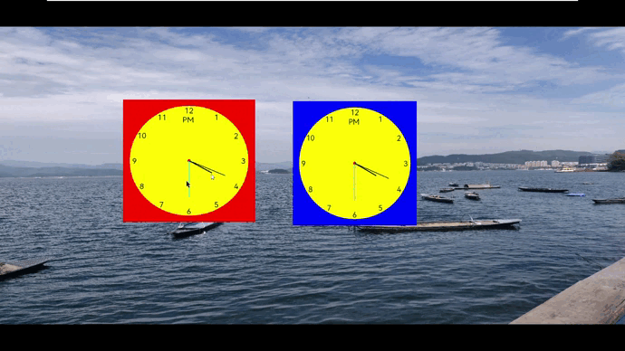

In May 2023, openEuler officially established FangTian SIG with **a focus on the FangTian Window Engine (FangTian Engine for short), including display service, window management, and modules such as graphics drawing, composition, and display. In addition, FangTian Engine proposed a new FT display protocol to solve the problem of poor user experience in the Linux desktop environment**.

After more than two months of development and commissioning, the demo application of FangTian Engine has been running smoothly on devices. The following describes the latest progress and basic concepts of  FangTian Engine.

# Latest Progress

The demo application of FangTian Engine has been running smoothly on devices.

As shown in the preceding figure, the demo implements three windows, including two clock windows and one background window. You can drag and zoom in or out a window by controlling the mouse.

The demo demonstrates the basic functions of creating and destroying windows and cascading multiple windows, the capability of identifying and distributing input events, and the function of moving and zooming in and out a window using the mouse. FangTian SIG will focus on the window engine to continuously bring brand-new display experience to users.

# Understanding FangTian Engine

FangTian Engine focuses on two parts: window display and window management. The following describes the software architecture and protocol:

**1. C/S architecture**: The FangTian Client provides APIs for application developers or GUI framework developers to invoke services, such as applying for surfaces, controlling the window position and size, and obtaining peripheral input.  As the core of the window display and window management capabilities, the FangTian Server provides the following services:

(1) **Window display service**: provides the buffer allocation and rotation, Vsync, rendering, composition, and display capabilities. The data-driven interfaces and unified rendering architecture are used to fulfill high-performance and low-memory goals.

(2) **Window management service**: provides the window creation, destruction, moving, scaling, and layout capabilities. The independent window policy module enables FangTian Engine to be used in a wide range of scenarios across different devices, including mobile terminals and PCs.

In addition to the window display service and window management service, FangTian Engine also provides and depends on the input management service, such as input device management and input event identification and distribution, implementing unified management of various peripherals such as a touchscreen, a mouse, a keyboard, and a touchpad to **support and simplify multimode input interaction scenarios**.

**2. FT protocol**: The client and server interact with each other through the FT protocol. Unified rendering and data-driven interfaces are used to reduce the rendering load and the cross-process data interaction volume, improving the animation capability and performance of applications.

The FT protocol mainly includes three parts: a basic window protocol, a self-drawing protocol, and a unified rendering protocol. The following describes the self-drawing protocol and unified rendering protocol.

(1) **Self-drawing**, also called direct rendering, indicates that applications directly use the CPU or GPU to complete image rendering and share the rendered data with the server through the buffer. The surface (including the buffer handle) is sent to the server through the self-drawing interface of FangTian Engine. The server directly composes the rendered data. The advantage of self-drawing is innate parallelism, that is, rendering between applications can be performed concurrently without disturbing each other.

(2) **Unified rendering** is different from the self-drawing mode. The 2D drawing instruction instead of the surface is transferred between the client and server. In the server, the 2D drawing instructions transferred by different applications are executed in a unified manner. An advantage of unified rendering is that information blocked between windows can be fully used in a rendering process, to reduce repeated rendering.

FangTian Engine uses the preceding two rendering modes. In the future, it will work with the GUI framework to implement unified scheduling of the rendering mode, ensuring performance and reducing resource consumption. In addition, in unified rendering mode, FangTian Engine adds data-driven capability. Only the change needs to be sent between frames, reducing the instruction processing and rendering load.

# Summary

As a new window engine, FangTian Engine not only provides the window display capability for applications but also proposes the new FT protocol. FangTian Engine uses the self-drawing and unified rendering architecture and data-driven expression to reduce the amount of data exchanged between the client and server, improving performance and reducing memory and power consumption. This makes **FangTian Engine applicable to both PC and server scenarios as well as mobile device scenarios**.

Currently, FangTian Engine is in fast iteration and will be improved to provide more window capabilities. For details, visit the following website:

<https://www.openeuler.org/en/sig/sig-detail/?name=sig-FangTian>

You are also welcome to add WeChat contact (**vx:hxt_hhg**) to join the FangTian SIG.
