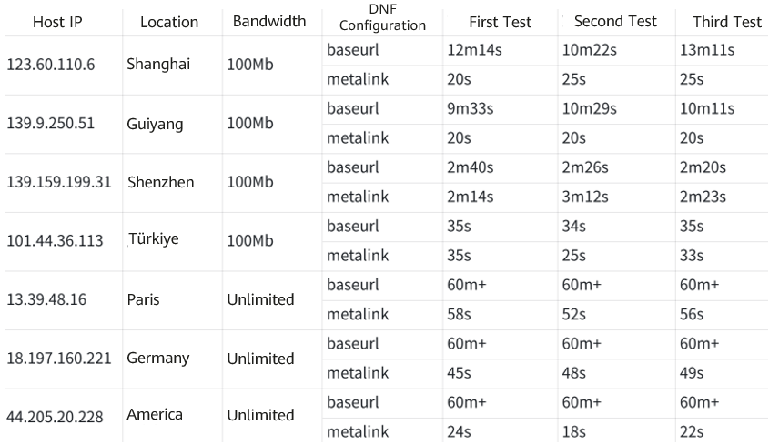

For developers in the openEuler community, it is necessary to download software from the openEuler repository. **Finding a way to quickly download software is a priority for the developers.**

To optimize user experience and accelerate the download speed, the metalink configuration item is added in the DNF configuration file of openEuler 22.03-LTS-SP2, with which software download from the openEuler repository can be accelerated by more than 20 times. **Users can directly download openEuler to use this function.**

# Download Examples

To verify the effect of this function, we performed download tests on clients in North America, Europe, and China. The test results are as follows:

After the metalink configuration item is added, **the download speed in China increases by 20 to 30 times, and that in Europe and North America increases by 50 to 100 times.**

# Future Plan

The metalink configuration item will be added to more releases of openEuler to ensure that users can download software more efficiently and stably.

You are welcome to try out openEuler and give your comments and suggestions.
