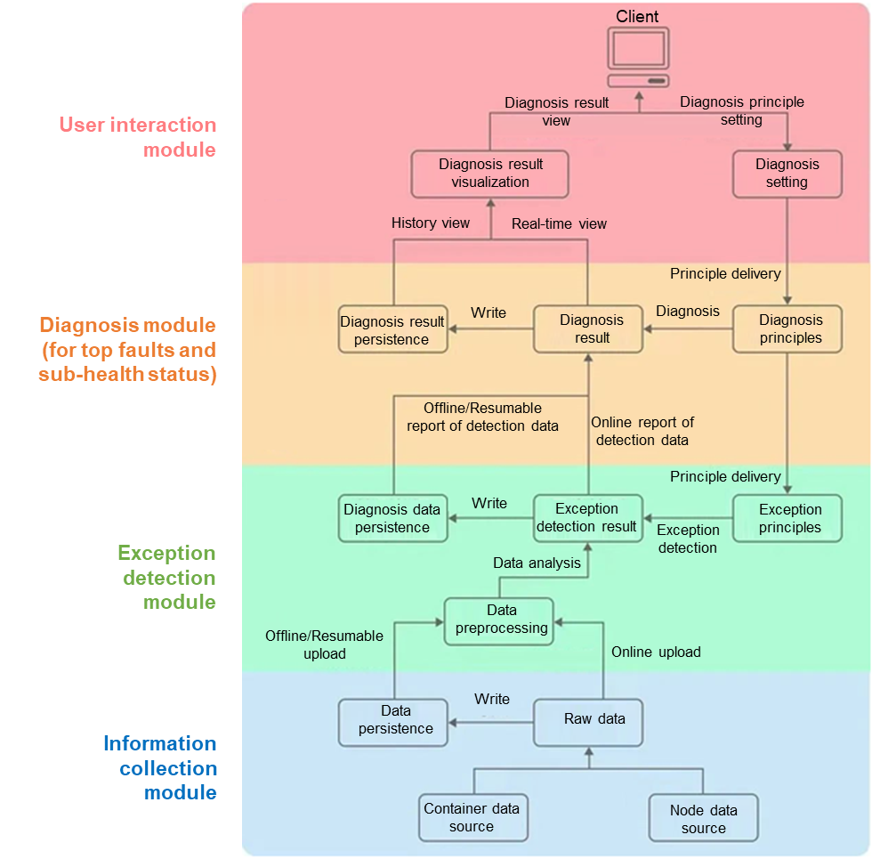

Container technology is one of the latest industry trends, offering high elasticity and agility in AI, big data, and edge computing. The popularity of container clusters has created a demand for simplified management, specifically for O&M. To avoid system interruptions caused by software and hardware faults, the following measures are used to analyze and prevent container cluster faults: 

-	Detecting cluster component status  
-	Monitoring service entries  
-	Inspecting custom interfaces  

Sadly, these measures fail to analyze the sub-health status or formulate fault diagnosis and execution policies, rendering them unuseful for certain faults.

Built for cloud-native applications, the Linx Software's open source system Container Problem Detection System, or CPDS, can monitor and identify faults and sub-health status of containers.

Specifically, the CPDS can detect and handle exceptions arising from cluster base services, OSs, and applications.
-	The CPDS resolves cluster base service exceptions by using the systemd and initv processes to start and monitor policies for key services.  
-	For OSs, the CPDS invokes node agents to collect and report information about the network, system calls, I/Os, and especially drive Logical Volume Manager (LVM), and execute policies.  
-	Comprehensive analysis is performed on applications using cross-container-namespace agents in non-intrusive mode. This lets the CPDS monitor, analyze, and detect the application status, resource consumption, key system calls, and I/O status in containers. For example, if the CPU usage is high, the CPDS analyzes multiple parameters and metrics (such as irq and iowait) to locate the cause. What's more, the CPDS analyzes the network, system calls, and I/Os to inform decisions on troubleshooting.  

CPDS architecture:
>
 
The work process of the CPDS is as follows:
1. The information collection module collects key data covering container cluster base services, system, and applications through the agents, and reports the data to the exception detection module.   
2. After preprocessing data, the exception detection module identifies potential exceptions from the data and uploads the results to the diagnosis module.  
3. The diagnosis module follows certain principles to analyze nodes and services, and displays the diagnosis results using the user interaction module.  

To learn more about the CPDS, visit the openEuler community or explore our repositories:

-	[openEuler official website](https://www.openeuler.org/en/)

-	[openEuler@GitHub](https://github.com/openeuler-mirror)

