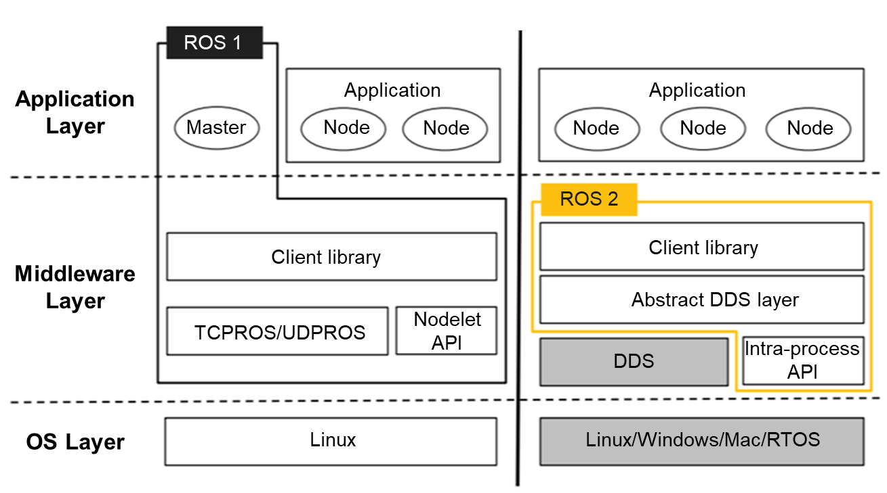
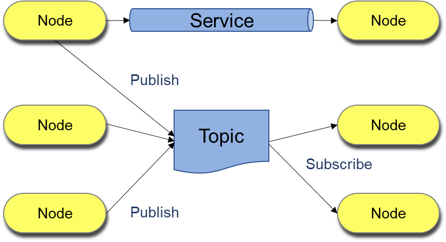

openEuler 22.03 LTS SP1 has the Robot Operating System (ROS) inside to help you build robot applications.

Although it's called an "operating system", ROS is not a conventional operating system but a middleware (or a meta operating system) running on top of openEuler to enable communication between openEuler and developers' ROS applications.

From drivers to algorithms and developer tools, ROS offers some standard operating system services that perform hardware abstraction, just like a conventional operating system does. This is one of the reasons why ROS has an analogous name to operating systems used in PCs and servers.

ROS is available in open source. It has two versions, ROS 1 and ROS 2. The original ROS version ROS 1 was designed for academic projects, and the updated version ROS 2 was created for commercial projects as robotics hardware has become more affordable.

ROS 2 is developed with an intention to overcome the shortcomings of ROS 1. While it inherits the core functions and features available in ROS 1, it also brings many improvements, one most important of which is the Data Distribution Service (DDS) support. The ability to enhance communication between nodes using the DDS middleware makes ROS 2 perform more efficiently.

openEuler offers basic ROS components based on ROS 1 and ROS 2, including the communication framework and build tools.

>
 
In the ROS development framework, a process is called a node and every node is responsible for one task. Nodes communicate with each other by passing messages through logical channels called topics. Each node can send or get data from another node using the publish/subscribe model.  

>

With ROS, it's easier to develop basic robot software features such as communication interaction and message processing. You can customize synchronous or asynchronous communication functions for topic and service communications to build a basic robot communication framework.

ROS aims to enable code reuse in robotics research and development with built-in development utilities. With the ROS support incorporated, openEuler expands its applicable scenarios, once again proving it's a versatile operating system.

For more information about how openEuler helps tackle modern workloads, visit:

-	[openEuler official website](https://www.openeuler.org/en/)

-	[openEuler@GitHub](https://github.com/openeuler-mirror)

