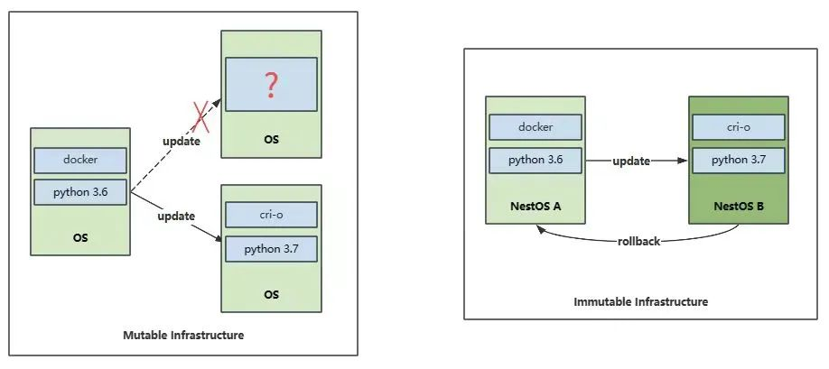
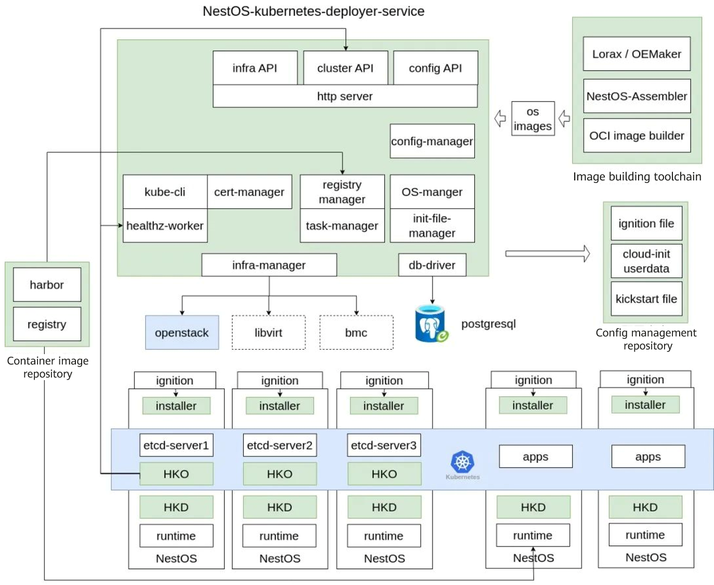

**Short for NestOS-Kubernetes-Deployer, NKD is a solution for the O&M of Kubernetes clusters deployed on NestOS. It aims to provide services such as deployment, update, and configuration of cluster infrastructure (including the OS and basic Kubernetes components) outside the cluster.**

## 1. Introduction

As the de facto standard for cloud container scenarios in the cloud native field, Kubernetes simplifies the deployment and management of containerized applications with its excellent functions and flexibility. The container technology encapsulates the required operating environment and decouples applications from the underlying OS. Kubernetes further decouples applications from the underlying running nodes, enabling seamless application deployment in environments of different cloud providers. However, this decoupling brings new challenges. Kubernetes' popularity couples with O&M complexity. Maintaining Kubernetes clusters requires a large number of technologies and resources. O&M personnel must be familiar with Kubernetes configuration and management to ensure stable cluster running. To achieve this, O&M personnel need to focus on the O&M of the cluster and avoid frequently updating the underlying OS and basic Kubernetes components. However, to incorporate security updates and support for new Kubernetes features, updates to underlying infrastructure components are imperative. Therefore, a solution is required to simplify the O&M procedure and make it easier to manage and update cluster infrastructure.

## 2. About NestOS

NestOS is a cloud-based OS incubated by the Cloud Native SIG of the openEuler community. It provides an optimal container host in a large-scale cluster environment. When a traditional general-purpose OS is used as cluster infrastructure, an enterprise-level system management platform such as Red Hat Satellite or SUSE Manager is an ideal solution to software package management, configuration management, and patch update, facilitating O&M of large-scale clusters. However, during OS upgrade and management, network or power supply exceptions may occur, causing some nodes to run in an unstable intermediate state. In addition, these platforms operate only in their own management scope. They may not be able to detect and rectify in a timely manner the environment inconsistency caused by temporary maintenance by O&M personnel or temporary debugging by R&D personnel in the cluster. To solve these problems, NestOS uses an OS encapsulation solution based on rpm-ostree to implement atomic update and avoid intermediate states. Even if the upgrade fails, NestOS supports quick rollback to the previous stable state, ensuring system stability. In daily operation, NestOS takes security measures such as granting the read only permission to key directories so that core system files and configurations are not modified accidentally. It also uses the ignition mechanism to import and solidify important system configurations to ensure configuration persistence and consistency. In this way, the OS can maintain the expected state, reducing unexpected errors. The core idea of NestOS is similar to that of image in the container technology, which aims to build immutable infrastructure for the OS layer. The OS version and configuration are solidified during deployment, making it immutable. This approach helps eliminate OS variants and ensure consistency between basic component versions and configurations, thereby providing a stable and reliable infrastructure environment. In short, using NestOS in a cluster brings high consistency and reliability, and streamlines OS management and maintenance.

**Mutable infrastructure vs. immutable infrastructure**

The introduction of NestOS simplifies cluster O&M; on the other hand, it brings some challenges in actual implementation. For example, as a new OS pattern, NestOS requires O&M personnel to be familiar with its core ideas. Any change requires O&M personnel to rebuild a system image on the CICD pipeline instead of logging in and rebooting the system. In addition, NestOS is different from traditional OSs and involves new tools and technologies. The details are as follows:

1.  **[System image building toolchain]** The NestOS-Assembler toolchain is provided to build new system images for all service-related components and configuration changes. It is used to generate build configurations and system images in multiple formats. In addition, it provides an automatic test tool to verify the reliability of basic image components.

2.  **[Environment-related dynamic configuration file]** NestOS uses the ignition mechanism to inject environment-related dynamic configurations (such as login credentials, network, and external storage information) in the deployment phase. O&M personnel need to write configuration files in advance, and the tool provided by NestOS converts the files into machine-readable IGN files for OS deployment.

3.  **[System image update repo]** NestOS allows download of the latest version of the current version tree through rpm-ostree. This requires O&M personnel to maintain and manage the system image update repo and learn to use relevant deployment tools. O&M personnel can also distribute a system image of a new version as a container image to reuse the existing CICD resources. However, incremental update is not supported. Each update requires downloading a complete system image.

4.  **[System update and upgrade management]**: The above tools pave the way for system updates, but do not address the issue of when a system update can be performed. Although NestOS provides the zincati component to implement basic update policy management, it is recommended that update and maintenance operations be performed on nodes in the time window allowed by OS services based on service status. In cloud container scenarios, NestOS provides the housekeeper service based on the operator mechanism that container services running on nodes are evicted before upgrade. Users can also formulate more complex upgrade and maintenance policies based on the housekeeper service.

The acceptance of NestOS requires success cases and takes time. Nevertheless, the introduced O&M challenges can be solved using convenient O&M tools. NestOS-Kubernetes-Deployer (NKD) is developed to provide services such as deployment, update, and configuration management outside the cluster, improving NestOS O&M experience for O&M personnel.

## 3. NKD's Assistance in Cloud Container O&M

NKD is a solution oriented to Kubernetes clusters. It simplifies cluster deployment and upgrade processes. The details are as follows:

1.  **[Cluster infrastructure creation]** NKD connects infrastructure providers to dynamically create required IaaS resources based on cluster requirements, and supports bare metal and virtualization scenarios. Currently, it can be used in OpenStack scenarios.

2.  **[OS image building]** NestOS provides a complete image building toolchain, which can be easily integrated into the existing CICD process to quickly build custom images based on the official openEuler or user-defined software repositories. Currently, NKD can obtain image building results and apply update repo configuration to the cluster. In the future, NKD will support the configuration of hosted image building.

3.  **[Dynamic configuration injection]** When deploying NestOS, O&M personnel need to use the ignition mechanism to inject dynamic configurations required after the system deployment. Currently, NKD provides tools to convert user configurations to IGN files through command line parameters or configuration files. The goal is to provide a user-friendly front-end configuration interface to easily generate required configurations and provide version management function on configuration changes.

4.  **[Kubernetes cluster deployment]** This is also the core capability of NKD. NKD automatically combines configurations required for Kubernetes cluster deployment into the IGN file generated using user configurations. In this way, a Kubernetes cluster is automatically created after the OS is deployed and booted on a node.

5.  **[Cluster status detection and housekeeper deployment]** NKD continuously detects Kubernetes cluster status. Once a cluster is created, NKD provides access credentials for users and deploys custom housekeeper resources for subsequent maintenance and upgrade. Users can choose not to deploy custom resources by default.

6.  **[OS and basic Kubernetes component upgrade and maintenance]** NKD uses the deployed custom housekeeper resources when the OS or basic Kubernetes components need to be upgraded or maintained. The housekeeper service in the cluster upgrades cluster nodes one by one based on the configuration to complete the upgrade of the entire cluster.

With this solution, users can easily create clusters and perform O&M tasks. The following introduces the NKD architecture and future planning.

## 4. Complete NKD Planning

The overall NKD architecture consists of multiple components, including the NestOS-kubernetes-deployer-service (NKDS), housekeeper operator (HKO) deployed in a cluster, and installer integrated in a NestOS image. In addition, NKD can work with the NestOS image building toolchain, configuration management repository (such as Git), and private container image repositories to complete cluster O&M tasks. Currently, NKDS is provided as a command line tool and does not provide external HTTP interfaces or front-end configuration pages. However, its required modules such as infrastructure management, configuration management, system image management, certificate management, and health check have been preliminarily developed. HKO consists of the cluster-oriented HKO component and the housekeeper daemon (HKD) integrated in a NestOS image. Currently, the installer component is responsible for creating and deploying a Kubernetes cluster in the system ignition phase. In the future, its functions will be integrated into the HKD to simplify the overall solution and facilitate users to manage basic Kubernetes components as required. The ultimate goal of NKD is to provide O&M services as a persistent service and support the management of multiple clusters. It will provide functions such as persistent configuration change recording, certificate management, and multiple update and upgrade policies. In the future, we will continue to optimize NKD functions and performance, and import more intelligent features such as automatic troubleshooting and resource optimization, so as to make NKD a core component in the NestOS ecosystem, providing all-round support for O&M in cloud native scenarios and promoting the development and application of cloud native technologies.

## 5. Summary

As an OS designed for cloud native scenarios, NestOS greatly facilitates cloud container O&M. NKD is a solution to new challenges introduced in NestOS O&M. Through continuous optimization and innovation, NKD will make it easier for the industry to accept immutable infrastructure represented by NestOS. In addition, with the development of the Kubernetes community, more innovative solutions will drive the maturity and sustainability of cloud native technologies.

You can visit the [NestOS official website](https://nestos.openeuler.org/) and [NKD project homepage](https://gitee.com/openeuler/nestos-kubernetes-deployer) for details. Any comments and suggestions are welcome.