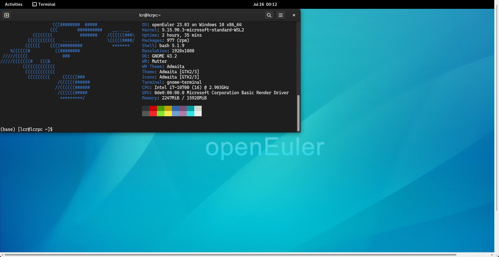
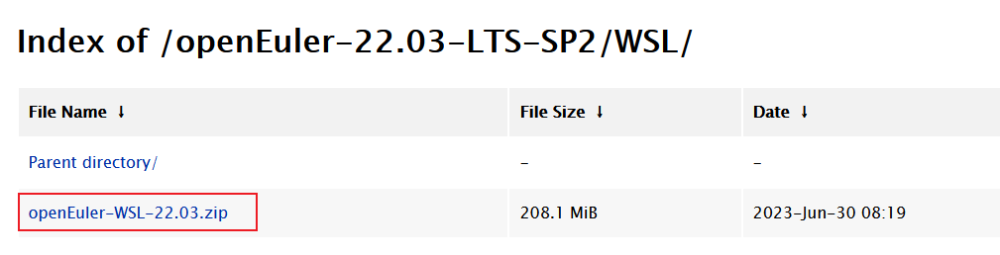
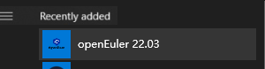

## openEuler WSL
[WSL (Windows Subsystem for Linux)](https://learn.microsoft.com/en-us/windows/wsl/about)  is an architecture released by Microsoft that enables users to run a Linux environment on Windows.

By using the WSL application released by openEuler, you can run the original openEuler development environment on Windows. 

You can download openEuler 20.03-LTS, 22.03-LTS, 22.03-LTS, 22.03, and 23.03 from the [Microsoft Store](https://apps.microsoft.com/store/search/openeuler).

If you cannot access the store, see [this article to use WSL sideload](https://mp.weixin.qq.com/s/XKkapDSG98UlhtS4wVBCQA).

## openEuler User Repo
To enrich the software package ecosystem of openEuler, the community also launched the [openEuler User Repository (EUR)](https://eur.openeuler.openatom.cn/). For a more detailed introduction and usage guide to EUR, see [this blog](https://zhengzhenyu.gitee.io/post/intro-eur/) or [official blog 1](https://www.openeuler.org/en/blog/waaagh/waaagh/openEuler-user-repo-howto.html) and [official blog 2](https://www.openeuler.org/en/blog/waaagh/waaagh/openEuler-user-repo-intro.html).

EUR is a solution if you find that some software packages are missing or existing packages do not meet your requirements when using openEuler.

## WSL + EUR
Currently, the mainstream desktop solution in the WSL community is [Win-KeX](https://www.kali.org/docs/wsl/win-kex/), which is the exclusive software package of `kali linux`. The `Seamless Mode` of `kex` is implemented by `xrdp`, which is not introduced in the openEuler community for the time being.

However, with EUR and WSL, we can add `xrdp` to openEuler and run `xrdp` desktop environment on WSL.

The following figure shows the use of the openEuler desktop environment on Windows.


Here's the procedure to run the GNOME desktop environment on the WSL of openEuler 23.03:

1. Install the WSL on the Windows Server.
    - The whole procedure is performed on openEuler 23.03. If you cannot access the Windows Store, download the latest [WSL sideload package of openEuler 22.03-LTS-SP2](https://repo.openeuler.org/openEuler-22.03-LTS-SP2/WSL/openEuler-WSL-22.03.zip). If you install openEuler 23.03 from the Windows Store, you can skip the next two steps.

    - Double-click **DistroLauncher-Appx_2203.1.164.0_x64_ARM64.cer** in the package and choose **Install Certificate** > **Local Machine** > **Place all certificates in the following store** > **Trusted People**.

    
    - Install the sideload application: Start a PowerShell terminal as an administrator and run the `Add-AppDevPackage.ps1` script in the package.

    
    - Initialize the WSL environment: After the installation is complete, double-click the icon of the openEuler 22.03/23.03 application in the Start menu. After the application is started, initialize the account and password as prompted to start the WSL environment.

    

1. Set up the desktop environment. This procedure uses the `xrdp` method to implement the desktop environment in the [EUR](https://eur.openeuler.openatom.cn/coprs/mywaaagh_admin/xrdp/). The `xrdp` package does not exist in the official repository of the [EUR](https://eur.openeuler.openatom.cn/coprs/mywaaagh_admin/xrdp/). Therefore, you can introduce the latest `xrdp 0.9.22.1` to the [EUR](https://eur.openeuler.openatom.cn/coprs/mywaaagh_admin/xrdp/).
    - Obtain the configuration of the EUR repository of the `23.03` version. For other versions, obtain the configuration from [here](https://eur.openeuler.openatom.cn/coprs/mywaaagh_admin/xrdp/).

    ```
    $ sudo curl -o /etc/yum.repos.d/xrdp.repo -L https://eur.openeuler.openatom.cn/coprs/mywaaagh_admin/xrdp/repo/openeuler-23.03/mywaaagh_admin-xrdp-openeuler-23.03.repo
    
    We trust you have received the usual lecture from the local System
    Administrator. It usually boils down to these three things:
    
        #1) Respect the privacy of others.
        #2) Think before you type.
        #3) With great power comes great responsibility.
    
    [sudo] password for lcr:
    % Total    % Received % Xferd  Average Speed   Time    Time     Time  Current
                                    Dload  Upload   Total   Spent    Left  Speed
    100   379  100   379    0     0   1237      0 --:--:-- --:--:-- --:--:--  1238
    ```

    - Install the software packages related to `xrdp` and `gnome`.

    ```
    $ sudo dnf in xrdp gnome-terminal gdm neofetch
    ...
    Total                                                                                   1.2 MB/s | 358 MB     05:05
    Copr repo for xrdp owned by mywaaagh_admin                                              7.0 kB/s | 1.0 kB     00:00
    Importing GPG key 0xA893D75B:
    Userid     : "mywaaagh_admin_xrdp (None) <mywaaagh_admin#xrdp@copr.osinfra.cn>"
    Fingerprint: 945E 21A6 D982 49A7 A61A E62A 026A 219C A893 D75B
    From       : https://eur.openeuler.openatom.cn/results/mywaaagh_admin/xrdp/pubkey.gpg
    Is this ok [y/N]: y
    ...
    
    Complete!
    ```

    - Start the  `xrdp` and `gdm`.

    ```bash
    sudo systemctl start xrdp
    sudo systemctl restart gdm
    ```

1. Run the `mstsc.exe` command to access the `xrdp` service that is just started. You can run the `ip a` command to obtain the IP address of the WSL service.
    ```
    $ ip a
    1: lo: <LOOPBACK,UP,LOWER_UP> mtu 65536 qdisc noqueue state UNKNOWN group default qlen 1000
        link/loopback 00:00:00:00:00:00 brd 00:00:00:00:00:00
        inet 127.0.0.1/8 scope host lo
        valid_lft forever preferred_lft forever
        inet6 ::1/128 scope host
        valid_lft forever preferred_lft forever
    2: eth0: <BROADCAST,MULTICAST,UP,LOWER_UP> mtu 1500 qdisc mq state UP group default qlen 1000
        link/ether 00:15:5d:1a:3f:30 brd ff:ff:ff:ff:ff:ff
        inet 172.29.191.92/20 brd 172.29.191.255 scope global eth0
        valid_lft forever preferred_lft forever
        inet6 fe80::215:5dff:fe1a:3f30/64 scope link
        valid_lft forever preferred_lft forever
    (base) [lcr@lcrpc cascadia-code-nerd-fonts-mono]$
    ```
    

    
    
1. After the remote desktop is connected, select `Xvnc` and enter the user name and password created when the WSL is started for the first time to access the GNOME desktop of the openEuler.

    

    
## Precautions
- Multiple WSL instances share the network. Therefore, after the `xrdp` service is enabled for an instance, the service fails to be started in another WSL instance. In this case, you can modify the listening ports in `/etc/xrdp/xrdp.ini` and `/etc/xrdp/sesman.ini` to enable the remote desktop service for multiple instances.
- After the remote desktop is successfully connected, the window may exit unexpectedly. This may be caused by residual X-sessions in the system. In this case, you can try to restart the `gdm` service.
    ```
    sudo systemctl restart gdm
    ```
- The font used in the GNOME terminal screenshot is the `cascadia-code-nerd-fonts-mono`, which is hosted in the [xrdp repository](https://eur.openeuler.openatom.cn/coprs/mywaaagh_admin/xrdp/) of the EUR.
- Theoretically, `xrdp` can start any desktop environment through `/etc/xrdp/startwm.sh`. Any desktop session process can be added to `$HOME/.xsession`. For example, to start `i3`, only `echo i3 > $HOME/.xsession && chmod +x ~/.xsession` is required. When the `xrdp` is connected, an `i3` session is started.